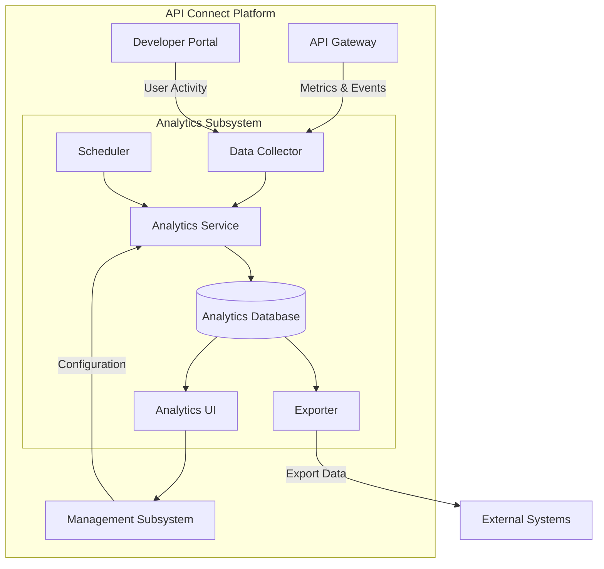
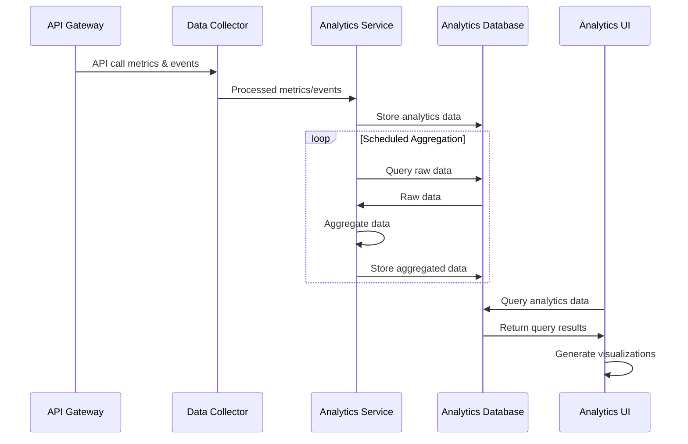
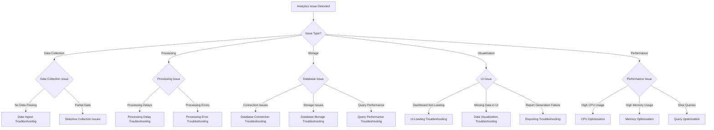

# API Connect Analytics Runbook

This runbook provides detailed procedures for operating, troubleshooting, and maintaining the Analytics subsystem of the IBM API Connect platform deployed on AWS EKS.

## Analytics Component Overview

The Analytics subsystem of API Connect collects, processes, stores, and visualizes usage metrics and operational data from the API Gateway and other platform components. It provides insights into API usage, performance, and business value.

### Analytics Architecture

The Analytics subsystem consists of several key components:

- **Data Collector**: Receives metrics and events from API Gateway and other components
- **Analytics Service**: Processes and stores analytics data
- **Analytics Database**: Stores processed analytics data (typically PostgreSQL)
- **Analytics UI**: Visualization interface for analytics dashboards
- **Scheduler**: Manages scheduled report generation and data aggregation jobs
- **Exporter**: Exports analytics data to external systems

### Component Relationships



### Data Flow



## Diagnostic Decision Tree

Use this decision tree to quickly navigate to the appropriate troubleshooting section:



## Analytics Observability

### Key Metrics to Monitor

| Metric | Description | Warning Threshold | Critical Threshold | Dashboard |
|--------|-------------|-------------------|---------------------|-----------|
| Analytics.DataCollectionRate | Events collected per second | <expected baseline, >150% normal | <10% normal, >200% normal | [Analytics Dashboard](https://your-tenant.dynatrace.com/analytics-dashboard) |
| Analytics.ProcessingDelay | Time between collection and availability | >30s | >5min | [Analytics Dashboard](https://your-tenant.dynatrace.com/analytics-dashboard) |
| Analytics.ErrorRate | Percentage of processing errors | >1% | >5% | [Analytics Dashboard](https://your-tenant.dynatrace.com/analytics-dashboard) |
| Analytics.DatabaseSize | Analytics database size | >70% capacity | >85% capacity | [Analytics Resources](https://your-tenant.dynatrace.com/analytics-resources) |
| Analytics.DatabaseConnections | Active DB connections | >70% pool | >90% pool | [Analytics Resources](https://your-tenant.dynatrace.com/analytics-resources) |
| Analytics.CPUUtilization | Pod CPU usage | >70% | >85% | [Analytics Resources](https://your-tenant.dynatrace.com/analytics-resources) |
| Analytics.MemoryUtilization | Pod memory usage | >70% | >85% | [Analytics Resources](https://your-tenant.dynatrace.com/analytics-resources) |
| Analytics.QueryTime | Time to execute analytics queries | >3s | >10s | [Analytics Dashboard](https://your-tenant.dynatrace.com/analytics-dashboard) |
| Analytics.StorageGrowth | Storage growth rate | >expected trend | >200% expected trend | [Analytics Resources](https://your-tenant.dynatrace.com/analytics-resources) |
| Analytics.DataSyncErrors | Data synchronization errors | >0 | >10/hour | [Analytics Dashboard](https://your-tenant.dynatrace.com/analytics-dashboard) |
| Analytics.ReportGenerationTime | Time to generate reports | >30s | >2min | [Analytics Dashboard](https://your-tenant.dynatrace.com/analytics-dashboard) |

### Key Logs to Check

| Log Source | Typical Issues | Access Method | Retention |
|------------|----------------|--------------|-----------|
| Analytics Service Logs | Processing errors, service issues | `kubectl logs -n api-connect -l app=analytics -c analytics` | 7 days in pods, 30 days in Splunk |
| Data Collector Logs | Collection failures, connection issues | `kubectl logs -n api-connect -l app=analytics -c collector` | 7 days in pods, 30 days in Splunk |
| Analytics Database Logs | Query failures, connection issues | `kubectl logs -n api-connect [analytics-db-pod-name]` or RDS logs | 7 days in pods, 90 days in Splunk |
| Scheduler Logs | Failed scheduled jobs | `kubectl logs -n api-connect -l app=analytics -c scheduler` | 7 days in pods, 30 days in Splunk |
| Exporter Logs | Export failures | `kubectl logs -n api-connect -l app=analytics -c exporter` | 7 days in pods, 30 days in Splunk |

### Splunk Queries

| Issue | Splunk Query | Dashboard |
|-------|-------------|-----------|
| Analytics processing errors | `index=api_connect sourcetype=analytics-logs level=ERROR | timechart count by error_code` | [Analytics Errors](https://splunk.your-company.com/analytics-errors) |
| Data collection issues | `index=api_connect sourcetype=analytics-logs "collection failed" OR "connection failed" | stats count by collector_id, error_message` | [Collection Issues](https://splunk.your-company.com/collection-issues) |
| Slow queries | `index=api_connect sourcetype=analytics-db-logs "slow query" | stats avg(duration) as avg_duration, max(duration) as max_duration by query_type | sort -max_duration` | [Query Performance](https://splunk.your-company.com/query-performance) |
| Report generation failures | `index=api_connect sourcetype=analytics-logs "report generation failed" | stats count by report_id, error_message` | [Reporting Issues](https://splunk.your-company.com/reporting-issues) |
| Database connection issues | `index=api_connect sourcetype=analytics-logs "database connection" | stats count by error_message` | [DB Connection Issues](https://splunk.your-company.com/db-connection-issues) |

## Data Collection Issues

### Symptoms
- Missing API metrics in dashboards
- Gaps in analytics data
- Error messages about data collection
- Zero or significantly reduced event counts

### Diagnostic Steps

1. **Check Data Collector status:**
   ```bash
   kubectl get pods -n api-connect -l app=analytics,component=collector
   kubectl describe pods -n api-connect -l app=analytics,component=collector
   ```

2. **Check Data Collector logs:**
   ```bash
   kubectl logs -n api-connect -l app=analytics,component=collector | grep -i "error\|failed\|warning" | tail -100
   ```

3. **Verify Gateway to Collector connectivity:**
   ```bash
   # Get Analytics service details
   kubectl get svc -n api-connect analytics-collector-service
   
   # Test connection from Gateway pod
   kubectl exec -it -n api-connect $(kubectl get pods -n api-connect -l app=gateway -o jsonpath="{.items[0].metadata.name}") -- curl -k https://analytics-collector-service:9443/health
   ```

4. **Check collector configuration:**
   ```bash
   kubectl get configmap -n api-connect analytics-collector-config -o yaml
   ```

5. **Verify incoming data metrics:**
   ```bash
   # Check event rate metrics
   kubectl exec -it -n api-connect $(kubectl get pods -n api-connect -l app=analytics,component=collector -o jsonpath="{.items[0].metadata.name}") -- curl -k https://localhost:9443/metrics | grep event_rate
   ```

### Common Issues and Resolutions

#### Collector Connection Issues

**Symptoms:**
- Connection errors in logs
- Zero event rate
- Gateway unable to reach collector

**Resolution:**
1. Check network policies:
   ```bash
   kubectl get networkpolicies -n api-connect
   ```

2. Verify service endpoints:
   ```bash
   kubectl get endpoints -n api-connect analytics-collector-service
   ```

3. Check collector configuration in Gateway:
   ```bash
   kubectl get configmap -n api-connect gateway-config -o yaml | grep -A 10 analytics
   ```

4. Update configuration if needed:
   ```bash
   # Edit gateway configuration
   kubectl edit configmap -n api-connect gateway-config
   # Update analytics endpoint URL if needed
   
   # Restart gateway to apply changes
   kubectl rollout restart deployment gateway-deployment -n api-connect
   ```

5. Check security settings:
   ```bash
   # Verify TLS settings and credentials are correct
   kubectl get secret -n api-connect analytics-credentials
   ```

#### Selective Data Collection Issues

**Symptoms:**
- Some API data missing
- Inconsistent data collection
- Configuration mismatch

**Resolution:**
1. Check analytics scope configuration:
   ```bash
   kubectl get configmap -n api-connect analytics-filter-config -o yaml
   ```

2. Verify API definitions include analytics:
   ```bash
   # Exec into management pod
   kubectl exec -it -n api-connect $(kubectl get pods -n api-connect -l app=manager -o jsonpath="{.items[0].metadata.name}") -- bash
   
   # Check API configuration for analytics settings
   curl -k -u admin:password https://localhost:9443/api/apis/[api-id] | grep -i analytics
   ```

3. Update API analytics configuration:
   ```bash
   # Enable analytics for specific API
   curl -k -X PATCH -H "Content-Type: application/json" -d '{"analytics": {"enabled": true}}' -u admin:password https://localhost:9443/api/apis/[api-id]
   ```

4. Update analytics filter configuration:
   ```bash
   kubectl edit configmap -n api-connect analytics-filter-config
   # Modify filters as needed
   
   # Restart analytics collector
   kubectl rollout restart deployment analytics-collector-deployment -n api-connect
   ```

#### Data Buffer Overflow

**Symptoms:**
- Lost events during high traffic
- Buffer full errors in logs
- Inconsistent data collection during peak loads

**Resolution:**
1. Check buffer configuration:
   ```bash
   kubectl get configmap -n api-connect analytics-collector-config -o yaml | grep -A 10 buffer
   ```

2. Increase buffer size:
   ```bash
   kubectl edit configmap -n api-connect analytics-collector-config
   # Increase buffer.size and buffer.maxSize values
   
   # Restart collector to apply changes
   kubectl rollout restart deployment analytics-collector-deployment -n api-connect
   ```

3. Scale collector pods:
   ```bash
   kubectl scale deployment analytics-collector-deployment -n api-connect --replicas=3
   ```

4. Implement event sampling during peak loads:
   ```bash
   kubectl edit configmap -n api-connect analytics-collector-config
   # Enable sampling and set appropriate sampling rate
   # sampling.enabled: true
   # sampling.rate: 0.5  # 50% sampling
   
   # Restart collector to apply changes
   kubectl rollout restart deployment analytics-collector-deployment -n api-connect
   ```

## Data Processing Issues

### Symptoms
- Delayed data in analytics dashboards
- Processing errors in logs
- Increased event processing time
- Backlog of unprocessed events

### Diagnostic Steps

1. **Check Analytics Service status:**
   ```bash
   kubectl get pods -n api-connect -l app=analytics,component=service
   kubectl describe pods -n api-connect -l app=analytics,component=service
   ```

2. **Check Analytics Service logs:**
   ```bash
   kubectl logs -n api-connect -l app=analytics,component=service | grep -i "error\|failed\|warning" | tail -100
   ```

3. **Check processing metrics:**
   ```bash
   # Check processing rate
   kubectl exec -it -n api-connect $(kubectl get pods -n api-connect -l app=analytics,component=service -o jsonpath="{.items[0].metadata.name}") -- curl -k https://localhost:9443/metrics | grep processing_rate
   
   # Check processing backlog
   kubectl exec -it -n api-connect $(kubectl get pods -n api-connect -l app=analytics,component=service -o jsonpath="{.items[0].metadata.name}") -- curl -k https://localhost:9443/metrics | grep backlog
   ```

4. **Check resource usage:**
   ```bash
   kubectl top pods -n api-connect -l app=analytics,component=service
   ```

5. **Verify database connectivity:**
   ```bash
   kubectl exec -it -n api-connect $(kubectl get pods -n api-connect -l app=analytics,component=service -o jsonpath="{.items[0].metadata.name}") -- curl -v [db-service]:5432
   ```

### Common Issues and Resolutions

#### Processing Backlog

**Symptoms:**
- Increasing event backlog
- Delayed data availability
- High CPU usage

**Resolution:**
1. Check processor configuration:
   ```bash
   kubectl get configmap -n api-connect analytics-service-config -o yaml | grep -A 10 processor
   ```

2. Increase processing threads:
   ```bash
   kubectl edit configmap -n api-connect analytics-service-config
   # Increase processor.threads value
   
   # Restart service to apply changes
   kubectl rollout restart deployment analytics-service-deployment -n api-connect
   ```

3. Scale service pods:
   ```bash
   kubectl scale deployment analytics-service-deployment -n api-connect --replicas=3
   ```

4. Increase resources:
   ```bash
   kubectl edit deployment analytics-service-deployment -n api-connect
   # Increase CPU and memory resources
   ```

5. Enable batch processing:
   ```bash
   kubectl edit configmap -n api-connect analytics-service-config
   # Enable batch processing and adjust batch size
   # processor.batch.enabled: true
   # processor.batch.size: 1000
   
   # Restart service to apply changes
   kubectl rollout restart deployment analytics-service-deployment -n api-connect
   ```

#### Processing Errors

**Symptoms:**
- Error messages in service logs
- Failed event processing
- Incomplete data in analytics

**Resolution:**
1. Identify error patterns:
   ```bash
   kubectl logs -n api-connect -l app=analytics,component=service | grep -i error | sort | uniq -c | sort -nr
   ```

2. Check for malformed events:
   ```bash
   # Look for specific error patterns related to event format
   kubectl logs -n api-connect -l app=analytics,component=service | grep -i "malformed\|invalid\|parse"
   ```

3. Update event validation:
   ```bash
   kubectl edit configmap -n api-connect analytics-service-config
   # Adjust validation settings based on error patterns
   
   # Restart service to apply changes
   kubectl rollout restart deployment analytics-service-deployment -n api-connect
   ```

4. For database-related errors:
   - Check database connection and schema
   - Verify database user permissions
   - Check for database constraints being violated

5. Enable error handling for specific errors:
   ```bash
   kubectl edit configmap -n api-connect analytics-service-config
   # Configure error handling strategy
   # errorHandling.strategy: "skip" or "retry" or "dlq"
   
   # Restart service to apply changes
   kubectl rollout restart deployment analytics-service-deployment -n api-connect
   ```

#### Scheduled Processing Jobs Failures

**Symptoms:**
- Failed aggregation jobs
- Missing aggregated data
- Scheduler errors in logs

**Resolution:**
1. Check scheduler status:
   ```bash
   kubectl get pods -n api-connect -l app=analytics,component=scheduler
   kubectl logs -n api-connect -l app=analytics,component=scheduler | grep -i "error\|failed"
   ```

2. Check job configuration:
   ```bash
   kubectl get configmap -n api-connect analytics-scheduler-config -o yaml
   ```

3. Check for database locks:
   ```bash
   # Connect to database and check locks
   kubectl exec -it postgres-util -n api-connect -- bash
   psql -h [analytics-db-host] -U [username] -d [dbname]
   
   # Check for locks
   SELECT * FROM pg_locks pl LEFT JOIN pg_stat_activity psa ON pl.pid = psa.pid WHERE psa.state = 'active';
   ```

4. Adjust job scheduling:
   ```bash
   kubectl edit configmap -n api-connect analytics-scheduler-config
   # Adjust job schedules to prevent overlaps
   # Adjust job timeout values
   
   # Restart scheduler to apply changes
   kubectl rollout restart deployment analytics-scheduler-deployment -n api-connect
   ```

5. Manually run failed jobs:
   ```bash
   kubectl exec -it -n api-connect $(kubectl get pods -n api-connect -l app=analytics,component=scheduler -o jsonpath="{.items[0].metadata.name}") -- curl -k -X POST https://localhost:9443/api/jobs/[job-id]/execute
   ```

## Database Issues

### Symptoms
- Database connection errors
- Slow query performance
- Storage space issues
- High database CPU usage
- Data retrieval failures

### Diagnostic Steps

1. **Check database status:**
   ```bash
   # For RDS
   aws rds describe-db-instances --db-instance-identifier analytics-db --region us-east-1
   
   # For in-cluster database
   kubectl get pods -n api-connect -l app=analytics-db
   kubectl describe pods -n api-connect -l app=analytics-db
   ```

2. **Check database connection:**
   ```bash
   # Test connection from analytics service
   kubectl exec -it -n api-connect $(kubectl get pods -n api-connect -l app=analytics,component=service -o jsonpath="{.items[0].metadata.name}") -- curl -v [db-host]:5432
   ```

3. **Check database logs:**
   ```bash
   # For RDS
   aws rds download-db-log-file-portion --db-instance-identifier analytics-db --log-file-name error/postgresql.log --region us-east-1
   
   # For in-cluster database
   kubectl logs -n api-connect -l app=analytics-db
   ```

4. **Check database metrics:**
   ```bash
   # For RDS
   aws cloudwatch get-metric-statistics --namespace AWS/RDS --metric-name CPUUtilization --dimensions Name=DBInstanceIdentifier,Value=analytics-db --start-time $(date -u -d "1 hour ago" +%Y-%m-%dT%H:%M:%SZ) --end-time $(date -u +%Y-%m-%dT%H:%M:%SZ) --period 300 --statistics Average --region us-east-1
   
   # Storage usage
   aws cloudwatch get-metric-statistics --namespace AWS/RDS --metric-name FreeStorageSpace --dimensions Name=DBInstanceIdentifier,Value=analytics-db --start-time $(date -u -d "1 hour ago" +%Y-%m-%dT%H:%M:%SZ) --end-time $(date -u +%Y-%m-%dT%H:%M:%SZ) --period 300 --statistics Average --region us-east-1
   ```

5. **Check database queries:**
   ```bash
   # For PostgreSQL, connect to database
   kubectl exec -it postgres-util -n api-connect -- bash
   psql -h [analytics-db-host] -U [username] -d [dbname]
   
   # Check for long-running queries
   SELECT pid, now() - pg_stat_activity.query_start AS duration, query FROM pg_stat_activity WHERE state = 'active' AND now() - pg_stat_activity.query_start > interval '5 minutes';
   
   # Check for locks
   SELECT * FROM pg_locks pl LEFT JOIN pg_stat_activity psa ON pl.pid = psa.pid;
   ```

### Common Issues and Resolutions

#### Database Connection Issues

**Symptoms:**
- Connection timeout errors
- "Cannot connect to database" errors
- Connection pool exhaustion

**Resolution:**
1. Check connection configuration:
   ```bash
   kubectl get configmap -n api-connect analytics-db-config -o yaml
   ```

2. Verify security group settings (for RDS):
   ```bash
   # Get RDS security group
   SG_ID=$(aws rds describe-db-instances --db-instance-identifier analytics-db --query "DBInstances[0].VpcSecurityGroups[0].VpcSecurityGroupId" --output text --region us-east-1)
   
   # Check security group rules
   aws ec2 describe-security-groups --group-ids $SG_ID --region us-east-1
   ```

3. Adjust connection pool settings:
   ```bash
   kubectl edit configmap -n api-connect analytics-db-config
   # Adjust max connections, connection timeout, etc.
   
   # Restart service to apply changes
   kubectl rollout restart deployment analytics-service-deployment -n api-connect
   ```

4. Check database max connections:
   ```bash
   # For RDS, check parameter group
   aws rds describe-db-parameters --db-parameter-group-name [parameter-group-name] --source user --region us-east-1 | grep max_connections
   
   # For in-cluster database, check config
   kubectl get configmap -n api-connect analytics-db-config -o yaml | grep max_connections
   ```

5. Check for connection leaks:
   ```bash
   # Monitor connection count
   kubectl exec -it -n api-connect $(kubectl get pods -n api-connect -l app=analytics,component=service -o jsonpath="{.items[0].metadata.name}") -- curl -k https://localhost:9443/metrics | grep db_connections
   ```

#### Database Performance Issues

**Symptoms:**
- Slow query execution
- High CPU usage in database
- Query timeouts

**Resolution:**
1. Identify slow queries:
   ```bash
   # Enable slow query logging in RDS
   aws rds modify-db-parameter-group --db-parameter-group-name [parameter-group-name] --parameters "ParameterName=log_min_duration_statement,ParameterValue=1000,ApplyMethod=immediate" --region us-east-1
   
   # Review slow query log
   aws rds download-db-log-file-portion --db-instance-identifier analytics-db --log-file-name slowquery/postgresql.log --region us-east-1
   ```

2. Check for missing indexes:
   ```bash
   # Connect to database
   kubectl exec -it postgres-util -n api-connect -- bash
   psql -h [analytics-db-host] -U [username] -d [dbname]
   
   # Find missing indexes
   SELECT schemaname, relname, seq_scan, seq_tup_read, idx_scan, idx_tup_fetch, seq_scan - idx_scan AS too_much_seq,
   CASE WHEN seq_scan - idx_scan > 0 THEN 'Missing Index?' ELSE 'OK' END
   FROM pg_stat_user_tables WHERE seq_scan > 0 ORDER BY too_much_seq DESC;
   ```

3. Add necessary indexes:
   ```bash
   # Create index
   kubectl exec -it postgres-util -n api-connect -- bash
   psql -h [analytics-db-host] -U [username] -d [dbname] -c "CREATE INDEX idx_name ON table_name(column_name);"
   ```

4. Optimize queries in analytics service:
   ```bash
   kubectl edit configmap -n api-connect analytics-service-config
   # Modify query optimizations settings
   # Enable query caching if applicable
   
   # Restart service to apply changes
   kubectl rollout restart deployment analytics-service-deployment -n api-connect
   ```

5. Consider database scaling:
   ```bash
   # For RDS, upgrade instance
   aws rds modify-db-instance --db-instance-identifier analytics-db --db-instance-class db.m5.2xlarge --apply-immediately --region us-east-1
   ```

#### Database Storage Issues

**Symptoms:**
- Low free storage alerts
- Storage space errors
- Database becoming read-only

**Resolution:**
1. Check current storage usage:
   ```bash
   # For RDS
   aws cloudwatch get-metric-statistics --namespace AWS/RDS --metric-name FreeStorageSpace --dimensions Name=DBInstanceIdentifier,Value=analytics-db --start-time $(date -u -d "1 hour ago" +%Y-%m-%dT%H:%M:%SZ) --end-time $(date -u +%Y-%m-%dT%H:%M:%SZ) --period 300 --statistics Average --region us-east-1
   ```

2. Identify large tables:
   ```bash
   # Connect to database
   kubectl exec -it postgres-util -n api-connect -- bash
   psql -h [analytics-db-host] -U [username] -d [dbname]
   
   # Find largest tables
   SELECT nspname || '.' || relname AS "relation",
     pg_size_pretty(pg_total_relation_size(C.oid)) AS "total_size"
   FROM pg_class C
   LEFT JOIN pg_namespace N ON (N.oid = C.relnamespace)
   WHERE nspname NOT IN ('pg_catalog', 'information_schema')
   ORDER BY pg_total_relation_size(C.oid) DESC
   LIMIT 20;
   ```

3. Implement data archiving:
   ```bash
   # Create archive tables
   kubectl exec -it postgres-util -n api-connect -- bash
   psql -h [analytics-db-host] -U [username] -d [dbname] -c "CREATE TABLE archived_events_2023 AS SELECT * FROM events WHERE timestamp < '2023-01-01';"
   
   # Delete archived data
   psql -h [analytics-db-host] -U [username] -d [dbname] -c "DELETE FROM events WHERE timestamp < '2023-01-01';"
   
   # Export archived data to S3 if needed
   psql -h [analytics-db-host] -U [username] -d [dbname] -c "\COPY (SELECT * FROM archived_events_2023) TO '/tmp/archived_events_2023.csv' WITH CSV HEADER;"
   aws s3 cp /tmp/archived_events_2023.csv s3://analytics-archives/
   ```

4. Update data retention policy:
   ```bash
   kubectl edit configmap -n api-connect analytics-retention-config
   # Adjust retention periods
   
   # Restart service to apply changes
   kubectl rollout restart deployment analytics-service-deployment -n api-connect
   ```

5. Increase storage allocation:
   ```bash
   # For RDS
   aws rds modify-db-instance --db-instance-identifier analytics-db --allocated-storage 200 --apply-immediately --region us-east-1
   ```

## UI and Visualization Issues

### Symptoms
- Analytics dashboard not loading
- Missing charts or visualizations
- Errors when generating reports
- Slow dashboard performance

### Diagnostic Steps

1. **Check Analytics UI status:**
   ```bash
   kubectl get pods -n api-connect -l app=analytics,component=ui
   kubectl describe pods -n api-connect -l app=analytics,component=ui
   ```

2. **Check Analytics UI logs:**
   ```bash
   kubectl logs -n api-connect -l app=analytics,component=ui | grep -i "error\|failed\|warning" | tail -100
   ```

3. **Check service connectivity:**
   ```bash
   # Test connection to Analytics service
   kubectl exec -it -n api-connect $(kubectl get pods -n api-connect -l app=analytics,component=ui -o jsonpath="{.items[0].metadata.name}") -- curl -k https://analytics-service:9443/health
   ```

4. **Verify user permissions:**
   ```bash
   # Check user roles in Management subsystem
   kubectl exec -it -n api-connect $(kubectl get pods -n api-connect -l app=manager -o jsonpath="{.items[0].metadata.name}") -- curl -k -u admin:password https://localhost:9443/api/users/[username]
   ```

5. **Check browser console for errors:**
   - Use browser developer tools to check for JavaScript errors
   - Analyze network requests for failures

### Common Issues and Resolutions

#### Dashboard Loading Issues

**Symptoms:**
- Blank dashboard
- Loading spinner never completes
- JavaScript errors in browser console

**Resolution:**
1. Check UI service health:
   ```bash
   kubectl get pods -n api-connect -l app=analytics,component=ui
   kubectl describe pods -n api-connect -l app=analytics,component=ui
   ```

2. Clear browser cache:
   - Advise users to clear browser cache
   - Try different browser or incognito mode

3. Check for UI configuration issues:
   ```bash
   kubectl get configmap -n api-connect analytics-ui-config -o yaml
   ```

4. Restart UI pods:
   ```bash
   kubectl rollout restart deployment analytics-ui-deployment -n api-connect
   ```

5. Verify necessary API endpoints:
   ```bash
   # Test essential endpoints
   kubectl exec -it -n api-connect $(kubectl get pods -n api-connect -l app=analytics,component=ui -o jsonpath="{.items[0].metadata.name}") -- curl -k https://analytics-service:9443/api/charts
   kubectl exec -it -n api-connect $(kubectl get pods -n api-connect -l app=analytics,component=ui -o jsonpath="{.items[0].metadata.name}") -- curl -k https://analytics-service:9443/api/dashboards
   ```

#### Missing or Incorrect Data Visualization

**Symptoms:**
- Charts show no data
- Incorrect data displayed
- Partial data visualization

**Resolution:**
1. Verify data queries:
   ```bash
   # Check query logs
   kubectl logs -n api-connect -l app=analytics,component=service | grep -i "query\|sql" | tail -100
   ```

2. Check data time range configuration:
   ```bash
   # Verify time range settings
   kubectl get configmap -n api-connect analytics-ui-config -o yaml | grep -A 10 timeRange
   ```

3. Check for data filtering issues:
   ```bash
   # Verify filter settings
   kubectl get configmap -n api-connect analytics-ui-config -o yaml | grep -A 10 filter
   ```

4. Reset dashboard to default:
   ```bash
   # For custom dashboard issues, reset to default
   kubectl exec -it -n api-connect $(kubectl get pods -n api-connect -l app=analytics,component=service -o jsonpath="{.items[0].metadata.name}") -- curl -k -X POST https://localhost:9443/api/dashboards/[dashboard-id]/reset
   ```

5. Verify data availability in database:
   ```bash
   # Connect to database and check data
   kubectl exec -it postgres-util -n api-connect -- bash
   psql -h [analytics-db-host] -U [username] -d [dbname] -c "SELECT count(*) FROM events WHERE timestamp > NOW() - INTERVAL '1 day';"
   ```

#### Report Generation Issues

**Symptoms:**
- Failed report generation
- Reports showing incomplete data
- Timeout errors during report generation

**Resolution:**
1. Check report scheduler status:
   ```bash
   kubectl get pods -n api-connect -l app=analytics,component=scheduler
   kubectl logs -n api-connect -l app=analytics,component=scheduler | grep -i "report\|scheduling" | tail -100
   ```

2. Verify report configuration:
   ```bash
   kubectl get configmap -n api-connect analytics-reports-config -o yaml
   ```

3. Check for timeouts in report generation:
   ```bash
   kubectl edit configmap -n api-connect analytics-reports-config
   # Increase timeout values for report generation
   
   # Restart scheduler to apply changes
   kubectl rollout restart deployment analytics-scheduler-deployment -n api-connect
   ```

4. Manually trigger report generation:
   ```bash
   kubectl exec -it -n api-connect $(kubectl get pods -n api-connect -l app=analytics,component=scheduler -o jsonpath="{.items[0].metadata.name}") -- curl -k -X POST https://localhost:9443/api/reports/[report-id]/generate
   ```

5. Check for resource constraints:
   ```bash
   kubectl top pods -n api-connect -l app=analytics,component=scheduler
   
   # Increase resources if needed
   kubectl edit deployment analytics-scheduler-deployment -n api-connect
   # Update CPU and memory resources
   ```

## Performance Optimization

### Analytics Service Optimization

#### Resource Allocation

1. **Monitor resource usage:**
   ```bash
   kubectl top pods -n api-connect -l app=analytics
   ```

2. **Adjust resource requests and limits:**
   ```bash
   kubectl edit deployment analytics-service-deployment -n api-connect
   # Update resources section:
   # resources:
   #   requests:
   #     cpu: "1000m"
   #     memory: "2Gi"
   #   limits:
   #     cpu: "2000m"
   #     memory: "4Gi"
   ```

3. **Scale horizontally:**
   ```bash
   kubectl scale deployment analytics-service-deployment -n api-connect --replicas=3
   ```

4. **Implement auto-scaling:**
   ```bash
   kubectl apply -f - <<EOF
   apiVersion: autoscaling/v2
   kind: HorizontalPodAutoscaler
   metadata:
     name: analytics-service-hpa
     namespace: api-connect
   spec:
     scaleTargetRef:
       apiVersion: apps/v1
       kind: Deployment
       name: analytics-service-deployment
     minReplicas: 2
     maxReplicas: 5
     metrics:
     - type: Resource
       resource:
         name: cpu
         target:
           type: Utilization
           averageUtilization: 70
   EOF
   ```

#### Processing Optimization

1. **Batch processing configuration:**
   ```bash
   kubectl edit configmap -n api-connect analytics-service-config
   # Configure batch processing:
   # processor:
   #   batch:
   #     enabled: true
   #     size: 1000
   #     flushInterval: "5s"
   
   # Restart service to apply changes
   kubectl rollout restart deployment analytics-service-deployment -n api-connect
   ```

2. **Parallel processing configuration:**
   ```bash
   kubectl edit configmap -n api-connect analytics-service-config
   # Configure parallel processing:
   # processor:
   #   threads: 8
   #   queueSize: 10000
   
   # Restart service to apply changes
   kubectl rollout restart deployment analytics-service-deployment -n api-connect
   ```

3. **Memory optimization:**
   ```bash
   kubectl edit configmap -n api-connect analytics-service-config
   # Configure JVM options:
   # jvmOptions: "-Xms1g -Xmx2g -XX:+UseG1GC -XX:MaxGCPauseMillis=200"
   
   # Restart service to apply changes
   kubectl rollout restart deployment analytics-service-deployment -n api-connect
   ```

### Database Optimization

#### Query Optimization

1. **Identify slow queries:**
   ```bash
   # Enable slow query logging
   aws rds modify-db-parameter-group --db-parameter-group-name [parameter-group-name] --parameters "ParameterName=log_min_duration_statement,ParameterValue=1000,ApplyMethod=immediate" --region us-east-1
   
   # Analyze slow queries
   aws rds download-db-log-file-portion --db-instance-identifier analytics-db --log-file-name slowquery/postgresql.log --region us-east-1
   ```

2. **Create appropriate indexes:**
   ```bash
   # Connect to database
   kubectl exec -it postgres-util -n api-connect -- bash
   psql -h [analytics-db-host] -U [username] -d [dbname]
   
   # Add indexes on frequently queried columns
   CREATE INDEX idx_events_timestamp ON events(timestamp);
   CREATE INDEX idx_events_api_id ON events(api_id);
   CREATE INDEX idx_events_org_id ON events(organization_id);
   ```

3. **Optimize table partitioning:**
   ```bash
   # Create partitioned tables for time-series data
   kubectl exec -it postgres-util -n api-connect -- bash
   psql -h [analytics-db-host] -U [username] -d [dbname]
   
   # Create partitioned table
   CREATE TABLE events_partitioned (
     id SERIAL,
     timestamp TIMESTAMP,
     api_id VARCHAR(255),
     organization_id VARCHAR(255),
     ...
   ) PARTITION BY RANGE (timestamp);
   
   # Create monthly partitions
   CREATE TABLE events_y2023m01 PARTITION OF events_partitioned
     FOR VALUES FROM ('2023-01-01') TO ('2023-02-01');
   CREATE TABLE events_y2023m02 PARTITION OF events_partitioned
     FOR VALUES FROM ('2023-02-01') TO ('2023-03-01');
   ...
   ```

4. **Implement query caching:**
   ```bash
   kubectl edit configmap -n api-connect analytics-service-config
   # Enable query caching:
   # queryCache:
   #   enabled: true
   #   size: 1000
   #   ttl: "15m"
   
   # Restart service to apply changes
   kubectl rollout restart deployment analytics-service-deployment -n api-connect
   ```

#### Database Scaling

1. **Vertical scaling:**
   ```bash
   # Upgrade RDS instance
   aws rds modify-db-instance --db-instance-identifier analytics-db --db-instance-class db.m5.2xlarge --apply-immediately --region us-east-1
   ```

2. **Read scaling with replicas:**
   ```bash
   # Create read replica
   aws rds create-db-instance-read-replica --db-instance-identifier analytics-db-replica --source-db-instance-identifier analytics-db --db-instance-class db.m5.xlarge --region us-east-1
   
   # Configure service to use replica for reads
   kubectl edit configmap -n api-connect analytics-db-config
   # Add read replica configuration:
   # readReplica:
   #   host: analytics-db-replica.abcdefghijk.us-east-1.rds.amazonaws.com
   #   port: 5432
   
   # Restart service to apply changes
   kubectl rollout restart deployment analytics-service-deployment -n api-connect
   ```

3. **Connection pool optimization:**
   ```bash
   kubectl edit configmap -n api-connect analytics-db-config
   # Optimize connection pool:
   # connectionPool:
   #   maxSize: 50
   #   minIdle: 10
   #   maxLifetime: "30m"
   #   connectionTimeout: "5s"
   
   # Restart service to apply changes
   kubectl rollout restart deployment analytics-service-deployment -n api-connect
   ```

### Data Retention and Archiving

1. **Implement data retention policy:**
   ```bash
   kubectl edit configmap -n api-connect analytics-retention-config
   # Configure retention periods:
   # retention:
   #   rawData: "90d"
   #   hourlyAggregates: "365d"
   #   dailyAggregates: "730d"
   
   # Restart service to apply changes
   kubectl rollout restart deployment analytics-service-deployment -n api-connect
   ```

2. **Set up automated data archiving:**
   ```bash
   # Create CronJob for data archiving
   kubectl apply -f - <<EOF
   apiVersion: batch/v1
   kind: CronJob
   metadata:
     name: analytics-data-archiver
     namespace: api-connect
   spec:
     schedule: "0 0 * * 0" # Weekly on Sunday at midnight
     jobTemplate:
       spec:
         template:
           spec:
             containers:
             - name: archiver
               image: postgres:13
               command:
               - /bin/sh
               - -c
               - |
                 # Archive data older than 90 days
                 ARCHIVE_DATE=\$(date -d "90 days ago" +%Y-%m-%d)
                 ARCHIVE_TABLE="archived_events_\$(date +%Y%m)"
                 
                 # Create archive table
                 psql -h ${DB_HOST} -U ${DB_USER} -d ${DB_NAME} -c "CREATE TABLE IF NOT EXISTS ${ARCHIVE_TABLE} (LIKE events);"
                 
                 # Move data to archive
                 psql -h ${DB_HOST} -U ${DB_USER} -d ${DB_NAME} -c "INSERT INTO ${ARCHIVE_TABLE} SELECT * FROM events WHERE timestamp < '\${ARCHIVE_DATE}';"
                 
                 # Delete archived data
                 psql -h ${DB_HOST} -U ${DB_USER} -d ${DB_NAME} -c "DELETE FROM events WHERE timestamp < '\${ARCHIVE_DATE}';"
                 
                 # Export archive to S3 if needed
                 psql -h ${DB_HOST} -U ${DB_USER} -d ${DB_NAME} -c "\\COPY ${ARCHIVE_TABLE} TO '/tmp/${ARCHIVE_TABLE}.csv' WITH CSV HEADER;"
                 aws s3 cp /tmp/${ARCHIVE_TABLE}.csv s3://analytics-archives/
               env:
               - name: DB_HOST
                 valueFrom:
                   secretKeyRef:
                     name: analytics-db-credentials
                     key: host
               - name: DB_USER
                 valueFrom:
                   secretKeyRef:
                     name: analytics-db-credentials
                     key: username
               - name: DB_NAME
                 valueFrom:
                   secretKeyRef:
                     name: analytics-db-credentials
                     key: database
               - name: PGPASSWORD
                 valueFrom:
                   secretKeyRef:
                     name: analytics-db-credentials
                     key: password
             restartPolicy: OnFailure
   EOF
   ```

3. **Configure aggregation jobs:**
   ```bash
   kubectl edit configmap -n api-connect analytics-scheduler-config
   # Configure data aggregation jobs:
   # jobs:
   #   hourlyAggregation:
   #     schedule: "0 * * * *"
   #     type: "aggregate"
   #     period: "hourly"
   #   dailyAggregation:
   #     schedule: "0 0 * * *"
   #     type: "aggregate"
   #     period: "daily"
   
   # Restart scheduler to apply changes
   kubectl rollout restart deployment analytics-scheduler-deployment -n api-connect
   ```

## Backup and Restore

### Analytics Database Backup

1. **Using RDS automated backups:**
   ```bash
   # Configure automated backups
   aws rds modify-db-instance --db-instance-identifier analytics-db --backup-retention-period 7 --preferred-backup-window "02:00-04:00" --region us-east-1
   
   # Create manual snapshot
   aws rds create-db-snapshot --db-instance-identifier analytics-db --db-snapshot-identifier analytics-backup-$(date +%Y%m%d) --region us-east-1
   ```

2. **Custom backup procedure:**
   ```bash
   # For PostgreSQL database
   kubectl exec -it postgres-util -n api-connect -- bash
   
   # Dump database to file
   pg_dump -h [analytics-db-host] -U [username] -d [dbname] -f /tmp/analytics-backup-$(date +%Y%m%d).sql
   
   # Copy to S3
   aws s3 cp /tmp/analytics-backup-$(date +%Y%m%d).sql s3://api-connect-backups/analytics/
   ```

### Analytics Configuration Backup

1. **Back up configuration:**
   ```bash
   # Export all analytics configmaps
   kubectl get configmap -l component=analytics -n api-connect -o yaml > analytics-config-backup-$(date +%Y%m%d).yaml
   
   # Store in S3
   aws s3 cp analytics-config-backup-$(date +%Y%m%d).yaml s3://api-connect-backups/analytics/
   ```

2. **Back up custom dashboards and reports:**
   ```bash
   # Export custom dashboards
   kubectl exec -it -n api-connect $(kubectl get pods -n api-connect -l app=analytics,component=service -o jsonpath="{.items[0].metadata.name}") -- curl -k https://localhost:9443/api/dashboards > analytics-dashboards-backup-$(date +%Y%m%d).json
   
   # Export custom reports
   kubectl exec -it -n api-connect $(kubectl get pods -n api-connect -l app=analytics,component=service -o jsonpath="{.items[0].metadata.name}") -- curl -k https://localhost:9443/api/reports > analytics-reports-backup-$(date +%Y%m%d).json
   
   # Store in S3
   aws s3 cp analytics-dashboards-backup-$(date +%Y%m%d).json s3://api-connect-backups/analytics/
   aws s3 cp analytics-reports-backup-$(date +%Y%m%d).json s3://api-connect-backups/analytics/
   ```

### Restore Procedures

1. **Restore database from RDS snapshot:**
   ```bash
   # Restore from snapshot
   aws rds restore-db-instance-from-db-snapshot \
     --db-instance-identifier analytics-db-restored \
     --db-snapshot-identifier analytics-backup-20230101 \
     --db-instance-class db.m5.large \
     --region us-east-1
   
   # Update connection in configuration
   kubectl edit configmap -n api-connect analytics-db-config
   # Update database host, port, etc.
   
   # Restart analytics services
   kubectl rollout restart deployment -l app=analytics -n api-connect
   ```

2. **Restore configuration:**
   ```bash
   # Retrieve configuration from S3
   aws s3 cp s3://api-connect-backups/analytics/analytics-config-backup-20230101.yaml .
   
   # Apply configuration
   kubectl apply -f analytics-config-backup-20230101.yaml
   
   # Restart analytics services
   kubectl rollout restart deployment -l app=analytics -n api-connect
   ```

3. **Restore custom dashboards and reports:**
   ```bash
   # Retrieve from S3
   aws s3 cp s3://api-connect-backups/analytics/analytics-dashboards-backup-20230101.json .
   aws s3 cp s3://api-connect-backups/analytics/analytics-reports-backup-20230101.json .
   
   # Restore dashboards
   kubectl exec -it -n api-connect $(kubectl get pods -n api-connect -l app=analytics,component=service -o jsonpath="{.items[0].metadata.name}") -- curl -k -X POST -H "Content-Type: application/json" --data-binary @/tmp/analytics-dashboards-backup-20230101.json https://localhost:9443/api/dashboards/restore
   
   # Restore reports
   kubectl exec -it -n api-connect $(kubectl get pods -n api-connect -l app=analytics,component=service -o jsonpath="{.items[0].metadata.name}") -- curl -k -X POST -H "Content-Type: application/json" --data-binary @/tmp/analytics-reports-backup-20230101.json https://localhost:9443/api/reports/restore
   ```

## Custom Reporting and Integrations

### Custom Dashboard Creation

1. **Create custom dashboard:**
   ```bash
   # Create dashboard via API
   kubectl exec -it -n api-connect $(kubectl get pods -n api-connect -l app=analytics,component=service -o jsonpath="{.items[0].metadata.name}") -- curl -k -X POST -H "Content-Type: application/json" -d '{
     "name": "Custom API Usage Dashboard",
     "description": "Monitors API usage patterns",
     "layout": "grid",
     "widgets": [
       {
         "type": "lineChart",
         "title": "API Calls Per Minute",
         "query": "SELECT count(*) FROM events WHERE event_type = 'api_call' GROUP BY time(1m)",
         "position": {"x": 0, "y": 0, "w": 6, "h": 4}
       },
       {
         "type": "barChart",
         "title": "Top APIs by Usage",
         "query": "SELECT count(*) FROM events WHERE event_type = 'api_call' GROUP BY api_id ORDER BY count DESC LIMIT 10",
         "position": {"x": 6, "y": 0, "w": 6, "h": 4}
       }
     ]
   }' https://localhost:9443/api/dashboards
   ```

2. **Update existing dashboard:**
   ```bash
   # Update dashboard via API
   kubectl exec -it -n api-connect $(kubectl get pods -n api-connect -l app=analytics,component=service -o jsonpath="{.items[0].metadata.name}") -- curl -k -X PUT -H "Content-Type: application/json" -d '{
     "name": "Custom API Usage Dashboard",
     "description": "Updated dashboard for API usage patterns",
     "layout": "grid",
     "widgets": [
       ...
     ]
   }' https://localhost:9443/api/dashboards/[dashboard-id]
   ```

### Scheduled Report Configuration

1. **Create scheduled report:**
   ```bash
   # Create report via API
   kubectl exec -it -n api-connect $(kubectl get pods -n api-connect -l app=analytics,component=service -o jsonpath="{.items[0].metadata.name}") -- curl -k -X POST -H "Content-Type: application/json" -d '{
     "name": "Monthly API Usage Report",
     "description": "Monthly report of API usage statistics",
     "format": "pdf",
     "schedule": "0 0 1 * *", // First day of month at midnight
     "recipients": ["team@example.com"],
     "queries": [
       {
         "name": "Total API Calls",
         "query": "SELECT count(*) FROM events WHERE event_type = 'api_call' AND timestamp >= date_trunc('month', now()) - interval '1 month' AND timestamp < date_trunc('month', now())"
       },
       {
         "name": "Top APIs",
         "query": "SELECT api_id, count(*) FROM events WHERE event_type = 'api_call' AND timestamp >= date_trunc('month', now()) - interval '1 month' AND timestamp < date_trunc('month', now()) GROUP BY api_id ORDER BY count DESC LIMIT 10"
       }
     ]
   }' https://localhost:9443/api/reports
   ```

2. **Generate ad-hoc report:**
   ```bash
   # Generate report manually
   kubectl exec -it -n api-connect $(kubectl get pods -n api-connect -l app=analytics,component=service -o jsonpath="{.items[0].metadata.name}") -- curl -k -X POST https://localhost:9443/api/reports/[report-id]/generate
   ```

### External Data Integration

1. **Configure data export to external systems:**
   ```bash
   # Configure Exporter
   kubectl edit configmap -n api-connect analytics-exporter-config
   # Configure export destinations:
   # destinations:
   #   splunk:
   #     type: "http"
   #     url: "https://splunk.example.com:8088/services/collector"
   #     headers:
   #       Authorization: "Splunk [token]"
   #     format: "json"
   #   s3:
   #     type: "s3"
   #     bucket: "analytics-exports"
   #     prefix: "daily-exports/"
   #     region: "us-east-1"
   #     format: "csv"
   
   # Restart exporter to apply changes
   kubectl rollout restart deployment analytics-exporter-deployment -n api-connect
   ```

2. **Create export job:**
   ```bash
   # Configure export job
   kubectl edit configmap -n api-connect analytics-scheduler-config
   # Add export job:
   # jobs:
   #   dailyExport:
   #     schedule: "0 1 * * *" // Daily at 1 AM
   #     type: "export"
   #     query: "SELECT * FROM daily_summary WHERE timestamp = date_trunc('day', now() - interval '1 day')"
   #     destination: "s3"
   
   # Restart scheduler to apply changes
   kubectl rollout restart deployment analytics-scheduler-deployment -n api-connect
   ```

3. **Implement webhook integration:**
   ```bash
   # Configure webhook for real-time events
   kubectl edit configmap -n api-connect analytics-service-config
   # Add webhook configuration:
   # webhooks:
   #   enabled: true
   #   endpoints:
   #     - name: "alert-webhook"
   #       url: "https://alerts.example.com/webhook"
   #       events: ["error_threshold_exceeded", "latency_threshold_exceeded"]
   #       headers:
   #         Authorization: "Bearer [token]"
   
   # Restart service to apply changes
   kubectl rollout restart deployment analytics-service-deployment -n api-connect
   ```

## Environment-Specific Considerations

### Development Environment

- **Configuration**: Simplified configuration, reduced resources
- **Data Retention**: Shorter retention periods
- **Performance**: Lower performance requirements
- **Monitoring**: Basic monitoring, fewer alerts

**Special Configurations:**
```yaml
# Development environment specific settings
analytics:
  retention:
    rawData: "14d"  # Only keep 14 days of raw data
    hourlyAggregates: "30d"
    dailyAggregates: "90d"
  
  database:
    instance: "db.t3.medium"  # Smaller instance type
    connectionPool:
      maxSize: 10  # Smaller connection pool
  
  processing:
    batchSize: 100  # Smaller batch size
    threads: 2  # Fewer processing threads
  
  scheduler:
    enabled: true
    jobs:
      # Less frequent aggregation jobs
      hourlyAggregation:
        schedule: "0 */3 * * *"  # Every 3 hours instead of hourly
```

**Development Environment Operations:**
- Reset test data periodically
- More frequent configuration changes
- Test new analytics features
- Performance testing with synthetic data

### Testing Environment

- **Configuration**: Similar to production but with test data
- **Data Volume**: Controlled test data sets
- **Testing Focus**: Functional testing of analytics
- **Use Case**: Validate analytics features before production

**Special Operations:**
```bash
# Load test data
kubectl exec -it -n api-connect $(kubectl get pods -n api-connect -l app=analytics,component=service -o jsonpath="{.items[0].metadata.name}") -- curl -k -X POST -H "Content-Type: application/json" --data-binary @/tmp/test-data.json https://localhost:9443/api/test-data/load

# Reset analytics database
kubectl exec -it postgres-util -n api-connect -- bash
psql -h [test-analytics-db-host] -U [username] -d [dbname] -c "TRUNCATE TABLE events; TRUNCATE TABLE daily_summary; TRUNCATE TABLE hourly_summary;"

# Run analytics tests
kubectl create job --from=cronjob/analytics-test analytics-test-run -n api-connect
```

### Staging Environment

- **Configuration**: Production-like configuration
- **Data**: Production-like data volume and patterns
- **Purpose**: Performance testing and validation
- **Monitoring**: Full monitoring similar to production

**Staging-Specific Considerations:**
- Performance testing with production-like load
- Validate data retention policies
- Test backup and restore procedures
- Validate analytics dashboard performance

### Production Environment

- **Configuration**: Optimized for performance and reliability
- **Resources**: Properly sized based on actual usage
- **Monitoring**: Comprehensive monitoring and alerting
- **Operations**: Strict change management, regular backups

**Production Best Practices:**
- Monitor data growth trends closely
- Regular performance optimization
- Implement data archiving strategy
- Regular backup verification
- Strict security controls

**Production-Specific Commands:**
```bash
# Check analytics health
kubectl exec -it -n api-connect $(kubectl get pods -n api-connect -l app=analytics,component=service -o jsonpath="{.items[0].metadata.name}") -- curl -k https://localhost:9443/health | jq

# Monitor processing backlog
kubectl exec -it -n api-connect $(kubectl get pods -n api-connect -l app=analytics,component=service -o jsonpath="{.items[0].metadata.name}") -- curl -k https://localhost:9443/metrics | grep backlog

# Verify data collection
kubectl logs -n api-connect -l app=analytics,component=collector --since=5m | grep "events collected"
```

### DR Environment

- **Configuration**: Match production configuration
- **Data Synchronization**: Replicated from production
- **Purpose**: Business continuity
- **Operations**: Validate replication, test failover

**DR Considerations:**
- Database replication from production
- Configuration synchronized with production
- Regular testing of analytics functionality
- Validate data integrity after failover

## References and Resources

### Related Documentation

- [Main Runbook](Main-Runbook) - Main platform runbook
- [Gateway Runbook](Gateway-Runbook) - Gateway component runbook
- [Management Runbook](Management-Runbook) - Management component runbook
- [Portal Runbook](Portal-Runbook) - Portal component runbook
- [Infrastructure Runbook](Infrastructure-Runbook) - Infrastructure management
- [Database Runbook](Database-Runbook) - Database-specific procedures
- [Maintenance Runbook](Maintenance-Runbook) - Maintenance procedures
- [Operations Runbook](Operations-Runbook) - Daily operations
- [IBM API Connect Analytics Documentation](https://www.ibm.com/docs/en/api-connect/10.0.1.x?topic=apis-analytics)

### Useful Commands Reference

| Task | Command |
|------|---------|
| Check analytics pods | `kubectl get pods -n api-connect -l app=analytics` |
| Check analytics logs | `kubectl logs -n api-connect -l app=analytics -c [container]` |
| Check service health | `kubectl exec -it [pod-name] -n api-connect -- curl -k https://localhost:9443/health` |
| Check service metrics | `kubectl exec -it [pod-name] -n api-connect -- curl -k https://localhost:9443/metrics` |
| Restart analytics components | `kubectl rollout restart deployment -l app=analytics -n api-connect` |
| Scale analytics service | `kubectl scale deployment analytics-service-deployment -n api-connect --replicas=[count]` |
| Check database status | `aws rds describe-db-instances --db-instance-identifier analytics-db --region us-east-1` |
| Backup database | `aws rds create-db-snapshot --db-instance-identifier analytics-db --db-snapshot-identifier analytics-backup-$(date +%Y%m%d) --region us-east-1` |
| Query analytics database | `kubectl exec -it postgres-util -n api-connect -- psql -h [db-host] -U [username] -d [dbname] -c "[query]"` |
| Check for long-running queries | `kubectl exec -it postgres-util -n api-connect -- psql -h [db-host] -U [username] -d [dbname] -c "SELECT pid, now() - pg_stat_activity.query_start AS duration, query FROM pg_stat_activity WHERE state = 'active' AND now() - pg_stat_activity.query_start > interval '5 minutes';"` |

### Troubleshooting Quick Reference

| Symptom | Possible Cause | First Action | Additional Steps |
|---------|---------------|--------------|------------------|
| No data in analytics | Collection issue | Check gateway to collector connectivity | Verify gateway sending events, check collector logs |
| Missing specific API data | API config issue | Check API analytics configuration | Verify API has analytics enabled in manager |
| Slow analytics dashboard | Query performance | Check for slow queries | Add indexes, optimize queries, scale database |
| Database space issues | Data growth | Check current storage usage | Implement data archiving, increase storage |
| Report generation failures | Resource constraints | Check scheduler logs | Increase timeout values, optimize queries |
| High CPU/memory in analytics | Processing load | Check event rate and backlog | Scale horizontally, optimize processing configuration |
| Data processing delays | Bottleneck in pipeline | Identify which component is delayed | Scale specific component, optimize configuration |
| Database connection issues | Connection pool exhaustion | Check connection metrics | Increase connection pool size, optimize usage |
| Analytics UI errors | Service connectivity | Check browser console errors | Verify service connectivity, check CORS settings |
| Authorization errors | Permission issues | Check user roles | Update user permissions in management subsystem |

### Contact Information

| Role | Contact | Availability |
|------|---------|--------------|
| Analytics Support | analytics-support@your-company.com | Business hours + on-call |
| Database Team | dba-team@your-company.com | Business hours + on-call |
| API Connect SRE Team | api-connect-sre@your-company.com | 24/7 via Teams |
| IBM Support | IBM Support Portal (Case #IBM-12345) | 24/7 with support contract |
