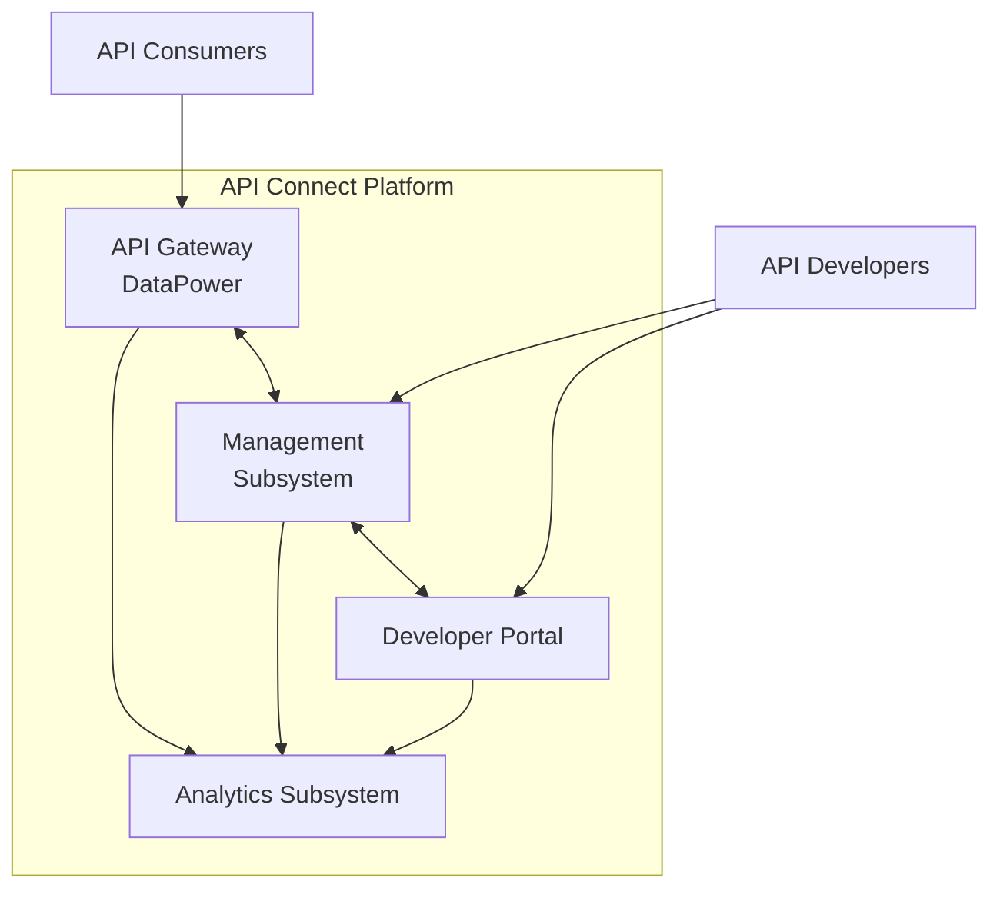
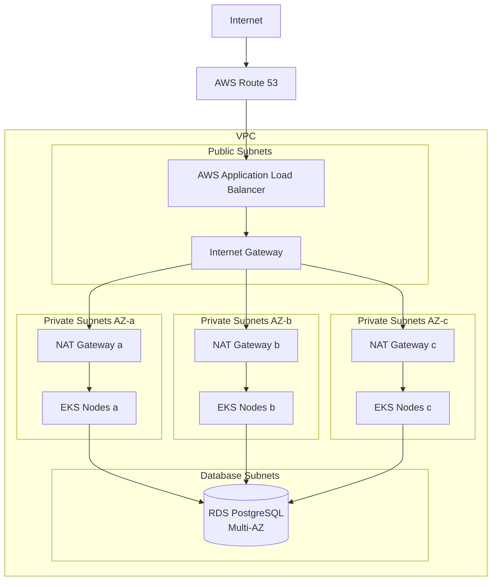
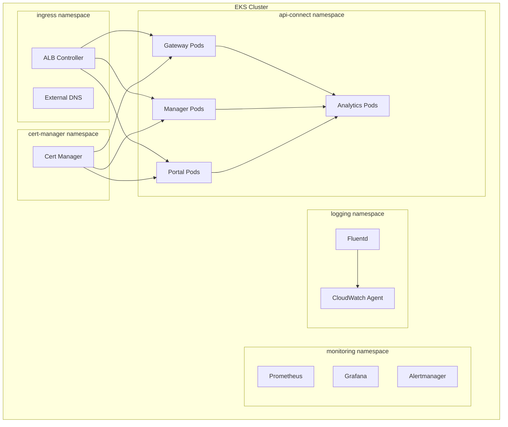
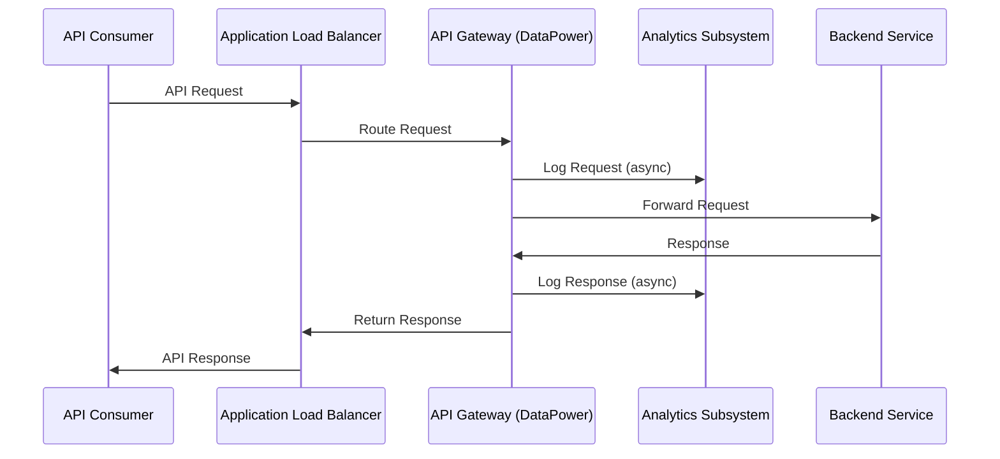
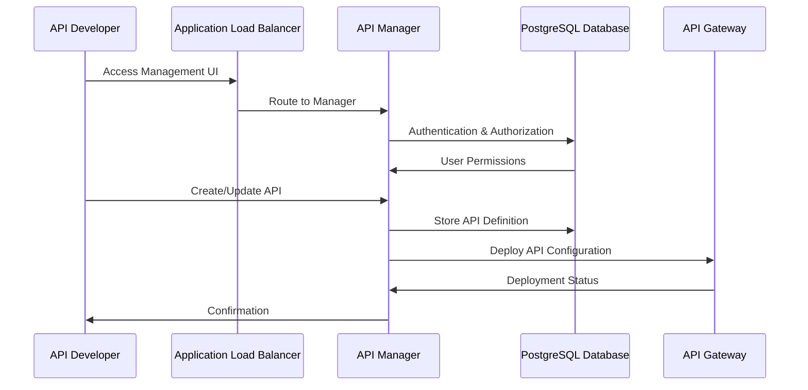

# API Connect Architecture

This page documents the architecture of our IBM API Connect platform deployed on AWS EKS. It covers the system components, infrastructure design, and integration patterns.

## Overview

IBM API Connect is our enterprise API management platform that enables the creation, execution, management, and security of APIs and microservices. The platform is hosted on AWS EKS (Elastic Kubernetes Service) and leverages various AWS services for a scalable, resilient infrastructure.

### Key Architecture Goals

- **High Availability**: Multi-AZ deployment with redundancy at all layers
- **Scalability**: Horizontal scaling capability for all components
- **Security**: Defense-in-depth approach with multiple security controls
- **Operational Excellence**: Infrastructure as code, automated deployments
- **Performance**: Low-latency API processing with optimized data paths

## Logical Architecture

### High-Level Component Diagram



### Component Descriptions

#### API Gateway (DataPower)

The IBM DataPower Gateway is responsible for:
- Runtime execution of APIs
- Policy enforcement
- Security control implementation
- Protocol mediation
- Traffic management and throttling

The gateway is deployed as multiple stateless pods in Kubernetes for high availability and scalability.

#### Management Subsystem

The Management Subsystem includes:
- **API Manager**: UI for API creation, configuration, and lifecycle management
- **Cloud Manager**: Administrative interface for platform management
- **API Connect Service**: Backend service for management operations

This component is deployed with database persistence and supports multi-user collaboration.

#### Developer Portal

The Developer Portal provides:
- Self-service API discovery and exploration
- API documentation
- Application registration
- API subscription management
- API analytics for consumers

#### Analytics Subsystem

The Analytics Subsystem collects and processes:
- API traffic metrics
- Usage statistics
- Performance data
- Error reports
- Audit logs

## Physical Architecture

### AWS Infrastructure

Our API Connect platform runs on AWS with the following key components:

#### Compute Infrastructure

- **EKS Cluster**:
  - Kubernetes version: 1.29
  - Node groups: Production and Management
  - Instance types: m5.2xlarge (8 vCPU, 32 GiB memory)
  - Autoscaling enabled: Min 3, Max 10 nodes per group

- **Node Distribution**:
  - Gateway nodes: Dedicated node group with spot instances
  - Management nodes: On-demand instances with guaranteed resources
  - Analytics nodes: Compute-optimized instances for data processing

#### Network Architecture

- **VPC Configuration**:
  - CIDR block: 10.0.0.0/16
  - 3 Availability Zones for high availability
  - Public and private subnets in each AZ

- **Subnet Layout**:
  | Subnet Purpose | AZ-a | AZ-b | AZ-c |
  |----------------|------|------|------|
  | Public | 10.0.1.0/24 | 10.0.2.0/24 | 10.0.3.0/24 |
  | Private (EKS) | 10.0.10.0/24 | 10.0.11.0/24 | 10.0.12.0/24 |
  | Private (DB) | 10.0.20.0/24 | 10.0.21.0/24 | 10.0.22.0/24 |

- **Network Flow Diagram**:



#### Storage Architecture

- **Database**: Amazon RDS PostgreSQL Multi-AZ
  - Instance class: db.m5.xlarge
  - Storage: 100GB GP3
  - Read replica for reporting and DR

- **Object Storage**: Amazon S3
  - API artifacts bucket: `api-connect-artifacts`
  - Backup bucket: `api-connect-backups`
  - Log archive bucket: `api-connect-logs`

- **Kubernetes Storage**:
  - EBS volumes for stateful workloads
  - EFS for shared filesystem access
  - StorageClasses with different performance tiers

### Security Architecture

#### Network Security

- **Security Groups**:
  | Group Name | Purpose | Inbound Access |
  |------------|---------|----------------|
  | ALB-SG | Load Balancer | HTTP/HTTPS from internet |
  | EKS-Control-Plane-SG | EKS Control Plane | HTTPS from bastion and VPN |
  | EKS-Node-SG | Worker Nodes | Control plane and node intercommunication |
  | DB-SG | RDS Instances | PostgreSQL from EKS nodes only |

- **Network ACLs**: Implemented at subnet level for additional security

- **AWS WAF**: Web application firewall configured on ALB
  - OWASP Top 10 rule sets
  - Rate limiting
  - Geographic restrictions

#### Data Security

- **Encryption**:
  - Data at rest: EBS, S3, RDS encryption using KMS
  - Data in transit: TLS 1.2+ for all communications
  - Secrets: AWS Secrets Manager for credential storage

- **Certificate Management**:
  - AWS Certificate Manager for public endpoints
  - Private CA for internal service communication
  - Automated rotation process

#### Identity and Access Management

- **Service Authentication**:
  - IAM roles for EKS nodes and services
  - OIDC integration for pod-level permissions
  - Service accounts with least privilege

- **User Authentication**:
  - Integration with corporate SSO via SAML
  - MFA enforcement for all admin access
  - Role-based access control (RBAC)

### Kubernetes Architecture

#### Cluster Configuration

- **Control Plane**: AWS-managed EKS control plane
- **Node Groups**: Self-managed with custom AMI
- **Add-ons**:
  - AWS Load Balancer Controller
  - External DNS
  - Cluster Autoscaler
  - AWS Node Termination Handler
  - Prometheus and Grafana

#### Namespace Organization

| Namespace | Purpose | Components |
|-----------|---------|------------|
| api-connect | Main application | Gateway, Manager, Portal, Analytics |
| monitoring | Monitoring tools | Prometheus, Grafana, Alertmanager |
| logging | Log aggregation | Fluentd, CloudWatch agent |
| ingress | Ingress controllers | ALB controller, external-dns |
| cert-manager | Certificate management | cert-manager |

#### Deployment Strategy

- **Gateway**: DaemonSet with anti-affinity for HA
- **Management**: Deployment with PodDisruptionBudget
- **Portal**: Deployment with horizontal autoscaling
- **Analytics**: StatefulSet for ordered deployment



#### Resources and Limits

| Component | CPU Request | Memory Request | CPU Limit | Memory Limit |
|-----------|-------------|----------------|-----------|--------------|
| Gateway | 1000m | 2048Mi | 2000m | 4096Mi |
| Manager | 500m | 1024Mi | 1000m | 2048Mi |
| Portal | 500m | 1024Mi | 1000m | 2048Mi |
| Analytics | 1000m | 2048Mi | 2000m | 4096Mi |

## Data Flow Architecture

### API Request Flow



### Management Flow



## High Availability and Disaster Recovery

### High Availability Design

- **Multi-AZ Deployment**: Components distributed across 3 Availability Zones
- **Redundancy**: Minimum 2 replicas of each component
- **Auto-healing**: Kubernetes liveness and readiness probes
- **Load Distribution**: Anti-affinity rules to spread workloads

### Failover Scenarios

| Component | Failure Scenario | Failover Mechanism | Expected Impact |
|-----------|------------------|---------------------|----------------|
| API Gateway | Pod failure | Kubernetes reschedules pod | No impact - load balanced |
| API Gateway | Node failure | Pods reschedule to healthy nodes | Minimal - seconds of higher latency |
| Management | Pod failure | Kubernetes reschedules pod | No impact to gateway, brief UI interruption |
| Database | Primary failure | RDS automated failover to standby | 1-2 minutes of management UI downtime |
| Availability Zone | AZ outage | Traffic routes to other AZs | Minimal - possible brief latency spike |

### Disaster Recovery Strategy

- **Backup Schedule**:
  - Database: Daily full backups, 5-minute transaction log backups
  - Configuration: Hourly backups to S3
  - Infrastructure: Terraforms in version control

- **Recovery Time Objectives (RTO)**:
  - Tier 1 (Gateway): 30 minutes
  - Tier 2 (Management): 2 hours
  - Tier 3 (Portal): 4 hours

- **Recovery Point Objectives (RPO)**:
  - Tier 1 (Gateway): 5 minutes
  - Tier 2 (Management): 5 minutes
  - Tier 3 (Portal): 1 hour

- **DR Environments**:
  - Warm standby in alternate AWS region (us-west-2)
  - Regular DR testing schedule

## Scaling Architecture

### Horizontal Scaling

- **API Gateway**: Scales based on CPU utilization (target: 70%)
- **Management**: Fixed scaling with manual increases for maintenance
- **Portal**: Scales based on request count
- **Analytics**: Scales based on message queue backlog

### Vertical Scaling

- **Node Sizing**: Optimized for workload patterns
- **Resource Limits**: Prevents noisy neighbor issues
- **Instance Type Selection**: Cost vs. performance balanced

### Auto-scaling Configuration

```yaml
apiVersion: autoscaling/v2
kind: HorizontalPodAutoscaler
metadata:
  name: gateway-hpa
  namespace: api-connect
spec:
  scaleTargetRef:
    apiVersion: apps/v1
    kind: Deployment
    name: gateway-deployment
  minReplicas: 3
  maxReplicas: 10
  metrics:
  - type: Resource
    resource:
      name: cpu
      target:
        type: Utilization
        averageUtilization: 70
```

## Integration Points

### External System Integrations

| System | Integration Type | Purpose | Authentication |
|--------|------------------|---------|----------------|
| Active Directory | LDAP/SAML | User authentication | Mutual TLS + credentials |
| ServiceNow | REST API | Incident management | OAuth 2.0 |
| Splunk | HTTP Event Collector | Log forwarding | HEC Token |
| Dynatrace | OneAgent + API | Monitoring | API Token |
| CI/CD Pipeline | Webhook + API | Automated deployment | Service Account |

### Backend Services Integration

- **Authentication Methods**:
  - API Key
  - OAuth 2.0
  - mTLS
  - JWT

- **Connection Pooling**:
  - Configurable per API
  - Default: 10 connections per backend

- **Circuit Breaking**:
  - Failure threshold: 50% of requests
  - Reset timeout: 30 seconds

## Environment Comparison

Our API Connect platform is deployed across multiple environments with configurations tailored to each environment's purpose and requirements. This section provides a detailed comparison of the architectural differences between environments.

### Infrastructure Comparison

| Component | Development | Testing | Staging | Production | DR |
|-----------|-------------|---------|---------|------------|------------|
| AWS Region | us-east-2 | us-east-1 | us-east-1 | us-east-1 | us-west-2 |
| Availability Zones | Single AZ | 2 AZs | 3 AZs | 3 AZs | 3 AZs |
| VPC Design | Single VPC | Single VPC | Single VPC | Single VPC | Single VPC |
| EKS Version | 1.29 | 1.29 | 1.29 | 1.29 | 1.29 |
| Node Types | m5.large | m5.xlarge | m5.2xlarge | m5.2xlarge | m5.2xlarge |
| Node Count | 2 | 4 | 6 | 6-10 (autoscaling) | 3-6 (warm standby) |
| Database | RDS Single AZ (t3.medium) | RDS Multi-AZ (m5.large) | RDS Multi-AZ (m5.xlarge) | RDS Multi-AZ (m5.xlarge) + Read Replica | RDS Multi-AZ (m5.xlarge) |
| Load Balancer | ALB (single) | ALB (single) | ALB (single) | ALB (with failover) | ALB (single) |
| Storage | GP2 volumes | GP2 volumes | GP3 volumes | GP3 + Provisioned IOPS | GP3 volumes |
| Network Bandwidth | Up to 5 Gbps | Up to 10 Gbps | Up to 20 Gbps | Up to 25 Gbps | Up to 20 Gbps |
| Cost Optimization | Spot Instances | Mixed On-Demand/Spot | Reserved Instances | Reserved Instances | Reserved Instances |

### API Connect Component Scaling

| Component | Development | Testing | Staging | Production | DR |
|-----------|-------------|---------|---------|------------|------------|
| Gateway Pods | 1 | 2 | 3 | 3 per AZ (9 total) | 2 per AZ (6 total) |
| Manager Pods | 1 | 2 | 2 | 2 per AZ (6 total) | 1 per AZ (3 total) |
| Portal Pods | 1 | 2 | 2 | 2 per AZ (6 total) | 1 per AZ (3 total) |
| Analytics Pods | 1 | 2 | 3 | 3 per AZ (9 total) | 1 per AZ (3 total) |
| Gateway CPU Requests | 500m | 750m | 1000m | 1000m | 1000m |
| Gateway Memory Requests | 1024Mi | 1536Mi | 2048Mi | 2048Mi | 2048Mi |
| Manager CPU Requests | 250m | 500m | 500m | 500m | 500m |
| Manager Memory Requests | 512Mi | 1024Mi | 1024Mi | 1024Mi | 1024Mi |
| Horizontal Autoscaling | Disabled | Limited | Full | Full | Limited |
| Min/Max Gateway Pods | 1/1 | 2/4 | 3/6 | 9/18 | 6/12 |
| Min/Max Manager Pods | 1/1 | 2/2 | 2/4 | 6/8 | 3/6 |
| Min/Max Portal Pods | 1/1 | 2/2 | 2/4 | 6/8 | 3/6 |
| Min/Max Analytics Pods | 1/1 | 2/3 | 3/5 | 9/15 | 3/6 |
| Scaling Metrics | N/A | CPU only | CPU & Memory | CPU, Memory & Custom | CPU only |

### Network Configuration

| Feature | Development | Testing | Staging | Production | DR |
|---------|-------------|---------|---------|------------|------------|
| Ingress Protocol | HTTP + HTTPS | HTTPS Only | HTTPS Only | HTTPS Only | HTTPS Only |
| TLS Version | TLS 1.2+ | TLS 1.2+ | TLS 1.2+ | TLS 1.3 Only | TLS 1.3 Only |
| WAF Rules | Basic | Standard | Enhanced | Enhanced + Custom | Enhanced |
| Subnet Layout | Simplified | Standard | Production-like | Full isolation | Production-like |
| Network Policies | Basic | Enhanced | Full | Full + Audit | Full |
| DNS Strategy | dev.api.example.com | test.api.example.com | staging.api.example.com | api.example.com | dr.api.example.com |
| CDN Integration | None | None | CloudFront (testing) | CloudFront (production) | CloudFront (failover) |
| DDoS Protection | Basic | AWS Shield | AWS Shield | AWS Shield Advanced | AWS Shield Advanced |
| Traffic Monitoring | Basic | Standard | Enhanced | Full | Enhanced |
| Network Flow Logs | Off | Critical Only | All VPC Traffic | All VPC Traffic | Critical Only |
| API Endpoints | Non-versioned | Versioned | Versioned | Versioned + Region-aware | Versioned + Region-aware |
| Custom Domains | No | No | Limited | Yes | Limited |

### Security Configuration

| Feature | Development | Testing | Staging | Production | DR |
|---------|-------------|---------|---------|------------|------------|
| API Rate Limiting | 100 req/min | 50 req/min | 30 req/min | 20 req/min | 20 req/min |
| Certificate Issuer | Self-signed | Let's Encrypt Staging | Let's Encrypt Production | ACM + Let's Encrypt Production | ACM |
| Certificate Rotation | Manual | Automated (90 days) | Automated (60 days) | Automated (30 days) | Automated (60 days) |
| Authentication | Basic + OAuth | SAML Test | SAML Pre-Prod | SAML Production | SAML DR |
| Secret Management | ConfigMaps | K8s Secrets | AWS Secrets Manager | AWS Secrets Manager + KMS | AWS Secrets Manager |
| Security Scanning | On commit | Daily | Hourly | Hourly + Real-time | Daily |
| Compliance Checks | Basic | SOC2 | SOC2 + PCI | SOC2 + PCI + HIPAA | SOC2 + PCI + HIPAA |
| Pod Security Policies | Permissive | Standard | Strict | Strict + Custom | Strict |
| Security Groups | Permissive | Standard | Restrictive | Restrictive + Audit | Restrictive |
| IAM Permissions | Development | Limited | Production-like | Least Privilege | Least Privilege |
| Audit Logging | Basic | Standard | Enhanced | Full | Enhanced |
| Sensitive Data Masking | Limited | Standard | Enhanced | Full | Enhanced |
| Penetration Testing | Quarterly | Monthly | Bi-weekly | Weekly | Quarterly |
| Container Image Scanning | On Build | On Build + Daily | On Build + Hourly | On Build + Continuous | On Build + Daily |

### Backup and DR Strategy

| Feature | Development | Testing | Staging | Production | DR |
|---------|-------------|---------|---------|------------|------------|
| Database Backup | Weekly | Daily | Hourly | Continuous | Continuous from Production |
| Config Backup | On change | Daily | Hourly | Continuous | Continuous from Production |
| Retention Period | 7 days | 30 days | 60 days | 90 days | 90 days |
| Backup Testing | Quarterly | Monthly | Bi-weekly | Weekly | Monthly |
| DR Strategy | None | Backup restore | Pilot light | Warm standby | Active (for failover) |
| RTO | Best effort (24h+) | 8 hours | 4 hours | 30 minutes | 15 minutes |
| RPO | 1 week | 24 hours | 1 hour | 5 minutes | 0 minutes (sync replication) |
| DR Testing | None | Quarterly | Monthly | Bi-weekly | Bi-weekly |
| Failback Procedure | Manual rebuild | Manual restore | Semi-automated | Fully automated | Fully automated |
| Multi-region Strategy | Single region | Single region | Region + backup | Multi-region active/passive | Secondary active region |
| Data Synchronization | Manual | Daily sync | Hourly sync | Real-time replication | Real-time from Production |

### Performance Characteristics

| Metric | Development | Testing | Staging | Production | DR |
|--------|-------------|---------|---------|------------|------------|
| API Throughput Capacity | 100 TPS | 500 TPS | 1,000 TPS | 5,000 TPS | 3,000 TPS |
| Peak Load Capacity | 200 TPS | 1,000 TPS | 2,000 TPS | 15,000 TPS | 10,000 TPS |
| P95 Latency Target | 500ms | 300ms | 200ms | 150ms | 200ms |
| Max Concurrent Users | 50 | 200 | 500 | 5,000 | 3,000 |
| Connection Pool Size | 10 | 20 | 30 | 50 | 40 |
| Gateway Cache Size | 512 MB | 1 GB | 2 GB | 4 GB | 2 GB |
| Database Connections | 50 | 100 | 200 | 500 | 300 |
| Load Testing Frequency | On demand | Weekly | Daily | Continuous | Monthly |
| Performance Monitoring | Basic | Standard | Enhanced | Full with alerting | Enhanced |
| Throttling Behavior | Reject | Delayed response | Queueing | Advanced queue + reject | Queueing |
| SLA Commitment | None | None | 99.9% | 99.95% | 99.9% |
| Performance Testing | Manual | Automated weekly | Automated daily | Automated continuous | Automated weekly |

### Operational Differences

| Feature | Development | Testing | Staging | Production | DR |
|---------|-------------|---------|---------|------------|------------|
| Change Frequency | Multiple daily | Daily | Weekly | Bi-weekly | On failover only |
| Deployment Method | Direct kubectl | CI/CD pipeline | CI/CD with manual approval | CI/CD with multiple approvals | Automated with Production |
| Maintenance Window | Any time | Business hours | Off-hours notified | Scheduled monthly window | Scheduled with Production |
| Monitoring Scope | Basic uptime | Core metrics | Full metrics | Full metrics + business KPIs | Full metrics |
| Alert Routing | Slack only | Slack + email | Slack + email + ticketing | PagerDuty + ticketing | PagerDuty + ticketing |
| Support Hours | Business hours | Business hours | Extended hours | 24/7 | 24/7 during failover |
| Documentation | Minimal | Basic | Comprehensive | Comprehensive + runbooks | Comprehensive + DR runbooks |
| On-call Rotation | None | None | Limited | Full rotation | Combined with Production |
| Incident Response | Best effort | Next business day | Same day | Immediate | Immediate during failover |
| Change Approval | Team lead | Team lead + QA | Change board | Emergency CAB | Emergency CAB |

## References

- [AWS EKS Best Practices](https://aws.github.io/aws-eks-best-practices/)
- [IBM API Connect Documentation](https://www.ibm.com/docs/en/api-connect)
- [Kubernetes Documentation](https://kubernetes.io/docs/)
- [Internal Architecture Decision Records](https://github.com/your-org/architecture-decisions)

## Related Pages

- [Observability](../Observability) - Monitoring and observability for the platform
- [Runbook](../Runbook) - Operational procedures and incident management
- [SDLC](../SDLC) - Development and deployment processes
- [Access](../Access) - Access control and security information
