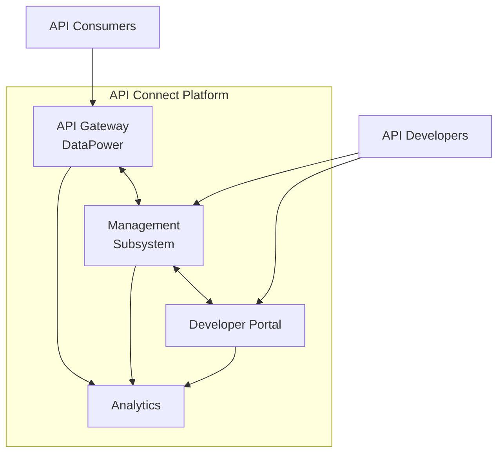
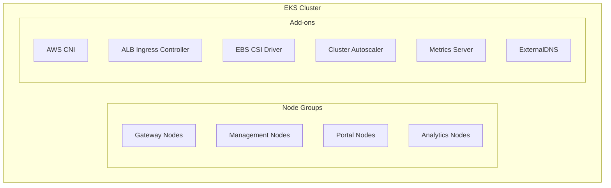

# API Connect Architecture

## Logical Architecture

| Component | Function | Deployment Pattern |
|-----------|----------|-------------------|
| Gateway (DataPower) | Runtime execution, policy enforcement, routing | StatefulSet, 3+ pods across AZs |
| Management | API lifecycle management, UI, configuration store | Deployment with 2+ replicas |
| Portal | Consumer self-service, API discovery, subscriptions | Deployment with 2+ replicas |
| Analytics | Metrics collection, processing, visualization | StatefulSet with dedicated nodegroup |

## Physical Architecture

### AWS Infrastructure

| Service | Configuration | Purpose |
|---------|---------------|---------|
| EKS | v1.29, 3 AZs | Container orchestration |
| EC2 | Multiple node groups with instance types: m5.2xlarge (Gateway), m5.xlarge (Management), r5.large (Analytics) | Compute resources |
| RDS | PostgreSQL 14, Multi-AZ, db.m5.xlarge | Database |
| Route53 | Public hosted zone with failover configuration | DNS management |
| ACM | TLS certificates for public endpoints | Certificate management |
| S3 | Buckets for backup, logs, artifacts | Object storage |
| IAM | IRSA for pod-level permissions | Access management |
| ELBv2 | ALB with WAF, target group per component | Load balancing |
| KMS | Service-managed keys for encryption | Encryption |

### Network Architecture

VPC CIDR: 10.0.0.0/16

| Subnet Type | AZ-a | AZ-b | AZ-c | Purpose |
|-------------|------|------|------|---------|
| Public | 10.0.1.0/24 | 10.0.2.0/24 | 10.0.3.0/24 | Load balancers, NAT gateways |
| Private (EKS) | 10.0.10.0/24 | 10.0.11.0/24 | 10.0.12.0/24 | EKS worker nodes |
| Private (DB) | 10.0.20.0/24 | 10.0.21.0/24 | 10.0.22.0/24 | RDS instances |

Security groups:
- alb-sg: 80/443 from internet
- api-sg: 9443 from ALB-SG
- mgmt-sg: 443 from VPN CIDR
- db-sg: 5432 from API-SG/MGMT-SG

### Kubernetes Architecture

| Namespace | Purpose | Components |
|-----------|---------|------------|
| api-connect | Main application | Gateway, Manager, Portal, Analytics |
| monitoring | Monitoring tools | Prometheus, Grafana, Alertmanager |
| logging | Log aggregation | Fluentd, CloudWatch agent |
| ingress | Ingress controllers | ALB controller, external-dns |
| cert-manager | Certificate management | cert-manager |

## HA & DR Strategy

### High Availability

- Multi-AZ deployment across 3 AZs
- Component redundancy: min 2 replicas of each component
- RDS Multi-AZ with automated failover
- Stateless architecture with persistent storage in RDS/S3

### Disaster Recovery

| Component | Strategy | RPO | RTO |
|-----------|----------|-----|-----|
| Gateway | Cross-region standby | 5 min | 30 min |
| Management | Cross-region DB replication | 5 min | 2 hrs |
| Portal | Cross-region DB replication | 1 hr | 4 hrs |
| Analytics | Cross-region replication | 1 hr | 4 hrs |

DR region: us-west-2 with warm standby configuration

## Scaling Architecture

| Component | Scaling Method | Min/Max | Scaling Trigger |
|-----------|----------------|---------|----------------|
| Gateway | HPA | 3/10 | CPU > 70% |
| Management | HPA | 2/6 | CPU > 70% |
| Portal | HPA | 2/6 | CPU > 70% |
| Analytics | HPA | 3/8 | CPU > 70% |
| EKS Nodes | Cluster Autoscaler | 3/10 per group | Node utilization > 70% |

Resource allocations:
- Gateway: 1000m/2000m CPU, 2Gi/4Gi memory
- Management: 500m/1000m CPU, 1Gi/2Gi memory
- Portal: 500m/1000m CPU, 1Gi/2Gi memory
- Analytics: 1000m/2000m CPU, 2Gi/4Gi memory

## Environment Comparison

| Aspect | Development | Testing | Staging | Production | DR |
|--------|-------------|---------|---------|------------|------------|
| AWS Region | us-east-2 | us-east-2 | us-east-1 | us-east-1 | us-west-2 |
| EKS Version | 1.29 | 1.29 | 1.29 | 1.29 | 1.29 |
| AZs | Single | Dual | Triple | Triple | Triple |
| Node Groups | Single | 2 | 3 | 4 | 3 |
| RDS | Single-AZ t3.medium | Multi-AZ m5.large | Multi-AZ m5.xlarge | Multi-AZ m5.xlarge + Read Replica | Multi-AZ m5.xlarge |
| Min Replicas | 1 each | 2 each | 2 each | 3 each | 2 each |
| Network | Single VPC | Single VPC | Production VPC | Production VPC | DR VPC |
| Certificate | Self-signed | ACM | ACM | ACM | ACM |
| DNS | dev.api.example.com | test.api.example.com | staging.api.example.com | api.example.com | dr.api.example.com |

## References

- [AWS EKS Best Practices](https://aws.github.io/aws-eks-best-practices/)
- [IBM API Connect Documentation](https://www.ibm.com/docs/en/api-connect)
- [Kubernetes Documentation](https://kubernetes.io/docs/)
- [Internal ADRs](https://github.com/your-org/architecture-decisions)