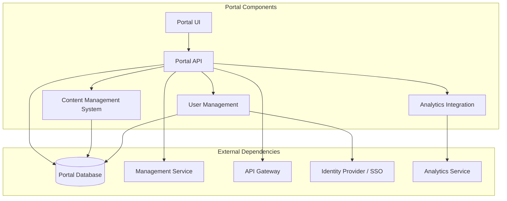
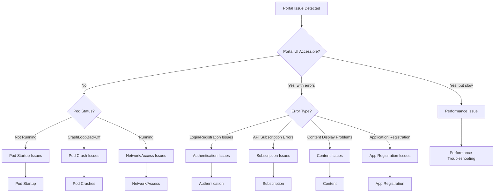
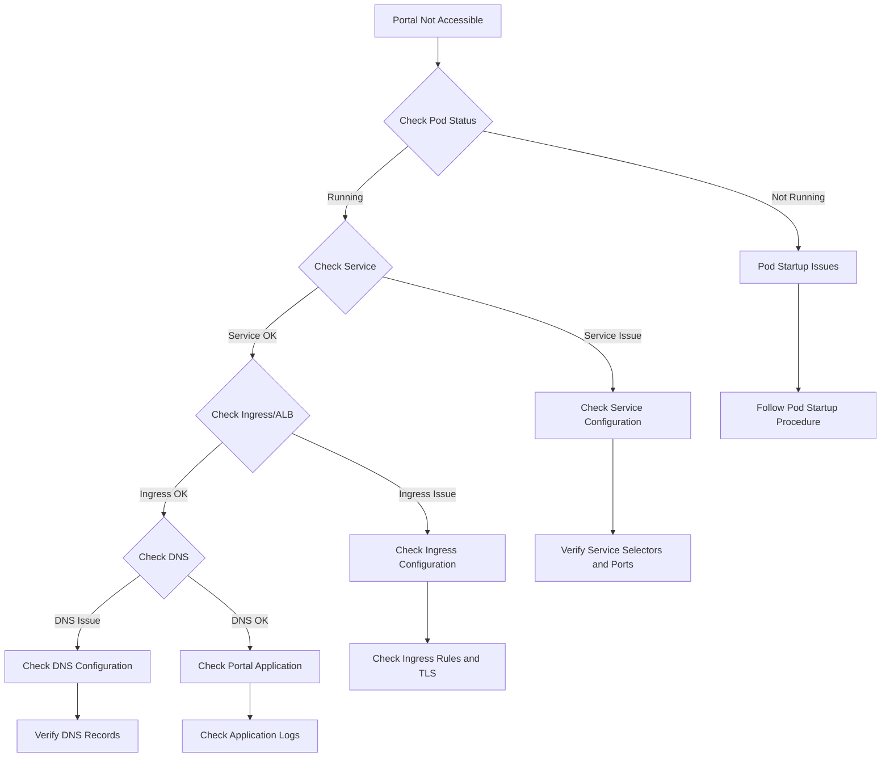
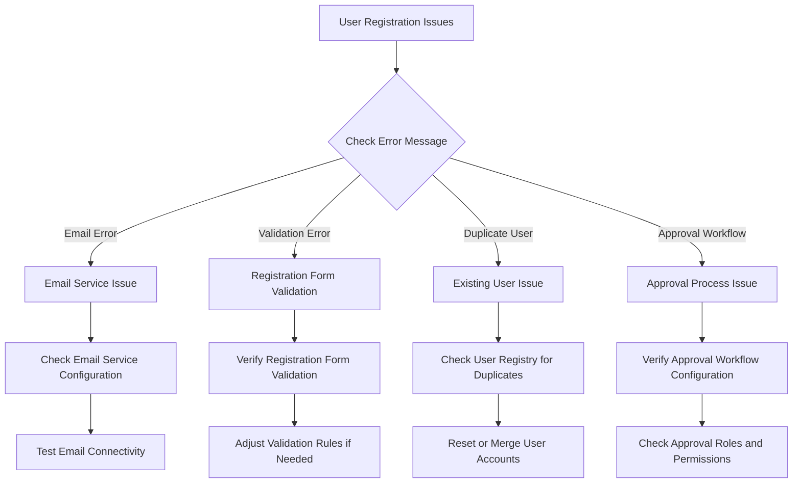

# APIC Developer Portal Runbook

This runbook provides detailed troubleshooting steps and operational procedures for the IBM API Connect Developer Portal deployed on AWS EKS.

## Portal Component Overview

The Developer Portal is the consumer-facing component of the API Connect platform, providing a self-service interface for API consumers to discover, explore, and subscribe to APIs. Key functions include:
- API discovery and documentation
- Developer registration and onboarding
- Application registration and credential management
- API subscription management
- API testing and exploration
- Usage analytics for API consumers
- Community features such as blogs and forums

### Portal Architecture

The Developer Portal consists of these key components:

- **Portal UI**: Web interface for API consumers
- **Portal API**: Backend services supporting the Portal UI
- **Portal Database**: Stores portal content, user data, and application registrations
- **Content Management System**: Manages portal content and themes
- **User Management**: Handles portal user registration and authentication
- **Analytics Integration**: Provides usage metrics to API consumers

### Key Dependencies



## Diagnostic Decision Tree

Use this decision tree to quickly navigate to the appropriate troubleshooting section:



## Portal Observability

### Key Metrics to Monitor

| Metric | Description | Warning Threshold | Critical Threshold | Dashboard |
|--------|-------------|-------------------|---------------------|-----------|
| Portal.Availability | Portal UI accessibility | <99.5% | <99% | [Portal Dashboard](https://your-tenant.dynatrace.com/portal-dashboard) |
| Portal.ResponseTime | UI response time (p95) | >2s | >5s | [Portal Dashboard](https://your-tenant.dynatrace.com/portal-dashboard) |
| Portal.ErrorRate | Percentage of errors | >5% | >10% | [Portal Dashboard](https://your-tenant.dynatrace.com/portal-dashboard) |
| Portal.UserRegistrationRate | New user registrations | <historical baseline | N/A (trend) | [Portal Usage](https://your-tenant.dynatrace.com/portal-usage) |
| Portal.SubscriptionCount | API subscription operations | N/A (trend) | N/A (trend) | [Portal Usage](https://your-tenant.dynatrace.com/portal-usage) |
| Portal.DatabaseConnectionCount | Active DB connections | >70% pool | >90% pool | [Portal Resources](https://your-tenant.dynatrace.com/portal-resources) |
| Portal.CPUUtilization | Pod CPU usage | >70% | >85% | [Portal Resources](https://your-tenant.dynatrace.com/portal-resources) |
| Portal.MemoryUtilization | Pod memory usage | >70% | >85% | [Portal Resources](https://your-tenant.dynatrace.com/portal-resources) |
| Portal.PodReplicaCount | Number of running pods | <2 | 0 | [Portal Dashboard](https://your-tenant.dynatrace.com/portal-dashboard) |

### Key Logs to Check

| Log Source | Typical Issues | Access Method | Retention |
|------------|----------------|--------------|-----------|
| Portal Application Logs | Errors, warnings, system issues | `kubectl logs -n api-connect -l component=portal -c portal` | 7 days in pods, 30 days in Splunk |
| Portal Access Logs | UI access, API operations, timing | `kubectl logs -n api-connect -l component=portal -c portal-access-logs` | 7 days in pods, 90 days in Splunk |
| Portal Audit Logs | Security events, user activities | `kubectl logs -n api-connect -l component=portal -c portal-audit` | 7 days in pods, 1 year in Splunk |
| SSO Integration Logs | Authentication issues | `kubectl logs -n api-connect -l component=portal -c portal | grep -i "sso\|auth\|login"` | 7 days in pods, 90 days in Splunk |

### Splunk Queries

| Issue | Splunk Query | Dashboard |
|-------|-------------|-----------|
| Portal errors | `index=api_connect sourcetype=portal-logs level=ERROR | timechart count by error_code` | [Portal Errors](https://splunk.your-company.com/portal-errors) |
| Login failures | `index=api_connect sourcetype=portal-logs "login failed" OR "authentication failed" | stats count by username, error_message` | [Portal Auth Issues](https://splunk.your-company.com/portal-auth-issues) |
| Subscription issues | `index=api_connect sourcetype=portal-logs "subscription failed" OR "subscription error" | stats count by api_name, error_message` | [Subscription Issues](https://splunk.your-company.com/subscription-issues) |
| Slow page loads | `index=api_connect sourcetype=portal-access-logs | stats avg(response_time) as avg_resp, p95(response_time) as p95_resp by page_path | sort - p95_resp` | [Portal Performance](https://splunk.your-company.com/portal-performance) |

## Portal Pod Startup Issues

### Symptoms
- Portal UI is not accessible
- Pods stuck in `Pending` or `ContainerCreating` state
- ServiceNow alerts about Portal service unavailability
- Error messages when trying to access the Portal URL

### Diagnostic Steps

1. **Check pod status:**
   ```bash
   kubectl get pods -n api-connect -l component=portal
   ```

2. **Check pod details for pending issues:**
   ```bash
   kubectl describe pod -n api-connect [portal-pod-name]
   ```

3. **Check node resource availability:**
   ```bash
   kubectl describe nodes | grep -A 5 "Allocated resources"
   kubectl top nodes
   ```

4. **Check recent events:**
   ```bash
   kubectl get events -n api-connect --sort-by=.metadata.creationTimestamp | grep portal
   ```

5. **Check persistent volume claims if applicable:**
   ```bash
   kubectl get pvc -n api-connect | grep portal
   kubectl describe pvc -n api-connect [pvc-name]
   ```

### Common Issues and Resolutions

<details>
<summary><strong>Insufficient Resources</strong></summary>

**Symptoms:**
- Pod status shows `Pending`
- Events show `FailedScheduling`
- Error mentions insufficient CPU or memory

**Resolution:**
1. Check node resource usage:
   ```bash
   kubectl top nodes
   ```

2. Adjust resource requests if too high:
   ```bash
   kubectl edit deployment -n api-connect portal-deployment
   # Modify resources.requests values
   ```

3. Scale up node group if cluster is at capacity:
   ```bash
   # Check current node group size
   aws eks describe-nodegroup --cluster-name api-connect-cluster --nodegroup-name portal-nodes --region us-east-1
   
   # Scale up node group (using console or AWS CLI)
   aws eks update-nodegroup-config --cluster-name api-connect-cluster --nodegroup-name portal-nodes --scaling-config desiredSize=4,minSize=2,maxSize=6 --region us-east-1
   ```
</details>

<details>
<summary><strong>Image Pull Issues</strong></summary>

**Symptoms:**
- Pod status shows `ContainerCreating`
- Events show `ErrImagePull` or `ImagePullBackOff`

**Resolution:**
1. Verify image name and repository access:
   ```bash
   kubectl describe pod -n api-connect [portal-pod-name]
   # Check image name and pull error details
   ```

2. Check registry credentials:
   ```bash
   kubectl get secret -n api-connect registry-credentials
   # Verify the secret exists and is correctly formatted
   ```

3. Update image pull secret if needed:
   ```bash
   kubectl create secret docker-registry registry-credentials \
     --docker-server=your-registry.example.com \
     --docker-username=your-username \
     --docker-password=your-password \
     --docker-email=your-email@example.com \
     -n api-connect \
     --dry-run=client -o yaml | kubectl apply -f -
   ```
</details>

#### Database Connection Issues

**Symptoms:**
- Pods start but crash immediately
- Logs show database connection failures
- Events mention readiness probe failures

**Resolution:**
1. Check database connectivity:
   ```bash
   # Get the portal pod name
   PORTAL_POD=$(kubectl get pods -n api-connect -l component=portal -o jsonpath='{.items[0].metadata.name}')
   
   # Test database connection
   kubectl exec -it $PORTAL_POD -n api-connect -- curl -v [db-service]:5432
   ```

2. Check database credentials:
   ```bash
   # Verify the database secret exists
   kubectl get secret -n api-connect portal-db-credentials
   ```

3. Check RDS instance status (if using AWS RDS):
   ```bash
   aws rds describe-db-instances --db-instance-identifier api-connect-db --query 'DBInstances[].DBInstanceStatus' --region us-east-1
   ```

4. If needed, update database credentials:
   ```bash
   kubectl create secret generic portal-db-credentials \
     --from-literal=username=dbuser \
     --from-literal=password=dbpassword \
     -n api-connect \
     --dry-run=client -o yaml | kubectl apply -f -
   ```

## Portal Pod Crash Issues

### Symptoms
- Pods in `CrashLoopBackOff` state
- Repeated container restarts
- Portal service intermittently available

### Diagnostic Steps

1. **Check pod status and restart count:**
   ```bash
   kubectl get pods -n api-connect -l component=portal
   ```

2. **Check pod events:**
   ```bash
   kubectl describe pod -n api-connect [portal-pod-name]
   ```

3. **Check container logs:**
   ```bash
   # Check current logs
   kubectl logs -n api-connect [portal-pod-name] -c portal
   
   # Check previous container logs if available
   kubectl logs -n api-connect [portal-pod-name] -c portal --previous
   ```

4. **Check resource usage before crash:**
   ```bash
   kubectl top pods -n api-connect
   ```

### Common Issues and Resolutions

#### Configuration Errors

**Symptoms:**
- Logs show configuration parsing errors
- Error messages about invalid properties
- References to missing config elements

**Resolution:**
1. Check the portal configuration:
   ```bash
   kubectl get configmap -n api-connect portal-config -o yaml
   ```

2. Look for syntax errors or invalid values

3. Restore previous configuration if recent change caused the issue:
   ```bash
   # Apply previous known-good config
   kubectl apply -f previous-portal-config.yaml
   ```

4. Restart portal pods:
   ```bash
   kubectl rollout restart deployment -n api-connect portal-deployment
   ```

#### Memory Issues

**Symptoms:**
- Logs show OutOfMemoryError
- Container killed with exit code 137
- Memory usage climbing before crash

**Resolution:**
1. Check memory limits and usage:
   ```bash
   kubectl describe pod -n api-connect [portal-pod-name] | grep -A 3 Limits
   kubectl top pods -n api-connect
   ```

2. Increase memory limits if needed:
   ```bash
   kubectl edit deployment -n api-connect portal-deployment
   # Increase resources.limits.memory value
   ```

3. Check for memory leaks by analyzing heap dumps or monitoring memory growth patterns

4. Implement a regular restart schedule as a temporary measure:
   ```bash
   # Create a Jenkins job to restart pods on a schedule
   # Example Jenkins pipeline step
   stage('Scheduled Portal Restart') {
     steps {
       sh 'kubectl rollout restart deployment -n api-connect portal-deployment'
     }
   }
   ```

#### Database Connection Pool Exhaustion

**Symptoms:**
- Errors about database connections
- Log messages showing "connection pool exhausted"
- Degraded performance leading to crashes

**Resolution:**
1. Check current connection pool settings:
   ```bash
   kubectl get configmap -n api-connect portal-config -o yaml | grep -A 10 "database"
   ```

2. Increase connection pool size:
   ```bash
   kubectl edit configmap -n api-connect portal-config
   # Modify database connection pool settings
   # Example: increase maxActive, maxIdle values
   ```

3. Check database for long-running queries:
   ```bash
   # If using PostgreSQL, connect to database
   # Example query to find long-running queries
   SELECT pid, now() - pg_stat_activity.query_start AS duration, query 
   FROM pg_stat_activity 
   WHERE state = 'active' AND now() - pg_stat_activity.query_start > interval '30 seconds'
   ORDER BY duration DESC;
   ```

4. Restart the portal pods to apply configuration changes:
   ```bash
   kubectl rollout restart deployment -n api-connect portal-deployment
   ```

## Portal Authentication Issues

### Symptoms
- Users unable to log in to the Developer Portal
- Registration failures
- SSO integration issues
- Session expiration problems

### Diagnostic Steps

1. **Check authentication configuration:**
   ```bash
   kubectl get configmap -n api-connect portal-auth-config -o yaml
   ```

2. **Check login failure logs:**
   ```bash
   kubectl logs -n api-connect -l component=portal | grep -i "login\|auth\|authentication\|registration"
   ```

3. **Verify SSO provider connectivity (if using SSO):**
   ```bash
   kubectl exec -it -n api-connect [portal-pod-name] -- curl -kv [sso-provider-url]
   ```

4. **Check user registry status:**
   ```bash
   kubectl exec -it -n api-connect [portal-pod-name] -- curl -s -k https://localhost:8443/api/user-registry/status
   ```

### Common Issues and Resolutions

#### Local User Authentication Problems

**Symptoms:**
- Users can't log in with username/password
- Password reset not working
- Account lockouts

**Resolution:**
1. Check user status in the database:
   ```bash
   # Connect to database and check user status
   # Example PostgreSQL query
   SELECT username, email, active, locked, email_verified 
   FROM portal_users 
   WHERE username = 'user_with_problem';
   ```

2. Reset user password if needed:
   ```bash
   # Use portal admin API to reset password
   kubectl exec -it -n api-connect [portal-pod-name] -- curl -k -X POST -H "Content-Type: application/json" -d '{"username":"user_with_problem"}' https://localhost:8443/api/users/reset-password
   ```

3. Unlock user account if needed:
   ```bash
   # Unlock a locked account
   kubectl exec -it -n api-connect [portal-pod-name] -- curl -k -X POST -H "Content-Type: application/json" -d '{"username":"user_with_problem"}' https://localhost:8443/api/users/unlock
   ```

#### SSO Integration Issues

**Symptoms:**
- SSO login fails
- Redirect loops
- SAML assertion errors

**Resolution:**
1. Verify SAML configuration:
   ```bash
   kubectl get configmap -n api-connect portal-saml-config -o yaml
   # Check for correct metadata URL, entity ID, etc.
   ```

2. Test SAML metadata URL accessibility:
   ```bash
   kubectl exec -it -n api-connect [portal-pod-name] -- curl -kv [saml-metadata-url]
   ```

3. Update SAML metadata if needed:
   ```bash
   # Update SAML metadata configmap
   kubectl create configmap portal-saml-config --from-file=metadata.xml -n api-connect --dry-run=client -o yaml | kubectl apply -f -
   ```

4. Check for clock skew issues:
   ```bash
   # Check time synchronization on nodes
   kubectl debug node/[node-name] -it --image=ubuntu -- chronyc tracking
   ```

#### Registration Process Failures

**Symptoms:**
- New users can't complete registration
- Email verification issues
- Organization approval workflow failures

**Resolution:**
1. Verify email service configuration:
   ```bash
   kubectl get configmap -n api-connect portal-email-config -o yaml
   # Check SMTP settings, templates, etc.
   ```

2. Test email connectivity:
   ```bash
   kubectl exec -it -n api-connect [portal-pod-name] -- curl -v [smtp-server]:25
   ```

3. Check registration workflow configuration:
   ```bash
   kubectl get configmap -n api-connect portal-registration-config -o yaml
   # Verify approval workflow, required fields, etc.
   ```

4. Review pending registrations:
   ```bash
   # Check pending registrations in database
   # Example PostgreSQL query
   SELECT username, email, registration_date, status
   FROM portal_registrations
   WHERE status = 'pending';
   ```

## API Subscription Issues

### Symptoms
- Users unable to subscribe to APIs
- Subscription approval workflow failures
- Missing API credentials after subscription
- Errors when using subscribed APIs

### Diagnostic Steps

1. **Check subscription process logs:**
   ```bash
   kubectl logs -n api-connect -l component=portal | grep -i "subscription\|subscribe\|product\|plan"
   ```

2. **Verify API product visibility:**
   ```bash
   kubectl exec -it -n api-connect [portal-pod-name] -- curl -k -H "Accept: application/json" https://localhost:8443/api/catalogs/[catalog-name]/products
   ```

3. **Check subscription database records:**
   ```bash
   # Example PostgreSQL query
   SELECT app_id, product_id, plan_id, state, created_at
   FROM subscriptions
   WHERE app_id = 'problem_application_id';
   ```

4. **Verify management service connectivity:**
   ```bash
   kubectl exec -it -n api-connect [portal-pod-name] -- curl -kv https://manager-service:9443/health
   ```

### Common Issues and Resolutions

#### Subscription Approval Workflow Issues

**Symptoms:**
- Subscriptions stuck in "pending" state
- Approval emails not being sent
- Approval actions not taking effect

**Resolution:**
1. Check subscription approval workflow configuration:
   ```bash
   kubectl get configmap -n api-connect portal-subscription-config -o yaml
   # Verify approval process settings
   ```

2. Verify approval roles and permissions:
   ```bash
   # Check roles assigned to approvers
   # Example PostgreSQL query
   SELECT username, role_name
   FROM portal_user_roles
   WHERE role_name = 'subscription_approver';
   ```

3. Manually approve pending subscriptions if needed:
   ```bash
   kubectl exec -it -n api-connect [portal-pod-name] -- curl -k -X POST -H "Content-Type: application/json" -d '{"state":"approved"}' https://localhost:8443/api/apps/[app-id]/subscriptions/[subscription-id]
   ```

#### API Credential Issues

**Symptoms:**
- Missing credentials after subscription
- Invalid credentials when calling API
- Credential regeneration failures

**Resolution:**
1. Verify credential generation process:
   ```bash
   kubectl logs -n api-connect -l component=portal | grep -i "credential\|key\|secret"
   ```

2. Check stored credentials:
   ```bash
   # Example PostgreSQL query
   SELECT app_id, key, created_at
   FROM app_credentials
   WHERE app_id = 'problem_application_id';
   ```

3. Regenerate credentials if needed:
   ```bash
   kubectl exec -it -n api-connect [portal-pod-name] -- curl -k -X POST -H "Content-Type: application/json" https://localhost:8443/api/apps/[app-id]/credentials/regenerate
   ```

4. Verify gateway credential synchronization:
   ```bash
   kubectl exec -it -n api-connect [gateway-pod-name] -- curl -k https://localhost:9443/api/credential-sync/status
   ```

#### Rate Limit and Quota Issues

**Symptoms:**
- APIs returning 429 status codes
- Quota exceeded errors
- Inconsistent rate limiting behavior

**Resolution:**
1. Check subscription plan configuration:
   ```bash
   kubectl exec -it -n api-connect [portal-pod-name] -- curl -k -H "Accept: application/json" https://localhost:8443/api/catalogs/[catalog-name]/products/[product-id]/plans
   ```

2. Verify rate limit configuration on gateway:
   ```bash
   kubectl exec -it -n api-connect [gateway-pod-name] -- curl -k -H "Accept: application/json" https://localhost:9443/api/rate-limits
   ```

3. Check current usage against limits:
   ```bash
   # Example PostgreSQL query
   SELECT app_id, api_id, usage_count, quota_limit, period
   FROM usage_records
   WHERE app_id = 'problem_application_id';
   ```

4. Reset quotas if needed (for testing):
   ```bash
   kubectl exec -it -n api-connect [gateway-pod-name] -- curl -k -X POST -H "Content-Type: application/json" -d '{"app_id":"problem_application_id"}' https://localhost:9443/api/quotas/reset
   ```

## Portal Content Issues

### Symptoms
- Missing or incorrect API documentation
- Broken links or images
- Formatting problems
- Custom pages not displaying correctly

### Diagnostic Steps

1. **Check content management logs:**
   ```bash
   kubectl logs -n api-connect -l component=portal | grep -i "content\|cms\|page\|document"
   ```

2. **Verify content in database:**
   ```bash
   # Example PostgreSQL query
   SELECT page_id, title, updated_at, published
   FROM portal_pages
   WHERE page_id = 'problem_page_id';
   ```

3. **Check theme and customization settings:**
   ```bash
   kubectl get configmap -n api-connect portal-theme-config -o yaml
   ```

4. **Verify API documentation synchronization:**
   ```bash
   kubectl logs -n api-connect -l component=portal | grep -i "api-doc\|swagger\|openapi\|sync"
   ```

### Common Issues and Resolutions

#### API Documentation Synchronization Issues

**Symptoms:**
- Missing or outdated API documentation
- Swagger/OpenAPI rendering issues
- Try-it feature not working

**Resolution:**
1. Check API documentation synchronization status:
   ```bash
   kubectl exec -it -n api-connect [portal-pod-name] -- curl -k -H "Accept: application/json" https://localhost:8443/api/docs/sync/status
   ```

2. Force documentation resynchronization:
   ```bash
   kubectl exec -it -n api-connect [portal-pod-name] -- curl -k -X POST -H "Content-Type: application/json" https://localhost:8443/api/docs/sync
   ```

3. Verify OpenAPI document formatting:
   ```bash
   kubectl exec -it -n api-connect [portal-pod-name] -- curl -k -H "Accept: application/json" https://localhost:8443/api/catalogs/[catalog-name]/apis/[api-id]/document > api-doc.json
   
   # Validate OpenAPI document
   npm install -g swagger-cli
   swagger-cli validate api-doc.json
   ```

4. Check for browser console errors when rendering documentation

#### Custom Content Issues

**Symptoms:**
- Custom pages not displaying
- Template rendering errors
- Missing CSS or JavaScript resources

**Resolution:**
1. Check custom page content:
   ```bash
   kubectl exec -it -n api-connect [portal-pod-name] -- curl -k -H "Accept: application/json" https://localhost:8443/api/pages/[page-id]
   ```

2. Verify theme assets:
   ```bash
   kubectl exec -it -n api-connect [portal-pod-name] -- curl -k -H "Accept: application/json" https://localhost:8443/api/theme/assets
   ```

3. Check for syntax errors in custom templates:
   ```bash
   kubectl logs -n api-connect -l component=portal | grep -i "template\|render\|syntax"
   ```

4. Rebuild theme cache if needed:
   ```bash
   kubectl exec -it -n api-connect [portal-pod-name] -- curl -k -X POST -H "Content-Type: application/json" https://localhost:8443/api/theme/cache/rebuild
   ```

#### Content Migration Issues

**Symptoms:**
- Content missing after upgrade or migration
- Broken layouts after theme changes
- URL structure changes causing 404 errors

**Resolution:**
1. Check migration logs:
   ```bash
   kubectl logs -n api-connect -l component=portal | grep -i "migration\|upgrade\|import"
   ```

2. Verify content database integrity:
   ```bash
   # Example PostgreSQL query
   SELECT COUNT(*) FROM portal_pages;
   SELECT COUNT(*) FROM portal_navigation;
   ```

3. Restore content from backup if available:
   ```bash
   # Import content from backup
   kubectl exec -it -n api-connect [portal-pod-name] -- curl -k -X POST -F "file=@/tmp/content-backup.zip" https://localhost:8443/api/content/import
   ```

4. Update URL redirects if structure changed:
   ```bash
   kubectl edit configmap -n api-connect portal-url-config
   # Add redirects for changed URLs
   ```

## Portal Performance Issues

### Symptoms
- Slow page loading times
- High resource utilization
- Timeouts during operations
- Poor user experience

### Diagnostic Steps

1. **Check resource utilization:**
   ```bash
   kubectl top pods -n api-connect -l component=portal
   ```

2. **Monitor response times:**
   ```bash
   kubectl logs -n api-connect -l component=portal -c portal-access-logs | awk '{print $NF}' | sort -n | uniq -c
   ```

3. **Check database performance:**
   ```bash
   # If using RDS with performance insights
   aws pi get-resource-metrics --service-type RDS --identifier [db-resource-id] --metric-queries '[{"Metric":"db.load.avg","GroupBy":{"Group":"db.sql","Limit":10}}]' --start-time $(date -u -d "30 minutes ago" +%Y-%m-%dT%H:%M:%SZ) --end-time $(date -u +%Y-%m-%dT%H:%M:%SZ) --region us-east-1
   ```

4. **Check for slow API calls:**
   ```bash
   kubectl logs -n api-connect -l component=portal | grep -i "slow\|timeout\|latency"
   ```

### Common Issues and Resolutions

#### Resource Constraints

**Symptoms:**
- High CPU or memory utilization
- Increasing response times
- Container restarts due to resource limits

**Resolution:**
1. Analyze resource usage:
   ```bash
   kubectl top pods -n api-connect -l component=portal
   ```

2. Scale horizontally if needed:
   ```bash
   kubectl scale deployment -n api-connect portal-deployment --replicas=[current+1]
   ```

3. Adjust resource limits:
   ```bash
   kubectl edit deployment -n api-connect portal-deployment
   # Increase resources.limits values
   ```

4. Enable or tune horizontal pod autoscaling:
   ```bash
   kubectl get hpa -n api-connect portal-hpa
   kubectl edit hpa -n api-connect portal-hpa
   # Adjust minReplicas, maxReplicas, and targetCPUUtilizationPercentage
   ```

#### Caching Issues

**Symptoms:**
- Repeated slow operations that should be cached
- Higher than expected database load
- Cache miss logs

**Resolution:**
1. Check cache configuration:
   ```bash
   kubectl get configmap -n api-connect portal-cache-config -o yaml
   ```

2. Optimize cache settings:
   ```bash
   kubectl edit configmap -n api-connect portal-cache-config
   # Adjust cache TTL, size limits, etc.
   ```

3. Verify Redis cache status (if used):
   ```bash
   kubectl exec -it -n api-connect [redis-pod-name] -- redis-cli info | grep used_memory
   kubectl exec -it -n api-connect [redis-pod-name] -- redis-cli --stat
   ```

4. Rebuild cache if corrupted:
   ```bash
   kubectl exec -it -n api-connect [portal-pod-name] -- curl -k -X POST -H "Content-Type: application/json" https://localhost:8443/api/cache/rebuild
   ```

#### Content Delivery Optimization

**Symptoms:**
- Slow image or asset loading
- Large page sizes
- Uncompressed content

**Resolution:**
1. Check CDN configuration (if used):
   ```bash
   kubectl get configmap -n api-connect portal-cdn-config -o yaml
   ```

2. Verify compression settings:
   ```bash
   kubectl get configmap -n api-connect portal-nginx-config -o yaml | grep -A 10 "gzip"
   ```

3. Enable or optimize static asset caching:
   ```bash
   kubectl edit configmap -n api-connect portal-nginx-config
   # Adjust cache-control headers for static assets
   ```

4. Optimize image sizes and formats:
   ```bash
   # Check for large images in theme
   kubectl exec -it -n api-connect [portal-pod-name] -- find /opt/app-root/src/public/images -type f -size +500k
   ```

## Backup and Restore Procedures

### Portal Content Backup

1. **Backup portal content:**
   ```bash
   # Export portal content
   kubectl exec -it -n api-connect [portal-pod-name] -- curl -k -X POST -H "Content-Type: application/json" -H "Accept: application/octet-stream" https://localhost:8443/api/content/export > portal-content-backup.zip
   
   # Store backup in S3
   aws s3 cp portal-content-backup.zip s3://api-connect-backups/portal/content/portal-content-$(date +%Y%m%d).zip
   ```

2. **Backup portal configuration:**
   ```bash
   # Create a backup of all portal configmaps
   kubectl get configmap -n api-connect -l component=portal -o yaml > portal-configmaps-backup.yaml
   
   # Store backup in S3
   aws s3 cp portal-configmaps-backup.yaml s3://api-connect-backups/portal/config/portal-config-$(date +%Y%m%d).yaml
   ```

3. **Automated backup using Jenkins:**
   ```groovy
   // Example Jenkins pipeline
   pipeline {
       agent any
       stages {
           stage('Portal Content Backup') {
               steps {
                   sh ```
                   PORTAL_POD=$(kubectl get pods -n api-connect -l component=portal -o jsonpath='{.items[0].metadata.name}')
                   kubectl exec -it $PORTAL_POD -n api-connect -- curl -k -X POST -H "Content-Type: application/json" -H "Accept: application/octet-stream" https://localhost:8443/api/content/export > portal-content-backup.zip
                   aws s3 cp portal-content-backup.zip s3://api-connect-backups/portal/content/portal-content-$(date +%Y%m%d).zip
                   ```
               }
           }
       }
   }
   ```

### Portal Database Backup

1. **RDS automated snapshots:**
   ```bash
   # Create manual RDS snapshot
   aws rds create-db-snapshot --db-instance-identifier api-connect-portal-db --db-snapshot-identifier portal-backup-$(date +%Y%m%d) --region us-east-1
   
   # List available snapshots
   aws rds describe-db-snapshots --db-instance-identifier api-connect-portal-db --region us-east-1
   ```

2. **Manual database dumps:**
   ```bash
   # Create a backup job
   kubectl create job --from=cronjob/portal-db-backup manual-backup -n api-connect
   
   # Check backup job status
   kubectl get jobs -n api-connect manual-backup
   
   # Verify backup in S3
   aws s3 ls s3://api-connect-backups/portal/database/ | grep $(date +%Y-%m-%d)
   ```

### Restore Procedures

1. **Restore portal content:**
   ```bash
   # Download backup from S3
   aws s3 cp s3://api-connect-backups/portal/content/portal-content-[date].zip portal-content-backup.zip
   
   # Copy to portal pod
   kubectl cp portal-content-backup.zip api-connect/[portal-pod-name]:/tmp/
   
   # Import content
   kubectl exec -it -n api-connect [portal-pod-name] -- curl -k -X POST -F "file=@/tmp/portal-content-backup.zip" https://localhost:8443/api/content/import
   
   # Verify import
   kubectl logs -n api-connect [portal-pod-name] | grep -i "import"
   ```

2. **Restore database:**
   ```bash
   # Restore from RDS snapshot
   aws rds restore-db-instance-from-db-snapshot \
     --db-instance-identifier api-connect-portal-db-restored \
     --db-snapshot-identifier portal-backup-[date] \
     --region us-east-1
   
   # Update application configuration to point to restored database
   kubectl edit configmap -n api-connect portal-config
   # Update database connection information
   
   # Restart portal pods
   kubectl rollout restart deployment -n api-connect portal-deployment
   ```

3. **Restore configuration:**
   ```bash
   # Apply saved configuration
   kubectl apply -f portal-configmaps-backup.yaml
   
   # Restart portal pods
   kubectl rollout restart deployment -n api-connect portal-deployment
   ```

## Environment-Specific Considerations

### Development Environment

- **Configuration**: Simplified configuration, may lack high availability
- **Resources**: Lower resource limits to reduce costs
- **Data**: Test data, frequent resets may occur
- **Authentication**: Simpler authentication methods for testing
- **Features**: May have developer-only features enabled

**Special Commands for Development:**
```bash
# Enable debug logging
kubectl annotate pods -n api-connect [portal-pod-name] "debug=true" --overwrite

# Reset development data
kubectl exec -it -n api-connect [portal-pod-name] -- curl -k -X POST -H "Content-Type: application/json" https://localhost:8443/api/development/reset

# Load sample content
kubectl exec -it -n api-connect [portal-pod-name] -- curl -k -X POST -H "Content-Type: application/json" https://localhost:8443/api/content/samples/load
```

### Testing Environment

- **Test Automation**: Integration with CI/CD pipelines
- **Content**: Test content and data
- **Security**: May have reduced security controls for testing
- **Instability**: Expected during test execution windows
- **Reset Policy**: Regular resets for clean testing

**Special Commands for Testing:**
```bash
# Run functional tests
kubectl create job --from=cronjob/portal-tests test-run -n api-connect

# View test results
kubectl logs -n api-connect -l job-name=test-run

# Generate test users and applications
kubectl exec -it -n api-connect [portal-pod-name] -- curl -k -X POST -H "Content-Type: application/json" -d '{"count":10}' https://localhost:8443/api/test/generate-users
```

### Staging Environment

- **Pre-release Validation**: Used for final validation before production
- **Configuration**: Production-like configuration
- **Performance Testing**: Regular performance testing occurs here
- **Content**: Staging content mimicking production
- **Validation**: Pre-deployment testing and validation

**Special Commands for Staging:**
```bash
# Compare with production configuration
kubectl diff -f staging-vs-prod-portal.yaml

# Run performance tests
kubectl create job --from=cronjob/portal-perf-test perf-test-run -n api-connect

# Validate production readiness
kubectl exec -it -n api-connect [portal-pod-name] -- curl -k -X POST -H "Content-Type: application/json" https://localhost:8443/api/production-readiness/validate
```

### Production Environment

- **High Availability**: Multiple replicas across zones
- **Resource Isolation**: Dedicated node groups
- **Strict Security**: All security policies enforced
- **Change Control**: Strict change management process
- **Monitoring**: Comprehensive monitoring and alerting

**Special Commands for Production:**
```bash
# Enable temporary debug logging (requires approval)
kubectl annotate pods -n api-connect [portal-pod-name] "debug=true" "debug-ttl=30m" --overwrite

# Check user activity
kubectl exec -it -n api-connect [portal-pod-name] -- curl -k -H "Accept: application/json" https://localhost:8443/api/analytics/active-users

# Perform rolling restart outside business hours
kubectl rollout restart deployment -n api-connect portal-deployment
```

### DR Environment

- **Synchronization**: Regular sync from production
- **Validation**: Regular testing to ensure readiness
- **Activation**: Only activated during DR scenarios
- **Configuration**: Match production but with DR-specific endpoints
- **Testing**: Periodic DR drills to ensure preparedness

**Special Commands for DR:**
```bash
# Check replication status
kubectl exec -it -n api-connect [portal-pod-name] -- curl -k -H "Accept: application/json" https://localhost:8443/api/replication/status

# Validate DR readiness
kubectl exec -it -n api-connect [portal-pod-name] -- curl -k -X POST -H "Content-Type: application/json" https://localhost:8443/api/dr-readiness/validate

# Failover testing (controlled environment)
kubectl exec -it -n api-connect [portal-pod-name] -- curl -k -X POST -H "Content-Type: application/json" https://localhost:8443/api/dr-failover/test
```

## Routine Maintenance Procedures

### Daily Checks

| Check | Command | Expected Outcome | Action if Failed |
|-------|---------|------------------|------------------|
| Pod Health | `kubectl get pods -n api-connect -l component=portal` | All pods Running | Follow [Pod Crash Issues](#portal-pod-crash-issues) |
| Recent Errors | `kubectl logs -n api-connect -l component=portal --since=24h | grep -i error | wc -l` | Low error count | Investigate logs if high error count |
| API Documentation Sync | `kubectl exec -it -n api-connect [portal-pod-name] -- curl -k -H "Accept: application/json" https://localhost:8443/api/docs/sync/status` | All synced | Follow [API Documentation Synchronization Issues](#api-documentation-synchronization-issues) |
| User Activity | `kubectl exec -it -n api-connect [portal-pod-name] -- curl -k -H "Accept: application/json" https://localhost:8443/api/analytics/user-activity/today` | Active users | Investigate if unusually low |

### Weekly Maintenance

| Task | Procedure | Automation Status |
|------|-----------|------------------|
| Log Cleanup | Clean up old logs to prevent disk space issues | Automated via CronJob |
| Content Backup | Create weekly content backup | Automated via Jenkins |
| Performance Review | Review performance metrics, identify trends | Manual with dashboard |
| User Activity Report | Generate weekly user activity report | Automated with report distribution |

```bash
# Jenkins job for weekly maintenance
// Example Jenkins pipeline
pipeline {
    agent any
    stages {
        stage('Log Cleanup') {
            steps {
                sh 'kubectl exec -n api-connect [portal-pod-name] -- curl -k -X POST -H "Content-Type: application/json" https://localhost:8443/api/maintenance/logs/cleanup'
            }
        }
        stage('Content Backup') {
            steps {
                sh ```
                PORTAL_POD=$(kubectl get pods -n api-connect -l component=portal -o jsonpath='{.items[0].metadata.name}')
                kubectl exec -it $PORTAL_POD -n api-connect -- curl -k -X POST -H "Content-Type: application/json" -H "Accept: application/octet-stream" https://localhost:8443/api/content/export > portal-content-backup.zip
                aws s3 cp portal-content-backup.zip s3://api-connect-backups/portal/content/portal-content-$(date +%Y%m%d).zip
                ```
            }
        }
        stage('Performance Report') {
            steps {
                sh 'python3 generate_portal_performance_report.py'
            }
        }
        stage('User Activity Report') {
            steps {
                sh 'python3 generate_portal_user_activity_report.py'
            }
        }
    }
}
```

### Monthly Maintenance

| Task | Procedure | Automation Status |
|------|-----------|------------------|
| Database Optimization | VACUUM ANALYZE, index rebuild | Automated via Jenkins |
| Content Audit | Review content for outdated information | Manual with report |
| User Account Cleanup | Deactivate dormant accounts | Automated with approval |
| SEO Report | Generate monthly SEO performance report | Automated with distribution |

### Certificate Rotation

```bash
# Check certificate expiry
kubectl exec -it -n api-connect [portal-pod-name] -- curl -k -H "Accept: application/json" https://localhost:8443/api/certificates/expiry

# Generate new certificate
openssl req -x509 -nodes -days 365 -newkey rsa:2048 -keyout tls.key -out tls.crt -subj "/CN=developer-portal.example.com"

# Update certificate in Kubernetes
kubectl create secret tls portal-tls --key tls.key --cert tls.crt -n api-connect --dry-run=client -o yaml | kubectl apply -f -

# Restart to apply new certificate
kubectl rollout restart deployment -n api-connect portal-deployment
```

## Troubleshooting Reference

### Common Error Messages and Resolutions

| Error Message | Likely Cause | Resolution |
|---------------|--------------|------------|
| `Failed to connect to database` | Database connectivity issues | Check database health, credentials, network |
| `User registration failed` | Email service or validation issues | Verify email service, check registration configuration |
| `API documentation synchronization failed` | Management service connectivity or API definition issues | Check management service connectivity, verify API definitions |
| `Failed to create subscription` | Subscription workflow or gateway issues | Follow [API Subscription Issues](#api-subscription-issues) |
| `Theme compilation error` | Syntax errors in theme files | Check theme files for syntax errors, rebuild theme |
| `Out of memory error` | Resource constraints | Increase memory limits, check for memory leaks |
| `Cache failure` | Redis or cache storage issues | Check Redis connectivity, rebuild cache |

### Useful Commands Reference

```bash
# Get portal pod status
kubectl get pods -n api-connect -l component=portal

# Check logs for errors
kubectl logs -n api-connect -l component=portal | grep -i error

# Get recent events
kubectl get events -n api-connect --sort-by=.metadata.creationTimestamp | grep portal

# Check resource usage
kubectl top pods -n api-connect -l component=portal

# Describe pod for detailed status
kubectl describe pod -n api-connect [portal-pod-name]

# Check configmaps
kubectl get configmap -n api-connect -l component=portal

# Get service status
kubectl get svc -n api-connect -l component=portal

# Test portal endpoint
kubectl exec -it -n api-connect [any-pod] -- curl -k https://portal-service:8443/health

# Check database connectivity
kubectl exec -it -n api-connect [portal-pod-name] -- curl -v [db-service]:5432

# Force cache rebuild
kubectl exec -it -n api-connect [portal-pod-name] -- curl -k -X POST -H "Content-Type: application/json" https://localhost:8443/api/cache/rebuild
```

### Common Troubleshooting Flows

#### Portal Accessibility Issues



#### User Registration Issues



## Reference Information

### Related Documentation

- [Main Runbook](Main-Runbook) - Main platform runbook
- [Gateway Runbook](Gateway-Runbook) - Gateway component runbook
- [Management Runbook](Management-Runbook) - Management component runbook
- [Analytics Runbook](Analytics-Runbook) - Analytics component runbook
- [Incident Management](Incident-Management) - Incident response procedures
- [Architecture](Architecture) - Platform architecture documentation
- [Observability](Observability) - Monitoring and observability details
- [IBM API Connect Documentation](https://www.ibm.com/docs/en/api-connect)

### Contact Information

| Role | Contact | Availability |
|------|---------|--------------|
| API Connect SRE Team | api-connect-sre@your-company.com | 24/7 via Teams |
| Portal Team | portal-support@your-company.com | Business hours + on-call |
| Content Team | content-management@your-company.com | Business hours |
| IBM Support | IBM Support Portal (Case #IBM-12345) | 24/7 with support contract |
| AWS Support | AWS Support Portal (Account #AWS-67890) | 24/7 with support contract |
