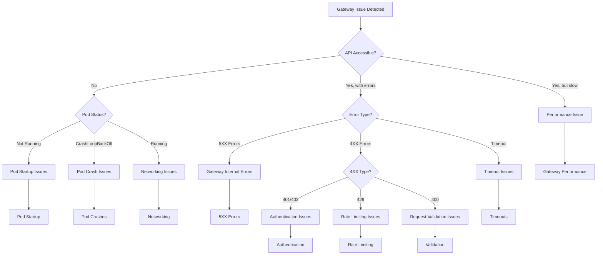

# API Connect Gateway Runbook

This runbook provides detailed troubleshooting steps and operational procedures for the IBM API Connect Gateway component (DataPower Gateway) deployed on AWS EKS.

## Gateway Component Overview

The API Gateway (DataPower) is the runtime component that processes all API requests. It handles:
- API request routing and transformations
- Security policy enforcement
- Rate limiting and quotas
- Request/response validation
- Protocol mediation
- Logging and analytics data collection

### Gateway Architecture

The gateway runs as containerized DataPower instances in Kubernetes with:
- Stateless architecture for horizontal scaling
- Configuration synchronized from the Management Subsystem
- Load balanced through AWS ALB
- Typically 3+ instances across availability zones

## Diagnostic Decision Tree

Use this decision tree to quickly navigate to the appropriate troubleshooting section:



## Gateway Observability

### Key Metrics to Monitor

| Metric | Description | Warning Threshold | Critical Threshold | Dashboard |
|--------|-------------|-------------------|---------------------|-----------|
| Gateway.RequestCount | Total API requests | N/A (trend) | N/A (trend) | [Gateway Dashboard](https://your-tenant.dynatrace.com/gateway-dashboard) |
| Gateway.ErrorRate | Percentage of 5XX errors | >1% | >5% | [Gateway Dashboard](https://your-tenant.dynatrace.com/gateway-dashboard) |
| Gateway.ResponseTime | API response time (p95) | >300ms | >1000ms | [Gateway Dashboard](https://your-tenant.dynatrace.com/gateway-dashboard) |
| Gateway.CPUUtilization | Pod CPU usage | >70% | >85% | [Gateway Resources](https://your-tenant.dynatrace.com/gateway-resources) |
| Gateway.MemoryUtilization | Pod memory usage | >70% | >85% | [Gateway Resources](https://your-tenant.dynatrace.com/gateway-resources) |
| Gateway.PodReplicaCount | Number of running pods | <3 | <2 | [Gateway Dashboard](https://your-tenant.dynatrace.com/gateway-dashboard) |
| Gateway.RateLimitEvents | Rate limit triggers | >100/min | >1000/min | [Gateway Dashboard](https://your-tenant.dynatrace.com/gateway-dashboard) |

### Key Logs to Check

| Log Source | Typical Issues | Access Method | Retention |
|------------|----------------|--------------|-----------|
| Gateway Application Logs | Errors, warnings, config issues | `kubectl logs -n api-connect -l app=gateway -c gateway` | 7 days in pods, 30 days in Splunk |
| Gateway Access Logs | API requests, status codes, timing | `kubectl logs -n api-connect -l app=gateway -c gateway-access-logs` | 7 days in pods, 90 days in Splunk |
| Gateway Audit Logs | Security events, config changes | `kubectl logs -n api-connect -l app=gateway -c gateway-audit` | 7 days in pods, 1 year in Splunk |
| Kubernetes Events | Pod scheduling, volumes, networking | `kubectl get events -n api-connect --sort-by=.metadata.creationTimestamp` | 1 hour in Kubernetes, 30 days in Splunk |

### Splunk Queries

| Issue | Splunk Query | Dashboard |
|-------|-------------|-----------|
| High error rates | `index=api_connect sourcetype=gateway-logs level=ERROR | timechart count by error_code` | [Gateway Errors](https://splunk.your-company.com/gateway-errors) |
| Authentication failures | `index=api_connect sourcetype=gateway-logs "authentication failed" OR "unauthorized" | stats count by client_id, error_message` | [Auth Issues](https://splunk.your-company.com/auth-issues) |
| Slow APIs | `index=api_connect sourcetype=gateway-access-logs | stats avg(response_time) as avg_resp, p95(response_time) as p95_resp by api_path | sort - p95_resp` | [API Performance](https://splunk.your-company.com/api-performance) |
| Rate limiting | `index=api_connect sourcetype=gateway-logs "rate limit exceeded" | timechart count by client_id` | [Rate Limiting](https://splunk.your-company.com/rate-limiting) |

## Gateway Pod Startup Issues

### Symptoms
- Gateway pods stuck in `Pending` or `ContainerCreating` state
- Gateway endpoints return 503 errors
- Reduced capacity warnings in monitoring

### Diagnostic Steps

1. **Check pod status:**
   ```bash
   kubectl get pods -n api-connect -l app=gateway
   ```

2. **Check pod details for pending issues:**
   ```bash
   kubectl describe pod -n api-connect [gateway-pod-name]
   ```

3. **Check node resource availability:**
   ```bash
   kubectl describe nodes | grep -A 5 "Allocated resources"
   kubectl top nodes
   ```

4. **Check recent events:**
   ```bash
   kubectl get events -n api-connect --sort-by=.metadata.creationTimestamp | grep gateway
   ```

5. **Check persistent volume claims if applicable:**
   ```bash
   kubectl get pvc -n api-connect
   kubectl describe pvc -n api-connect [pvc-name]
   ```

### Common Issues and Resolutions

#### Insufficient Resources

**Symptoms:**
- Pod status shows `Pending`
- Events show `FailedScheduling`
- Error mentions insufficient CPU or memory

**Resolution:**
1. Check node resource usage:
   ```bash
   kubectl top nodes
   ```

2. Adjust resource requests if too high:
   ```bash
   kubectl edit deployment -n api-connect gateway-deployment
   # Modify resources.requests values
   ```

3. Scale up node group if cluster is at capacity:
   ```bash
   # Check current node group size
   aws eks describe-nodegroup --cluster-name api-connect-cluster --nodegroup-name gateway-nodes --region us-east-1
   
   # Scale up node group (using console or AWS CLI)
   aws eks update-nodegroup-config --cluster-name api-connect-cluster --nodegroup-name gateway-nodes --scaling-config desiredSize=5,minSize=3,maxSize=10 --region us-east-1
   ```

#### Image Pull Issues

**Symptoms:**
- Pod status shows `ContainerCreating`
- Events show `ErrImagePull` or `ImagePullBackOff`

**Resolution:**
1. Verify image name and repository access:
   ```bash
   kubectl describe pod -n api-connect [gateway-pod-name]
   # Check image name and pull error details
   ```

2. Check registry credentials:
   ```bash
   kubectl get secret -n api-connect registry-credentials
   # Verify the secret exists and is correctly formatted
   ```

3. Update image pull secret if needed:
   ```bash
   kubectl create secret docker-registry registry-credentials \
     --docker-server=your-registry.example.com \
     --docker-username=your-username \
     --docker-password=your-password \
     --docker-email=your-email@example.com \
     -n api-connect \
     --dry-run=client -o yaml | kubectl apply -f -
   ```

#### Volume Mount Issues

**Symptoms:**
- Pod status shows `ContainerCreating`
- Events mention volume mount failures

**Resolution:**
1. Check persistent volume status:
   ```bash
   kubectl get pv | grep gateway
   kubectl get pvc -n api-connect | grep gateway
   ```

2. Verify storage class availability:
   ```bash
   kubectl get storageclass
   ```

3. Check AWS EBS volume status if using EBS:
   ```bash
   aws ec2 describe-volumes --filters "Name=tag:kubernetes.io/created-for/pvc/name,Values=gateway-*" --region us-east-1
   ```

4. Recreate PVC if needed (after backing up data):
   ```bash
   kubectl delete pvc -n api-connect [gateway-pvc-name]
   # Apply PVC definition again
   kubectl apply -f gateway-pvc.yaml
   ```

## Gateway Pod Crash Issues

### Symptoms
- Pods in `CrashLoopBackOff` state
- Repeated container restarts
- Gateway service unavailable or intermittent

### Diagnostic Steps

1. **Check pod status and restart count:**
   ```bash
   kubectl get pods -n api-connect -l app=gateway
   ```

2. **Check pod events:**
   ```bash
   kubectl describe pod -n api-connect [gateway-pod-name]
   ```

3. **Check container logs:**
   ```bash
   # Check current logs
   kubectl logs -n api-connect [gateway-pod-name] -c gateway
   
   # Check previous container logs if available
   kubectl logs -n api-connect [gateway-pod-name] -c gateway --previous
   ```

4. **Check resource usage before crash:**
   ```bash
   kubectl top pods -n api-connect
   ```

### Common Issues and Resolutions

#### Configuration Errors

**Symptoms:**
- Logs show configuration parsing errors
- Error messages about invalid XML or properties
- References to missing config elements

**Resolution:**
1. Check the gateway configuration:
   ```bash
   kubectl get configmap -n api-connect gateway-config -o yaml
   ```

2. Look for syntax errors or invalid values

3. Verify configuration synchronization status:
   ```bash
   # Check manager logs for sync issues
   kubectl logs -n api-connect -l app=manager | grep sync
   ```

4. Restore previous configuration if recent change caused the issue:
   ```bash
   # Apply previous known-good config
   kubectl apply -f previous-gateway-config.yaml
   ```

5. Restart gateway pods:
   ```bash
   kubectl rollout restart deployment -n api-connect gateway-deployment
   ```

#### Memory Issues

**Symptoms:**
- Logs show OutOfMemoryError
- Container killed with exit code 137
- Memory usage climbing before crash

**Resolution:**
1. Check memory limits and usage:
   ```bash
   kubectl describe pod -n api-connect [gateway-pod-name] | grep -A 3 Limits
   kubectl top pods -n api-connect
   ```

2. Increase memory limits if needed:
   ```bash
   kubectl edit deployment -n api-connect gateway-deployment
   # Increase resources.limits.memory value
   ```

3. Check for memory leaks by analyzing heap dumps or monitoring memory growth patterns

4. Implement a regular restart schedule as a temporary measure:
   ```bash
   # Create a CronJob to restart pods periodically
   kubectl create cronjob gateway-restart --schedule="0 0 * * *" --image=bitnami/kubectl -- rollout restart deployment -n api-connect gateway-deployment
   ```

#### Liveness Probe Failures

**Symptoms:**
- Logs show successful startup but container restarts anyway
- Events show `Unhealthy` liveness probe failures
- Service appears to be running properly when checked manually

**Resolution:**
1. Check liveness probe configuration:
   ```bash
   kubectl describe deployment -n api-connect gateway-deployment | grep -A 10 "Liveness"
   ```

2. Test the liveness endpoint manually:
   ```bash
   # Forward the port locally
   kubectl port-forward -n api-connect [gateway-pod-name] 9443:9443
   
   # Test the endpoint
   curl -k https://localhost:9443/health
   ```

3. Adjust liveness probe settings:
   ```bash
   kubectl edit deployment -n api-connect gateway-deployment
   # Modify livenessProbe settings (initialDelaySeconds, timeoutSeconds, etc.)
   ```

## Gateway Networking Issues

### Symptoms
- Connectivity issues between gateway and other services
- Timeouts when accessing APIs
- DNS resolution problems
- Intermittent connection errors

### Diagnostic Steps

1. **Check service endpoints:**
   ```bash
   kubectl get endpoints -n api-connect gateway-service
   ```

2. **Verify network policies:**
   ```bash
   kubectl get networkpolicy -n api-connect
   kubectl describe networkpolicy -n api-connect gateway-network-policy
   ```

3. **Test connectivity from gateway pod:**
   ```bash
   kubectl exec -it -n api-connect [gateway-pod-name] -- curl -v [service-endpoint]
   ```

4. **Check DNS resolution:**
   ```bash
   kubectl exec -it -n api-connect [gateway-pod-name] -- nslookup [service-name].[namespace].svc.cluster.local
   ```

5. **Check AWS security groups:**
   ```bash
   # Get node instance IDs
   INSTANCE_ID=$(kubectl get node [node-name] -o jsonpath='{.spec.providerID}' | sed 's|.*/||')
   
   # Check security groups
   aws ec2 describe-instances --instance-ids $INSTANCE_ID --query 'Reservations[].Instances[].SecurityGroups' --region us-east-1
   ```

### Common Issues and Resolutions

#### Misconfigured Network Policies

**Symptoms:**
- Connection timeouts to specific services
- Connection refused errors
- One-way communication issues

**Resolution:**
1. Review network policies affecting the gateway:
   ```bash
   kubectl get networkpolicy -n api-connect -o yaml
   ```

2. Ensure policies allow required traffic:
   ```bash
   # Example policy allowing traffic from gateway to database
   kubectl apply -f - <<EOF
   apiVersion: networking.k8s.io/v1
   kind: NetworkPolicy
   metadata:
     name: gateway-to-db
     namespace: api-connect
   spec:
     podSelector:
       matchLabels:
         app: gateway
     egress:
     - to:
       - podSelector:
           matchLabels:
             app: database
       ports:
       - port: 5432
         protocol: TCP
   EOF
   ```

#### DNS Resolution Issues

**Symptoms:**
- Unable to resolve service names
- Intermittent name resolution failures
- Delays in API responses

**Resolution:**
1. Check CoreDNS pods:
   ```bash
   kubectl get pods -n kube-system -l k8s-app=kube-dns
   kubectl logs -n kube-system -l k8s-app=kube-dns
   ```

2. Check CoreDNS configuration:
   ```bash
   kubectl get configmap -n kube-system coredns -o yaml
   ```

3. Restart CoreDNS if needed:
   ```bash
   kubectl rollout restart deployment -n kube-system coredns
   ```

4. If persistent issues, consider NodeLocal DNSCache:
   ```bash
   # Deploy NodeLocal DNSCache according to your cluster configuration
   kubectl apply -f https://raw.githubusercontent.com/kubernetes/kubernetes/master/cluster/addons/dns/nodelocaldns/nodelocaldns.yaml
   ```

#### Load Balancer Issues

**Symptoms:**
- Intermittent 502/503 errors for clients
- Healthy pods but service unavailable
- Uneven traffic distribution

**Resolution:**
1. Check ALB health checks:
   ```bash
   # Get ALB name
   ALB_NAME=$(kubectl get svc -n api-connect gateway-service -o jsonpath='{.status.loadBalancer.ingress[0].hostname}' | cut -d- -f1)
   
   # Check target group health
   aws elbv2 describe-target-health --target-group-arn $(aws elbv2 describe-target-groups --query 'TargetGroups[?contains(TargetGroupName, `'$ALB_NAME'`)].TargetGroupArn' --output text --region us-east-1) --region us-east-1
   ```

2. Verify health check endpoints:
   ```bash
   kubectl get svc -n api-connect gateway-service -o yaml
   # Look for health check annotations
   ```

3. Update health check settings if needed:
   ```bash
   kubectl annotate service gateway-service -n api-connect \
     service.beta.kubernetes.io/aws-load-balancer-healthcheck-healthy-threshold="2" \
     service.beta.kubernetes.io/aws-load-balancer-healthcheck-unhealthy-threshold="2" \
     service.beta.kubernetes.io/aws-load-balancer-healthcheck-interval="10" \
     --overwrite
   ```

## Gateway 5XX Errors

### Symptoms
- Client receives 500, 502, 503, or 504 errors
- Error rates spike in monitoring
- Potential impact to all or specific APIs

### Diagnostic Steps

1. **Check error rates in monitoring:**
   - Review Dynatrace dashboard for error spikes
   - Check Splunk for error patterns

2. **Check gateway logs for errors:**
   ```bash
   kubectl logs -n api-connect -l app=gateway -c gateway | grep -i error | tail -100
   ```

3. **Check specific error codes in access logs:**
   ```bash
   kubectl logs -n api-connect -l app=gateway -c gateway-access-logs | grep " 5[0-9][0-9] " | tail -100
   ```

4. **Check backend service connectivity:**
   ```bash
   kubectl exec -it -n api-connect [gateway-pod-name] -- curl -v [backend-service-url]
   ```

5. **Check gateway resource utilization:**
   ```bash
   kubectl top pods -n api-connect -l app=gateway
   ```

### Common Issues and Resolutions

#### Gateway Overload

**Symptoms:**
- High CPU and memory utilization
- Increased response times before errors
- 503 Service Unavailable errors

**Resolution:**
1. Scale up gateway deployment:
   ```bash
   kubectl scale deployment -n api-connect gateway-deployment --replicas=[current+2]
   ```

2. Check for traffic spikes in monitoring and consider rate limiting:
   ```bash
   # Update rate limiting configuration
   kubectl edit configmap -n api-connect rate-limit-config
   ```

3. Implement circuit breakers if backend issues are causing the load:
   ```bash
   # Update circuit breaker configuration
   kubectl edit configmap -n api-connect gateway-config
   # Add or modify circuit breaker settings
   ```

4. Monitor the effect of scaling:
   ```bash
   kubectl get hpa -n api-connect
   kubectl describe hpa -n api-connect gateway-hpa
   ```

#### Backend Service Failures

**Symptoms:**
- Errors mention connection failures
- 502 Bad Gateway errors
- Timeouts when trying to reach backend

**Resolution:**
1. Verify backend service health:
   ```bash
   # Test backend connectivity
   kubectl exec -it -n api-connect [gateway-pod-name] -- curl -v [backend-service-url]
   ```

2. Check backend service logs if accessible

3. Implement retry logic if intermittent:
   ```bash
   # Update retry configuration
   kubectl edit configmap -n api-connect gateway-config
   # Add or modify retry settings
   ```

4. Consider fallback responses for critical APIs:
   ```bash
   # Configure fallback responses
   kubectl edit configmap -n api-connect gateway-config
   # Add fallback response configuration
   ```

#### Configuration Synchronization Issues

**Symptoms:**
- Errors after configuration changes
- Inconsistent behavior across gateway pods
- Configuration validation errors in logs

**Resolution:**
1. Check synchronization status:
   ```bash
   # Check manager logs for sync issues
   kubectl logs -n api-connect -l app=manager | grep sync
   ```

2. Force configuration resynchronization:
   ```bash
   kubectl exec -it -n api-connect [manager-pod-name] -- apic gateway-sync --force
   ```

3. Verify configuration is valid:
   ```bash
   kubectl exec -it -n api-connect [gateway-pod-name] -- apic validate-config
   ```

4. Rollback to previous configuration if needed:
   ```bash
   kubectl apply -f previous-gateway-config.yaml
   ```

## Gateway Authentication Issues

### Symptoms
- Client receives 401/403 errors
- Failed authentication logs
- Increases in auth-related error metrics

### Diagnostic Steps

1. **Check authentication error logs:**
   ```bash
   kubectl logs -n api-connect -l app=gateway -c gateway | grep -i "auth\|unauthorized\|forbidden" | tail -100
   ```

2. **Verify OAuth service health if using OAuth:**
   ```bash
   kubectl get pods -n api-connect -l app=oauth-provider
   kubectl logs -n api-connect -l app=oauth-provider | grep error
   ```

3. **Check API security policies:**
   ```bash
   # Get API security policies
   kubectl exec -it -n api-connect [manager-pod-name] -- apic security-policies list
   ```

4. **Test authentication manually:**
   ```bash
   # Test OAuth flow
   curl -X POST [oauth-token-url] \
     -d "grant_type=client_credentials&client_id=[client-id]&client_secret=[client-secret]"
   
   # Test API with token
   curl -H "Authorization: Bearer [token]" [api-url]
   ```

### Common Issues and Resolutions

#### OAuth Server Issues

**Symptoms:**
- Unable to obtain tokens
- Tokens not recognized by gateway
- OAuth service errors

**Resolution:**
1. Check OAuth service status:
   ```bash
   kubectl get pods -n api-connect -l app=oauth-provider
   kubectl describe pods -n api-connect -l app=oauth-provider
   ```

2. Verify OAuth configuration:
   ```bash
   kubectl get configmap -n api-connect oauth-config -o yaml
   ```

3. Check OAuth database connectivity:
   ```bash
   kubectl exec -it -n api-connect [oauth-pod-name] -- curl -v [db-service]:5432
   ```

4. Restart OAuth service if needed:
   ```bash
   kubectl rollout restart deployment -n api-connect oauth-provider
   ```

#### JWT Validation Failures

**Symptoms:**
- Valid tokens being rejected
- JWT signature validation errors
- Key retrieval errors

**Resolution:**
1. Check JWT validation configuration:
   ```bash
   kubectl get configmap -n api-connect jwt-config -o yaml
   ```

2. Verify key set is accessible:
   ```bash
   kubectl exec -it -n api-connect [gateway-pod-name] -- curl -v [jwks-endpoint]
   ```

3. Update JWK cache if needed:
   ```bash
   kubectl exec -it -n api-connect [gateway-pod-name] -- apic refresh-jwks
   ```

4. Sync gateway security configuration:
   ```bash
   kubectl exec -it -n api-connect [manager-pod-name] -- apic security-sync
   ```

#### Client Credential Issues

**Symptoms:**
- Specific clients having auth failures
- Client ID not found errors
- Subscription errors

**Resolution:**
1. Verify client in API Connect:
   ```bash
   kubectl exec -it -n api-connect [manager-pod-name] -- apic clients get [client-id]
   ```

2. Check subscription status:
   ```bash
   kubectl exec -it -n api-connect [manager-pod-name] -- apic subscriptions list --app [app-name]
   ```

3. Refresh client registry in gateway:
   ```bash
   kubectl exec -it -n api-connect [gateway-pod-name] -- apic refresh-registry
   ```

4. Recreate client credentials if needed:
   ```bash
   kubectl exec -it -n api-connect [manager-pod-name] -- apic clients reset-secret [client-id]
   ```

## Gateway Rate Limiting Issues

### Symptoms
- Client receives 429 Too Many Requests errors
- Rate limit metrics increasing
- Client complaints about throttling

### Diagnostic Steps

1. **Check rate limiting logs:**
   ```bash
   kubectl logs -n api-connect -l app=gateway -c gateway | grep -i "rate limit\|throttle\|quota" | tail -100
   ```

2. **Check rate limit configurations:**
   ```bash
   kubectl get configmap -n api-connect rate-limit-config -o yaml
   ```

3. **Check current rate limit counters:**
   ```bash
   kubectl exec -it -n api-connect [gateway-pod-name] -- apic rate-limit-status
   ```

4. **Monitor specific client usage:**
   ```bash
   kubectl exec -it -n api-connect [gateway-pod-name] -- apic client-usage [client-id]
   ```

### Common Issues and Resolutions

#### Misconfigured Rate Limits

**Symptoms:**
- Unexpected rate limiting
- Limits too restrictive for business needs
- Different limits across environments

**Resolution:**
1. Review current rate limit configuration:
   ```bash
   kubectl get configmap -n api-connect rate-limit-config -o yaml
   ```

2. Update rate limits based on requirements:
   ```bash
   # Update rate limits
   kubectl edit configmap -n api-connect rate-limit-config
   # Modify limits as needed
   ```

3. Verify changes applied to gateway:
   ```bash
   kubectl exec -it -n api-connect [gateway-pod-name] -- apic get-config rate-limits
   ```

4. Apply changes:
   ```bash
   kubectl rollout restart deployment -n api-connect gateway-deployment
   ```

#### Distributed Rate Limiting Inconsistencies

**Symptoms:**
- Inconsistent rate limiting across pods
- Some requests limited, others allowed
- Counter synchronization issues

**Resolution:**
1. Check if using distributed rate limiting:
   ```bash
   kubectl get configmap -n api-connect rate-limit-config -o yaml | grep distributed
   ```

2. Verify Redis cache for distributed rate limiting:
   ```bash
   kubectl get pods -n api-connect -l app=redis
   kubectl exec -it -n api-connect [redis-pod-name] -- redis-cli ping
   ```

3. Enable or fix distributed rate limiting:
   ```bash
   # Update to use distributed rate limiting
   kubectl edit configmap -n api-connect rate-limit-config
   # Set distributed: true and configure Redis connection
   ```

4. Monitor Redis connection:
   ```bash
   kubectl logs -n api-connect -l app=gateway | grep redis
   ```

#### Business Need for Higher Limits

**Symptoms:**
- Legitimate business traffic being limited
- Client complaints about limits
- Impact to business operations

**Resolution:**
1. Analyze current usage patterns:
   ```bash
   # Check usage reports
   kubectl exec -it -n api-connect [analytics-pod-name] -- apic usage-report [api-name] --days 7
   ```

2. Adjust limits based on business needs:
   ```bash
   # Update specific API or client limits
   kubectl edit configmap -n api-connect rate-limit-config
   ```

3. Consider subscription plan changes:
   ```bash
   kubectl exec -it -n api-connect [manager-pod-name] -- apic plans update [plan-name] --rate-limit [new-limit]
   ```

4. Implement request queuing for burst handling:
   ```bash
   # Enable request queuing
   kubectl edit configmap -n api-connect gateway-config
   # Add queue configuration
   ```

## Gateway Performance Issues

### Symptoms
- Increased API latency
- High resource utilization
- Gradually degrading performance
- Client timeout errors

### Diagnostic Steps

1. **Check gateway resource usage:**
   ```bash
   kubectl top pods -n api-connect -l app=gateway
   ```

2. **Monitor API response times:**
   ```bash
   kubectl logs -n api-connect -l app=gateway -c gateway-access-logs | awk '{print $NF}' | sort -n | uniq -c
   ```

3. **Check for slow backend services:**
   ```bash
   kubectl exec -it -n api-connect [gateway-pod-name] -- apic backend-latency
   ```

4. **Look for configuration issues affecting performance:**
   ```bash
   kubectl get configmap -n api-connect gateway-config -o yaml | grep -i "timeout\|keepalive\|connection"
   ```

5. **Check network performance:**
   ```bash
   kubectl exec -it -n api-connect [gateway-pod-name] -- ping -c 5 [backend-service]
   kubectl exec -it -n api-connect [gateway-pod-name] -- traceroute [backend-service]
   ```

### Common Issues and Resolutions

#### Resource Constraints

**Symptoms:**
- High CPU or memory utilization
- Increasing response times
- Garbage collection pauses

**Resolution:**
1. Analyze resource usage:
   ```bash
   kubectl top pods -n api-connect -l app=gateway
   ```

2. Scale horizontally if needed:
   ```bash
   kubectl scale deployment -n api-connect gateway-deployment --replicas=[current+2]
   ```

3. Adjust resource limits:
   ```bash
   kubectl edit deployment -n api-connect gateway-deployment
   # Increase resources.limits values
   ```

4. Enable or tune horizontal pod autoscaling:
   ```bash
   kubectl get hpa -n api-connect
   kubectl edit hpa -n api-connect gateway-hpa
   # Adjust minReplicas, maxReplicas, and targetCPUUtilizationPercentage
   ```

#### Connection Pool Exhaustion

**Symptoms:**
- Increased latency under load
- Connection timeout errors
- Backend connection errors

**Resolution:**
1. Check connection pool settings:
   ```bash
   kubectl get configmap -n api-connect gateway-config -o yaml | grep -A 10 "connectionPool"
   ```

2. Increase connection pool size:
   ```bash
   kubectl edit configmap -n api-connect gateway-config
   # Adjust connectionPool settings
   ```

3. Enable connection reuse:
   ```bash
   kubectl edit configmap -n api-connect gateway-config
   # Set reuseConnections: true
   ```

4. Apply changes:
   ```bash
   kubectl rollout restart deployment -n api-connect gateway-deployment
   ```

#### Inefficient API Policies

**Symptoms:**
- Specific APIs have higher latency
- Policies with complex processing
- High CPU usage during processing

**Resolution:**
1. Identify slow policies:
   ```bash
   kubectl logs -n api-connect -l app=gateway | grep -i "policy execution time"
   ```

2. Profile policy execution:
   ```bash
   kubectl exec -it -n api-connect [gateway-pod-name] -- apic policy-profile [api-name]
   ```

3. Optimize expensive policies:
   ```bash
   # Update API definitions with optimized policies
   kubectl exec -it -n api-connect [manager-pod-name] -- apic policies update [policy-name]
   ```

4. Consider caching for expensive operations:
   ```bash
   kubectl edit configmap -n api-connect gateway-config
   # Enable or adjust caching settings
   ```

## Environment-Specific Gateway Considerations

### Development Environment

- **Relaxed Resource Limits**: Development gateways have lower resource limits
- **Debug Logging**: Higher verbosity logs enabled
- **Simplified Security**: Some security policies may be disabled for ease of development
- **Considerations**:
  - Performance metrics will differ from production
  - Debug logs impact performance
  - Security bypass does not reflect production behavior

**Special Commands for Development:**
```bash
# Enable debug logging
kubectl annotate pods -n api-connect [gateway-pod-name] "debug=true" --overwrite

# View debug logs
kubectl logs -n api-connect [gateway-pod-name] -c gateway --tail=100

# Test API directly (bypassing security)
kubectl port-forward -n api-connect [gateway-pod-name] 9443:9443
curl -k https://localhost:9443/api/[api-path] -H "X-Dev-Override: true"
```

### Testing Environment

- **Test Data**: Contains synthetic test data
- **Automated Testing**: Subject to load and functional tests
- **Simulated Errors**: May have fault injection enabled
- **Considerations**:
  - Expect occasional instability during testing windows
  - Error rates may be artificially high during chaos testing
  - Performance may be impacted during test execution

**Special Commands for Testing:**
```bash
# Check current test execution
kubectl get pods -n api-connect -l app=test-runner

# View test logs
kubectl logs -n api-connect -l app=test-runner --tail=100

# Disable fault injection temporarily
kubectl annotate pods -n api-connect -l app=gateway "fault-injection=disabled" --overwrite
```

### Production Environment

- **High Availability**: Multiple replicas across zones
- **Resource Isolation**: Dedicated node groups
- **Strict Security**: All security policies enforced
- **Performance Optimization**: Tuned for throughput and latency
- **Considerations**:
  - Changes require change management approval
  - Debug logging disabled by default
  - Zero-downtime updates required

**Special Commands for Production:**
```bash
# Enable temporary debug logging (requires approval)
kubectl annotate pods -n api-connect [gateway-pod-name] "debug=true" "debug-ttl=30m" --overwrite

# Check gateway custom metrics
kubectl get --raw "/apis/custom.metrics.k8s.io/v1beta1/namespaces/api-connect/pods/*/gateway_request_count" | jq

# Perform rolling restart outside business hours
kubectl rollout restart deployment -n api-connect gateway-deployment
```

## Reference Information

### Gateway Configuration Reference

The gateway configuration is stored in Kubernetes ConfigMaps:

1. **Main Gateway Config**: `kubectl get configmap -n api-connect gateway-config -o yaml`
2. **TLS Config**: `kubectl get configmap -n api-connect gateway-tls-config -o yaml`
3. **Rate Limit Config**: `kubectl get configmap -n api-connect rate-limit-config -o yaml`
4. **Logging Config**: `kubectl get configmap -n api-connect gateway-logging -o yaml`

### Gateway Deployment Reference

Gateway deployment details:

1. **Deployment**: `kubectl get deployment -n api-connect gateway-deployment -o yaml`
2. **Service**: `kubectl get service -n api-connect gateway-service -o yaml`
3. **HPA**: `kubectl get hpa -n api-connect gateway-hpa -o yaml`
4. **PodDisruptionBudget**: `kubectl get pdb -n api-connect gateway-pdb -o yaml`

### Common Gateway CLI Commands

DataPower Gateway has specific CLI commands available through `kubectl exec`:

```bash
# Check gateway status
kubectl exec -it -n api-connect [gateway-pod-name] -- apic status

# Get running configuration
kubectl exec -it -n api-connect [gateway-pod-name] -- apic get-config

# Test a specific API
kubectl exec -it -n api-connect [gateway-pod-name] -- apic test-api [api-name]

# View gateway statistics
kubectl exec -it -n api-connect [gateway-pod-name] -- apic stats

# Check policy enforcement
kubectl exec -it -n api-connect [gateway-pod-name] -- apic policy-status
```

### Gateway Logs Reference

Key log patterns to look for:

| Log Pattern | Meaning | Severity |
|-------------|---------|----------|
| `[ERROR]` | Error condition | High |
| `ConnectionError` | Backend connectivity issue | High |
| `MemoryWarning` | Approaching memory limit | Medium |
| `PolicyExecutionError` | Error in policy execution | High |
| `RateLimitExceeded` | Client exceeded rate limit | Low |
| `ConfigurationError` | Issue with loaded configuration | High |
| `CertificateError` | TLS certificate issue | High |
| `AuthenticationFailure` | Failed client authentication | Medium |

### Related Documentation

- [Gateway Architecture](../Architecture#gateway-architecture) - Detailed gateway design
- [Gateway Observability](../Observability#gateway-monitoring) - Monitoring configuration
- [Security Policies](../Runbook-Security#gateway-security) - Security-specific procedures
- [Performance Tuning](../Runbook-Performance#gateway-tuning) - Performance optimization guide
- [IBM DataPower Gateway Documentation](https://www.ibm.com/docs/en/datapower-gateway)
