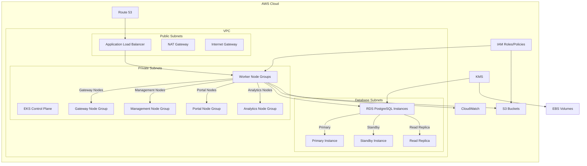
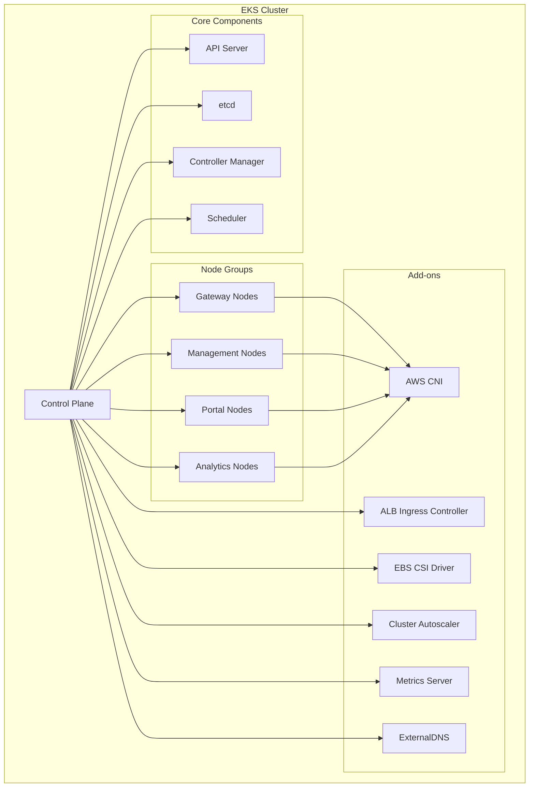
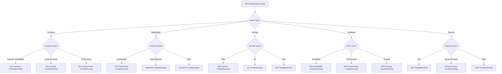
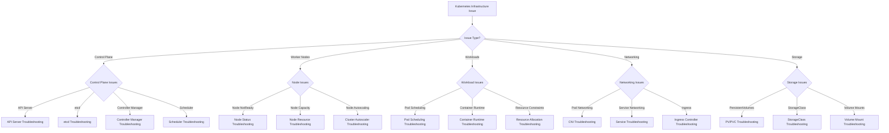
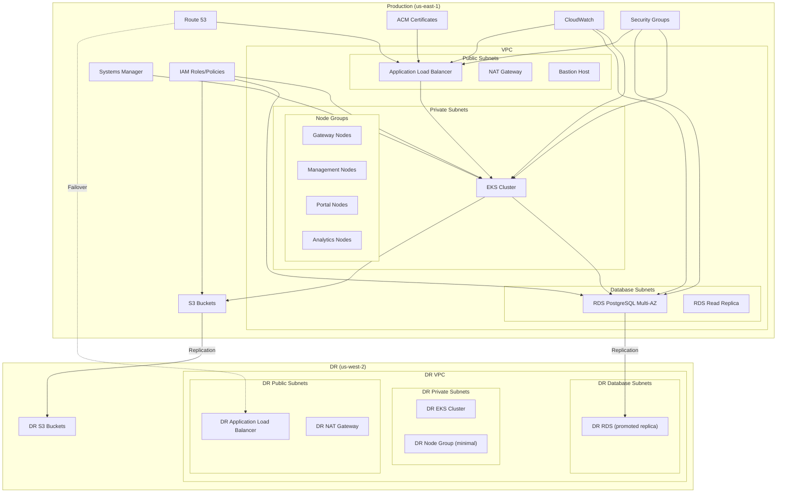

# API Connect Infrastructure Runbook

This runbook provides detailed troubleshooting steps and operational procedures for the AWS infrastructure and Kubernetes environment supporting the IBM API Connect platform.

## Infrastructure Overview

The API Connect platform is deployed on AWS using EKS (Elastic Kubernetes Service) with supporting infrastructure components. This runbook covers the management and troubleshooting of the underlying infrastructure rather than the API Connect application components.

### Infrastructure Components

- **AWS EKS**: Managed Kubernetes service hosting the API Connect platform
- **EC2 Instances**: Worker nodes for the EKS cluster
- **VPC and Networking**: Network infrastructure including subnets, security groups, and load balancers
- **RDS**: PostgreSQL database instances for API Connect components
- **S3**: Object storage for backups, artifacts, and logs
- **IAM**: Identity and access management for AWS resources
- **CloudWatch**: Monitoring and logging service
- **Route53**: DNS management
- **KMS**: Key management for encryption
- **EBS/EFS**: Storage volumes for Kubernetes persistent volumes

### Infrastructure Architecture



### Kubernetes Architecture



## Infrastructure Diagnostic Trees

### AWS Infrastructure Issues



### Kubernetes Infrastructure Issues



## Infrastructure Observability

### Key Metrics to Monitor

| Metric | Description | Warning Threshold | Critical Threshold | Dashboard |
|--------|-------------|-------------------|---------------------|-----------|
| EC2.CPUUtilization | EC2 instance CPU usage | >70% | >85% | [EC2 Dashboard](https://us-east-1.console.aws.amazon.com/cloudwatch/home?region=us-east-1#dashboards:name=EC2) |
| EC2.MemoryUtilization | EC2 instance memory usage | >70% | >85% | [EC2 Dashboard](https://us-east-1.console.aws.amazon.com/cloudwatch/home?region=us-east-1#dashboards:name=EC2) |
| EC2.DiskUtilization | EC2 instance disk usage | >70% | >85% | [EC2 Dashboard](https://us-east-1.console.aws.amazon.com/cloudwatch/home?region=us-east-1#dashboards:name=EC2) |
| EKS.NodeCount | Number of worker nodes | <min threshold | N/A | [EKS Dashboard](https://your-tenant.dynatrace.com/eks-dashboard) |
| EKS.PodCapacity | Available pod capacity | <20% | <10% | [EKS Dashboard](https://your-tenant.dynatrace.com/eks-dashboard) |
| RDS.CPUUtilization | RDS instance CPU usage | >70% | >85% | [RDS Dashboard](https://us-east-1.console.aws.amazon.com/cloudwatch/home?region=us-east-1#dashboards:name=RDS) |
| RDS.FreeStorageSpace | RDS available storage | <20% | <10% | [RDS Dashboard](https://us-east-1.console.aws.amazon.com/cloudwatch/home?region=us-east-1#dashboards:name=RDS) |
| RDS.DatabaseConnections | Number of active connections | >80% threshold | >90% threshold | [RDS Dashboard](https://us-east-1.console.aws.amazon.com/cloudwatch/home?region=us-east-1#dashboards:name=RDS) |
| ALB.HTTPCode_ELB_5XX | Load balancer 5XX errors | >0 | >10/min | [ALB Dashboard](https://us-east-1.console.aws.amazon.com/cloudwatch/home?region=us-east-1#dashboards:name=ALB) |
| ALB.TargetResponseTime | Load balancer response time | >1s | >3s | [ALB Dashboard](https://us-east-1.console.aws.amazon.com/cloudwatch/home?region=us-east-1#dashboards:name=ALB) |
| S3.BucketSizeBytes | S3 bucket storage usage | >80% quota | >90% quota | [S3 Dashboard](https://us-east-1.console.aws.amazon.com/cloudwatch/home?region=us-east-1#dashboards:name=S3) |
| NetworkIn/Out | Network traffic | >80% threshold | >90% threshold | [Network Dashboard](https://us-east-1.console.aws.amazon.com/cloudwatch/home?region=us-east-1#dashboards:name=Network) |

### Key Logs to Check

| Log Source | Typical Issues | Access Method | Retention |
|------------|----------------|--------------|-----------|
| EKS Control Plane Logs | API server issues, scheduling problems | CloudWatch Logs | 90 days |
| EC2 System Logs | System-level issues on worker nodes | CloudWatch Logs | 30 days |
| VPC Flow Logs | Network connectivity issues | CloudWatch Logs | 30 days |
| ALB Access Logs | Load balancer issues, client errors | S3 bucket | 90 days |
| RDS Logs | Database errors, slow queries | CloudWatch Logs | 30 days |
| Kubernetes Audit Logs | Security events, API access | CloudWatch Logs | 90 days |
| CloudTrail | AWS API activities | S3 bucket | 90 days |

### Splunk Queries

| Issue | Splunk Query | Dashboard |
|-------|-------------|-----------|
| Node failures | `index=aws sourcetype=aws:cloudwatch:ec2 StatusCheckFailed > 0 | stats count by InstanceId` | [EC2 Health](https://splunk.your-company.com/ec2-health) |
| High node CPU | `index=aws sourcetype=aws:cloudwatch:ec2 CPUUtilization > 85 | timechart avg(CPUUtilization) by InstanceId` | [EC2 Performance](https://splunk.your-company.com/ec2-performance) |
| EKS control plane issues | `index=aws sourcetype=aws:cloudwatch:eks "level"="error" OR "level"="warning" | stats count by kubernetes.host, level, message` | [EKS Issues](https://splunk.your-company.com/eks-issues) |
| RDS performance | `index=aws sourcetype=aws:cloudwatch:rds CPUUtilization > 80 OR FreeStorageSpace < 10240000000 | stats avg(CPUUtilization) as CPU, avg(FreeStorageSpace) as "Free Storage" by DBInstanceIdentifier` | [RDS Performance](https://splunk.your-company.com/rds-performance) |
| Network issues | `index=aws sourcetype=vpc_flow_logs action=REJECT | stats count by srcaddr, dstaddr, dstport` | [VPC Network Issues](https://splunk.your-company.com/vpc-issues) |

## EC2 Instance Issues

### Symptoms
- EKS worker nodes in `NotReady` state
- Instance health checks failing
- Instance performance degradation
- Auto Scaling group capacity issues
- Application pods being evicted

### Diagnostic Steps

1. **Check instance status:**
   ```bash
   aws ec2 describe-instance-status --region us-east-1 --filters "Name=instance-state-name,Values=running" "Name=instance-status.status,Values=impaired"
   ```

2. **Check instance details:**
   ```bash
   # Get instance details
   aws ec2 describe-instances --instance-ids i-1234567890abcdef0 --region us-east-1
   ```

3. **Review CloudWatch metrics:**
   ```bash
   # Get CPU utilization
   aws cloudwatch get-metric-statistics --region us-east-1 --namespace AWS/EC2 --metric-name CPUUtilization --dimensions Name=InstanceId,Value=i-1234567890abcdef0 --start-time $(date -u -d "1 hour ago" +%Y-%m-%dT%H:%M:%SZ) --end-time $(date -u +%Y-%m-%dT%H:%M:%SZ) --period 300 --statistics Average
   ```

4. **Check system logs:**
   ```bash
   # Get console output
   aws ec2 get-console-output --instance-id i-1234567890abcdef0 --region us-east-1
   ```

5. **Check Auto Scaling group:**
   ```bash
   # Get ASG information
   aws autoscaling describe-auto-scaling-groups --auto-scaling-group-names api-connect-node-group --region us-east-1
   ```

### Common Issues and Resolutions

#### Instance Health Check Failures

**Symptoms:**
- Status checks failing
- Instance marked as unhealthy
- Auto Scaling group replacing instances

**Resolution:**
1. Check system status and instance status checks:
   ```bash
   aws ec2 describe-instance-status --instance-ids i-1234567890abcdef0 --region us-east-1
   ```

2. Connect to the instance if possible (SSM or SSH):
   ```bash
   # Using SSM (if enabled)
   aws ssm start-session --target i-1234567890abcdef0 --region us-east-1
   
   # Using SSH (if possible)
   ssh -i /path/to/key.pem ec2-user@instance-ip
   ```

3. Check system logs:
   ```bash
   # Once connected
   sudo dmesg
   sudo journalctl -xen
   ```

4. If unrecoverable, terminate and replace the instance:
   ```bash
   # For Auto Scaling group instances
   aws autoscaling set-instance-health --instance-id i-1234567890abcdef0 --health-status Unhealthy --region us-east-1
   
   # Manual termination (use with caution)
   aws ec2 terminate-instances --instance-ids i-1234567890abcdef0 --region us-east-1
   ```

#### Resource Exhaustion

**Symptoms:**
- High CPU utilization
- High memory usage
- Disk space running low
- Performance degradation

**Resolution:**
1. Check resource utilization:
   ```bash
   # Using CloudWatch
   aws cloudwatch get-metric-statistics --region us-east-1 --namespace AWS/EC2 --metric-name CPUUtilization --dimensions Name=InstanceId,Value=i-1234567890abcdef0 --start-time $(date -u -d "1 hour ago" +%Y-%m-%dT%H:%M:%SZ) --end-time $(date -u +%Y-%m-%dT%H:%M:%SZ) --period 300 --statistics Average
   
   # If connected to instance
   top
   free -m
   df -h
   ```

2. Identify resource-intensive processes:
   ```bash
   # If connected
   ps aux --sort=-%cpu | head -10
   ps aux --sort=-%mem | head -10
   ```

3. For disk space issues:
   ```bash
   # Find large files
   sudo find / -type f -size +100M -exec ls -lh {} \;
   
   # Clean up logs if necessary
   sudo find /var/log -type f -name "*.log" -size +100M -exec truncate -s 0 {} \;
   ```

4. Scale up instance type if needed:
   ```bash
   # If using ASG, update the launch template
   aws ec2 create-launch-template-version --launch-template-id lt-0123456789abcdef0 --version-description "Increased instance type" --source-version 1 --launch-template-data '{"InstanceType":"m5.2xlarge"}' --region us-east-1
   
   # Update ASG to use new launch template version
   aws autoscaling update-auto-scaling-group --auto-scaling-group-name api-connect-node-group --launch-template LaunchTemplateId=lt-0123456789abcdef0,Version='$Latest' --region us-east-1
   ```

#### Auto Scaling Issues

**Symptoms:**
- Cluster not scaling as expected
- Slow scaling response
- Capacity shortfalls
- Failed scale-out events

**Resolution:**
1. Check Auto Scaling activity:
   ```bash
   aws autoscaling describe-scaling-activities --auto-scaling-group-name api-connect-node-group --region us-east-1
   ```

2. Verify ASG configuration:
   ```bash
   aws autoscaling describe-auto-scaling-groups --auto-scaling-group-names api-connect-node-group --region us-east-1
   
   # Check scaling policies
   aws autoscaling describe-policies --auto-scaling-group-name api-connect-node-group --region us-east-1
   ```

3. Check if hitting service quotas:
   ```bash
   aws service-quotas get-service-quota --service-code ec2 --quota-code L-1216C47A --region us-east-1
   ```

4. Adjust scaling parameters:
   ```bash
   # Update cooldown period
   aws autoscaling update-auto-scaling-group --auto-scaling-group-name api-connect-node-group --default-cooldown 300 --region us-east-1
   
   # Update scaling policy
   aws autoscaling put-scaling-policy --auto-scaling-group-name api-connect-node-group --policy-name cpu-scaling-policy --policy-type TargetTrackingScaling --target-tracking-configuration '{"PredefinedMetricSpecification":{"PredefinedMetricType":"ASGAverageCPUUtilization"},"TargetValue":70.0}' --region us-east-1
   ```

5. For Cluster Autoscaler issues:
   ```bash
   # Check Cluster Autoscaler logs
   kubectl logs -n kube-system -l app=cluster-autoscaler
   
   # Check if CA pod is healthy
   kubectl get pods -n kube-system -l app=cluster-autoscaler
   ```

## EKS Cluster Issues

### Symptoms
- Control plane API unavailability
- Worker nodes not joining cluster
- Pod scheduling issues
- Cluster upgrade failures
- Authentication or authorization issues

### Diagnostic Steps

1. **Check EKS cluster status:**
   ```bash
   aws eks describe-cluster --name api-connect-cluster --region us-east-1
   ```

2. **Check node status in Kubernetes:**
   ```bash
   kubectl get nodes
   kubectl describe nodes
   ```

3. **Check control plane logs:**
   ```bash
   # Enable logs if not already enabled
   aws eks update-cluster-config --name api-connect-cluster --logging '{"clusterLogging":[{"types":["api","audit","authenticator","controllerManager","scheduler"],"enabled":true}]}' --region us-east-1
   
   # View logs in CloudWatch
   # Navigate to CloudWatch Logs -> /aws/eks/api-connect-cluster/cluster
   ```

4. **Check cluster add-ons:**
   ```bash
   aws eks list-addons --cluster-name api-connect-cluster --region us-east-1
   ```

### Common Issues and Resolutions

#### API Server Availability Issues

**Symptoms:**
- `kubectl` commands fail with connection errors
- API server timeout errors
- Applications unable to communicate with API server

**Resolution:**
1. Check EKS cluster health:
   ```bash
   aws eks describe-cluster --name api-connect-cluster --region us-east-1 --query "cluster.status"
   ```

2. Check EKS service health:
   ```bash
   # Check AWS Service Health Dashboard
   # https://health.aws.amazon.com/health/status
   ```

3. Check VPC endpoint connectivity (if using private access):
   ```bash
   # Test connectivity to VPC endpoint
   aws ec2 describe-vpc-endpoints --filters "Name=service-name,Values=com.amazonaws.us-east-1.eks" --region us-east-1
   ```

4. Verify security groups:
   ```bash
   # Get cluster security group
   SG_ID=$(aws eks describe-cluster --name api-connect-cluster --region us-east-1 --query "cluster.resourcesVpcConfig.clusterSecurityGroupId" --output text)
   
   # Check security group rules
   aws ec2 describe-security-groups --group-ids $SG_ID --region us-east-1
   ```

5. Update kubeconfig if necessary:
   ```bash
   aws eks update-kubeconfig --name api-connect-cluster --region us-east-1
   ```

#### Node Registration Issues

**Symptoms:**
- Nodes not joining cluster
- Nodes showing `NotReady` status
- Nodes cycling between `Ready` and `NotReady`

**Resolution:**
1. Check node status:
   ```bash
   kubectl get nodes
   kubectl describe node problematic-node
   ```

2. Check node bootstrap logs:
   ```bash
   # Connect to the instance
   aws ssm start-session --target i-1234567890abcdef0 --region us-east-1
   
   # Check bootstrap logs
   sudo journalctl -u kubelet
   ```

3. Verify instance role and policies:
   ```bash
   # Get instance profile
   aws ec2 describe-instances --instance-ids i-1234567890abcdef0 --query "Reservations[].Instances[].IamInstanceProfile.Arn" --output text --region us-east-1
   
   # Check role policies
   ROLE_NAME=$(aws ec2 describe-instances --instance-ids i-1234567890abcdef0 --query "Reservations[].Instances[].IamInstanceProfile.Arn" --output text --region us-east-1 | cut -d/ -f2)
   aws iam list-attached-role-policies --role-name $ROLE_NAME --region us-east-1
   ```

4. Check node group configuration:
   ```bash
   aws eks describe-nodegroup --cluster-name api-connect-cluster --nodegroup-name api-connect-nodes --region us-east-1
   ```

5. Recreate problematic nodes:
   ```bash
   # Drain node
   kubectl drain node-name --ignore-daemonsets --delete-emptydir-data
   
   # Terminate instance
   aws ec2 terminate-instances --instance-ids i-1234567890abcdef0 --region us-east-1
   ```

#### Cluster Upgrade Issues

**Symptoms:**
- Upgrade operations stuck
- Rollback failures
- Version incompatibilities
- Add-on compatibility issues

**Resolution:**
1. Check current upgrade status:
   ```bash
   aws eks describe-update --name update-id --cluster-name api-connect-cluster --region us-east-1
   ```

2. Verify cluster add-on versions:
   ```bash
   aws eks describe-addon-versions --kubernetes-version 1.29 --region us-east-1
   ```

3. Check for deprecated APIs:
   ```bash
   # Install kubectl-deprecations plugin
   kubectl deprecations --k8s-version=1.29.0
   ```

4. For stuck upgrades, contact AWS Support with:
   - Cluster name
   - Update ID
   - CloudTrail logs
   - Error messages

5. Ensure worker nodes are upgraded after control plane:
   ```bash
   # Update managed node group
   aws eks update-nodegroup-version --cluster-name api-connect-cluster --nodegroup-name api-connect-nodes --region us-east-1
   ```

## Networking Issues

### Symptoms
- Pod to pod communication failures
- Service connectivity issues
- DNS resolution problems
- Load balancer health check failures
- Ingress controller issues
- Public endpoint access problems

### Diagnostic Steps

1. **Check VPC and subnet configuration:**
   ```bash
   aws ec2 describe-vpcs --vpc-ids vpc-1234567890abcdef0 --region us-east-1
   aws ec2 describe-subnets --filters "Name=vpc-id,Values=vpc-1234567890abcdef0" --region us-east-1
   ```

2. **Check security groups:**
   ```bash
   aws ec2 describe-security-groups --group-ids sg-1234567890abcdef0 --region us-east-1
   ```

3. **Check network ACLs:**
   ```bash
   aws ec2 describe-network-acls --filters "Name=vpc-id,Values=vpc-1234567890abcdef0" --region us-east-1
   ```

4. **Check load balancer status:**
   ```bash
   aws elbv2 describe-load-balancers --names api-connect-alb --region us-east-1
   aws elbv2 describe-target-health --target-group-arn arn:aws:elasticloadbalancing:us-east-1:123456789012:targetgroup/api-connect-tg/1234567890abcdef --region us-east-1
   ```

5. **Check Kubernetes networking:**
   ```bash
   kubectl get pods -o wide
   kubectl get services
   kubectl get ingress
   ```

### Common Issues and Resolutions

#### Pod Networking Issues

**Symptoms:**
- Pods unable to communicate with each other
- `CrashLoopBackOff` due to dependent service connectivity
- DNS resolution failures within cluster
- CNI errors in logs

**Resolution:**
1. Check CNI pod status:
   ```bash
   kubectl get pods -n kube-system -l k8s-app=aws-node
   kubectl logs -n kube-system -l k8s-app=aws-node
   ```

2. Verify pod network configuration:
   ```bash
   # Get pod details
   kubectl describe pod problematic-pod
   
   # Test connectivity from a pod
   kubectl exec -it debugging-pod -- ping other-pod-ip
   kubectl exec -it debugging-pod -- curl -v service-name:port
   ```

3. Check CoreDNS for DNS issues:
   ```bash
   kubectl get pods -n kube-system -l k8s-app=kube-dns
   kubectl logs -n kube-system -l k8s-app=kube-dns
   
   # Test DNS resolution
   kubectl run dnsutils --image=tutum/dnsutils --command -- sleep 3600
   kubectl exec -it dnsutils -- nslookup kubernetes.default
   ```

4. Ensure proper VPC CNI configuration:
   ```bash
   kubectl describe daemonset aws-node -n kube-system
   
   # Check for custom CNI configuration
   kubectl get configmap -n kube-system aws-node
   ```

5. Recreate CNI pods if necessary:
   ```bash
   kubectl delete pods -n kube-system -l k8s-app=aws-node
   ```

#### Load Balancer Issues

**Symptoms:**
- Services not accessible externally
- Target health check failures
- Increased latency
- 5XX errors from load balancer

**Resolution:**
1. Check load balancer status:
   ```bash
   aws elbv2 describe-load-balancers --names api-connect-alb --region us-east-1
   ```

2. Check target group health:
   ```bash
   aws elbv2 describe-target-health --target-group-arn arn:aws:elasticloadbalancing:us-east-1:123456789012:targetgroup/api-connect-tg/1234567890abcdef --region us-east-1
   ```

3. Verify security group configuration:
   ```bash
   # Get LB security group
   SG_ID=$(aws elbv2 describe-load-balancers --names api-connect-alb --query "LoadBalancers[0].SecurityGroups[0]" --output text --region us-east-1)
   
   # Check security group rules
   aws ec2 describe-security-groups --group-ids $SG_ID --region us-east-1
   ```

4. Check AWS Load Balancer Controller logs:
   ```bash
   kubectl logs -n kube-system -l app.kubernetes.io/name=aws-load-balancer-controller
   ```

5. Verify service and ingress configuration:
   ```bash
   kubectl describe service problematic-service
   kubectl describe ingress problematic-ingress
   ```

6. Recreate the service/ingress if needed:
   ```bash
   kubectl delete service problematic-service
   kubectl apply -f service-definition.yaml
   
   kubectl delete ingress problematic-ingress
   kubectl apply -f ingress-definition.yaml
   ```

#### Ingress Controller Issues

**Symptoms:**
- Ingress resources not working
- 404 errors for services
- Incorrect routing
- TLS/certificate issues

**Resolution:**
1. Check Ingress controller status:
   ```bash
   kubectl get pods -n kube-system -l app.kubernetes.io/name=aws-load-balancer-controller
   kubectl logs -n kube-system -l app.kubernetes.io/name=aws-load-balancer-controller
   ```

2. Verify Ingress resource:
   ```bash
   kubectl get ingress
   kubectl describe ingress problematic-ingress
   ```

3. Check AWS resources created by controller:
   ```bash
   # Look for ALB with proper tags
   aws elbv2 describe-load-balancers --region us-east-1
   
   # Check for proper target groups
   aws elbv2 describe-target-groups --region us-east-1
   ```

4. Verify annotations on Ingress:
   ```bash
   # Check for proper ALB Ingress Controller annotations
   kubectl get ingress problematic-ingress -o yaml
   ```

5. Check certificate configuration:
   ```bash
   # For ACM certificates
   aws acm describe-certificate --certificate-arn arn:aws:acm:us-east-1:123456789012:certificate/12345678-1234-1234-1234-123456789012 --region us-east-1
   
   # For Kubernetes TLS secrets
   kubectl describe secret tls-secret
   ```

## Storage Issues

### Symptoms
- Persistent Volume Claims stuck in `Pending` state
- Pods unable to mount volumes
- EBS volume errors
- S3 access issues
- Backup/restore failures

### Diagnostic Steps

1. **Check Persistent Volume status:**
   ```bash
   kubectl get pv
   kubectl describe pv problematic-pv
   ```

2. **Check Persistent Volume Claim status:**
   ```bash
   kubectl get pvc
   kubectl describe pvc problematic-pvc
   ```

3. **Check Storage Class configuration:**
   ```bash
   kubectl get storageclass
   kubectl describe storageclass gp2
   ```

4. **Check EBS volumes:**
   ```bash
   aws ec2 describe-volumes --filters "Name=tag:kubernetes.io/created-for/pvc/name,Values=problematic-pvc" --region us-east-1
   ```

5. **Check CSI driver pods:**
   ```bash
   kubectl get pods -n kube-system -l app=ebs-csi-controller
   kubectl logs -n kube-system -l app=ebs-csi-controller
   ```

### Common Issues and Resolutions

#### PVC Provisioning Issues

**Symptoms:**
- PVCs stuck in `Pending` state
- Events showing provisioning errors
- CSI driver errors

**Resolution:**
1. Check PVC status and events:
   ```bash
   kubectl describe pvc problematic-pvc
   ```

2. Verify storage class exists and is default:
   ```bash
   kubectl get storageclass
   ```

3. Check CSI driver status:
   ```bash
   kubectl get pods -n kube-system -l app=ebs-csi-controller
   kubectl logs -n kube-system -l app=ebs-csi-controller -c csi-provisioner
   ```

4. Verify IAM permissions:
   ```bash
   # Check node IAM role has proper policies
   NODE_ROLE=$(aws eks describe-nodegroup --cluster-name api-connect-cluster --nodegroup-name api-connect-nodes --query "nodegroup.nodeRole" --output text --region us-east-1)
   aws iam list-attached-role-policies --role-name $NODE_ROLE --region us-east-1
   ```

5. Check for AWS EBS limits:
   ```bash
   aws service-quotas get-service-quota --service-code ec2 --quota-code L-D18FCD1D --region us-east-1
   ```

6. If necessary, manually create a PV:
   ```bash
   # Create EBS volume
   aws ec2 create-volume --availability-zone us-east-1a --size 50 --volume-type gp3 --region us-east-1
   
   # Create PV manifest
   cat <<EOF > manual-pv.yaml
   apiVersion: v1
   kind: PersistentVolume
   metadata:
     name: manual-pv
   spec:
     capacity:
       storage: 50Gi
     volumeMode: Filesystem
     accessModes:
       - ReadWriteOnce
     persistentVolumeReclaimPolicy: Retain
     storageClassName: gp2
     awsElasticBlockStore:
       volumeID: vol-1234567890abcdef0
       fsType: ext4
   EOF
   
   kubectl apply -f manual-pv.yaml
   ```

#### Volume Mount Issues

**Symptoms:**
- Pods stuck in `ContainerCreating` state
- Mount errors in pod events
- Volume attachment errors

**Resolution:**
1. Check pod events:
   ```bash
   kubectl describe pod problematic-pod
   ```

2. Verify EBS volume status:
   ```bash
   # Get volume ID from PV
   VOLUME_ID=$(kubectl get pv problematic-pv -o jsonpath='{.spec.awsElasticBlockStore.volumeID}')
   
   # Check volume status
   aws ec2 describe-volumes --volume-ids $VOLUME_ID --region us-east-1
   ```

3. Check if volume is attached to the wrong instance:
   ```bash
   # Get volume attachments
   aws ec2 describe-volumes --volume-ids $VOLUME_ID --query "Volumes[0].Attachments" --region us-east-1
   ```

4. Force detach if necessary (use with caution):
   ```bash
   aws ec2 detach-volume --volume-id $VOLUME_ID --force --region us-east-1
   ```

5. Check node for storage issues:
   ```bash
   # Connect to node
   aws ssm start-session --target i-1234567890abcdef0 --region us-east-1
   
   # Check attached volumes
   lsblk
   sudo df -h
   ```

#### S3 Access Issues

**Symptoms:**
- Pods unable to access S3 buckets
- Backup failures to S3
- Permission errors in logs

**Resolution:**
1. Verify bucket exists and policy:
   ```bash
   aws s3api get-bucket-policy --bucket api-connect-backups --region us-east-1
   ```

2. Check bucket accessibility:
   ```bash
   aws s3 ls s3://api-connect-backups/ --region us-east-1
   ```

3. Verify IAM permissions:
   ```bash
   # Check IAM role or user policy
   aws iam get-role-policy --role-name api-connect-s3-access-role --policy-name s3-access --region us-east-1
   ```

4. Test S3 access from pod:
   ```bash
   kubectl run awscli --image=amazon/aws-cli --command -- sleep 3600
   kubectl exec -it awscli -- aws s3 ls s3://api-connect-backups/
   ```

5. Verify VPC endpoint for S3 (if using):
   ```bash
   aws ec2 describe-vpc-endpoints --filters "Name=service-name,Values=com.amazonaws.us-east-1.s3" --region us-east-1
   ```

## Database (RDS) Issues

### Symptoms
- Database connectivity failures
- High CPU or memory utilization
- Storage space running low
- Replication lag
- Performance degradation
- Connection timeout errors

### Diagnostic Steps

1. **Check RDS instance status:**
   ```bash
   aws rds describe-db-instances --db-instance-identifier api-connect-db --region us-east-1
   ```

2. **Check performance metrics:**
   ```bash
   # CPU utilization
   aws cloudwatch get-metric-statistics --region us-east-1 --namespace AWS/RDS --metric-name CPUUtilization --dimensions Name=DBInstanceIdentifier,Value=api-connect-db --start-time $(date -u -d "1 hour ago" +%Y-%m-%dT%H:%M:%SZ) --end-time $(date -u +%Y-%m-%dT%H:%M:%SZ) --period 300 --statistics Average
   
   # Free storage space
   aws cloudwatch get-metric-statistics --region us-east-1 --namespace AWS/RDS --metric-name FreeStorageSpace --dimensions Name=DBInstanceIdentifier,Value=api-connect-db --start-time $(date -u -d "1 hour ago" +%Y-%m-%dT%H:%M:%SZ) --end-time $(date -u +%Y-%m-%dT%H:%M:%SZ) --period 300 --statistics Average
   ```

3. **Check database logs:**
   ```bash
   # List log files
   aws rds describe-db-log-files --db-instance-identifier api-connect-db --region us-east-1
   
   # Get log content
   aws rds download-db-log-file-portion --db-instance-identifier api-connect-db --log-file-name error/postgresql.log --region us-east-1
   ```

4. **Check database connections:**
   ```bash
   # Current connections
   aws cloudwatch get-metric-statistics --region us-east-1 --namespace AWS/RDS --metric-name DatabaseConnections --dimensions Name=DBInstanceIdentifier,Value=api-connect-db --start-time $(date -u -d "1 hour ago" +%Y-%m-%dT%H:%M:%SZ) --end-time $(date -u +%Y-%m-%dT%H:%M:%SZ) --period 300 --statistics Average
   ```

### Common Issues and Resolutions

#### High CPU/Memory Utilization

**Symptoms:**
- High CPU usage alerts
- Database operations becoming slow
- Query timeouts
- Performance degradation

**Resolution:**
1. Identify resource-intensive queries:
   ```bash
   # If using PostgreSQL with Performance Insights
   aws pi get-resource-metrics --service-type RDS --identifier db-ABCDEFGHIJK123 --metric-queries '[{"Metric":"db.load.avg","GroupBy":{"Group":"db.sql","Limit":10}}]' --start-time $(date -u -d "30 minutes ago" +%Y-%m-%dT%H:%M:%SZ) --end-time $(date -u +%Y-%m-%dT%H:%M:%SZ) --region us-east-1
   ```

2. Check for long-running transactions:
   ```bash
   # Using PostgreSQL utility instance or direct connection
   # Query to find long-running queries
   SELECT pid, now() - pg_stat_activity.query_start AS duration, query 
   FROM pg_stat_activity 
   WHERE state = 'active' AND now() - pg_stat_activity.query_start > interval '30 seconds'
   ORDER BY duration DESC;
   ```

3. Optimize problematic queries:
   - Review and rewrite inefficient queries
   - Add appropriate indexes
   - Consider query caching at application level

4. Scale the database instance if needed:
   ```bash
   aws rds modify-db-instance --db-instance-identifier api-connect-db --db-instance-class db.m5.2xlarge --apply-immediately --region us-east-1
   ```

5. Consider read replicas to offload read operations:
   ```bash
   aws rds create-db-instance-read-replica --db-instance-identifier api-connect-db-replica --source-db-instance-identifier api-connect-db --region us-east-1
   ```

#### Storage Issues

**Symptoms:**
- Low free storage space alerts
- Database becoming read-only
- Insert/update operations failing
- `no space left on device` errors

**Resolution:**
1. Check current storage usage:
   ```bash
   aws cloudwatch get-metric-statistics --region us-east-1 --namespace AWS/RDS --metric-name FreeStorageSpace --dimensions Name=DBInstanceIdentifier,Value=api-connect-db --start-time $(date -u -d "1 hour ago" +%Y-%m-%dT%H:%M:%SZ) --end-time $(date -u +%Y-%m-%dT%H:%M:%SZ) --period 300 --statistics Average
   ```

2. Identify large tables and indexes:
   ```bash
   # Query to find largest tables (PostgreSQL)
   SELECT pg_size_pretty(pg_total_relation_size(c.oid)) AS total_size, 
          pg_size_pretty(pg_relation_size(c.oid)) AS table_size, 
          pg_size_pretty(pg_total_relation_size(c.oid) - pg_relation_size(c.oid)) AS index_size, 
          c.relname AS table_name 
   FROM pg_class c 
   LEFT JOIN pg_namespace n ON n.oid = c.relnamespace 
   WHERE n.nspname NOT IN ('pg_catalog', 'information_schema') 
   AND c.relkind = 'r' 
   ORDER BY pg_total_relation_size(c.oid) DESC 
   LIMIT 20;
   ```

3. Clean up unnecessary data:
   ```bash
   # Example cleanup queries
   # Delete old logs or audit data
   DELETE FROM api_audit_logs WHERE timestamp < NOW() - INTERVAL '90 days';
   
   # Vacuum database
   VACUUM FULL;
   ```

4. Increase storage allocation:
   ```bash
   aws rds modify-db-instance --db-instance-identifier api-connect-db --allocated-storage 100 --apply-immediately --region us-east-1
   ```

5. Enable storage autoscaling:
   ```bash
   aws rds modify-db-instance --db-instance-identifier api-connect-db --max-allocated-storage 200 --region us-east-1
   ```

#### Connectivity Issues

**Symptoms:**
- Application unable to connect to database
- Connection timeout errors
- Too many connections errors
- Intermittent connection drops

**Resolution:**
1. Check security group rules:
   ```bash
   # Get RDS security group
   SG_ID=$(aws rds describe-db-instances --db-instance-identifier api-connect-db --query "DBInstances[0].VpcSecurityGroups[0].VpcSecurityGroupId" --output text --region us-east-1)
   
   # Check inbound rules
   aws ec2 describe-security-groups --group-ids $SG_ID --region us-east-1
   ```

2. Verify network connectivity:
   ```bash
   # Test connectivity from Kubernetes pod
   kubectl run postgres-client --image=postgres --rm -it -- bash -c "pg_isready -h api-connect-db.abcdefghijk.us-east-1.rds.amazonaws.com -p 5432"
   ```

3. Check current connections count:
   ```bash
   # Check connection metrics
   aws cloudwatch get-metric-statistics --region us-east-1 --namespace AWS/RDS --metric-name DatabaseConnections --dimensions Name=DBInstanceIdentifier,Value=api-connect-db --start-time $(date -u -d "1 hour ago" +%Y-%m-%dT%H:%M:%SZ) --end-time $(date -u +%Y-%m-%dT%H:%M:%SZ) --period 60 --statistics Average
   
   # Query for current connections (PostgreSQL)
   SELECT count(*) FROM pg_stat_activity;
   ```

4. Review connection pool configuration in applications:
   ```bash
   # Check API Connect database configuration
   kubectl get configmap -n api-connect database-config -o yaml
   ```

5. If needed, increase max connections parameter:
   ```bash
   # Modify DB parameter group
   aws rds modify-db-parameter-group --db-parameter-group-name api-connect-params --parameters "ParameterName=max_connections,ParameterValue=500,ApplyMethod=immediate" --region us-east-1
   ```

## IAM and Security Issues

### Symptoms
- Permission denied errors
- Access to AWS resources failing
- Service account authentication issues
- IRSA (IAM Roles for Service Accounts) problems
- Certificate errors

### Diagnostic Steps

1. **Check IAM roles and policies:**
   ```bash
   # List roles
   aws iam list-roles --region us-east-1 | grep api-connect
   
   # Get role details
   aws iam get-role --role-name api-connect-eks-role --region us-east-1
   
   # List attached policies
   aws iam list-attached-role-policies --role-name api-connect-eks-role --region us-east-1
   ```

2. **Check OIDC provider for IRSA:**
   ```bash
   # Get OIDC provider URL
   OIDC_URL=$(aws eks describe-cluster --name api-connect-cluster --query "cluster.identity.oidc.issuer" --output text --region us-east-1 | sed -e "s/^https:\/\///")
   
   # Check if provider exists
   aws iam list-open-id-connect-providers --region us-east-1
   ```

3. **Check Kubernetes service accounts:**
   ```bash
   kubectl get serviceaccounts -n api-connect
   kubectl describe serviceaccount problematic-sa -n api-connect
   ```

4. **Check certificate status:**
   ```bash
   # For ACM certificates
   aws acm describe-certificate --certificate-arn arn:aws:acm:us-east-1:123456789012:certificate/12345678-1234-1234-1234-123456789012 --region us-east-1
   
   # For Kubernetes TLS secrets
   kubectl describe secret tls-secret -n api-connect
   ```

### Common Issues and Resolutions

#### IAM Role Permission Issues

**Symptoms:**
- Permission denied when accessing AWS resources
- Access denied errors in pod logs
- AWS SDK operations failing
- CloudWatch logs showing access denied

**Resolution:**
1. Verify role has necessary permissions:
   ```bash
   # Get policy attached to role
   aws iam get-role-policy --role-name api-connect-eks-role --policy-name s3-access --region us-east-1
   
   # List attached managed policies
   aws iam list-attached-role-policies --role-name api-connect-eks-role --region us-east-1
   ```

2. Check AWS CloudTrail for access denied events:
   ```bash
   # Search CloudTrail logs
   aws cloudtrail lookup-events --lookup-attributes AttributeKey=EventName,AttributeValue=AccessDenied --region us-east-1
   ```

3. Update policy if needed:
   ```bash
   # Create or update policy document
   cat <<EOF > policy.json
   {
       "Version": "2012-10-17",
       "Statement": [
           {
               "Effect": "Allow",
               "Action": [
                   "s3:GetObject",
                   "s3:PutObject",
                   "s3:ListBucket"
               ],
               "Resource": [
                   "arn:aws:s3:::api-connect-backups",
                   "arn:aws:s3:::api-connect-backups/*"
               ]
           }
       ]
   }
   EOF
   
   # Update policy
   aws iam put-role-policy --role-name api-connect-eks-role --policy-name s3-access --policy-document file://policy.json --region us-east-1
   ```

4. Verify trust relationship:
   ```bash
   aws iam get-role --role-name api-connect-eks-role --query "Role.AssumeRolePolicyDocument" --region us-east-1
   ```

5. Verify service account annotation:
   ```bash
   kubectl get serviceaccount problematic-sa -n api-connect -o yaml
   ```

#### IRSA Configuration Issues

**Symptoms:**
- Pods unable to assume IAM roles
- Authentication failures to AWS services
- Missing AWS_ROLE_ARN environment variable
- Web identity token errors

**Resolution:**
1. Verify OIDC provider is set up:
   ```bash
   # Get OIDC provider URL
   OIDC_URL=$(aws eks describe-cluster --name api-connect-cluster --query "cluster.identity.oidc.issuer" --output text --region us-east-1 | sed -e "s/^https:\/\///")
   
   # Check if provider exists
   aws iam list-open-id-connect-providers --region us-east-1 | grep $OIDC_URL
   ```

2. If missing, create the OIDC provider:
   ```bash
   eksctl utils associate-iam-oidc-provider --cluster api-connect-cluster --approve --region us-east-1
   ```

3. Check service account annotation:
   ```bash
   kubectl get serviceaccount problematic-sa -n api-connect -o yaml
   ```

4. Update service account if needed:
   ```bash
   # Create proper service account
   cat <<EOF | kubectl apply -f -
   apiVersion: v1
   kind: ServiceAccount
   metadata:
     name: problematic-sa
     namespace: api-connect
     annotations:
       eks.amazonaws.com/role-arn: arn:aws:iam::123456789012:role/api-connect-eks-role
   EOF
   ```

5. Verify role trust relationship:
   ```bash
   # Get account ID
   ACCOUNT_ID=$(aws sts get-caller-identity --query Account --output text)
   
   # Get OIDC provider
   OIDC_PROVIDER=$(aws eks describe-cluster --name api-connect-cluster --query "cluster.identity.oidc.issuer" --output text --region us-east-1 | sed -e "s/^https:\/\///")
   
   # Create trust relationship
   cat <<EOF > trust-policy.json
   {
     "Version": "2012-10-17",
     "Statement": [
       {
         "Effect": "Allow",
         "Principal": {
           "Federated": "arn:aws:iam::${ACCOUNT_ID}:oidc-provider/${OIDC_PROVIDER}"
         },
         "Action": "sts:AssumeRoleWithWebIdentity",
         "Condition": {
           "StringEquals": {
             "${OIDC_PROVIDER}:sub": "system:serviceaccount:api-connect:problematic-sa"
           }
         }
       }
     ]
   }
   EOF
   
   # Update role trust relationship
   aws iam update-assume-role-policy --role-name api-connect-eks-role --policy-document file://trust-policy.json --region us-east-1
   ```

6. Restart affected pods:
   ```bash
   kubectl rollout restart deployment problematic-deployment -n api-connect
   ```

#### Certificate Issues

**Symptoms:**
- TLS handshake failures
- Certificate expired errors
- Certificate not trusted errors
- SNI mismatch errors

**Resolution:**
1. Check certificate validity and expiration:
   ```bash
   aws acm describe-certificate --certificate-arn arn:aws:acm:us-east-1:123456789012:certificate/12345678-1234-1234-1234-123456789012 --region us-east-1
   ```

2. If expired, renew or request a new certificate:
   ```bash
   # Request new certificate
   aws acm request-certificate --domain-name api.example.com --validation-method DNS --region us-east-1
   ```

3. For DNS validation, add required CNAME records:
   ```bash
   # Get validation details
   aws acm describe-certificate --certificate-arn arn:aws:acm:us-east-1:123456789012:certificate/12345678-1234-1234-1234-123456789012 --query "Certificate.DomainValidationOptions" --region us-east-1
   
   # Create Route 53 record (if applicable)
   aws route53 change-resource-record-sets --hosted-zone-id Z1234567890ABC --change-batch file://validation-record.json --region us-east-1
   ```

4. Update certificates in Kubernetes:
   ```bash
   # For TLS secrets
   kubectl create secret tls new-tls-secret --cert=new-cert.pem --key=new-key.pem -n api-connect
   
   # Update references
   kubectl edit ingress problematic-ingress -n api-connect
   ```

5. Update ALB listener:
   ```bash
   # For ALB certificates
   aws elbv2 modify-listener --listener-arn arn:aws:elasticloadbalancing:us-east-1:123456789012:listener/app/api-connect-alb/1234567890abcdef/1234567890abcdef --certificates CertificateArn=arn:aws:acm:us-east-1:123456789012:certificate/new-cert-id --region us-east-1
   ```

## Environment-Specific Considerations

### Development Environment

- **Configuration**: Simplified infrastructure, fewer redundancy features
- **Access**: More permissive IAM policies and security groups
- **Resources**: Smaller instance types, lower RDS configurations
- **Deployment**: More frequent updates, less rigorous change control
- **Monitoring**: Reduced alerting thresholds, fewer critical alerts

**Special Commands for Development:**
```bash
# Reset development environment
aws cloudformation delete-stack --stack-name api-connect-dev-infra --region us-east-1
aws cloudformation create-stack --stack-name api-connect-dev-infra --template-body file://cloudformation/dev-template.yaml --capabilities CAPABILITY_NAMED_IAM --region us-east-1

# Create development snapshot
aws rds create-db-snapshot --db-instance-identifier api-connect-dev-db --db-snapshot-identifier dev-snapshot-$(date +%Y%m%d) --region us-east-1
```

### Testing Environment

- **Automation Focus**: Integration with CI/CD pipelines
- **Data**: Test data sets, regular resets
- **Stability**: May be volatile during testing cycles
- **Scaling**: Limited auto-scaling to reduce costs
- **Security**: Test security configurations

**Special Commands for Testing:**
```bash
# Reset test database to known state
aws rds restore-db-instance-from-db-snapshot --db-instance-identifier api-connect-test-db --db-snapshot-identifier test-baseline --region us-east-1

# Run infrastructure tests
aws cloudformation validate-template --template-body file://cloudformation/test-template.yaml --region us-east-1
```

### Staging Environment

- **Configuration**: Production-like setup
- **Validation**: Pre-production validation environment
- **Load Testing**: Environment for performance testing
- **DR Testing**: Testing failover scenarios
- **Security**: Production-equivalent security controls

**Special Commands for Staging:**
```bash
# Compare with production
aws cloudformation detect-stack-drift --stack-name api-connect-staging-infra --region us-east-1

# Run performance tests
kubectl create job --from=cronjob/load-test load-test-run -n test
```

### Production Environment

- **High Availability**: Multi-AZ deployment
- **Redundancy**: Full redundancy across components
- **Security**: Strict security controls
- **Monitoring**: Comprehensive monitoring and alerting
- **Change Control**: Strict change management

**Special Commands for Production:**
```bash
# DR readiness check
aws rds describe-db-instances --db-instance-identifier api-connect-db --query "DBInstances[0].StatusInfos" --region us-east-1

# Check HA status
aws eks describe-cluster --name api-connect-cluster --query "cluster.status" --region us-east-1
```

### DR Environment

- **Replication**: Continuous replication from production
- **Failover Testing**: Regular DR drills
- **Activation**: Failover procedures
- **Data Consistency**: Replication lag monitoring
- **Configuration**: Match production with DR-specific endpoints

**Special Commands for DR:**
```bash
# Check replication status
aws rds describe-db-instances --db-instance-identifier api-connect-db-replica --query "DBInstances[0].ReplicaLag" --region us-west-2

# Test DNS failover
aws route53 test-dns-answer --hosted-zone-id Z1234567890ABC --record-name api.example.com --record-type A --region us-east-1
```

## Backup and Disaster Recovery

### Backup Procedures

#### AWS Resource Backups

1. **RDS Database Backups:**
   ```bash
   # Enable automated backups
   aws rds modify-db-instance --db-instance-identifier api-connect-db --backup-retention-period 7 --preferred-backup-window "02:00-04:00" --region us-east-1
   
   # Create manual snapshot
   aws rds create-db-snapshot --db-instance-identifier api-connect-db --db-snapshot-identifier manual-$(date +%Y%m%d) --region us-east-1
   ```

2. **EBS Volume Backups:**
   ```bash
   # Create snapshot of EBS volume
   aws ec2 create-snapshot --volume-id vol-1234567890abcdef0 --description "Manual backup $(date +%Y%m%d)" --region us-east-1
   
   # Enable AWS Backup for EBS volumes
   aws backup create-backup-plan --backup-plan file://backup-plan.json --region us-east-1
   ```

3. **S3 Cross-Region Replication:**
   ```bash
   # Enable CRR on S3 bucket
   aws s3api put-bucket-replication --bucket api-connect-backups --replication-configuration file://replication.json --region us-east-1
   ```

4. **EC2 AMI Backups:**
   ```bash
   # Create AMI from instance
   aws ec2 create-image --instance-id i-1234567890abcdef0 --name "api-connect-node-$(date +%Y%m%d)" --region us-east-1
   ```

#### Kubernetes Resource Backups

1. **etcd Backups:**
   ```bash
   # For self-managed Kubernetes (not needed for EKS)
   kubectl exec -it etcd-pod -- etcdctl snapshot save /backup/etcd-snapshot-$(date +%Y%m%d).db
   ```

2. **Kubernetes Resource YAML Backups:**
   ```bash
   # Get all resources in namespace
   kubectl get all -n api-connect -o yaml > api-connect-backup-$(date +%Y%m%d).yaml
   
   # Get all configmaps
   kubectl get configmap -n api-connect -o yaml > configmaps-backup-$(date +%Y%m%d).yaml
   
   # Get all secrets
   kubectl get secret -n api-connect -o yaml > secrets-backup-$(date +%Y%m%d).yaml
   
   # Save to S3
   aws s3 cp api-connect-backup-$(date +%Y%m%d).yaml s3://api-connect-backups/kubernetes/$(date +%Y%m%d)/
   aws s3 cp configmaps-backup-$(date +%Y%m%d).yaml s3://api-connect-backups/kubernetes/$(date +%Y%m%d)/
   aws s3 cp secrets-backup-$(date +%Y%m%d).yaml s3://api-connect-backups/kubernetes/$(date +%Y%m%d)/
   ```

3. **Using Velero (if deployed):**
   ```bash
   # Create backup
   velero backup create api-connect-backup-$(date +%Y%m%d) --include-namespaces api-connect
   
   # Check backup status
   velero backup describe api-connect-backup-$(date +%Y%m%d)
   ```

### Disaster Recovery Procedures

#### DR Planning

1. **RTO and RPO Objectives:**
   - Recovery Time Objective (RTO): 30 minutes
   - Recovery Point Objective (RPO): 5 minutes

2. **DR Strategies:**
   - Pilot Light: Minimal resources running in DR region
   - Warm Standby: Core infrastructure running, ready to scale
   - Multi-region Active/Passive: Full redundancy with failover

#### DR Testing

```bash
# Schedule regular DR tests
# Example Jenkins pipeline step:
stage('DR Testing') {
  steps {
    sh ```
      # Document test start
      aws sns publish --topic-arn arn:aws:sns:us-east-1:123456789012:dr-tests --message "Starting DR test" --region us-east-1
      
      # Test RDS failover
      aws rds describe-db-instances --db-instance-identifier api-connect-db-replica --region us-west-2
      
      # Test EKS deployment in DR region
      kubectl --context=dr-cluster get nodes
      
      # Deploy test workload to DR
      kubectl --context=dr-cluster apply -f dr-test.yaml
      
      # Test access
      curl -k https://dr-api.example.com/health
      
      # Document test completion
      aws sns publish --topic-arn arn:aws:sns:us-east-1:123456789012:dr-tests --message "DR test completed" --region us-east-1
    ```
  }
}
```

#### DR Activation

1. **Database Failover:**
   ```bash
   # For RDS with Multi-AZ
   aws rds reboot-db-instance --db-instance-identifier api-connect-db --force-failover --region us-east-1
   
   # For cross-region DR
   aws rds promote-read-replica --db-instance-identifier api-connect-db-replica --region us-west-2
   ```

2. **DNS Failover:**
   ```bash
   # Update Route53 record to point to DR
   aws route53 change-resource-record-sets --hosted-zone-id Z1234567890ABC --change-batch file://dns-failover.json --region us-east-1
   ```

3. **EKS Workload Activation:**
   ```bash
   # Scale up DR environment
   kubectl --context=dr-cluster scale deployment api-gateway --replicas=6 -n api-connect
   kubectl --context=dr-cluster scale deployment api-manager --replicas=3 -n api-connect
   kubectl --context=dr-cluster scale deployment api-portal --replicas=3 -n api-connect
   kubectl --context=dr-cluster scale deployment api-analytics --replicas=3 -n api-connect
   ```

4. **Post-Failover Verification:**
   ```bash
   # Verify application health
   kubectl --context=dr-cluster get pods -n api-connect
   curl -k https://dr-api.example.com/health
   
   # Verify database connectivity
   kubectl --context=dr-cluster exec -it database-util-pod -- pg_isready -h api-connect-db-replica.abcdefghijk.us-west-2.rds.amazonaws.com
   ```

## Maintenance Tasks

### Daily Operations

| Task | Command | Description |
|------|---------|-------------|
| Node Health Check | `kubectl get nodes` | Verify all nodes are in Ready state |
| Pod Health Check | `kubectl get pods -A --field-selector status.phase!=Running` | Check for pods not in Running state |
| Resource Utilization Check | `kubectl top nodes; kubectl top pods -A` | Check resource usage of nodes and pods |
| RDS Metrics Check | `aws cloudwatch get-metric-statistics --region us-east-1 --namespace AWS/RDS --metric-name CPUUtilization --dimensions Name=DBInstanceIdentifier,Value=api-connect-db --start-time $(date -u -d "1 day ago" +%Y-%m-%dT%H:%M:%SZ) --end-time $(date -u +%Y-%m-%dT%H:%M:%SZ) --period 3600 --statistics Average` | Check RDS metrics over the past day |
| Backup Verification | `aws rds describe-db-snapshots --db-instance-identifier api-connect-db --snapshot-type automated --region us-east-1` | Verify RDS automated backups |

### Weekly Operations

| Task | Description | Automation Status |
|------|-------------|------------------|
| Update Management | Apply critical patches and updates | Partially automated with Jenkins |
| Security Group Audit | Review security group changes | Automated with AWS Config |
| Cost Analysis | Review resource costs and optimization opportunities | Semi-automated with AWS Cost Explorer |
| Certificate Review | Check for expiring certificates | Automated with CloudWatch Events |
| Resource Cleanup | Clean up unattached EBS volumes, old snapshots, etc. | Automated with Lambda |

### Monthly Operations

| Task | Description | Procedure |
|------|-------------|-----------|
| EKS Version Review | Check for new EKS versions and plan upgrades | [EKS Upgrade Procedure](../Runbook-Maintenance#eks-upgrades) |
| Infrastructure as Code Review | Review and update CloudFormation/Terraform templates | Manual code review with automated validation |
| DR Testing | Perform disaster recovery testing | [DR Testing Procedure](#dr-testing) |
| Penetration Testing | Security testing of infrastructure | Scheduled with security team |
| Compliance Audit | Review infrastructure for compliance requirements | Manual checklist with automated checks |

### Automated Infrastructure Maintenance

```groovy
// Example Jenkins pipeline for routine maintenance
pipeline {
    agent any
    stages {
        stage('Backup Verification') {
            steps {
                sh ```
                # Verify RDS automated backups
                aws rds describe-db-snapshots --db-instance-identifier api-connect-db --snapshot-type automated --region us-east-1
                
                # Verify S3 backup copies
                aws s3 ls s3://api-connect-backups/$(date +%Y/%m/%d)/
                ```
            }
        }
        stage('Resource Cleanup') {
            steps {
                sh ```
                # Find unattached EBS volumes
                aws ec2 describe-volumes --filters Name=status,Values=available --query "Volumes[*].{ID:VolumeId,Size:Size,Type:VolumeType}" --region us-east-1
                
                # Find old snapshots (older than 30 days)
                aws ec2 describe-snapshots --owner-ids self --query "Snapshots[?StartTime<='$(date -d '30 days ago' -I)'].[SnapshotId,StartTime]" --region us-east-1
                
                # Find unused Elastic IPs
                aws ec2 describe-addresses --query "Addresses[?AssociationId==null].[AllocationId,PublicIp]" --region us-east-1
                ```
            }
        }
        stage('Security Review') {
            steps {
                sh ```
                # Check for publicly accessible security groups
                aws ec2 describe-security-groups --filters Name=ip-permission.cidr,Values=0.0.0.0/0 --query "SecurityGroups[*].[GroupId,GroupName]" --region us-east-1
                
                # Check for unused IAM roles
                aws iam list-roles --query "Roles[?ends_with(RoleName, '-unused')].[RoleName,CreateDate]" --region us-east-1
                ```
            }
        }
        stage('Certificate Review') {
            steps {
                sh ```
                # List certificates expiring in next 30 days
                aws acm list-certificates --query "CertificateSummaryList[?not_null(NotAfter) && NotAfter<=\`$(date -d '30 days' +%Y-%m-%dT%H:%M:%SZ)\`].[CertificateArn,DomainName,NotAfter]" --region us-east-1
                ```
            }
        }
    }
    post {
        always {
            // Send maintenance report
            emailext body: ```
                Infrastructure Maintenance Report
                ------------------------------
                ${currentBuild.rawBuild.getLog(1000)}
                ------------------------------
            ```,
            subject: "Weekly Infrastructure Maintenance Report",
            to: "infra-team@your-company.com"
        }
    }
}
```

## Reference Information

### Related Documentation

- [Main Runbook](Main-Runbook) - Main platform runbook
- [Gateway Runbook](Gateway-Runbook) - Gateway component runbook
- [Management Runbook](Management-Runbook) - Management component runbook
- [Portal Runbook](Portal-Runbook) - Portal component runbook
- [Database Runbook](Database-Runbook) - Database-specific runbook
- [Incident Management](Incident-Management) - Incident response procedures
- [Architecture](Architecture) - Platform architecture documentation
- [Observability](Observability) - Monitoring and observability details
- [SDLC](SDLC) - Development and deployment processes
- [AWS Documentation](https://docs.aws.amazon.com/)
- [Kubernetes Documentation](https://kubernetes.io/docs/)
- [IBM API Connect Documentation](https://www.ibm.com/docs/en/api-connect)

### Contact Information

| Role | Contact | Availability |
|------|---------|--------------|
| AWS Infrastructure Team | infrastructure@your-company.com | Business hours + on-call |
| Database Administration | dba-team@your-company.com | Business hours + on-call |
| Network Team | network-team@your-company.com | Business hours + on-call |
| Security Team | security@your-company.com | Business hours + on-call |
| AWS Support | AWS Support Portal (Account #AWS-67890) | 24/7 with support contract |
| API Connect SRE Team | api-connect-sre@your-company.com | 24/7 via Teams |

### Infrastructure Architecture Diagram



### AWS Resources Summary

| Resource | Type | Environment | Purpose |
|----------|------|------------|---------|
| api-connect-cluster | EKS Cluster | All | Kubernetes cluster |
| api-connect-nodes | EKS Node Group | All | General purpose nodes |
| api-connect-gateway-nodes | EKS Node Group | Prod/Staging | Gateway-specific nodes |
| api-connect-vpc | VPC | All | Network isolation |
| api-connect-alb | Application Load Balancer | All | External traffic routing |
| api-connect-db | RDS PostgreSQL | All | Database |
| api-connect-db-replica | RDS PostgreSQL | Prod | Read replica |
| api-connect-backups | S3 Bucket | Prod | Backup storage |
| api-connect-artifacts | S3 Bucket | All | Artifact storage |
| api-connect-logs | S3 Bucket | All | Log storage |
| api-connect.example.com | Route 53 Hosted Zone | All | DNS management |
| api-connect-cert | ACM Certificate | All | TLS certificate |
| api-connect-eks-role | IAM Role | All | EKS service role |
| api-connect-node-role | IAM Role | All | Node instance role |
| api-connect-sg | Security Group | All | Cluster security group |

### Common Infrastructure Issues and Quick Solutions

| Issue | Symptoms | Quick Resolution |
|-------|----------|------------------|
| Node capacity | Pods stuck in Pending state | Scale up node group: `aws autoscaling update-auto-scaling-group --auto-scaling-group-name api-connect-nodes --desired-capacity 4 --region us-east-1` |
| Node health | Node NotReady status | Check node: `kubectl describe node problematic-node`, possibly terminate and replace: `aws ec2 terminate-instances --instance-ids i-1234567890abcdef0 --region us-east-1` |
| RDS CPU high | Database performance issues | Check queries: `aws pi get-resource-metrics --service-type RDS --identifier db-ABCDEFGHIJK123 --metric-queries '[{"Metric":"db.load.avg","GroupBy":{"Group":"db.sql","Limit":10}}]' --region us-east-1`, scale if needed: `aws rds modify-db-instance --db-instance-identifier api-connect-db --db-instance-class db.m5.2xlarge --apply-immediately --region us-east-1` |
| Load balancer health check failures | Services unavailable externally | Check target group: `aws elbv2 describe-target-health --target-group-arn arn:aws:elasticloadbalancing:us-east-1:123456789012:targetgroup/api-connect-tg/1234567890abcdef --region us-east-1`, check pods: `kubectl get pods -n api-connect`, verify service: `kubectl describe service problematic-service -n api-connect` |
| Security group issues | Connection timeouts | Check rules: `aws ec2 describe-security-groups --group-ids sg-1234567890abcdef0 --region us-east-1`, add missing rules: `aws ec2 authorize-security-group-ingress --group-id sg-1234567890abcdef0 --protocol tcp --port 5432 --source-group sg-0987654321fedcba --region us-east-1` |
| Certificate expiration | TLS errors | Check expiration: `aws acm describe-certificate --certificate-arn arn:aws:acm:us-east-1:123456789012:certificate/12345678-1234-1234-1234-123456789012 --region us-east-1`, renew: `aws acm request-certificate --domain-name api.example.com --validation-method DNS --region us-east-1` |
| EBS volume full | Disk space alerts | Check usage: `kubectl exec -it problematic-pod -- df -h`, expand volume: `aws ec2 modify-volume --volume-id vol-1234567890abcdef0 --size 100 --region us-east-1` |
