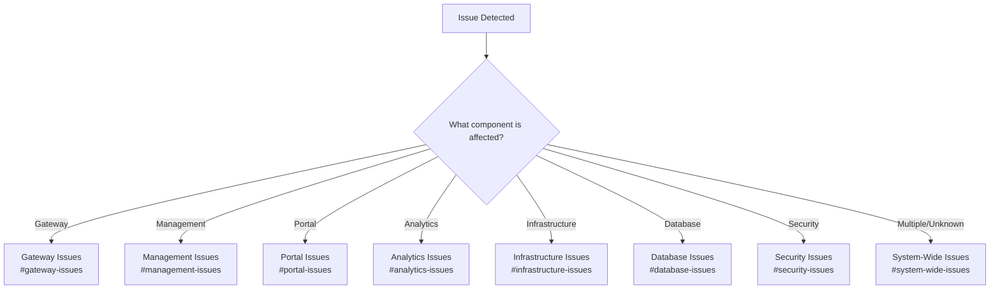
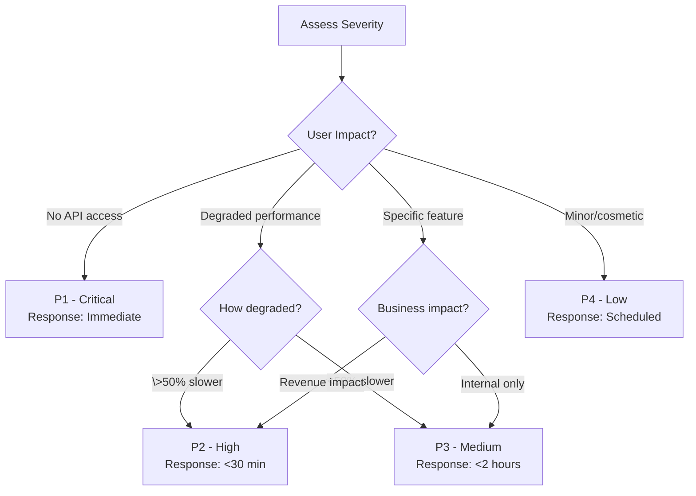
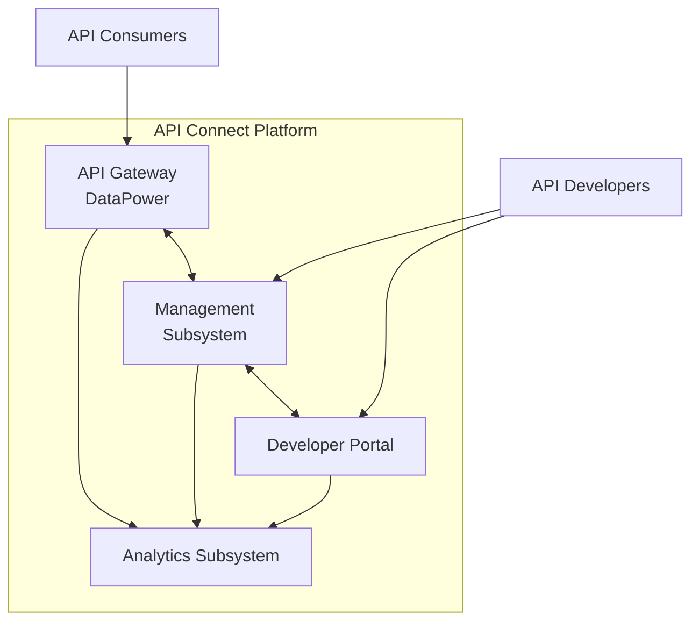

# API Connect Runbook

This runbook serves as the primary operational guide for the IBM API Connect platform deployed on AWS EKS. It provides high-level guidance and links to detailed procedures for operating and maintaining the platform.

## General

The IBM API Connect platform is a business-critical system that enables the creation, execution, management, and security of APIs across our organization. This runbook prioritizes responses based on business and customer impact, with clearly defined ownership and escalation paths.

### Platform Purpose

API Connect serves as our organization's API management solution, providing:
- Creation and documentation of APIs
- Runtime execution of API calls
- Security and access control
- Analytics and monitoring
- Developer self-service portal

### Runbook Navigation

This main runbook provides high-level guidance with links to detailed procedures:
- Use the [Decision Trees](#decision-trees) to identify the appropriate response procedure
- Refer to [Incident Management](#incident-management) for issue resolution
- See [Contact Details](#contact-details) for escalation paths

### Related Documentation

- [Architecture](../Architecture) - Detailed platform design and components
- [Observability](../Observability) - Monitoring, logging, and alerting
- [Access](../Access) - Access control and security procedures
- [SDLC](../SDLC) - Development and deployment processes
- [Home](../Home) - Wiki landing page

## Decision Trees

Use these decision trees to identify which runbook section or detailed procedure to follow:

### Component Issue Identification

### Severity Assessment

## Incident Management

The incident management section describes known error conditions and instructions for resolving incidents. For detailed resolution procedures, follow the links to component-specific runbooks.

### Severity Levels

| Level | Definition | Response Time | Resolution Target | Notification |
|-------|------------|---------------|-------------------|--------------|
| P1 (Critical) | Complete service outage or severe degradation affecting all users | Immediate (<15 min) | <4 hours | Full team + management |
| P2 (High) | Partial service outage or significant performance degradation | <30 min | <8 hours | On-call team + backup |
| P3 (Medium) | Minor functionality issues with limited impact | <2 hours | <24 hours | Primary on-call |
| P4 (Low) | Cosmetic issues or minor bugs with minimal impact | Next business day | Based on priority | Ticket only |

### Known Error Conditions

| Error Condition | Symptoms | Impact | Owner | Detailed Runbook |
|-----------------|----------|--------|-------|------------------|
| Gateway Service Failure | 5XX errors, Gateway pods in CrashLoopBackOff | Direct customer impact | L2 Support | [Gateway Issues](../Runbook-Gateway) |
| Management Service Disruption | Unable to publish APIs, UI errors | Internal users cannot manage APIs | L2 Support | [Management Issues](../Runbook-Management) |
| Developer Portal Unavailability | Portal inaccessible | API consumers cannot access documentation | L2 Support | [Portal Issues](../Runbook-Portal) |
| Analytics Service Failure | Missing metrics, dashboard not updating | Loss of visibility | L2 Support | [Analytics Issues](../Runbook-Analytics) |
| Certificate Expiration | TLS handshake failures | API calls failing with SSL errors | Security Team | [Security Issues](../Runbook-Security#certificates) |
| AWS Infrastructure Issues | Multiple pod failures, node issues | Widespread disruption | SRE Team | [Infrastructure Issues](../Runbook-Infrastructure) |

### General Incident Response Process

1. **Acknowledge the Incident**
   - Confirm alert receipt in PagerDuty
   - Join incident channel in MS Teams
   - Update ticket status in ServiceNow
   - For P1/P2: Start conference bridge

2. **Assess Impact and Severity**
   - Verify user impact using synthetic monitors in [Dynatrace](https://your-tenant.dynatrace.com/dashboards/api-connect-overview)
   - Check [API Connect Real-Time Dashboard](https://your-tenant.dynatrace.com/dashboards/api-connect-real-time) for current traffic impact
   - Determine severity level using the [Severity Assessment](#severity-assessment) decision tree
   - Document initial findings in the incident ticket

3. **Investigate and Diagnose**
   - Use the [Component Issue Identification](#component-issue-identification) decision tree
   - Follow the relevant component runbook
   - Reference common queries from [Splunk Query Library](../Runbook-Operations#splunk-query-library)
   - Apply the component-specific diagnostic workflow
   - Document all diagnostic steps taken

4. **Implement Resolution**
   - Apply the resolution steps from the relevant runbook
   - Follow standard change process for P3/P4 issues
   - Use emergency change process for P1/P2 issues
   - Update stakeholders on progress
   - Document all actions taken
   - Use component-specific verification tests to confirm resolution

5. **Verify Resolution**
   - Confirm issue resolution through:
     - [Dynatrace Synthetic Monitors](https://your-tenant.dynatrace.com/synthetics)
     - [API Connect Health Checks](https://your-tenant.dynatrace.com/synthetics/api-health)
     - Component-specific verification steps
   - Verify with affected users if applicable
   - Monitor for recurrence for at least 30 minutes
   - Update and resolve the incident in ServiceNow

6. **Post-Incident Activities**
   - Schedule post-incident review for P1/P2 incidents within 48 hours
   - Document timeline in standard template
   - Update runbooks with new learnings
   - Create preventative action items in backlog
   - Update monitoring based on lessons learned

### Environment-Specific Considerations

| Environment | Special Considerations | Runbook Adjustments |
|-------------|------------------------|---------------------|
| Development | Non-production workloads, reduced redundancy | More permissive actions, focus on quick resolution |
| Testing | Test automation, periodic resets | Coordinate with QA team, check test schedules |
| Staging | Pre-production validation | Validate against production configuration |
| Production | Business-critical, strict change control | Follow formal change process, consider business impact |
| DR | Warm standby, replication from production | Verify replication status, check sync jobs |

## System Overview

### High-Level Architecture

API Connect consists of these key components deployed on AWS EKS:

For detailed architecture information, see the [Architecture](../Architecture) page.

### Component Roles

| Component | Purpose | Criticality | Availability Target |
|-----------|---------|-------------|---------------------|
| API Gateway | Processes API requests, enforces policies | Critical | 99.99% |
| Management | API creation, configuration, lifecycle | High | 99.9% |
| Developer Portal | Self-service API discovery and subscription | Medium | 99.9% |
| Analytics | Metrics collection and reporting | Medium | 99.5% |

### Hours of Operation

The API Connect platform operates 24/7/365 with the following maintenance windows:

| Component | Availability Target | Maintenance Window |
|-----------|---------------------|-------------------|
| Gateway Services | 99.99% | None (Rolling updates only) |
| Management Services | 99.9% | Sunday 2:00 AM - 4:00 AM EST |
| Developer Portal | 99.9% | Sunday 2:00 AM - 4:00 AM EST |
| Analytics Services | 99.5% | Sunday 2:00 AM - 4:00 AM EST |

### Service Level Objectives (SLOs)

| Service | SLO | Target | Measurement Window | Dashboard |
|---------|-----|--------|---------------------|----------|
| API Gateway | Availability | 99.95% | 30-day rolling | [SLO Dashboard](https://your-tenant.dynatrace.com/slo/gateway-availability) |
| API Gateway | Latency (p95) | <300ms | 30-day rolling | [SLO Dashboard](https://your-tenant.dynatrace.com/slo/gateway-latency) |
| Overall Platform | Error Rate | <0.1% | 30-day rolling | [SLO Dashboard](https://your-tenant.dynatrace.com/slo/platform-errors) |

For detailed SLO definitions and monitoring, see the [Observability](../Observability#slis-slos) page.

## Security and Access Control

This section provides a high-level overview of security and access control for the API Connect platform. For detailed security procedures, see the [Access](../Access) page and [Security Issues](../Runbook-Security) runbook.

### Authentication Methods

| Method | Used For | Configuration |
|--------|----------|--------------|
| SAML | UI access | Integration with corporate SSO |
| OAuth 2.0 | API access | Token-based authentication |
| API Keys | Developer applications | Subscription-based |
| Client certificates | Secure backend connections | Mutual TLS |

### Access Levels

| Role | Capabilities | Management |
|------|--------------|------------|
| Admin | Full platform control | Restricted to SRE team |
| API Developer | Create and test APIs | Restricted to development teams |
| API Manager | Approve and publish APIs | Restricted to product owners |
| API Consumer | Subscribe and use APIs | Self-service via Developer Portal |

### Security Incident Response

For security incidents, follow these steps:

1. Identify the security issue type using the [Security Issues](../Runbook-Security) runbook
2. Follow the specific procedure for the issue type
3. Engage the Security Team for all P1/P2 security incidents
4. Document all actions in a security incident report

## Cloud Configurations

This section provides a high-level overview of the AWS cloud configuration for API Connect. For detailed cloud configuration information, see the [Architecture](../Architecture#physical-architecture) page.

### AWS Services Used

| Service | Purpose | Critical Configurations |
|---------|---------|-------------------------|
| EKS | Kubernetes orchestration | Version 1.29, 3 AZs |
| RDS | Database services | PostgreSQL, Multi-AZ |
| ALB | Load balancing | TLS termination, WAF integration |
| Route53 | DNS management | Health checks, failover |
| S3 | Object storage | Backup storage, artifacts |
| KMS | Encryption | Secrets, disk encryption |

### AWS Regions

| Environment | Primary Region | DR Region |
|-------------|---------------|-----------|
| Production | us-east-1 | us-west-2 |
| Non-Production | us-east-2 | N/A |

## Application and Operating System Configurations

This section provides high-level information about application and OS configurations. For detailed configuration information, see the [Architecture](../Architecture#application-and-operating-system-configurations) page.

### Key Configuration Files

| Component | Configuration Location | Purpose | Change Process |
|-----------|------------------------|---------|----------------|
| Gateway | ConfigMap: gateway-config | API runtime settings | GitOps pipeline |
| Manager | ConfigMap: manager-config | Management UI settings | GitOps pipeline |
| Portal | ConfigMap: portal-config | Developer portal settings | GitOps pipeline |
| Analytics | ConfigMap: analytics-config | Metrics collection settings | GitOps pipeline |

### Configuration Parameter Reference

For each key component, critical configuration parameters to be aware of during incident response:

#### Gateway Configuration Critical Parameters

| Parameter | Purpose | Default Value | Impact if Misconfigured |
|-----------|---------|--------------|--------------------------|
| `maxConnections` | Maximum concurrent connections | 10000 | Connection rejection, API failures |
| `timeoutSeconds` | Request timeout | 60 | Premature request termination |
| `rateLimit.enabled` | Rate limiting toggle | true | Unprotected backend services |
| `logging.level` | Log verbosity | info | Excessive or insufficient logging |
| `tlsVersion` | Minimum TLS version | TLSv1.2 | Security vulnerabilities or client rejections |

#### Management Configuration Critical Parameters

| Parameter | Purpose | Default Value | Impact if Misconfigured |
|-----------|---------|--------------|--------------------------|
| `database.maxConnections` | DB connection pool size | 50 | Connection failures or resource exhaustion |
| `sessionTimeout` | UI session timeout | 30m | Security risks or frequent logouts |
| `deploymentTimeout` | API deployment timeout | 120s | Failed deployments |
| `backupEnabled` | Configuration backup | true | Unrecoverable configuration changes |

### Configuration Management

All configuration changes must follow the change management process:

1. Create configuration change in the [api-connect-config](https://github.com/your-org/api-connect-config) repository
2. Submit pull request for review
3. Run automated validation tests
4. Obtain approval based on change type
5. Deploy through CI/CD pipeline
6. Verify change was applied correctly

For detailed deployment procedures, see the [SDLC](../SDLC#deployment-process) page.

## Monitoring and Alerting

This section provides a high-level overview of monitoring and alerting for API Connect. For detailed monitoring information, see the [Observability](../Observability) page.

### Monitoring Tools

| Tool | Purpose | Primary URL | Alert Integration |
|------|---------|------------|------------------|
| Dynatrace | APM and monitoring | [Dynatrace Portal](https://your-tenant.dynatrace.com/) | ServiceNow, PagerDuty |
| Splunk | Log aggregation and analysis | [Splunk Portal](https://splunk.your-company.com/) | ServiceNow, PagerDuty |
| ServiceNow | Incident management | [ServiceNow Portal](https://your-instance.service-now.com/) | Email notifications |
| AWS CloudWatch | AWS resource monitoring | [AWS Console](https://console.aws.amazon.com/cloudwatch/) | PagerDuty |

### Key Dashboards

| Dashboard | Purpose | URL | Primary Audience | Key Metrics |
|-----------|---------|-----|-----------------|------------|
| API Connect Overview | Platform health | [Dashboard](https://your-tenant.dynatrace.com/dashboards/api-connect-overview) | All Teams | Availability, error rates, response times |
| Gateway Performance | Gateway metrics | [Dashboard](https://your-tenant.dynatrace.com/dashboards/gateway-performance) | SRE Team | Throughput, latency, error rates by API |
| Business Impact | User experience | [Dashboard](https://your-tenant.dynatrace.com/dashboards/business-impact) | Product Team | Business transaction failures, customer impact |
| Operational Health | Infrastructure status | [Dashboard](https://your-tenant.dynatrace.com/dashboards/operational-health) | SRE Team | Node status, pod health, resource utilization |
| SLO Tracking | SLO compliance | [Dashboard](https://your-tenant.dynatrace.com/dashboards/slo-tracking) | SRE Team, Management | SLO metrics, error budgets, trend analysis |

### Alert Configuration

Our alert configuration in Dynatrace and Splunk aligns with our [Severity Levels](#severity-levels) to ensure consistent incident response. Alerts are routed to appropriate channels based on severity:

| Alert Source | Integration | Notification Routing |
|--------------|-------------|---------------------|
| Dynatrace | ServiceNow, PagerDuty | Based on severity level |
| Splunk | ServiceNow, PagerDuty | Based on severity level and component |
| Custom Checks | ServiceNow | Based on check type |

For detailed alert configurations and response procedures, see the [Observability](../Observability#alerting-configuration) page.

## Operational Tasks

This section covers routine operational tasks for the API Connect platform. For detailed operational procedures, see the corresponding component runbooks.

### Daily Operations

| Task | Frequency | Owner | Procedure |
|------|-----------|-------|-----------|
| Platform health check | Daily | L1 Support | [Daily Health Check](../Runbook-Operations#daily-health-check) |
| Backup verification | Daily | SRE Team | [Backup Verification](../Runbook-Operations#backup-verification) |
| Error log review | Daily | L2 Support | [Log Review](../Runbook-Operations#log-review) |
| Resource utilization | Daily | SRE Team | [Resource Monitoring](../Runbook-Operations#resource-monitoring) |

### Weekly Operations

| Task | Frequency | Owner | Procedure |
|------|-----------|-------|-----------|
| Certificate expiration check | Weekly | Security Team | [Certificate Management](../Runbook-Security#certificate-management) |
| Performance review | Weekly | SRE Team | [Performance Review](../Runbook-Operations#weekly-performance-review) |
| Capacity planning | Weekly | SRE Team | [Capacity Planning](../Runbook-Operations#capacity-planning) |
| Backup testing | Weekly | SRE Team | [Backup Testing](../Runbook-Operations#backup-testing) |

### Monthly Operations

| Task | Frequency | Owner | Procedure |
|------|-----------|-------|-----------|
| Security scan review | Monthly | Security Team | [Security Review](../Runbook-Security#security-review) |
| DR testing | Monthly | SRE Team | [DR Testing](../Runbook-Operations#dr-testing) |
| SLA/SLO review | Monthly | SRE Team | [SLO Review](../Runbook-Operations#slo-review) |

## Maintenance Tasks

This section covers planned maintenance tasks that might affect platform stability. For detailed procedures, see the [Runbook-Maintenance](../Runbook-Maintenance) page.

### Scheduled Maintenance

| Maintenance Type | Frequency | Duration | Impact | Procedure |
|------------------|-----------|----------|--------|-----------|
| Database maintenance | Weekly (Sunday 2-3 AM) | 1 hour | Minimal | [DB Maintenance](../Runbook-Maintenance#database-maintenance) |
| Gateway updates | Monthly | 2 hours | Rolling (none) | [Gateway Updates](../Runbook-Maintenance#gateway-updates) |
| EKS upgrades | Quarterly | 4 hours | Minimal | [EKS Upgrades](../Runbook-Maintenance#eks-upgrades) |
| Full platform upgrade | Bi-annually | 8 hours | Potential brief outages | [Platform Upgrade](../Runbook-Maintenance#platform-upgrade) |

### Patching Strategy

| Component | Patching Frequency | Approval Required | Procedure |
|-----------|---------------------|-------------------|-----------|
| Security patches | Within 7 days of release | Yes (expedited) | [Security Patching](../Runbook-Maintenance#security-patching) |
| OS patches | Monthly | Yes (standard) | [OS Patching](../Runbook-Maintenance#os-patching) |
| Kubernetes | Quarterly | Yes (CAB) | [Kubernetes Patching](../Runbook-Maintenance#kubernetes-patching) |
| API Connect | Quarterly | Yes (CAB) | [API Connect Patching](../Runbook-Maintenance#api-connect-patching) |

### Change Management

All changes follow our change management process:

1. Create change request in ServiceNow
2. Categorize change (Standard, Normal, Emergency)
3. Obtain appropriate approvals
4. Schedule change window
5. Execute pre-change validation checks
6. Implement change
7. Execute post-change validation checks
8. Update documentation
9. Close change record with results

For detailed change management procedures, see the [SDLC](../SDLC#change-management) page.

## Contact Details

### On-Call Rotation

| Role | Schedule | Responsibilities | Escalation Time |
|------|----------|------------------|-----------------|
| Primary On-Call | Weekly rotation | First response to all alerts | N/A |
| Secondary On-Call | Weekly rotation | Backup for primary | 15 minutes |
| Team Lead | As needed | Escalation point | 30 minutes |
| Manager | As needed | Critical incident management | 1 hour |

Access the on-call schedule: [PagerDuty Schedule](https://your-org.pagerduty.com/schedules)

### Support Tiers

| Tier | Team | Hours | Contact Method | Response Time |
|------|------|-------|---------------|---------------|
| L1 | NOC/Operations | 24x7 | noc@your-company.com | 15 minutes |
| L2 | SRE Team | Business hours + on-call | sre-team@your-company.com | 30 minutes |
| L3 | Development | Business hours + emergency | dev-oncall@your-company.com | 1 hour |

### External Support

| Vendor | Purpose | Contact Method | Contract ID | Response SLA |
|--------|---------|---------------|-------------|--------------|
| IBM | API Connect product support | [IBM Support](https://www.ibm.com/mysupport) | IBM-12345 | P1: 1 hour, P2: 4 hours |
| AWS | Cloud infrastructure support | [AWS Support](https://console.aws.amazon.com/support/) | AWS-67890 | Business Critical: 15 min |
| Dynatrace | Monitoring platform support | [Dynatrace Support](https://support.dynatrace.com/) | DT-24680 | P1: 1 hour, P2: 4 hours |
| Splunk | Log analysis platform support | [Splunk Support](https://www.splunk.com/en_us/support-and-services.html) | SP-13579 | P1: 1 hour, P2: 4 hours |

### Escalation Matrix

#### P1 Incidents
1. Primary On-Call Engineer (immediate)
2. Secondary On-Call Engineer (+15 minutes)
3. SRE Team Lead (+30 minutes)
4. Engineering Manager (+1 hour)
5. Director of Engineering (+2 hours)
6. CTO (+4 hours)

#### P2 Incidents
1. Primary On-Call Engineer (immediate)
2. Secondary On-Call Engineer (+30 minutes)
3. SRE Team Lead (+2 hours)
4. Engineering Manager (+4 hours)

#### P3 Incidents
1. Primary On-Call Engineer (immediate)
2. SRE Team Lead (next business day if unresolved)

### Business Stakeholders

| Role | When to Notify | Contact | Notification Template |
|------|---------------|---------|------------------------|
| Product Owner | P1/P2 incidents | product-owner@your-company.com | [Product Notification Template](../Runbook-Operations#product-notification) |
| Business Unit Manager | P1 incidents > 1 hour | bu-manager@your-company.com | [BU Notification Template](../Runbook-Operations#bu-notification) |
| Executive Team | P1 incidents > 2 hours | exec-escalation@your-company.com | [Executive Notification Template](../Runbook-Operations#executive-notification) |
| Customer Success | Customer-impacting incidents | customer-success@your-company.com | [CS Notification Template](../Runbook-Operations#cs-notification) |

### Cross-Team Collaboration

| Team | Collaboration Scenario | Contact Method | Response Expectation |
|------|------------------------|----------------|----------------------|
| Network Team | Connectivity/routing issues | #network-support Slack, network-team@your-company.com | 30 minutes during business hours |
| Security Team | Security incidents, certificate issues | #security-alerts Slack, security@your-company.com | 15 minutes for P1/P2 |
| Database Team | Database performance/availability | #database-support Slack, dba-team@your-company.com | 30 minutes during business hours |
| Development Team | Application bugs requiring code changes | #dev-support Slack, api-dev@your-company.com | Next business day, 2 hours for P1 |