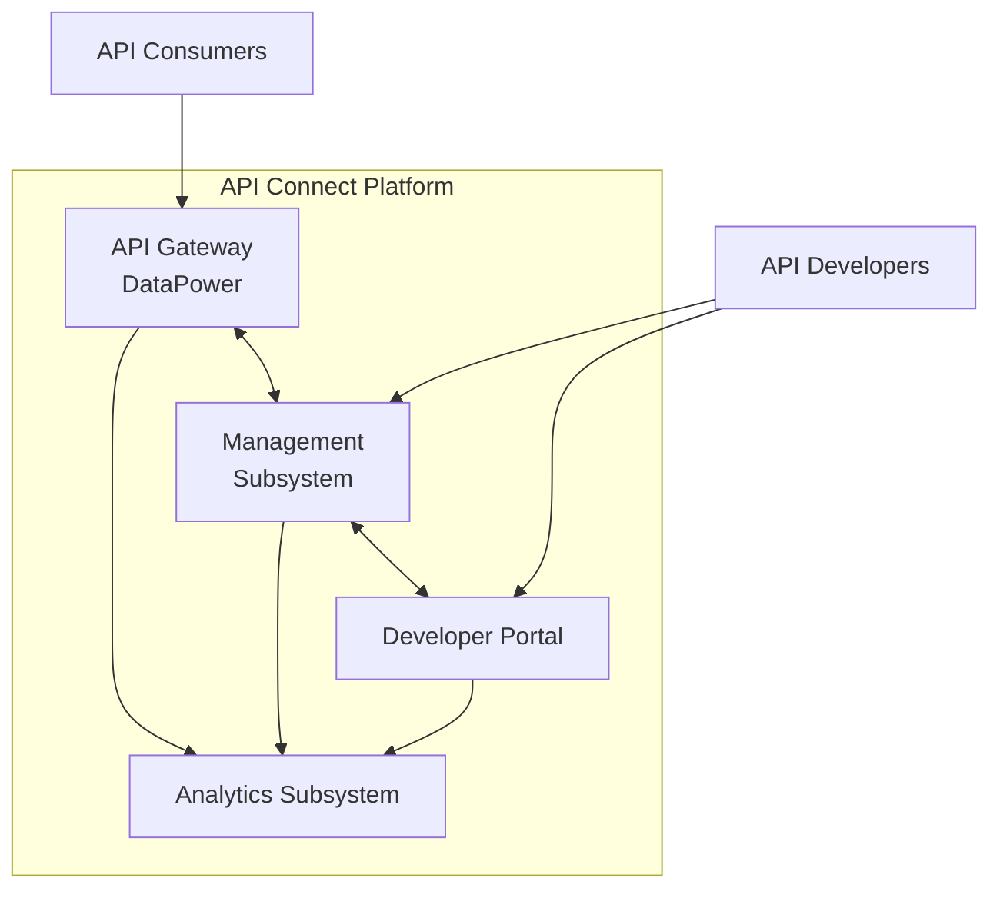

# IBM API Connect Service Overview

## Service Description

IBM API Connect is an enterprise-grade API management platform deployed on AWS EKS that enables the full API lifecycle including creation, security, management, testing, and monitoring of APIs. The platform serves as the central hub for all API activities within the organization.

### Business Purpose

API Connect provides:
- Creation and documentation of REST and SOAP APIs
- Secure runtime execution of API calls
- Policy enforcement and access control
- API analytics and performance monitoring
- Self-service developer portal for API consumers
- API lifecycle management

### Business Impact

This platform is **business-critical** as it:
- Enables integration between internal systems
- Provides controlled access to enterprise data
- Supports partner integrations
- Enables digital product capabilities
- Facilitates mobile application functionality

## Architecture Overview

API Connect consists of four primary components deployed on AWS EKS. For detailed architecture information, see the [Architecture](../Architecture) wiki page.

### High-Level Architecture

### Component Descriptions

| Component | Description | Criticality | Detailed Documentation |
|-----------|-------------|-------------|------------------------|
| **API Gateway (DataPower)** | Runtime component that processes API requests, enforces security policies, validates requests, and routes to backend services. | Critical - Directly impacts API consumers | [Gateway Runbook](../Gateway-Runbook) |
| **Management Subsystem** | Provides API lifecycle management, including creation, configuration, testing, and publishing. Includes API Manager UI and backend services. | High - Required for API administration | [Management Runbook](../Management-Runbook) |
| **Developer Portal** | Self-service portal for API consumers to discover, explore, test, and subscribe to APIs. | Medium - Affects API discovery and onboarding | [Portal Runbook](../Developer-Portal-Runbook) |
| **Analytics Subsystem** | Collects, processes, and visualizes API usage metrics and operational data. | Medium - Affects visibility into platform usage | [Analytics Runbook](../Analytics-Runbook) |

### AWS Infrastructure

The platform is hosted on AWS with the following key services. For detailed infrastructure information, see the [Architecture#physical-architecture](../Architecture#physical-architecture) wiki page.

| AWS Service | Usage | Configuration |
|-------------|-------|---------------|
| EKS | Kubernetes orchestration | Version 1.29, deployed across 3 AZs |
| EC2 | Worker nodes for EKS | Auto-scaling node groups with right-sized instances |
| RDS | PostgreSQL database | Multi-AZ deployment with automated backups |
| ALB | Load balancing | TLS termination, WAF integration |
| Route53 | DNS management | Health checks, failover configuration |
| S3 | Object storage | Backup storage, artifacts, logging |
| KMS | Encryption | Secrets and data encryption |

### Network Architecture

The platform utilizes a secure network design. For detailed network architecture, see the [Architecture#network-architecture](../Architecture#network-architecture) wiki page.
- VPC with public and private subnets across 3 AZs
- API traffic flows through public ALB to private Gateway services
- Internal components operate in private subnets
- NAT Gateways for outbound connectivity
- VPC endpoints for AWS service access
- Network ACLs and security groups for traffic control

## Environments

| Environment | Purpose | URL | AWS Region | Access |
|-------------|---------|-----|-----------|--------|
| **Production** | Business operations | api.example.com | us-east-1 | Restricted |
| **DR** | Disaster recovery | dr.api.example.com | us-west-2 | Emergency only |
| **Staging** | Pre-production validation | staging-api.example.com | us-east-1 | Limited |
| **Testing** | QA and automated testing | test-api.example.com | us-east-2 | Team access |
| **Development** | Development work | dev-api.example.com | us-east-2 | Developer access |

For environment-specific details, see the [Architecture#environment-comparison](../Architecture#environment-comparison) wiki page.

## Service Level Objectives

| Service | Metric | Target | Measurement |
|---------|--------|--------|-------------|
| API Gateway | Availability | 99.95% | 30-day rolling window |
| API Gateway | Response Time (p95) | < 300ms | 30-day rolling window |
| All Services | Error Rate | < 0.1% | 30-day rolling window |
| Management Services | Availability | 99.9% | 30-day rolling window |
| Developer Portal | Availability | 99.9% | 30-day rolling window |

For detailed SLO definitions and monitoring, see the [Observability#slis-slos](../Observability#slis-slos) wiki page.

## Maintenance Windows

| Component | Window | Frequency | Impact |
|-----------|--------|-----------|--------|
| Gateway Services | None (Rolling updates) | As needed | No downtime |
| Management Services | Sunday 2:00 AM - 4:00 AM EST | Monthly | UI unavailable |
| Developer Portal | Sunday 2:00 AM - 4:00 AM EST | Monthly | Portal unavailable |
| Analytics Services | Sunday 2:00 AM - 4:00 AM EST | Monthly | Analytics unavailable |

For detailed maintenance procedures, see the [Maintenance-Runbook](../Maintenance-Runbook) wiki page.

## Monitoring and Alerting

For comprehensive monitoring information, see the [Observability](../Observability) wiki page.

### Monitoring Tools

| Tool | Purpose | Access |
|------|---------|--------|
| Dynatrace | APM, synthetic monitoring, alerting | [Dynatrace Portal](https://your-tenant.dynatrace.com/) |
| Splunk | Log aggregation and analysis | [Splunk Portal](https://splunk.your-company.com/) |
| AWS CloudWatch | AWS resource monitoring | AWS Console |
| ServiceNow | Incident management | [ServiceNow Portal](https://your-instance.service-now.com/) |

### Key Dashboards

| Dashboard | Purpose | URL |
|-----------|---------|-----|
| API Connect Overview | Platform-wide health | [Dynatrace Dashboard](https://your-tenant.dynatrace.com/api-connect-overview) |
| Gateway Performance | API Gateway metrics | [Dynatrace Dashboard](https://your-tenant.dynatrace.com/gateway-performance) |
| SLO Tracking | SLO compliance | [Dynatrace Dashboard](https://your-tenant.dynatrace.com/slo-tracking) |
| Security Events | Security monitoring | [Splunk Dashboard](https://splunk.your-company.com/security-events) |

For dashboard details, see the [Observability#dashboards](../Observability#dashboards) wiki page.

### Critical Metrics

| Metric | Description | Warning Threshold | Critical Threshold |
|--------|-------------|-------------------|---------------------|
| API Success Rate | % of API calls with 2xx/3xx status | < 99.5% | < 99% |
| Response Time (p95) | 95th percentile of response times | > 300ms | > 500ms |
| Error Rate | % of 5XX responses | > 0.1% | > 1% |
| CPU Utilization | Resource usage | > 70% | > 85% |
| Active DB Connections | Database connections | > 70% of max | > 85% of max |

For the complete metrics catalog, see the [Observability#key-metrics](../Observability#key-metrics) wiki page.

## Authentication and Access Control

For detailed security information, see the [Access](../Access) wiki page.

### Authentication Methods

| Interface | Method | Provider | Notes |
|-----------|--------|----------|-------|
| Management UI | SAML | Corporate SSO (Okta) | MFA required |
| Developer Portal | OAuth 2.0 / OpenID Connect | Okta | Self-service registration with approval |
| API Gateway | Multiple (API Key, OAuth 2.0, JWT, mTLS) | API Connect | Configurable per API |
| Kubernetes | OIDC | Corporate SSO (Okta) | Role-based access |

See [Access#authentication-methods](../Access#authentication-methods) for detailed authentication configurations.

### Access Control Models

API Connect implements a comprehensive RBAC model. For detailed access control information, see the [Access#authorization-models](../Access#authorization-models) wiki page.

| Role | Description | Access Scope |
|------|-------------|--------------|
| Administrator | Full platform control | Restricted to SRE team |
| Operator | Runtime management | SRE team |
| API Developer | API creation and testing | Development teams |
| API Administrator | API lifecycle management | API product owners |
| Consumer Organization Owner | Consumer organization management | External partners |
| API Consumer | API usage | External developers |

## Backup and Disaster Recovery

### Backup Strategy

| Component | Backup Method | Frequency | Retention |
|-----------|---------------|-----------|-----------|
| RDS Database | Automated snapshots | Daily | 30 days |
| Configuration | S3 backups | Hourly | 90 days |
| API Definitions | Git repository | Continuous | Indefinite |
| Platform State | EKS resource exports | Daily | 30 days |

For detailed backup procedures, see the [Infrastructure-Runbook#backup-and-disaster-recovery](../Infrastructure-Runbook#backup-and-disaster-recovery) wiki page.

### Disaster Recovery

| Scenario | Strategy | RTO | RPO |
|----------|----------|-----|-----|
| AZ Failure | Multi-AZ redundancy | Automatic | 0 minutes |
| Region Failure | Cross-region DR environment | 30 minutes | 5 minutes |
| Database Corruption | Point-in-time recovery | 2 hours | 5 minutes |
| Configuration Error | Configuration rollback | 30 minutes | Depends on detection |

For complete disaster recovery procedures, see the [Infrastructure-Runbook#disaster-recovery-procedures](../Infrastructure-Runbook#disaster-recovery-procedures) wiki page.

## Support and Escalation

### Support Tiers

| Tier | Team | Response Time | Contact Method |
|------|------|---------------|---------------|
| L1 | 24x7 Operations | 15 minutes | ServiceNow, PagerDuty |
| L2 | SRE Team | 30 minutes | ServiceNow, MS Teams |
| L3 | Platform Engineering | 1 hour | ServiceNow, MS Teams |
| Vendor | IBM Support | Based on severity | IBM Support Portal |

### Escalation Path

For critical incidents (P1/P2):

1. Primary On-Call Engineer (immediate)
2. Secondary On-Call Engineer (+15 minutes)
3. SRE Team Lead (+30 minutes)
4. Engineering Manager (+1 hour)
5. Director of Engineering (+2 hours)

For detailed incident response procedures, see the [Operations-Runbook#incident-management](../Operations-Runbook#incident-management) wiki page.

### Contact Information

| Role | Contact | Availability |
|------|---------|--------------|
| SRE Team | api-connect-sre@your-company.com | 24/7 via Teams |
| Platform Engineering | platform-engineering@your-company.com | Business hours + on-call |
| IBM Support | IBM Support Portal (Case #IBM-12345) | 24/7 with support contract |
| AWS Support | AWS Support Portal (Account #AWS-67890) | 24/7 with Business Support |

For complete contact details, see the [Operations-Runbook#contact-details](../Operations-Runbook#contact-details) wiki page.

## Documentation References

### Technical Documentation

- [Architecture Documentation](../Architecture) - Detailed platform design
- [Observability Documentation](../Observability) - Monitoring and alerting
- [Access Documentation](../Access) - Security and access control
- [SDLC Documentation](../SDLC) - Development and deployment

### Runbooks

- [Gateway Runbook](../Gateway-Runbook) - Gateway troubleshooting
- [Management Runbook](../Management-Runbook) - Management troubleshooting
- [Portal Runbook](../Developer-Portal-Runbook) - Developer Portal troubleshooting
- [Analytics Runbook](../Analytics-Runbook) - Analytics troubleshooting
- [Infrastructure Runbook](../Infrastructure-Runbook) - AWS and Kubernetes issues
- [Database Runbook](../Database-Runbook) - Database operations
- [Maintenance Runbook](../Maintenance-Runbook) - Planned maintenance procedures
- [Operations Runbook](../Operations-Runbook) - Day-to-day operational procedures

### External Documentation

- [IBM API Connect Documentation](https://www.ibm.com/docs/en/api-connect/)
- [EKS Documentation](https://docs.aws.amazon.com/eks/)
- [Kubernetes Documentation](https://kubernetes.io/docs/)
