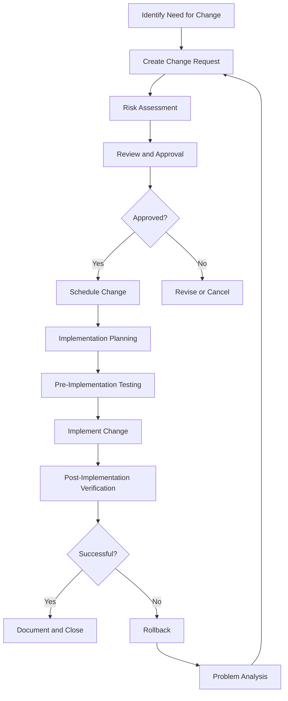
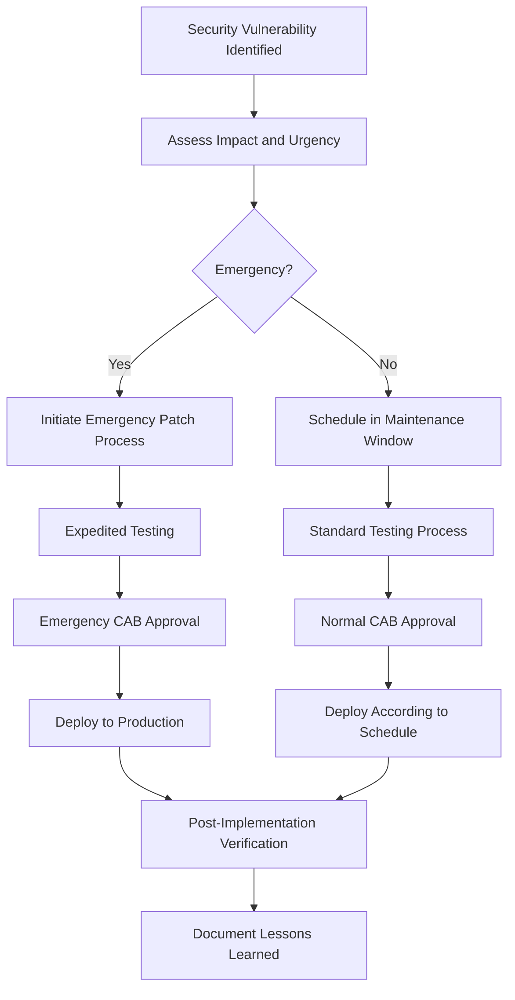

# API Connect Maintenance Runbook

This runbook provides detailed procedures for planned maintenance activities for the IBM API Connect platform deployed on AWS EKS, including upgrades, patching, routine maintenance, and certificate management.

## Maintenance Overview

Maintenance activities ensure the stability, security, and optimal performance of the API Connect platform. This runbook covers scheduled and emergency maintenance procedures across all environments.

### Maintenance Principles

- **Minimize Disruption**: Perform maintenance with minimal impact to users
- **Thorough Testing**: Test all changes in lower environments before production
- **Clear Communication**: Notify stakeholders before and after maintenance
- **Rollback Planning**: Maintain detailed rollback procedures for all changes
- **Documentation**: Update documentation as part of maintenance activities

### Types of Maintenance Activities

```mermaid
graph TD
    A[Maintenance Activities] --> B[Routine Maintenance]
    A --> C[Patching & Updates]
    A --> D[Version Upgrades]
    A --> E[Infrastructure Changes]
    A --> F[Emergency Maintenance]
    
    B --> B1[Performance Optimization]
    B --> B2[Certificate Rotation]
    B --> B3[Storage Management]
    B --> B4[Database Maintenance]
    
    C --> C1[Security Patches]
    C --> C2[OS Updates]
    C --> C3[Kubernetes Updates]
    C --> C4[Application Patches]
    
    D --> D1[API Connect Upgrades]
    D --> D2[Kubernetes Version Upgrades]
    D --> D3[Component Upgrades]
    
    E --> E1[Scaling Operations]
    E --> E2[Resource Reconfiguration]
    E --> E3[Network Changes]
    
    F --> F1[Critical Security Issues]
    F --> F2[Incident Response]
    F --> F3[Urgent Fixes]
```



## Maintenance Windows

### Standard Maintenance Windows

| Environment | Primary Window | Alternate Window | Notice Period | Approval Required |
|-------------|----------------|------------------|---------------|------------------|
| Development | Any time | N/A | None | Team Lead |
| Testing | Mon-Fri, 9 AM - 5 PM | N/A | Same day | Team Lead |
| Staging | Tue/Thu, 6 PM - 10 PM | Sat, 9 AM - 5 PM | 24 hours | Product Owner |
| Production | Sun, 2 AM - 6 AM | Sat, 11 PM - Sun 3 AM | 5 business days | CAB Approval |
| DR | Same as Production | Same as Production | 5 business days | CAB Approval |

### Blackout Periods

Maintenance activities are restricted during the following periods:

- **Business-Critical Events**: Such as major product launches or marketing campaigns
- **Financial Periods**: Quarter-end, year-end financial processing periods
- **Holiday Seasons**: Major holidays with increased API traffic
- **Regulatory Periods**: Compliance reporting periods

The current blackout calendar is maintained in: [Blackout Calendar](https://your-company.sharepoint.com/sites/api-platform/blackout-calendar)

### Emergency Maintenance

For urgent maintenance (e.g., critical security patches):

1. **Declaration**: SRE Manager or CISO can declare emergency maintenance
2. **Expedited Approval**: Requires CTO or designated backup approval
3. **Communication**: Minimum 2-hour notice if possible
4. **Documentation**: Post-implementation report required within 24 hours

## Change Management Process

### Change Request Workflow



### Change Types and SLAs

| Change Type | Description | Approval Requirements | SLA |
|-------------|-------------|------------------------|-----|
| Standard | Pre-approved routine changes | Team Lead | 24 hours |
| Normal | Planned changes with moderate risk | CAB | 5 business days |
| Emergency | Urgent changes to restore service | Emergency CAB | 2 hours |
| Latent | Zero-impact background changes | Team Lead | 48 hours |

### Risk Assessment Matrix

| Impact ↓ / Probability → | Low | Medium | High |
|--------------------------|-----|--------|------|
| **High** | Medium Risk | High Risk | Critical Risk |
| **Medium** | Low Risk | Medium Risk | High Risk |
| **Low** | Very Low Risk | Low Risk | Medium Risk |

- **Very Low Risk**: Standard approval, minimal testing
- **Low Risk**: Normal approval, component testing
- **Medium Risk**: Normal approval, full regression testing
- **High Risk**: CAB approval, extended testing, heightened monitoring
- **Critical Risk**: Executive approval, extensive testing, maintenance window restriction

### Change Request Template

```
Change Request: [CR-ID]
Title: [Brief description of change]
Requester: [Name and role]
Date Requested: [YYYY-MM-DD]

Description:
[Detailed description of the proposed change]

Business Justification:
[Why is this change necessary?]

Components Affected:
- [Component 1]
- [Component 2]

Risk Assessment:
- Impact: [High/Medium/Low]
- Probability of issues: [High/Medium/Low]
- Overall risk: [Critical/High/Medium/Low/Very Low]

Testing Plan:
[How will this change be tested before implementation?]

Implementation Plan:
[Step by step implementation procedure]

Rollback Plan:
[Detailed steps to rollback the change if needed]

Communication Plan:
[Who needs to be notified, when, and how]

Verification Plan:
[How will success be verified post-implementation?]
```

## Platform Upgrades

### API Connect Version Upgrades

#### Planning and Prerequisites

1. **Version Selection:**
   ```bash
   # Check available versions
   curl -s https://api.github.com/repos/IBM/apiconnect-operator/tags | grep name
   ```

2. **Compatibility Check:**
   - Review [IBM API Connect compatibility matrix](https://www.ibm.com/support/pages/node/713725)
   - Verify infrastructure requirements for new version
   - Check compatibility with existing integrations

3. **Backup Requirements:**
   - Full database backup
   - Configuration export
   - Application state backup
   - See [Backup Procedures](Database-Runbook#backup-procedures)

#### Pre-Upgrade Tasks

1. **Environment Readiness:**
   ```bash
   # Check cluster health
   kubectl get nodes
   kubectl top nodes
   
   # Check existing pod status
   kubectl get pods -n api-connect
   
   # Check persistent volumes
   kubectl get pv | grep api-connect
   
   # Verify storage availability
   kubectl get storageclass
   ```

2. **Create upgrade plan document:**
   ```
   # API Connect Upgrade Plan
   
   ## Current Version: [x.y.z]
   ## Target Version: [a.b.c]
   
   ## Upgrade Path: [Specify if direct or stepped upgrade]
   
   ## Timeline:
   - Pre-upgrade testing: [Date]
   - Staging upgrade: [Date]
   - Production upgrade: [Date]
   
   ## Responsible Team Members:
   - Upgrade lead: [Name]
   - Database admin: [Name]
   - Infrastructure admin: [Name]
   - Application admin: [Name]
   
   ## Communications Plan:
   [Detail when and how users will be notified]
   
   ## Testing Plan:
   [Detail test cases to run post-upgrade]
   
   ## Rollback Criteria:
   [Define specific criteria that would trigger rollback]
   ```

#### Upgrade Procedure

1. **Development Environment Upgrade:**
   ```bash
   # Update Helm repository
   helm repo update
   
   # Apply upgrade
   helm upgrade api-connect ibm-repo/apiconnect -n api-connect -f values-dev.yaml --version [target-version]
   
   # Monitor upgrade progress
   kubectl get pods -n api-connect -w
   ```

2. **Testing Phase:**
   - Run full test suite against upgraded dev environment
   - Document any issues encountered
   - Make necessary adjustments to values.yaml

3. **Staging Environment Upgrade:**
   ```bash
   # Backup staging environment
   kubectl exec -it -n api-connect [manager-pod-name] -- curl -k -X POST -H "Content-Type: application/json" -u admin:password https://localhost:9443/api/backups
   
   # Apply upgrade
   helm upgrade api-connect ibm-repo/apiconnect -n api-connect -f values-staging.yaml --version [target-version]
   
   # Verify upgrade
   kubectl get apiconnectcluster -n api-connect api-connect -o=jsonpath='{.status.phase}'
   ```

4. **Production Environment Upgrade:**
   - Schedule downtime if required
   - Notify users of maintenance window
   - Follow the same process as staging with additional verification steps
   - Implement heightened monitoring during and after upgrade

#### Post-Upgrade Tasks

1. **Verification:**
   ```bash
   # Check component versions
   kubectl exec -it -n api-connect [manager-pod-name] -- curl -k -H "Accept: application/json" -u admin:password https://localhost:9443/api/versions
   
   # Run health checks
   kubectl exec -it -n api-connect [gateway-pod-name] -- curl -k https://localhost:9443/health
   ```

2. **Functional Testing:**
   - Verify API creation and publication
   - Test API invocation through gateway
   - Verify developer portal functionality
   - Check analytics functionality

3. **Documentation Updates:**
   - Update runbooks with any new procedures
   - Update architecture diagrams if needed
   - Document any configuration changes

### Kubernetes Version Upgrades

#### Planning and Prerequisites

1. **Version Selection:**
   ```bash
   # Check available EKS versions
   aws eks describe-addon-versions --kubernetes-version 1.29 --region us-east-1
   ```

2. **Addon Compatibility:**
   ```bash
   # Check compatibility of existing add-ons
   aws eks describe-addon --cluster-name api-connect-cluster --addon-name vpc-cni --region us-east-1
   aws eks describe-addon --cluster-name api-connect-cluster --addon-name kube-proxy --region us-east-1
   aws eks describe-addon --cluster-name api-connect-cluster --addon-name coredns --region us-east-1
   ```

#### Upgrade Procedure

1. **Control Plane Upgrade:**
   ```bash
   # Update EKS control plane
   aws eks update-cluster-version --name api-connect-cluster --kubernetes-version 1.29 --region us-east-1
   
   # Monitor upgrade status
   aws eks describe-update --name [update-id] --cluster-name api-connect-cluster --region us-east-1
   ```

2. **Update Add-ons:**
   ```bash
   # Update each add-on
   aws eks update-addon --cluster-name api-connect-cluster --addon-name vpc-cni --addon-version [version] --region us-east-1
   aws eks update-addon --cluster-name api-connect-cluster --addon-name kube-proxy --addon-version [version] --region us-east-1
   aws eks update-addon --cluster-name api-connect-cluster --addon-name coredns --addon-version [version] --region us-east-1
   ```

3. **Worker Node Upgrade:**
   ```bash
   # Update managed node group
   aws eks update-nodegroup-version --cluster-name api-connect-cluster --nodegroup-name api-connect-nodes --region us-east-1
   
   # Monitor upgrade status
   aws eks describe-nodegroup --cluster-name api-connect-cluster --nodegroup-name api-connect-nodes --region us-east-1
   ```

4. **Post-Upgrade Verification:**
   ```bash
   # Verify Kubernetes version
   kubectl version
   
   # Check node versions
   kubectl get nodes
   
   # Verify all pods running
   kubectl get pods -A
   ```

## Patching Procedures

### Security Patching

#### Critical Security Patch Workflow



#### Security Patch Evaluation Matrix

| Factor | Low | Medium | High | Critical |
|--------|-----|--------|------|----------|
| Vulnerability Severity (CVSS) | 0.1 - 3.9 | 4.0 - 6.9 | 7.0 - 8.9 | 9.0 - 10.0 |
| Exploitability | Difficult, theoretical | Proof of concept exists | Exploits available | Active exploitation |
| Data Sensitivity | Non-sensitive | Internal use | Confidential | Regulated/PII |
| System Exposure | Internal, not exposed | Limited external exposure | Public-facing | Critical business function |
| **Response Time** | Next patch cycle | Within 30 days | Within 7 days | Within 24-48 hours |

#### Security Patching Procedure

1. **Preparation:**
   ```bash
   # Create backup
   kubectl get all -n api-connect -o yaml > api-connect-pre-patch.yaml
   
   # Document current versions
   kubectl describe pods -n api-connect | grep Image: > pre-patch-image-versions.txt
   ```

2. **Testing:**
   - Apply patch to development environment first
   - Run security scans to verify patch effectiveness
   - Conduct regression testing

3. **Implementation:**
   ```bash
   # Apply security patch (example for container image update)
   kubectl set image deployment/[deployment-name] [container-name]=[new-secure-image] -n api-connect
   
   # Verify rollout
   kubectl rollout status deployment/[deployment-name] -n api-connect
   ```

4. **Verification:**
   - Run vulnerability scan to verify patch effectiveness
   - Confirm application functionality
   - Check for any performance impacts

### OS Patching

#### Worker Node Patching Strategy

| Approach | Description | Use Case | Procedure |
|----------|-------------|----------|-----------|
| Rolling Update | Update nodes one by one, moving workloads | Regular patching | Safe but slower |
| Blue/Green | Create new node group, migrate all pods | Major OS updates | More complex, minimal impact |
| Surge | Temporarily increase cluster size during patching | Time-sensitive patches | Higher cost, minimal impact |

#### OS Patch Procedure (Rolling)

1. **Preparation:**
   ```bash
   # Ensure cluster is healthy
   kubectl get nodes
   
   # Check current patch level
   aws ec2 describe-instances --instance-ids i-1234567890abcdef0 --query "Reservations[].Instances[].PlatformDetails" --region us-east-1
   ```

2. **Update Launch Template:**
   ```bash
   # Create new version with patched AMI
   aws ec2 create-launch-template-version --launch-template-id lt-0123456789abcdef0 --version-description "Patched AMI" --source-version 1 --launch-template-data '{"ImageId":"ami-0abcdef1234567890"}' --region us-east-1
   ```

3. **Update Node Group:**
   ```bash
   # Update the node group to use new launch template
   aws eks update-nodegroup-version --cluster-name api-connect-cluster --nodegroup-name api-connect-nodes --launch-template launchTemplateId=lt-0123456789abcdef0,version=2 --region us-east-1
   ```

4. **Monitor Update:**
   ```bash
   # Check node group update status
   aws eks describe-nodegroup --cluster-name api-connect-cluster --nodegroup-name api-connect-nodes --region us-east-1
   
   # Watch nodes being replaced
   kubectl get nodes -w
   ```

### Application Patching

#### API Connect Component Patching

1. **Gateway Patching:**
   ```bash
   # Update Gateway deployment
   kubectl set image deployment/gateway gateway=gateway-image:patched-version -n api-connect
   
   # Monitor rollout
   kubectl rollout status deployment/gateway -n api-connect
   ```

2. **Management Patching:**
   ```bash
   # Update Management deployment
   kubectl set image deployment/manager manager=manager-image:patched-version -n api-connect
   
   # Monitor rollout
   kubectl rollout status deployment/manager -n api-connect
   ```

3. **Portal Patching:**
   ```bash
   # Update Portal deployment
   kubectl set image deployment/portal portal=portal-image:patched-version -n api-connect
   
   # Monitor rollout
   kubectl rollout status deployment/portal -n api-connect
   ```

4. **Analytics Patching:**
   ```bash
   # Update Analytics deployment
   kubectl set image deployment/analytics analytics=analytics-image:patched-version -n api-connect
   
   # Monitor rollout
   kubectl rollout status deployment/analytics -n api-connect
   ```

#### Configuration Patching

1. **ConfigMap Updates:**
   ```bash
   # Export current ConfigMap
   kubectl get configmap config-name -n api-connect -o yaml > config-name-backup.yaml
   
   # Edit ConfigMap
   kubectl edit configmap config-name -n api-connect
   
   # Restart affected deployments to pick up changes
   kubectl rollout restart deployment affected-deployment -n api-connect
   ```

2. **Secret Updates:**
   ```bash
   # Create new secret with updated values
   kubectl create secret generic secret-name --from-literal=key=new-value -n api-connect --dry-run=client -o yaml | kubectl apply -f -
   
   # Restart affected deployments
   kubectl rollout restart deployment affected-deployment -n api-connect
   ```

## Database Maintenance

### Performance Optimization

#### Regular Database Maintenance Tasks

| Task | Frequency | Purpose | Command |
|------|-----------|---------|---------|
| VACUUM ANALYZE | Weekly | Update statistics, reclaim space | `VACUUM ANALYZE;` |
| Reindex | Monthly | Rebuild indexes for optimal performance | `REINDEX DATABASE apic_db;` |
| Update Statistics | Weekly | Update query planner statistics | `ANALYZE;` |
| Identify Bloat | Monthly | Find tables with significant bloat | Custom query |
| Check Long-running Queries | Daily | Identify problematic queries | `SELECT * FROM pg_stat_activity WHERE state = 'active' AND now() - pg_stat_activity.query_start > interval '5 minutes';` |

#### Database Maintenance Procedure

1. **Preparation:**
   ```bash
   # Connect to database utility pod
   kubectl exec -it postgres-util -n api-connect -- bash
   
   # Connect to database
   PGPASSWORD=password psql -h api-connect-db.cluster-xyz.us-east-1.rds.amazonaws.com -U apic_admin -d apic_db
   ```

2. **Pre-maintenance Checks:**
   ```sql
   -- Check database size
   SELECT pg_size_pretty(pg_database_size('apic_db'));
   
   -- Check largest tables
   SELECT relname, pg_size_pretty(pg_total_relation_size(relid)) AS total_size
   FROM pg_catalog.pg_statio_user_tables
   ORDER BY pg_total_relation_size(relid) DESC
   LIMIT 10;
   
   -- Check index usage
   SELECT relname, indexrelname, idx_scan, idx_tup_read, idx_tup_fetch
   FROM pg_stat_user_indexes
   JOIN pg_statio_user_indexes USING (indexrelid)
   ORDER BY idx_scan DESC
   LIMIT 10;
   ```

3. **Maintenance Operations:**
   ```sql
   -- Update statistics
   ANALYZE VERBOSE;
   
   -- Vacuum tables
   VACUUM VERBOSE ANALYZE;
   
   -- Reindex specific tables if needed
   REINDEX TABLE large_table_name;
   ```

4. **Post-maintenance Checks:**
   ```sql
   -- Check for long queries
   SELECT pid, now() - pg_stat_activity.query_start AS duration, query
   FROM pg_stat_activity
   WHERE state = 'active' AND now() - pg_stat_activity.query_start > interval '1 minute'
   ORDER BY duration DESC;
   
   -- Check for locks
   SELECT relation::regclass, mode, pid, now() - pg_stat_activity.query_start AS duration, query
   FROM pg_locks
   JOIN pg_stat_activity ON pg_locks.pid = pg_stat_activity.pid
   WHERE relation IS NOT NULL
   ORDER BY relation;
   ```

### Database Storage Management

1. **Monitor Storage Usage:**
   ```bash
   # Check RDS storage metrics
   aws cloudwatch get-metric-statistics --region us-east-1 --namespace AWS/RDS --metric-name FreeStorageSpace --dimensions Name=DBInstanceIdentifier,Value=api-connect-db --start-time $(date -u -d "1 day ago" +%Y-%m-%dT%H:%M:%SZ) --end-time $(date -u +%Y-%m-%dT%H:%M:%SZ) --period 3600 --statistics Average
   ```

2. **Expand Storage When Needed:**
   ```bash
   # Increase allocated storage
   aws rds modify-db-instance --db-instance-identifier api-connect-db --allocated-storage 100 --apply-immediately --region us-east-1
   ```

3. **Purge Old Data:**
   ```sql
   -- Identify tables with old data
   SELECT tablename FROM pg_tables WHERE schemaname = 'public';
   
   -- Create archive tables if needed
   CREATE TABLE archived_data_2023 AS SELECT * FROM data_table WHERE timestamp < '2024-01-01';
   
   -- Delete old data
   DELETE FROM data_table WHERE timestamp < '2024-01-01';
   ```

## Certificate Management

### Certificate Inventory

| Certificate Type | Purpose | Expiration Check Command | Rotation Frequency |
|------------------|---------|--------------------------|---------------------|
| TLS/SSL Certificates | Secure API and UI traffic | `aws acm describe-certificate --certificate-arn [arn]` | 1 year |
| Internal CA Certificates | Internal service communication | `kubectl get secret [tls-secret] -o yaml` | 2 years |
| JWT Signing Keys | API security | `kubectl get secret jwt-key -o yaml` | 6 months |
| Database Certificates | Secure DB connections | `aws rds describe-db-instances --db-instance-identifier [id]` | 1 year |
| OAuth Certificates | OAuth flow security | `kubectl get secret oauth-certs -o yaml` | 1 year |

### Certificate Expiration Monitoring

1. **Automated Monitoring:**
   ```bash
   # Example Jenkins job
   # Script to check certificate expiration dates
   
   # For ACM certificates
   aws acm list-certificates --region us-east-1 | jq -r '.CertificateSummaryList[].CertificateArn' | while read arn; do
     aws acm describe-certificate --certificate-arn $arn --region us-east-1 | jq -r '.Certificate | "\(.DomainName) expires on \(.NotAfter)"'
   done
   
   # For Kubernetes TLS secrets
   kubectl get secrets -n api-connect | grep tls | awk '{print $1}' | while read secret; do
     kubectl get secret $secret -n api-connect -o jsonpath='{.data.tls\.crt}' | base64 -d | openssl x509 -noout -enddate
   done
   ```

2. **Alerting Configuration:**
   - Set up CloudWatch alarms for ACM certificate expiration
   - Create custom checks for Kubernetes certificates
   - Configure alerts for 30/15/7 days before expiration

### Certificate Renewal Process

#### Public Certificates (ACM)

1. **Request New Certificate:**
   ```bash
   # Request new certificate
   aws acm request-certificate --domain-name api.example.com --validation-method DNS --region us-east-1
   ```

2. **Validate Certificate:**
   ```bash
   # Get validation CNAME
   aws acm describe-certificate --certificate-arn arn:aws:acm:us-east-1:123456789012:certificate/12345678-1234-1234-1234-123456789012 --region us-east-1
   
   # Add DNS record via Route 53 (if applicable)
   aws route53 change-resource-record-sets --hosted-zone-id Z1D633PJN98FT9 --change-batch file://validation.json --region us-east-1
   ```

3. **Update Service References:**
   ```bash
   # Update ALB listener
   aws elbv2 modify-listener --listener-arn arn:aws:elasticloadbalancing:us-east-1:123456789012:listener/app/my-load-balancer/50dc6c495c0c9188/f2f7dc8efc522ab2 --certificates CertificateArn=arn:aws:acm:us-east-1:123456789012:certificate/12345678-1234-1234-1234-123456789012 --region us-east-1
   ```

#### Kubernetes TLS Secrets

1. **Generate New Certificate:**
   ```bash
   # Generate new private key and CSR
   openssl genrsa -out tls.key 2048
   openssl req -new -key tls.key -out tls.csr -subj "/CN=*.api-connect.svc.cluster.local"
   
   # Sign CSR (using internal CA or external CA)
   openssl x509 -req -in tls.csr -CA ca.crt -CAkey ca.key -CAcreateserial -out tls.crt -days 365
   ```

2. **Create New Secret:**
   ```bash
   # Create new secret with new certificate
   kubectl create secret tls api-connect-tls --cert=tls.crt --key=tls.key -n api-connect --dry-run=client -o yaml > new-tls-secret.yaml
   kubectl apply -f new-tls-secret.yaml
   ```

3. **Update References:**
   ```bash
   # Update ingress resources
   kubectl edit ingress api-gateway-ingress -n api-connect
   # Update tls.secretName to the new secret name
   
   # Restart affected services if needed
   kubectl rollout restart deployment gateway -n api-connect
   ```

### Certificate Rotation Schedule

| Month | Certificates to Rotate |
|-------|------------------------|
| January | Development environment certificates |
| April | Testing environment certificates |
| July | Staging environment certificates |
| October | Production environment certificates |

## Routine Maintenance Tasks

### Daily Maintenance Tasks

| Task | Description | Responsibility | Automation Status |
|------|-------------|----------------|------------------|
| Cluster Health Check | Verify all nodes and pods are healthy | SRE | Automated |
| Database Connection Pool Check | Verify connection pools within limits | DBA | Automated |
| API Gateway Error Rate Monitoring | Check for abnormal error rates | SRE | Automated |
| Resource Utilization Check | Monitor CPU, memory, and storage usage | SRE | Automated |
| Log Inspection | Review error logs for critical issues | SRE | Partially Automated |

#### Daily Maintenance Automation

```bash
#!/bin/bash
# Daily maintenance script

echo "=== API Connect Daily Maintenance $(date) ==="

echo "Checking cluster health..."
kubectl get nodes -o wide
kubectl get pods -n api-connect | grep -v Running

echo "Checking resource utilization..."
kubectl top nodes
kubectl top pods -n api-connect | sort -k2 -nr | head -10

echo "Checking API error rates..."
# Custom script to query Dynatrace or Splunk for error rates

echo "Database connection pool status..."
# Query to check connection pool usage

echo "Alerting on critical issues..."
# Logic to find and alert on critical issues found during checks
```

### Weekly Maintenance Tasks

| Task | Description | Responsibility | Automation Status |
|------|-------------|----------------|------------------|
| Database Maintenance | Run VACUUM ANALYZE | DBA | Automated |
| Disk Space Cleanup | Clean up logs and temporary files | SRE | Automated |
| Security Scan | Run vulnerability scans | Security Team | Automated |
| Backup Verification | Test restoration of backups | DBA | Automated |
| Certificate Status Check | Verify expiring certificates | SRE | Automated |
| Obsolete Resource Cleanup | Remove unused resources | SRE | Partially Automated |

#### Weekly Maintenance Automation

```groovy
// Jenkins pipeline for weekly maintenance
pipeline {
    agent any
    stages {
        stage('Cluster Status') {
            steps {
                sh ```
                kubectl get nodes -o wide
                kubectl get pods -n api-connect | grep -v Running
                ```
            }
        }
        stage('Database Maintenance') {
            steps {
                sh ```
                # Connect to database and run maintenance tasks
                kubectl exec -it postgres-util -n api-connect -- bash -c "PGPASSWORD=password psql -h api-connect-db.cluster-xyz.us-east-1.rds.amazonaws.com -U apic_admin -d apic_db -c 'VACUUM ANALYZE;'"
                ```
            }
        }
        stage('Disk Cleanup') {
            steps {
                sh ```
                # Clean up old logs
                kubectl exec -it -n api-connect $(kubectl get pods -n api-connect -l app=gateway -o jsonpath="{.items[0].metadata.name}") -- find /var/log -name "*.log.*" -type f -mtime +7 -delete
                ```
            }
        }
        stage('Certificate Check') {
            steps {
                sh ```
                # Check for expiring certificates
                ./check-certificates.sh
                ```
            }
        }
        stage('Backup Verification') {
            steps {
                sh ```
                # Verify backups
                ./verify-backup.sh
                ```
            }
        }
    }
    post {
        always {
            emailext body: "Weekly maintenance report: ${currentBuild.currentResult}\n\n${currentBuild.rawBuild.getLog(1000)}",
                subject: "API Connect Weekly Maintenance - ${currentBuild.currentResult}",
                to: "sre-team@your-company.com"
        }
    }
}
```

### Monthly Maintenance Tasks

| Task | Description | Responsibility | Automation Status |
|------|-------------|----------------|------------------|
| Log Archiving | Archive older logs to long-term storage | SRE | Automated |
| Performance Review | Review performance metrics and optimization | SRE/DBA | Manual |
| Security Controls Review | Review security configurations and access | Security Team | Partially Automated |
| Resource Scaling Evaluation | Review resource allocation and adjust | SRE | Partially Automated |
| Compliance Check | Verify compliance requirements | Compliance Team | Manual |
| DR Testing | Test disaster recovery procedures | SRE | Partially Automated |

#### Monthly Maintenance Checklist

```
# API Connect Monthly Maintenance Checklist

## Infrastructure Review
- [ ] Review resource utilization trends
- [ ] Evaluate need for scaling resources
- [ ] Check for AWS cost optimization opportunities

## Database Maintenance
- [ ] Run REINDEX on critical tables
- [ ] Analyze query performance
- [ ] Review storage growth trends

## Security Review
- [ ] Review IAM role permissions
- [ ] Check security group configurations
- [ ] Review user access audit logs

## Performance Review
- [ ] Analyze API performance trends
- [ ] Review latency metrics
- [ ] Check throughput capacity

## Compliance Review
- [ ] Verify logging compliance
- [ ] Check data retention policies
- [ ] Review access control compliance

## Disaster Recovery
- [ ] Update DR documentation if needed
- [ ] Conduct DR test for specific component
- [ ] Verify cross-region replication
```

### Quarterly Maintenance Tasks

| Task | Description | Responsibility | Automation Status |
|------|-------------|----------------|------------------|
| Full Platform Health Assessment | Comprehensive review of all components | SRE Team | Manual |
| Major Version Evaluation | Assess new versions for potential upgrades | Architecture Team | Manual |
| Capacity Planning | Long-term capacity planning | SRE/Architecture Team | Manual |
| Full DR Exercise | Complete DR failover exercise | SRE Team | Partially Automated |
| Penetration Testing | Security penetration testing | Security Team | Manual |
| Architecture Review | Review platform architecture for improvements | Architecture Team | Manual |

## Environment-Specific Considerations

### Development Environment

- **Frequency**: More frequent maintenance permitted
- **Communication**: Minimal notification required
- **Downtime**: Acceptable for longer periods
- **Testing**: Used for testing maintenance procedures
- **Automation**: Testing ground for maintenance automation

**Special Considerations:**
- May be completely refreshed periodically
- Test data may be reset during maintenance
- May use smaller infrastructure for cost savings

### Testing Environment

- **Frequency**: Regular maintenance aligned with testing cycles
- **Communication**: Coordinate with QA team
- **Downtime**: Schedule around testing cycles
- **Testing**: Validate application tests after maintenance
- **Automation**: Validate maintenance automation procedures

**Special Considerations:**
- Coordinate with test automation schedules
- May need to reset to specific states for testing
- Configuration often mirrors production with reduced scale

### Staging Environment

- **Frequency**: Maintenance scheduled before production
- **Communication**: Notify development and product teams
- **Downtime**: Minimize during pre-release periods
- **Testing**: Full validation after maintenance
- **Automation**: Use same automation as production

**Special Considerations:**
- Used to validate production maintenance procedures
- Maintain close configuration to production
- Critical for pre-release validation

### Production Environment

- **Frequency**: Well-scheduled, minimized frequency
- **Communication**: Formal change control and notifications
- **Downtime**: Minimize or eliminate
- **Testing**: Exhaustive pre and post testing
- **Automation**: Fully automated with verification steps

**Special Considerations:**
- Zero-downtime techniques required
- Rollback plans must be thoroughly tested
- Heightened monitoring during maintenance period

### DR Environment

- **Frequency**: Aligned with production
- **Communication**: Include in production notices
- **Downtime**: Coordinated with production
- **Testing**: Verify replication after production maintenance
- **Automation**: Same automation as production

**Special Considerations:**
- Maintain synchronization with production
- Verify DR capabilities after maintenance
- Test failover capability periodically

## Maintenance Automation

### Automation Principles

- **Consistency**: Automated procedures ensure consistent execution
- **Repeatability**: Scripts can be executed in any environment
- **Verification**: Automated verification of maintenance results
- **Documentation**: Self-documenting through code
- **Rollback**: Automated rollback procedures

### Jenkins Maintenance Pipelines

```groovy
// Example maintenance pipeline structure
pipeline {
    agent any
    parameters {
        choice(name: 'ENVIRONMENT', choices: ['dev', 'test', 'stage', 'prod'], description: 'Target Environment')
        choice(name: 'MAINTENANCE_TYPE', choices: ['routine', 'patching', 'upgrade'], description: 'Maintenance Type')
        string(name: 'VERSION', defaultValue: '', description: 'Version to upgrade to (if applicable)')
        booleanParam(name: 'SKIP_BACKUP', defaultValue: false, description: 'Skip backup step (not recommended)')
    }
    
    stages {
        stage('Preparation') {
            steps {
                script {
                    // Verify maintenance window
                    if (params.ENVIRONMENT == 'prod' || params.ENVIRONMENT == 'stage') {
                        def withinMaintenanceWindow = sh(script: './check-maintenance-window.sh', returnStatus: true)
                        if (withinMaintenanceWindow != 0) {
                            error "Not within approved maintenance window for ${params.ENVIRONMENT}!"
                        }
                    }
                    
                    // Check for blackout periods
                    def inBlackoutPeriod = sh(script: './check-blackout-period.sh', returnStatus: true)
                    if (inBlackoutPeriod == 0) {
                        error "Currently in a blackout period! Maintenance not allowed."
                    }
                    
                    // Get necessary approvals
                    if (params.ENVIRONMENT == 'prod') {
                        timeout(time: 24, unit: 'HOURS') {
                            input message: 'Proceed with production maintenance?', submitter: 'manager,admin'
                        }
                    }
                }
            }
        }
        
        stage('Backup') {
            when {
                expression { return !params.SKIP_BACKUP }
            }
            steps {
                sh './backup-environment.sh ${params.ENVIRONMENT}'
            }
        }
        
        stage('Pre-checks') {
            steps {
                sh './pre-maintenance-checks.sh ${params.ENVIRONMENT}'
            }
        }
        
        stage('Maintenance Execution') {
            steps {
                script {
                    if (params.MAINTENANCE_TYPE == 'routine') {
                        sh './routine-maintenance.sh ${params.ENVIRONMENT}'
                    } else if (params.MAINTENANCE_TYPE == 'patching') {
                        sh './apply-patches.sh ${params.ENVIRONMENT}'
                    } else if (params.MAINTENANCE_TYPE == 'upgrade') {
                        sh './upgrade-platform.sh ${params.ENVIRONMENT} ${params.VERSION}'
                    }
                }
            }
        }
        
        stage('Verification') {
            steps {
                sh './verify-environment.sh ${params.ENVIRONMENT}'
            }
        }
    }
    
    post {
        always {
            // Send notification
            sh './notify-maintenance-complete.sh ${params.ENVIRONMENT} ${currentBuild.currentResult}'
            
            // Archive results
            archiveArtifacts artifacts: 'maintenance-logs/**', fingerprint: true
        }
        failure {
            // Execute rollback if needed
            sh './rollback-maintenance.sh ${params.ENVIRONMENT}'
        }
    }
}
```

### Scheduled Maintenance Jobs

| Job Name | Schedule | Description | Environments |
|----------|----------|-------------|--------------|
| daily-health-check | Daily, 8 AM | Basic health checks | All |
| weekly-database-maintenance | Sundays, 2 AM | Database maintenance | All |
| certificate-expiration-check | Mondays, 9 AM | Check certificate expiry | All |
| monthly-performance-review | 1st of month, 3 AM | Generate performance reports | All |
| storage-cleanup | Fridays, 1 AM | Clean up unused storage | All |
| quarterly-dr-test | 1st of quarter, 2 AM | DR testing | Prod DR |

### Maintenance Reporting

Automatically generated maintenance reports include:

1. **Execution Summary**:
   - Maintenance type and scope
   - Start/end time and duration
   - Overall status (success/failure)

2. **Actions Performed**:
   - List of executed tasks
   - Configuration changes made
   - Resources modified

3. **Verification Results**:
   - Health check results
   - Performance impact
   - Error detection

4. **Metrics**:
   - Pre/post resource utilization
   - System performance
   - Error rates

5. **Follow-up Items**:
   - Issues requiring attention
   - Future optimization opportunities
   - Recommended next actions

## Post-Maintenance Verification

### Health Check Procedures

1. **Kubernetes Component Verification:**
   ```bash
   # Check node status
   kubectl get nodes
   
   # Check pod status
   kubectl get pods -n api-connect
   
   # Check deployments
   kubectl get deployments -n api-connect
   
   # Check services
   kubectl get services -n api-connect
   ```

2. **API Connect Component Verification:**
   ```bash
   # Verify gateway status
   kubectl exec -it -n api-connect $(kubectl get pods -n api-connect -l app=gateway -o jsonpath="{.items[0].metadata.name}") -- curl -k https://localhost:9443/health
   
   # Verify manager status
   kubectl exec -it -n api-connect $(kubectl get pods -n api-connect -l app=manager -o jsonpath="{.items[0].metadata.name}") -- curl -k https://localhost:9443/health
   
   # Verify portal status
   kubectl exec -it -n api-connect $(kubectl get pods -n api-connect -l app=portal -o jsonpath="{.items[0].metadata.name}") -- curl -k https://localhost:8443/health
   
   # Verify analytics status
   kubectl exec -it -n api-connect $(kubectl get pods -n api-connect -l app=analytics -o jsonpath="{.items[0].metadata.name}") -- curl -k https://localhost:9443/health
   ```

### Functional Testing

1. **API Management Flow:**
   - Create test API
   - Publish API to catalog
   - Test API through gateway
   - Verify metrics collection

2. **Developer Portal Flow:**
   - Register test application
   - Subscribe to API
   - Generate credentials
   - Test API with credentials

### Performance Validation

1. **Response Time Comparison:**
   ```bash
   # Get pre-maintenance baseline
   curl -o pre-maintenance-performance.json "https://your-tenant.dynatrace.com/api/v2/metrics/query?metricSelector=builtin:service.response.time:filter(eq(service.name,api-gateway))&from=-12h&to=-1h" -H "Authorization: Api-Token $DYNATRACE_TOKEN"
   
   # Get post-maintenance metrics
   curl -o post-maintenance-performance.json "https://your-tenant.dynatrace.com/api/v2/metrics/query?metricSelector=builtin:service.response.time:filter(eq(service.name,api-gateway))&from=-1h&to=now" -H "Authorization: Api-Token $DYNATRACE_TOKEN"
   
   # Compare results
   python compare-performance.py
   ```

2. **Throughput Testing:**
   ```bash
   # Run load test to verify throughput
   jmeter -n -t load-tests/post-maintenance-test.jmx -l results.jtl
   
   # Analyze results
   python analyze-load-test.py results.jtl
   ```

## References and Resources

### Maintenance Templates

#### Change Request Template

```
Change Request: [CR-ID]
Title: [Brief description of change]
Requester: [Name and role]
Date Requested: [YYYY-MM-DD]

Description:
[Detailed description of the proposed change]

Business Justification:
[Why is this change necessary?]

Components Affected:
- [Component 1]
- [Component 2]

Risk Assessment:
- Impact: [High/Medium/Low]
- Probability of issues: [High/Medium/Low]
- Overall risk: [Critical/High/Medium/Low/Very Low]

Testing Plan:
[How will this change be tested before implementation?]

Implementation Plan:
[Step by step implementation procedure]

Rollback Plan:
[Detailed steps to rollback the change if needed]

Communication Plan:
[Who needs to be notified, when, and how]

Verification Plan:
[How will success be verified post-implementation?]
```

#### Pre-Maintenance Checklist

```
## Pre-Maintenance Checklist

### Planning
- [ ] Change request approved
- [ ] Maintenance window confirmed and communicated
- [ ] All required approvals obtained
- [ ] Team members assigned and available
- [ ] Rollback procedure documented

### Technical Preparation
- [ ] Environment is in stable state
- [ ] Current backups verified
- [ ] Pre-maintenance health checks passed
- [ ] Required resources and tools available
- [ ] Test environment validated

### Communication
- [ ] Users notified with sufficient lead time
- [ ] Support team briefed
- [ ] Escalation path established
- [ ] Status update mechanism ready
```

#### Post-Maintenance Checklist

```
## Post-Maintenance Checklist

### Technical Verification
- [ ] All services running and healthy
- [ ] All pods in Running state
- [ ] Database connections successful
- [ ] API functionality verified
- [ ] Performance metrics within acceptable range

### Business Verification
- [ ] Core business flows tested
- [ ] Sample transactions successful
- [ ] Monitoring showing normal patterns
- [ ] No unexpected errors in logs

### Wrap-up
- [ ] Maintenance log completed
- [ ] Lessons learned documented
- [ ] Maintenance report distributed
- [ ] Completion notification sent
- [ ] Change request closed
```

#### Maintenance Announcement Template

```
Subject: Scheduled Maintenance of API Connect Platform - [Date]

Dear API Connect Users,

We will be performing scheduled maintenance on the API Connect platform on [Date] from [Start Time] to [End Time] ([Time Zone]).

During this maintenance window, the following services may experience intermittent availability:
- [Service 1]
- [Service 2]
- [Service 3]

Purpose of Maintenance:
[Brief description of maintenance activities and benefits]

Impact:
[Description of expected impact to users]

Actions Required:
[Any actions users need to take before or after maintenance]

If you experience any issues after the maintenance window, please contact our support team at support@your-company.com or via the support portal.

We apologize for any inconvenience this may cause and appreciate your understanding as we work to improve our services.

Regards,
API Connect Support Team
```

### Related Documentation

- [Main Runbook](Main-Runbook) - Main platform runbook
- [Gateway Runbook](Gateway-Runbook) - Gateway component runbook
- [Management Runbook](Management-Runbook) - Management component runbook
- [Portal Runbook](Portal-Runbook) - Portal component runbook
- [Infrastructure Runbook](Infrastructure-Runbook) - Infrastructure management
- [Database Runbook](Database-Runbook) - Database-specific procedures
- [Incident Management](Incident-Management) - Incident response procedures
- [Architecture](Architecture) - Platform architecture documentation
- [Observability](Observability) - Monitoring and observability details
- [IBM API Connect Documentation](https://www.ibm.com/docs/en/api-connect)

### Contact Information

| Role | Contact | Availability |
|------|---------|--------------|
| API Connect SRE Team | api-connect-sre@your-company.com | 24/7 via Teams |
| Change Advisory Board | cab-team@your-company.com | Business hours |
| Database Administration | dba-team@your-company.com | Business hours + on-call |
| Security Team | security@your-company.com | Business hours + on-call |
| IBM Support | IBM Support Portal (Case #IBM-12345) | 24/7 with support contract |
