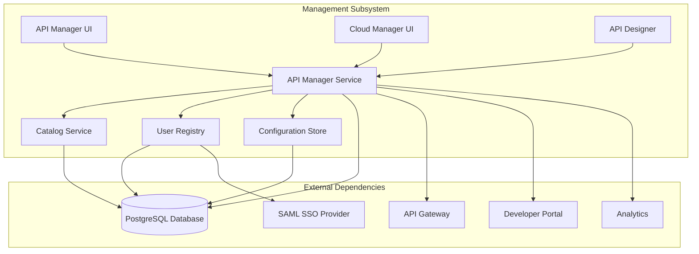
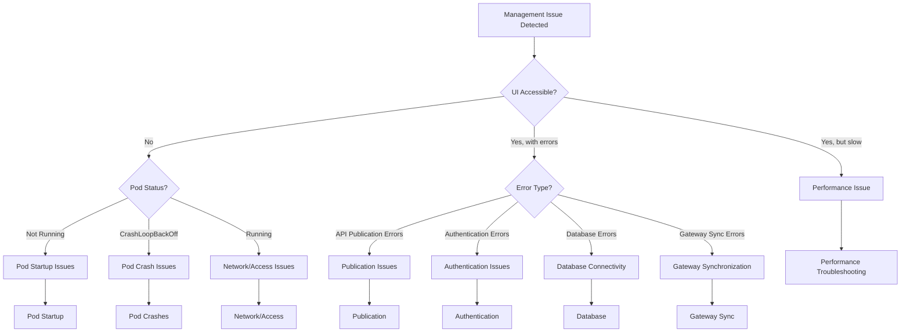
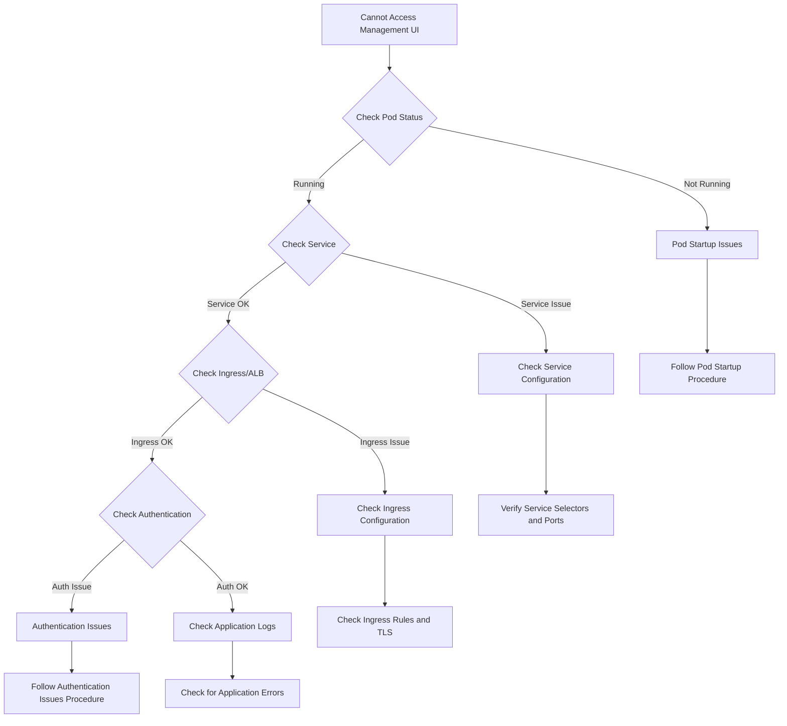
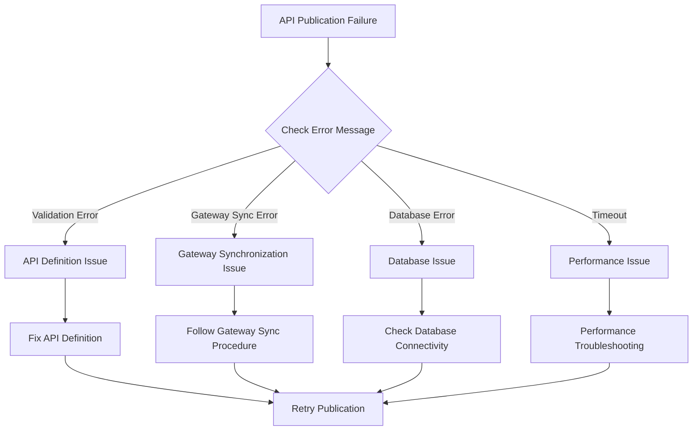

# API Connect Management Runbook

This runbook provides detailed troubleshooting steps and operational procedures for the IBM API Connect Management subsystem deployed on AWS EKS.

## Management Component Overview

The Management subsystem is responsible for the creation, configuration, and lifecycle management of APIs within the API Connect platform. It includes:
- API Manager UI for API design and configuration
- Cloud Manager UI for platform administration
- API Lifecycle management
- Catalog and product management
- Developer organization administration
- API analytics configuration

### Management Architecture

The Management subsystem consists of the following key components:

- **API Manager UI**: Web interface for API development and configuration
- **Cloud Manager UI**: Administrative interface for platform management
- **API Manager Service**: Backend service handling API operations
- **Catalog Service**: Manages API catalogs and products
- **User Registry**: Handles user authentication and authorization
- **Configuration Store**: Maintains platform and API configurations
- **API Designer**: Web-based API design tools

### Key Dependencies



## Diagnostic Decision Tree

Use this decision tree to quickly navigate to the appropriate troubleshooting section:



## Management Subsystem Observability

### Key Metrics to Monitor

| Metric | Description | Warning Threshold | Critical Threshold | Dashboard |
|--------|-------------|-------------------|---------------------|-----------|
| Management.APIPublishCount | API publishing operations | N/A (trend) | N/A (trend) | [Management Dashboard](https://your-tenant.dynatrace.com/management-dashboard) |
| Management.ErrorRate | Percentage of errors | >5% | >10% | [Management Dashboard](https://your-tenant.dynatrace.com/management-dashboard) |
| Management.ResponseTime | UI and API response time (p95) | >2s | >5s | [Management Dashboard](https://your-tenant.dynatrace.com/management-dashboard) |
| Management.DatabaseConnectionCount | Active DB connections | >70% pool | >90% pool | [Management Resources](https://your-tenant.dynatrace.com/management-resources) |
| Management.CPUUtilization | Pod CPU usage | >70% | >85% | [Management Resources](https://your-tenant.dynatrace.com/management-resources) |
| Management.MemoryUtilization | Pod memory usage | >70% | >85% | [Management Resources](https://your-tenant.dynatrace.com/management-resources) |
| Management.PodReplicaCount | Number of running pods | <2 | 0 | [Management Dashboard](https://your-tenant.dynatrace.com/management-dashboard) |
| Management.LoginFailureRate | Failed login attempts | >10/min | >50/min | [Management Security](https://your-tenant.dynatrace.com/management-security) |

### Key Logs to Check

| Log Source | Typical Issues | Access Method | Retention |
|------------|----------------|--------------|-----------|
| Management Application Logs | Errors, warnings, system issues | `kubectl logs -n api-connect -l app=manager -c manager` | 7 days in pods, 30 days in Splunk |
| Management Access Logs | UI access, API operations, timing | `kubectl logs -n api-connect -l app=manager -c manager-access-logs` | 7 days in pods, 90 days in Splunk |
| Management Audit Logs | Security events, config changes | `kubectl logs -n api-connect -l app=manager -c manager-audit` | 7 days in pods, 1 year in Splunk |
| Database Logs | Query failures, connection issues | `kubectl logs -n api-connect [db-pod-name]` or RDS logs | 7 days in pods, 90 days in Splunk |

### Splunk Queries

| Issue | Splunk Query | Dashboard |
|-------|-------------|-----------|
| Management errors | `index=api_connect sourcetype=manager-logs level=ERROR | timechart count by error_code` | [Management Errors](https://splunk.your-company.com/management-errors) |
| API publication failures | `index=api_connect sourcetype=manager-logs "publication failed" OR "deployment error" | stats count by api_name, error_message` | [Publication Issues](https://splunk.your-company.com/publication-issues) |
| Authentication failures | `index=api_connect sourcetype=manager-logs "authentication failed" OR "login failed" | stats count by username, error_message` | [Auth Issues](https://splunk.your-company.com/auth-issues) |
| Slow operations | `index=api_connect sourcetype=manager-access-logs | stats avg(response_time) as avg_resp, p95(response_time) as p95_resp by operation | sort - p95_resp` | [Management Performance](https://splunk.your-company.com/management-performance) |

## Management Pod Startup Issues

### Symptoms
- Management UI is not accessible
- Pods stuck in `Pending` or `ContainerCreating` state
- ServiceNow alerts about Management service unavailability
- Failed login attempts from users

### Diagnostic Steps

1. **Check pod status:**
   ```bash
   kubectl get pods -n api-connect -l app=manager
   ```

2. **Check pod details for pending issues:**
   ```bash
   kubectl describe pod -n api-connect [manager-pod-name]
   ```

3. **Check node resource availability:**
   ```bash
   kubectl describe nodes | grep -A 5 "Allocated resources"
   kubectl top nodes
   ```

4. **Check recent events:**
   ```bash
   kubectl get events -n api-connect --sort-by=.metadata.creationTimestamp | grep manager
   ```

5. **Check persistent volume claims if applicable:**
   ```bash
   kubectl get pvc -n api-connect | grep manager
   kubectl describe pvc -n api-connect [pvc-name]
   ```

### Common Issues and Resolutions

#### Insufficient Resources

**Symptoms:**
- Pod status shows `Pending`
- Events show `FailedScheduling`
- Error mentions insufficient CPU or memory

**Resolution:**
1. Check node resource usage:
   ```bash
   kubectl top nodes
   ```

2. Adjust resource requests if too high:
   ```bash
   kubectl edit deployment -n api-connect manager-deployment
   # Modify resources.requests values
   ```

3. Scale up node group if cluster is at capacity:
   ```bash
   # Check current node group size
   aws eks describe-nodegroup --cluster-name api-connect-cluster --nodegroup-name management-nodes --region us-east-1
   
   # Scale up node group (using console or AWS CLI)
   aws eks update-nodegroup-config --cluster-name api-connect-cluster --nodegroup-name management-nodes --scaling-config desiredSize=4,minSize=2,maxSize=6 --region us-east-1
   ```

#### Image Pull Issues

**Symptoms:**
- Pod status shows `ContainerCreating`
- Events show `ErrImagePull` or `ImagePullBackOff`

**Resolution:**
1. Verify image name and repository access:
   ```bash
   kubectl describe pod -n api-connect [manager-pod-name]
   # Check image name and pull error details
   ```

2. Check registry credentials:
   ```bash
   kubectl get secret -n api-connect registry-credentials
   # Verify the secret exists and is correctly formatted
   ```

3. Update image pull secret if needed:
   ```bash
   kubectl create secret docker-registry registry-credentials \
     --docker-server=your-registry.example.com \
     --docker-username=your-username \
     --docker-password=your-password \
     --docker-email=your-email@example.com \
     -n api-connect \
     --dry-run=client -o yaml | kubectl apply -f -
   ```

#### Database Connection Issues

**Symptoms:**
- Pods start but crash immediately
- Logs show database connection failures
- Events mention readiness probe failures

**Resolution:**
1. Check database connectivity:
   ```bash
   # Get the manager pod name
   MANAGER_POD=$(kubectl get pods -n api-connect -l app=manager -o jsonpath='{.items[0].metadata.name}')
   
   # Test database connection
   kubectl exec -it $MANAGER_POD -n api-connect -- curl -v [db-service]:5432
   ```

2. Check database credentials:
   ```bash
   # Verify the database secret exists
   kubectl get secret -n api-connect manager-db-credentials
   ```

3. Check RDS instance status (if using AWS RDS):
   ```bash
   aws rds describe-db-instances --db-instance-identifier api-connect-db --query 'DBInstances[].DBInstanceStatus' --region us-east-1
   ```

4. If needed, update database credentials:
   ```bash
   kubectl create secret generic manager-db-credentials \
     --from-literal=username=dbuser \
     --from-literal=password=dbpassword \
     -n api-connect \
     --dry-run=client -o yaml | kubectl apply -f -
   ```

## Management Pod Crash Issues

### Symptoms
- Pods in `CrashLoopBackOff` state
- Repeated container restarts
- Management service intermittently available

### Diagnostic Steps

1. **Check pod status and restart count:**
   ```bash
   kubectl get pods -n api-connect -l app=manager
   ```

2. **Check pod events:**
   ```bash
   kubectl describe pod -n api-connect [manager-pod-name]
   ```

3. **Check container logs:**
   ```bash
   # Check current logs
   kubectl logs -n api-connect [manager-pod-name] -c manager
   
   # Check previous container logs if available
   kubectl logs -n api-connect [manager-pod-name] -c manager --previous
   ```

4. **Check resource usage before crash:**
   ```bash
   kubectl top pods -n api-connect
   ```

### Common Issues and Resolutions

#### Configuration Errors

**Symptoms:**
- Logs show configuration parsing errors
- Error messages about invalid properties
- References to missing config elements

**Resolution:**
1. Check the manager configuration:
   ```bash
   kubectl get configmap -n api-connect manager-config -o yaml
   ```

2. Look for syntax errors or invalid values

3. Restore previous configuration if recent change caused the issue:
   ```bash
   # Apply previous known-good config
   kubectl apply -f previous-manager-config.yaml
   ```

4. Restart manager pods:
   ```bash
   kubectl rollout restart deployment -n api-connect manager-deployment
   ```

#### Memory Issues

**Symptoms:**
- Logs show OutOfMemoryError
- Container killed with exit code 137
- Memory usage climbing before crash

**Resolution:**
1. Check memory limits and usage:
   ```bash
   kubectl describe pod -n api-connect [manager-pod-name] | grep -A 3 Limits
   kubectl top pods -n api-connect
   ```

2. Increase memory limits if needed:
   ```bash
   kubectl edit deployment -n api-connect manager-deployment
   # Increase resources.limits.memory value
   ```

3. Check for memory leaks by analyzing heap dumps or monitoring memory growth patterns

4. Implement a regular restart schedule as a temporary measure:
   ```bash
   # Create a Jenkins job that restarts the deployment on a schedule
   # Example Jenkins pipeline step:
   stage('Scheduled Restart') {
     steps {
       sh 'kubectl rollout restart deployment -n api-connect manager-deployment'
     }
   }
   ```

#### Database Connection Pool Exhaustion

**Symptoms:**
- Errors about database connections
- Log messages showing "connection pool exhausted"
- Degraded performance leading to crashes

**Resolution:**
1. Check current connection pool settings:
   ```bash
   kubectl get configmap -n api-connect manager-config -o yaml | grep -A 10 "database"
   ```

2. Increase connection pool size:
   ```bash
   kubectl edit configmap -n api-connect manager-config
   # Modify database connection pool settings
   # Example: increase maxActive, maxIdle values
   ```

3. Check database for long-running queries:
   ```bash
   # If using PostgreSQL, create a temporary debugging pod
   kubectl run -i --tty pg-client --image=postgres --restart=Never --rm -n api-connect -- bash
   
   # Then connect to database
   PGPASSWORD=mypassword psql -h db-hostname -U username -d apic_management
   
   # Check for long running queries
   SELECT pid, now() - pg_stat_activity.query_start AS duration, query FROM pg_stat_activity WHERE state = 'active' ORDER BY duration DESC;
   ```

4. Restart the manager pods to apply configuration changes:
   ```bash
   kubectl rollout restart deployment -n api-connect manager-deployment
   ```

## API Publication Issues

### Symptoms
- Failures when publishing APIs
- APIs stuck in "Pending" state
- Error messages during API deployment
- Gateway not receiving API updates

### Diagnostic Steps

1. **Check API publication status:**
   ```bash
   # Get API publication status (using management pod)
   kubectl exec -n api-connect [manager-pod-name] -- curl -k -H "Accept: application/json" -u admin:password https://localhost:9443/api/publications
   ```

2. **Check gateway synchronization status:**
   ```bash
   # Check synchronization status
   kubectl exec -n api-connect [manager-pod-name] -- curl -k -H "Accept: application/json" -u admin:password https://localhost:9443/api/gateway/sync/status
   ```

3. **Check manager logs for publication errors:**
   ```bash
   kubectl logs -n api-connect -l app=manager | grep -i "publication\|deploy\|gateway sync"
   ```

4. **Check gateway logs for synchronization issues:**
   ```bash
   kubectl logs -n api-connect -l app=gateway | grep -i "sync\|configuration"
   ```

### Common Issues and Resolutions

#### Gateway Synchronization Failures

**Symptoms:**
- Publication succeeds but gateway doesn't reflect changes
- Errors about "gateway synchronization failed"
- Gateway configuration mismatch

**Resolution:**
1. Check gateway connectivity from management:
   ```bash
   # Get management pod name
   MANAGER_POD=$(kubectl get pods -n api-connect -l app=manager -o jsonpath='{.items[0].metadata.name}')
   
   # Test connectivity to gateway
   kubectl exec -it $MANAGER_POD -n api-connect -- curl -k https://gateway-service:9443/health
   ```

2. Check gateway credentials:
   ```bash
   kubectl get secret -n api-connect gateway-sync-credentials -o yaml
   # Verify credentials are properly set
   ```

3. Force gateway synchronization:
   ```bash
   # Force sync from management pod
   kubectl exec -n api-connect $MANAGER_POD -- curl -k -X POST -H "Content-Type: application/json" -u admin:password https://localhost:9443/api/gateway/sync
   ```

4. Restart gateway pods if needed:
   ```bash
   kubectl rollout restart deployment -n api-connect gateway-deployment
   ```

#### Invalid API Definitions

**Symptoms:**
- API validation errors during publication
- Specific error messages about API definition
- Publication fails at validation step

**Resolution:**
1. Check API validation errors:
   ```bash
   # Review the logs for validation errors
   kubectl logs -n api-connect -l app=manager | grep -i "validation\|invalid"
   ```

2. Export the API definition for analysis:
   ```bash
   # Export API definition for review
   kubectl exec -n api-connect $MANAGER_POD -- curl -k -H "Accept: application/yaml" -u admin:password "https://localhost:9443/api/apis/[api-id]" > api-definition.yaml
   ```

3. Correct API definition issues in API Manager UI

4. Retry publication after fixes

#### Database Transaction Issues

**Symptoms:**
- Transaction timeout errors
- Database deadlocks
- Publication times out

**Resolution:**
1. Check database performance:
   ```bash
   # If using RDS, check performance insights
   aws rds describe-db-instances --db-instance-identifier api-connect-db --region us-east-1
   ```

2. Check for long-running transactions:
   ```bash
   # Connect to database and check for blocking sessions
   # Example PostgreSQL query
   SELECT blocked_locks.pid AS blocked_pid,
          blocking_locks.pid AS blocking_pid,
          blocked_activity.usename AS blocked_user,
          blocking_activity.usename AS blocking_user,
          now() - blocked_activity.query_start AS blocked_duration
   FROM pg_catalog.pg_locks blocked_locks
   JOIN pg_catalog.pg_stat_activity blocked_activity ON blocked_locks.pid = blocked_activity.pid
   JOIN pg_catalog.pg_locks blocking_locks ON blocked_locks.locktype = blocking_locks.locktype
     AND blocked_locks.database IS NOT DISTINCT FROM blocking_locks.database
     AND blocked_locks.relation IS NOT DISTINCT FROM blocking_locks.relation
     AND blocked_locks.page IS NOT DISTINCT FROM blocking_locks.page
     AND blocked_locks.tuple IS NOT DISTINCT FROM blocking_locks.tuple
     AND blocked_locks.virtualxid IS NOT DISTINCT FROM blocking_locks.virtualxid
     AND blocked_locks.transactionid IS NOT DISTINCT FROM blocking_locks.transactionid
     AND blocked_locks.classid IS NOT DISTINCT FROM blocking_locks.classid
     AND blocked_locks.objid IS NOT DISTINCT FROM blocking_locks.objid
     AND blocked_locks.objsubid IS NOT DISTINCT FROM blocking_locks.objsubid
     AND blocked_locks.pid != blocking_locks.pid
   JOIN pg_catalog.pg_stat_activity blocking_activity ON blocking_locks.pid = blocking_activity.pid
   WHERE NOT blocked_locks.granted;
   ```

3. Adjust database transaction timeout in configuration:
   ```bash
   kubectl edit configmap -n api-connect manager-config
   # Modify database.transactionTimeout parameter
   ```

4. Restart manager pod to apply config changes:
   ```bash
   kubectl rollout restart deployment -n api-connect manager-deployment
   ```

## Authentication Issues

### Symptoms
- Users unable to log in to API Manager or Cloud Manager
- Authentication errors in logs
- SSO integration failing
- Session timeouts or premature logouts

### Diagnostic Steps

1. **Check authentication configuration:**
   ```bash
   kubectl get configmap -n api-connect manager-auth-config -o yaml
   ```

2. **Check user registry status:**
   ```bash
   # Get current user registry status
   kubectl exec -n api-connect [manager-pod-name] -- curl -k -H "Accept: application/json" -u admin:password https://localhost:9443/api/user-registry/status
   ```

3. **Check authentication logs:**
   ```bash
   kubectl logs -n api-connect -l app=manager | grep -i "authentication\|login\|user\|sso\|saml"
   ```

4. **Verify SSO provider connectivity (if using SSO):**
   ```bash
   # Test network connectivity to SSO provider
   kubectl exec -it -n api-connect [manager-pod-name] -- curl -kv [sso-provider-url]
   ```

### Common Issues and Resolutions

#### SAML Integration Issues

**Symptoms:**
- SSO login attempts failing
- SAML assertion validation errors
- SAML metadata issues

**Resolution:**
1. Verify SAML metadata configuration:
   ```bash
   kubectl get configmap -n api-connect saml-config -o yaml
   # Check for metadata URL or inline metadata
   ```

2. Test SAML metadata URL accessibility:
   ```bash
   kubectl exec -it -n api-connect [manager-pod-name] -- curl -kv [saml-metadata-url]
   ```

3. Update SAML metadata if needed:
   ```bash
   # Update SAML metadata configmap
   kubectl create configmap saml-config --from-file=metadata.xml -n api-connect --dry-run=client -o yaml | kubectl apply -f -
   ```

4. Restart manager pods to apply changes:
   ```bash
   kubectl rollout restart deployment -n api-connect manager-deployment
   ```

#### User Registry Sync Issues

**Symptoms:**
- Users missing from API Connect
- Group membership issues
- Auth provider sync failures

**Resolution:**
1. Check user registry sync status:
   ```bash
   kubectl exec -n api-connect [manager-pod-name] -- curl -k -H "Accept: application/json" -u admin:password https://localhost:9443/api/user-registry/sync/status
   ```

2. Force user registry synchronization:
   ```bash
   kubectl exec -n api-connect [manager-pod-name] -- curl -k -X POST -H "Content-Type: application/json" -u admin:password https://localhost:9443/api/user-registry/sync
   ```

3. Check synchronization logs:
   ```bash
   kubectl logs -n api-connect -l app=manager -c manager | grep -i "user-registry\|sync"
   ```

4. Update user registry configuration if needed:
   ```bash
   kubectl edit configmap -n api-connect user-registry-config
   # Modify user registry connection settings if needed
   ```

#### Session Management Issues

**Symptoms:**
- Users get logged out frequently
- Session timeout errors
- "Session invalid" messages

**Resolution:**
1. Check session configuration:
   ```bash
   kubectl get configmap -n api-connect manager-config -o yaml | grep -A 10 "session"
   ```

2. Adjust session timeout settings:
   ```bash
   kubectl edit configmap -n api-connect manager-config
   # Modify session.timeout parameter (in minutes)
   ```

3. Restart manager pods to apply changes:
   ```bash
   kubectl rollout restart deployment -n api-connect manager-deployment
   ```

## Management Performance Issues

### Symptoms
- Slow UI response time
- API operations taking longer than expected
- Timeouts during API operations
- High resource utilization

### Diagnostic Steps

1. **Check resource utilization:**
   ```bash
   kubectl top pods -n api-connect -l app=manager
   ```

2. **Monitor response times:**
   ```bash
   # Check access logs for response times
   kubectl logs -n api-connect -l app=manager -c manager-access-logs | awk '{print $NF}' | sort -n | uniq -c
   ```

3. **Check database performance:**
   ```bash
   # If using RDS, check performance insights
   aws cloudwatch get-metric-data --metric-data-queries '[{"Id":"cpu","MetricStat":{"Metric":{"Namespace":"AWS/RDS","MetricName":"CPUUtilization","Dimensions":[{"Name":"DBInstanceIdentifier","Value":"api-connect-db"}]},"Period":60,"Stat":"Average"}}]' --start-time $(date -u -d "30 minutes ago" +%Y-%m-%dT%H:%M:%SZ) --end-time $(date -u +%Y-%m-%dT%H:%M:%SZ) --region us-east-1
   ```

4. **Look for slow queries:**
   ```bash
   # If using RDS with performance insights
   aws pi get-resource-metrics --service-type RDS --identifier db-ABCDEFGHIJK123 --metric-queries '[{"Metric":"db.load.avg","GroupBy":{"Group":"db.sql","Limit":10}}]' --start-time $(date -u -d "30 minutes ago" +%Y-%m-%dT%H:%M:%SZ) --end-time $(date -u +%Y-%m-%dT%H:%M:%SZ) --region us-east-1
   ```

### Common Issues and Resolutions

#### Resource Constraints

**Symptoms:**
- High CPU or memory utilization
- Increasing response times
- Garbage collection pauses

**Resolution:**
1. Analyze resource usage:
   ```bash
   kubectl top pods -n api-connect -l app=manager
   ```

2. Scale horizontally if needed:
   ```bash
   kubectl scale deployment -n api-connect manager-deployment --replicas=[current+1]
   ```

3. Adjust resource limits:
   ```bash
   kubectl edit deployment -n api-connect manager-deployment
   # Increase resources.limits values
   ```

4. Enable or tune horizontal pod autoscaling:
   ```bash
   kubectl get hpa -n api-connect
   kubectl edit hpa -n api-connect manager-hpa
   # Adjust minReplicas, maxReplicas, and targetCPUUtilizationPercentage
   ```

#### Slow Database Queries

**Symptoms:**
- Database-related operations taking long time
- High DB CPU utilization
- Long-running queries

**Resolution:**
1. Identify slow queries:
   ```bash
   # For PostgreSQL, create a debugging pod
   kubectl run -i --tty pg-client --image=postgres --restart=Never --rm -n api-connect -- bash
   
   # Connect to database
   PGPASSWORD=mypassword psql -h db-hostname -U username -d apic_management
   
   # Check for slow queries
   SELECT pid, now() - pg_stat_activity.query_start AS duration, query 
   FROM pg_stat_activity 
   WHERE state = 'active' AND now() - pg_stat_activity.query_start > interval '30 seconds'
   ORDER BY duration DESC;
   ```

2. Optimize database:
   ```bash
   # Run VACUUM ANALYZE to update statistics
   PGPASSWORD=mypassword psql -h db-hostname -U username -d apic_management -c "VACUUM ANALYZE;"
   
   # Check for missing indices
   # Look at queries identified as slow and add appropriate indices
   CREATE INDEX idx_name ON table_name(column_name);
   ```

3. Adjust database connection pool settings:
   ```bash
   kubectl edit configmap -n api-connect manager-config
   # Modify database connection pool settings for optimal performance
   ```

#### Cache Configuration Issues

**Symptoms:**
- Repeated slow operations that should be cached
- Higher than expected database load
- Cache miss logs

**Resolution:**
1. Check cache configuration:
   ```bash
   kubectl get configmap -n api-connect manager-config -o yaml | grep -A 20 "cache"
   ```

2. Optimize cache settings:
   ```bash
   kubectl edit configmap -n api-connect manager-config
   # Adjust cache size, TTL, etc.
   ```

3. Implement or tune Redis cache (if used):
   ```bash
   # Check Redis status
   kubectl get pods -n api-connect -l app=redis
   kubectl exec -it -n api-connect [redis-pod-name] -- redis-cli info | grep used_memory
   
   # Increase Redis resources if needed
   kubectl edit deployment -n api-connect redis-deployment
   # Adjust resource limits
   ```

4. Restart manager pods to apply cache changes:
   ```bash
   kubectl rollout restart deployment -n api-connect manager-deployment
   ```

## Backup and Restore Procedures

### Database Backup

1. **Automated RDS Snapshots:**
   ```bash
   # Create manual RDS snapshot
   aws rds create-db-snapshot --db-instance-identifier api-connect-db --db-snapshot-identifier manual-backup-$(date +%Y%m%d) --region us-east-1
   
   # List available snapshots
   aws rds describe-db-snapshots --db-instance-identifier api-connect-db --region us-east-1
   ```

2. **Manual Database Dumps:**
   ```bash
   # Create a backup job
   kubectl create job --from=cronjob/db-backup manual-backup -n api-connect
   
   # Check backup job status
   kubectl get jobs -n api-connect
   
   # Verify backup in S3
   aws s3 ls s3://api-connect-backups/database/ | grep $(date +%Y-%m-%d)
   ```

### Configuration Backup

1. **Backup API Connect configuration:**
   ```bash
   # Create a configuration backup
   kubectl exec -n api-connect [manager-pod-name] -- curl -k -X POST -H "Content-Type: application/json" -u admin:password https://localhost:9443/api/backups
   
   # List available backups
   kubectl exec -n api-connect [manager-pod-name] -- curl -k -H "Accept: application/json" -u admin:password https://localhost:9443/api/backups
   
   # Download a specific backup
   kubectl exec -n api-connect [manager-pod-name] -- curl -k -H "Accept: application/octet-stream" -u admin:password https://localhost:9443/api/backups/[backup-id] > apic-backup.zip
   ```

2. **Kubernetes resource backup:**
   ```bash
   # Use Jenkins job to backup Kubernetes resources
   # Example Jenkins pipeline step:
   stage('Backup K8s Resources') {
     steps {
       sh ```
         mkdir -p k8s-backup
         kubectl get configmap -n api-connect -o yaml > k8s-backup/configmaps.yaml
         kubectl get secret -n api-connect -o yaml > k8s-backup/secrets.yaml
         kubectl get deployment -n api-connect -o yaml > k8s-backup/deployments.yaml
         aws s3 cp k8s-backup s3://api-connect-backups/kubernetes/$(date +%Y-%m-%d)/ --recursive
       ```
     }
   }
   ```

### Restore Procedures

1. **Database Restore:**
   ```bash
   # Restore from RDS snapshot
   aws rds restore-db-instance-from-db-snapshot \
     --db-instance-identifier api-connect-db-restored \
     --db-snapshot-identifier [snapshot-id] \
     --region us-east-1
   
   # Then update application to point to restored database
   kubectl edit configmap -n api-connect manager-config
   # Update database connection information
   ```

2. **Configuration Restore:**
   ```bash
   # Upload backup file to manager pod
   kubectl cp apic-backup.zip api-connect/[manager-pod-name]:/tmp/
   
   # Restore from backup
   kubectl exec -n api-connect [manager-pod-name] -- curl -k -X POST -F "file=@/tmp/apic-backup.zip" -u admin:password https://localhost:9443/api/restore
   
   # Verify restore completed
   kubectl logs -n api-connect [manager-pod-name] | grep -i "restore"
   ```

## Environment-Specific Considerations

### Development Environment

- **Configuration**: Simplified configuration, may lack high availability
- **Resources**: Lower resource limits to reduce costs
- **Data**: Test data, frequent resets may occur
- **Authentication**: May use basic auth instead of SSO for simplicity
- **Access**: More permissive access control

**Special Commands for Development:**
```bash
# Enable debug logging
kubectl annotate pods -n api-connect [manager-pod-name] "debug=true" --overwrite

# View debug logs
kubectl logs -n api-connect [manager-pod-name] -c manager --tail=100

# Reset development database
kubectl exec -n api-connect [manager-pod-name] -- curl -k -X POST -H "Content-Type: application/json" -u admin:password https://localhost:9443/api/reset-development
```

### Testing Environment

- **Test Automation**: Integration with CI/CD pipelines
- **Load Testing**: May experience performance issues during tests
- **Configuration**: Similar to production but with test-specific settings
- **Instability**: Expected during test execution windows
- **Reset Policy**: Weekly resets may be scheduled

**Special Commands for Testing:**
```bash
# Check test execution status
kubectl get pods -n api-connect -l app=test-runner

# Trigger specific test suite
kubectl create job --from=cronjob/integration-tests manual-test-run -n api-connect

# Get test results
kubectl logs -n api-connect -l job-name=manual-test-run
```

### Staging Environment

- **Pre-release Validation**: Used for final validation before production
- **Configuration**: Production-like configuration
- **Performance Testing**: Regular performance testing occurs here
- **Data Sync**: May contain sanitized copy of production data
- **Deployment Gate**: Successful staging deployment required before production

**Special Commands for Staging:**
```bash
# Validate configuration against production
kubectl diff -f staging-vs-prod.yaml

# Perform pre-production checks
kubectl exec -n api-connect [manager-pod-name] -- curl -k -X POST -H "Content-Type: application/json" -u admin:password https://localhost:9443/api/preproduction-validation

# Generate synthetic load for testing
kubectl create job --from=cronjob/performance-test perf-test-run -n api-connect
```

### Production Environment

- **High Availability**: Multiple replicas across zones
- **Resource Isolation**: Dedicated node groups
- **Strict Security**: All security policies enforced
- **Change Control**: Strict change management process
- **Monitoring**: Comprehensive monitoring and alerting

**Special Commands for Production:**
```bash
# Enable temporary debug logging (requires approval)
kubectl annotate pods -n api-connect [manager-pod-name] "debug=true" "debug-ttl=30m" --overwrite

# Check custom metrics
kubectl get --raw "/apis/custom.metrics.k8s.io/v1beta1/namespaces/api-connect/pods/*/manager_operation_count" | jq

# Perform rolling restart outside business hours
kubectl rollout restart deployment -n api-connect manager-deployment
```

### DR Environment

- **Synchronization**: Regular sync from production
- **Validation**: Regular testing to ensure readiness
- **Activation**: Only activated during DR scenarios
- **Configuration**: Match production but with DR-specific endpoints
- **Testing**: Periodic DR drills to ensure preparedness

**Special Commands for DR:**
```bash
# Check replication status
kubectl exec -n api-connect [manager-pod-name] -- curl -k -H "Accept: application/json" -u admin:password https://localhost:9443/api/replication/status

# Verify DR readiness
kubectl exec -n api-connect [manager-pod-name] -- curl -k -X POST -H "Content-Type: application/json" -u admin:password https://localhost:9443/api/dr-validation

# Activate DR (emergency only)
kubectl exec -n api-connect [manager-pod-name] -- curl -k -X POST -H "Content-Type: application/json" -u admin:password https://localhost:9443/api/dr-activate
```

## Routine Maintenance Procedures

### Daily Checks

| Check | Command | Expected Outcome | Action if Failed |
|-------|---------|------------------|------------------|
| Pod Health | `kubectl get pods -n api-connect -l app=manager` | All pods Running | Follow [Pod Crash Issues](#management-pod-crash-issues) |
| Recent Errors | `kubectl logs -n api-connect -l app=manager --since=24h | grep -i error | wc -l` | Low error count | Investigate logs if high error count |
| API Publication Status | `kubectl exec -n api-connect [manager-pod-name] -- curl -k -H "Accept: application/json" -u admin:password https://localhost:9443/api/publications/status` | All successful | Follow [API Publication Issues](#api-publication-issues) |
| Database Connections | `kubectl exec -n api-connect [manager-pod-name] -- curl -k -H "Accept: application/json" -u admin:password https://localhost:9443/api/database/status` | Connections healthy | Follow [Database Connection Issues](#database-connection-issues) |

### Weekly Maintenance

| Task | Procedure | Automation Status |
|------|-----------|------------------|
| Log Cleanup | Clean up old logs to prevent disk space issues | Automated via CronJob |
| Configuration Backup | Create weekly configuration backup | Automated via Jenkins |
| Performance Review | Review performance metrics, identify trends | Manual with dashboard |
| Resource Scaling Review | Check if resources need adjustment | Manual with recommendations |

```bash
# Jenkins job for weekly maintenance
// Example Jenkins pipeline
pipeline {
    agent any
    stages {
        stage('Log Cleanup') {
            steps {
                sh 'kubectl exec -n api-connect [manager-pod-name] -- curl -k -X POST -H "Content-Type: application/json" -u admin:password https://localhost:9443/api/maintenance/logs/cleanup'
            }
        }
        stage('Configuration Backup') {
            steps {
                sh 'kubectl exec -n api-connect [manager-pod-name] -- curl -k -X POST -H "Content-Type: application/json" -u admin:password https://localhost:9443/api/backups'
            }
        }
        stage('Performance Report') {
            steps {
                sh 'python3 generate_performance_report.py'
            }
        }
    }
}
```

### Monthly Maintenance

| Task | Procedure | Automation Status |
|------|-----------|------------------|
| Database Optimization | VACUUM ANALYZE, index rebuild | Automated via Jenkins |
| Security Review | Review access logs, role assignments | Partially automated |
| Configuration Audit | Verify configuration against baseline | Automated with reports |
| Capacity Planning | Review growth trends, plan scaling | Manual with data support |

### Certificate Rotation

```bash
# Check certificate expiry
kubectl exec -n api-connect [manager-pod-name] -- curl -k -H "Accept: application/json" -u admin:password https://localhost:9443/api/certificates/expiry

# Generate new certificate
openssl req -x509 -nodes -days 365 -newkey rsa:2048 -keyout tls.key -out tls.crt -subj "/CN=api-manager.example.com"

# Update certificate in Kubernetes
kubectl create secret tls manager-tls --key tls.key --cert tls.crt -n api-connect --dry-run=client -o yaml | kubectl apply -f -

# Restart to apply new certificate
kubectl rollout restart deployment -n api-connect manager-deployment
```

## Troubleshooting Reference

### Common Error Messages and Resolutions

| Error Message | Likely Cause | Resolution |
|---------------|--------------|------------|
| `Failed to connect to database` | Database connectivity issues | Check database health, credentials, network |
| `Failed to synchronize with gateway` | Gateway connectivity or auth issues | Verify gateway is running, check credentials |
| `Transaction timeout` | Long-running database operation | Increase timeout, optimize query, check DB performance |
| `Failed to publish API` | Various publication issues | Check specific error message, follow [API Publication Issues](#api-publication-issues) |
| `Authentication failed` | User registry or SSO issues | Follow [Authentication Issues](#authentication-issues) |
| `Out of memory error` | Resource constraints | Increase memory limits, check for memory leaks |
| `Certificate validation failed` | TLS/certificate issues | Check certificate validity, update if expired |

### Useful Commands Reference

```bash
# Get management pod status
kubectl get pods -n api-connect -l app=manager

# Check logs for errors
kubectl logs -n api-connect -l app=manager | grep -i error

# Get recent events
kubectl get events -n api-connect --sort-by=.metadata.creationTimestamp

# Check resource usage
kubectl top pods -n api-connect -l app=manager

# Describe pod for detailed status
kubectl describe pod -n api-connect [manager-pod-name]

# Check configmaps
kubectl get configmap -n api-connect -l app=manager

# Get service status
kubectl get svc -n api-connect -l app=manager

# Test API manager endpoint
kubectl exec -it -n api-connect [any-pod] -- curl -k https://manager-service:9443/health

# Check database connectivity
kubectl exec -it -n api-connect [manager-pod-name] -- curl -v [db-service]:5432

# Force configuration reload
kubectl exec -n api-connect [manager-pod-name] -- curl -k -X POST -H "Content-Type: application/json" -u admin:password https://localhost:9443/api/config/reload
```

### Common Troubleshooting Flows

#### Cannot Access Management UI



#### API Publication Failure



## Reference Information

### Related Documentation

- [Main Runbook](Main-Runbook) - Main platform runbook
- [Gateway Runbook](Gateway-Runbook) - Gateway component runbook
- [Database Runbook](Database-Runbook) - Database management procedures
- [Incident Management](Incident-Management) - Incident response procedures
- [Architecture](Architecture) - Platform architecture documentation
- [Observability](Observability) - Monitoring and observability details
- [IBM API Connect Documentation](https://www.ibm.com/docs/en/api-connect)

### Contact Information

| Role | Contact | Availability |
|------|---------|--------------|
| API Connect SRE Team | api-connect-sre@your-company.com | 24/7 via Teams |
| Database Team | db-support@your-company.com | Business hours + on-call |
| Network Team | network-support@your-company.com | Business hours + on-call |
| IBM Support | IBM Support Portal (Case #IBM-12345) | 24/7 with support contract |
| AWS Support | AWS Support Portal (Account #AWS-67890) | 24/7 with support contract |
