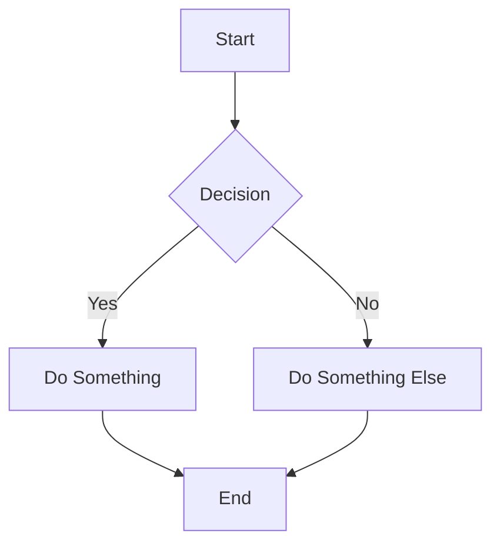
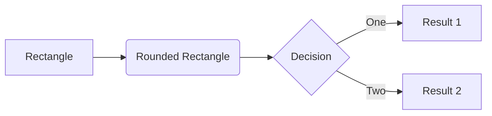
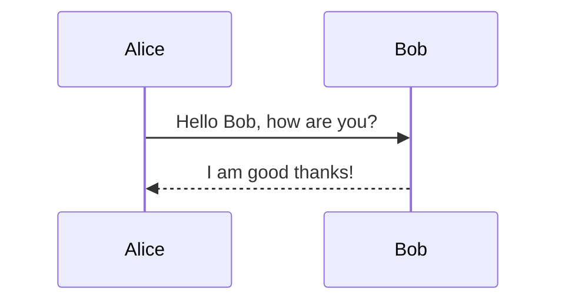
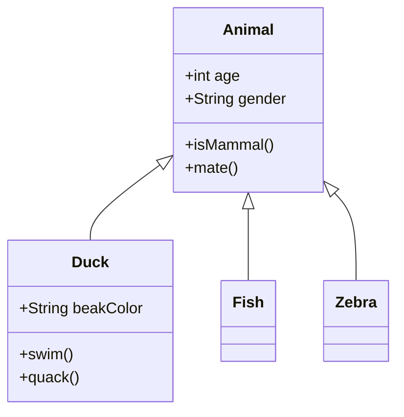
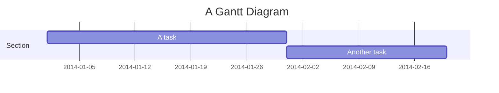

# Markdown Cheat Sheet

A quick reference guide for Markdown syntax used in GitHub wikis.

## Basic Syntax

### Headings

```
# Heading 1
## Heading 2
### Heading 3
#### Heading 4
##### Heading 5
###### Heading 6
```

### Text Formatting

```
**Bold text**
*Italic text*
***Bold and italic text***
~~Strikethrough text~~
```

**Bold text**  
*Italic text*  
***Bold and italic text***  
~~Strikethrough text~~

### Line Breaks and Paragraphs

```
This is line one.
This is still line one without line break.

This is a new paragraph.

This is line one again.  
This is line two with line break (use two spaces at end of previous line).
```

### Lists

#### Unordered Lists

```
- Item 1
- Item 2
  - Nested item 2.1
  - Nested item 2.2
- Item 3
```

- Item 1
- Item 2
  - Nested item 2.1
  - Nested item 2.2
- Item 3

#### Ordered Lists

```
1. First item
2. Second item
   1. Nested item 2.1
   2. Nested item 2.2
3. Third item
```

### Blockquotes

```
> This is a blockquote
> 
> > This is a nested blockquote
```

> This is a blockquote
> 
> > This is a nested blockquote

### Horizontal Rule

```
---
```

---

## Links and Images

### Links

```
[Link text](URL)
[Link with title](URL "Title")
<https://automatic-link.com>
```

### Reference Links

```
[Reference link][ref]

[ref]: https://example.com
```

### Images

```


```

### Reference Images

```
![Alt text][image-id]

[image-id]: URL
```

## Code

### Inline Code

```
Use `code` in a sentence
```

Use `code` in a sentence

### Code Blocks

````
```
Code block
without syntax highlighting
```

```python
def hello_world():
    print("Hello, world!")
```

```javascript
function helloWorld() {
    console.log("Hello, world!");
}
```
````

## Tables

```
| Header 1 | Header 2 | Header 3 |
|----------|----------|----------|
| Cell 1   | Cell 2   | Cell 3   |
| Cell 4   | Cell 5   | Cell 6   |
```

| Header 1 | Header 2 | Header 3 |
|----------|----------|----------|
| Cell 1   | Cell 2   | Cell 3   |
| Cell 4   | Cell 5   | Cell 6   |

### Text Alignment in Tables

```
| Left-aligned | Center-aligned | Right-aligned |
|:-------------|:--------------:|---------------:|
| Cell 1       | Cell 2         | Cell 3         |
| Cell 4       | Cell 5         | Cell 6         |
```

## GitHub Specific Markdown

### Task Lists

```
- [x] Completed task
- [ ] Uncompleted task
- [ ] \(Parentheses) escaped with backslash
```

### Username Mentions

```
@username
```

### Issue/PR References

```
#123
username/repository#123
```

### Emoji

```
:emoji_name:
:smile: :heart: :thumbsup:
```

## Mermaid Diagrams

GitHub wikis support Mermaid diagrams. Use the following syntax:

````

````

### Mermaid Flowchart

````

````

### Mermaid Sequence Diagram

````

````

### Mermaid Class Diagram

````

````

### Mermaid Gantt Chart

````

````

## Advanced Features

### Footnotes (not supported in all Markdown flavors)

```
Here's a sentence with a footnote[^1].

[^1]: This is the footnote content.
```

### Definition Lists (not supported in all Markdown flavors)

```
Term
: Definition
```

### Escaping Markdown

```
\*This text is not in italics\*
\# This is not a heading
```

\*This text is not in italics\*  
\# This is not a heading

## Collapsible Sections (GitHub specific)

```
<details>
  <summary>Click to expand</summary>
  
  Expanded content goes here...
  
  Note: Empty line after summary tag is required.
</details>
```

<details>
  <summary>Click to expand</summary>
  
  Expanded content goes here...
  
  Note: Empty line after summary tag is required.
</details>

## Tips and Best Practices

1. **Line Breaks**: Two spaces at the end of a line create a line break
2. **Code Block Languages**: Specify the language for proper syntax highlighting
3. **Tables**: Use [Table Generator](https://www.tablesgenerator.com/markdown_tables) for complex tables
4. **Escaping**: Use backslash (\\) to escape Markdown characters
5. **Headings**: Leave a space after the # for proper rendering
6. **Keep it Simple**: Don't over-format; use Markdown for clarity
7. **Preview**: Always preview your Markdown before committing to catch formatting issues

## References

- [GitHub Markdown Documentation](https://docs.github.com/en/github/writing-on-github/getting-started-with-writing-and-formatting-on-github/basic-writing-and-formatting-syntax)
- [GitHub Flavored Markdown Spec](https://github.github.com/gfm/)
- [Mermaid Documentation](https://mermaid-js.github.io/mermaid/#/)