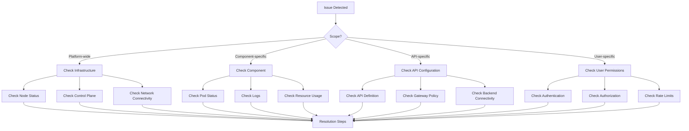

# API Connect Operations Runbook

This runbook provides detailed operational procedures for the IBM API Connect platform deployed on AWS EKS. It covers day-to-day operations, monitoring, troubleshooting, and routine tasks to maintain platform health and performance.

## Operations Overview

The API Connect platform requires continuous operational management to ensure optimal performance, reliability, and security. This runbook outlines standard operational procedures for the SRE team.

### Operational Principles

- **Consistency**: Use standardized procedures across environments
- **Proactive Management**: Identify and address issues before they impact users
- **Automation**: Automate routine tasks whenever possible
- **Documentation**: Keep documentation current with operational changes
- **Continuous Improvement**: Regularly review and enhance operational procedures

### Operational Responsibilities

```mermaid
graph TD
    A[SRE Operations Team] --> B[Platform Health]
    A --> C[Performance Management]
    A --> D[Capacity Planning]
    A --> E[Security Operations]
    A --> F[User Management]
    A --> G[Continuous Improvement]
    
    B --> B1[Daily Health Checks]
    B --> B2[Incident Response]
    B --> B3[Backup Management]
    
    C --> C1[Performance Monitoring]
    C --> C2[Performance Tuning]
    C --> C3[Bottleneck Identification]
    
    D --> D1[Resource Monitoring]
    D --> D2[Scaling Operations]
    D --> D3[Capacity Forecasting]
    
    E --> E1[Access Management]
    E --> E2[Security Monitoring]
    E --> E3[Vulnerability Management]
    
    F --> F1[User Onboarding]
    F --> F2[Permission Management]
    F --> F3[Organization Management]
    
    G --> G1[Process Improvement]
    G --> G2[Automation Enhancement]
    G --> G3[Knowledge Transfer]
```



## Daily Operations

### Morning Checklist

| Task | Description | Tool/Command | Expected Result |
|------|-------------|--------------|----------------|
| Infrastructure Health | Verify all nodes and services are healthy | Dynatrace dashboard, `kubectl get nodes,pods -A` | All nodes Ready, all pods Running |
| API Gateway Check | Verify gateway services operational | Gateway endpoint test, metrics | 2XX responses, normal traffic patterns |
| Alert Review | Review any overnight alerts | Dynatrace, ServiceNow | All alerts triaged |
| Backup Verification | Verify backups completed successfully | AWS Console, backup logs | Successful backup completion |
| Security Events | Review security events and logs | Splunk, CloudTrail | No unexpected security events |
| Service Level Check | Verify SLOs are being met | Dynatrace SLO dashboard | All SLOs within targets |

#### Morning Checklist Procedure

1. **Infrastructure Health Check:**
   ```bash
   # Check node status
   kubectl get nodes
   
   # Check for problematic pods
   kubectl get pods -A | grep -v "Running\|Completed"
   
   # Check resource utilization
   kubectl top nodes
   kubectl top pods -A | sort -k2 -nr | head -10
   ```

2. **API Gateway Check:**
   ```bash
   # Test gateway health
   curl -k https://api-gateway.example.com/health
   
   # Check error rates
   # Use Dynatrace query or Splunk dashboard
   ```

3. **Alert Review:**
   - Review Dynatrace problems dashboard: https://your-tenant.dynatrace.com/problems
   - Check ServiceNow for overnight tickets: https://your-instance.service-now.com/incident_list.do?sysparm_query=assignment_group=api-connect^active=true
   - Check Microsoft Teams channel #api-connect-alerts for notifications

4. **Backup Verification:**
   ```bash
   # Check RDS automated backups
   aws rds describe-db-snapshots --db-instance-identifier api-connect-db --snapshot-type automated --region us-east-1 --query "DBSnapshots[?SnapshotCreateTime>='$(date -d "yesterday" +%Y-%m-%d)'].{ID:DBSnapshotIdentifier,Time:SnapshotCreateTime,Status:Status}" --output table
   
   # Check S3 backup job status
   aws s3 ls s3://api-connect-backups/$(date -d "yesterday" +%Y-%m-%d)/
   ```

5. **Security Events Review:**
   - Check Splunk security dashboard: https://splunk.your-company.com/en-US/app/search/security_events
   - Review failed login attempts and access violations
   
6. **Service Level Check:**
   - Review SLO dashboard in Dynatrace: https://your-tenant.dynatrace.com/slo-dashboard
   - Check for any services approaching breach of SLO

### Evening Checklist

| Task | Description | Tool/Command | Expected Result |
|------|-------------|--------------|----------------|
| End-of-Day Health Check | Verify system health at end of day | Dynatrace dashboard, kubectl | All systems healthy |
| Resource Utilization Review | Check for resource constraints | Dynatrace, CloudWatch | All resources within thresholds |
| Pending Ticket Review | Check for unresolved tickets | ServiceNow | All P1/P2 issues resolved |
| CI/CD Pipeline Status | Verify build pipelines are healthy | Jenkins | All pipelines green |
| Scheduled Jobs Check | Verify scheduled jobs completed | Jenkins, Kubernetes CronJobs | All jobs completed successfully |
| On-Call Handover | Brief next on-call engineer | Microsoft Teams | Handover completed |

#### Evening Checklist Procedure

1. **End-of-Day Health Check:**
   ```bash
   # Check overall system health
   kubectl get nodes,deployment,statefulset,svc -n api-connect
   
   # Check for any recent events
   kubectl get events -n api-connect --sort-by=.metadata.creationTimestamp | tail -20
   ```

2. **Resource Utilization Review:**
   ```bash
   # Check highest CPU/memory consumers
   kubectl top pods -n api-connect
   
   # Check for pods approaching resource limits
   kubectl get pods -n api-connect -o json | jq '.items[] | {name: .metadata.name, requests: .spec.containers[].resources.requests, limits: .spec.containers[].resources.limits, usage: ""}'
   ```

3. **Pending Ticket Review:**
   - Check ServiceNow for unresolved tickets: https://your-instance.service-now.com/incident_list.do?sysparm_query=assignment_group=api-connect^active=true
   - Escalate or reassign any tickets requiring attention

4. **CI/CD Pipeline Status:**
   - Check Jenkins build status: https://jenkins.your-company.com/job/api-connect/
   - Investigate and resolve any failed builds

5. **Scheduled Jobs Check:**
   ```bash
   # Check CronJob executions
   kubectl get cronjobs -n api-connect
   kubectl get jobs -n api-connect
   
   # Check for failed jobs
   kubectl get jobs -n api-connect -o json | jq '.items[] | select(.status.succeeded == null)'
   ```

6. **On-Call Handover:**
   - Update on-call handover document
   - Brief next on-call engineer about any ongoing issues
   - Ensure they have access to all necessary resources

### Daily Health Check Automation

```bash
#!/bin/bash
# Daily API Connect Health Check

echo "===== API Connect Health Check: $(date) ====="

echo -e "\n>> Checking node status..."
kubectl get nodes

echo -e "\n>> Checking non-running pods..."
kubectl get pods -A | grep -v "Running\|Completed"

echo -e "\n>> Checking API Connect deployments..."
kubectl get deployment -n api-connect

echo -e "\n>> Checking resource utilization..."
echo "Top 10 CPU-consuming pods:"
kubectl top pods -A | sort -k2 -nr | head -10

echo "Top 10 memory-consuming pods:"
kubectl top pods -A | sort -k3 -nr | head -10

echo -e "\n>> Checking recent events..."
kubectl get events -n api-connect --sort-by=.metadata.creationTimestamp | tail -20

echo -e "\n>> Checking service endpoints..."
for svc in gateway-service manager-service portal-service analytics-service; do
  echo "Testing $svc..."
  kubectl exec -it debug-pod -n api-connect -- curl -k -m 5 https://$svc:9443/health || echo "Failed to connect to $svc"
done

echo -e "\n>> Checking database status..."
aws rds describe-db-instances --db-instance-identifier api-connect-db --query "DBInstances[*].{Status:DBInstanceStatus,Class:DBInstanceClass,Storage:AllocatedStorage,IOPS:Iops,Connections:DBInstanceClass}" --output table --region us-east-1

echo -e "\n>> Checking recent backups..."
aws rds describe-db-snapshots --db-instance-identifier api-connect-db --snapshot-type automated --region us-east-1 --query "DBSnapshots[?SnapshotCreateTime>='$(date -d "yesterday" +%Y-%m-%d)'].{ID:DBSnapshotIdentifier,Time:SnapshotCreateTime,Status:Status}" --output table

echo -e "\n===== Health Check Complete ====="
```

## Monitoring and Observability

### Dashboard Overview

| Dashboard | Purpose | URL | Primary Users |
|-----------|---------|-----|--------------|
| API Connect Overview | Platform-wide health and status | [Dynatrace Dashboard](https://your-tenant.dynatrace.com/api-connect-dashboard) | All SRE Team |
| Gateway Performance | API Gateway metrics and performance | [Dynatrace Dashboard](https://your-tenant.dynatrace.com/gateway-dashboard) | SRE Team |
| Management Console | Management service health | [Dynatrace Dashboard](https://your-tenant.dynatrace.com/management-dashboard) | SRE Team |
| Portal Health | Developer portal status | [Dynatrace Dashboard](https://your-tenant.dynatrace.com/portal-dashboard) | SRE Team |
| SLO Tracking | Service level objective monitoring | [Dynatrace Dashboard](https://your-tenant.dynatrace.com/slo-dashboard) | SRE/Management |
| API Usage Analytics | Business metrics for API usage | [Dynatrace Dashboard](https://your-tenant.dynatrace.com/api-usage-dashboard) | Product Team |
| Security Dashboard | Security events and compliance | [Splunk Dashboard](https://splunk.your-company.com/security-dashboard) | Security Team |
| Infrastructure Health | AWS/EKS infrastructure metrics | [CloudWatch Dashboard](https://console.aws.amazon.com/cloudwatch/home?region=us-east-1#dashboards:name=api-connect) | SRE Team |

### Key Metrics to Monitor

| Metric | Description | Warning Threshold | Critical Threshold | Data Source |
|--------|-------------|-------------------|---------------------|------------|
| Gateway Success Rate | % of successful API calls | <99.5% | <99% | Dynatrace |
| Gateway Response Time (p95) | 95th percentile response time | >300ms | >500ms | Dynatrace |
| Gateway Throughput | Requests per minute | <500 req/min for critical APIs | <100 req/min for critical APIs | Dynatrace |
| Error Rate | % of 5XX responses | >0.1% | >1% | Dynatrace |
| Node CPU Utilization | CPU usage of worker nodes | >70% | >85% | CloudWatch |
| Node Memory Utilization | Memory usage of worker nodes | >70% | >85% | CloudWatch |
| Pod CPU Utilization | CPU usage of pods | >70% of limit | >85% of limit | Dynatrace |
| Pod Memory Utilization | Memory usage of pods | >70% of limit | >85% of limit | Dynatrace |
| Database CPU Utilization | RDS CPU usage | >70% | >85% | CloudWatch |
| Database Connections | Number of active DB connections | >70% of max | >85% of max | CloudWatch |
| Database Storage | RDS storage utilization | >70% | >85% | CloudWatch |
| Certificate Expiry | Days until certificate expiration | <30 days | <7 days | Custom |
| Auth Failures | Authentication failures per minute | >5/min | >20/min | Splunk |
| Rate Limit Violations | Rate limit hits per minute | >100/min | >1000/min | Splunk |

### Alert Configuration

#### Dynatrace Alert Configuration

Alert profiles should be configured in Dynatrace to ensure proper notification routing:

```yaml
# Critical Infrastructure Alerts
criticalAlerts:
  name: "API Connect Critical Alerts"
  severity: AVAILABILITY, PERFORMANCE, ERROR
  sendToServiceNow: true
  sendToTeams: true
  sendToPagerDuty: true
  services:
    - "API Gateway"
    - "Management Service"
    - "Portal Service"
    - "Authentication Service"

# Performance Alerts
performanceAlerts:
  name: "API Connect Performance Alerts"
  severity: PERFORMANCE, RESOURCE_CONTENTION
  sendToServiceNow: true
  sendToTeams: true
  sendToPagerDuty: false
  services:
    - "API Gateway"
    - "Management Service"
    - "Portal Service"
    - "Analytics Service"

# Non-critical Alerts
nonCriticalAlerts:
  name: "API Connect Non-critical Alerts"
  severity: INFO, CUSTOM_ALERT
  sendToServiceNow: true
  sendToTeams: true
  sendToPagerDuty: false
  services:
    - "*"
```

#### Recommended Splunk Alerts

| Alert | Condition | Priority | Notification |
|-------|-----------|----------|--------------|
| Gateway Error Spike | Error rate > 1% for 5 minutes | High | ServiceNow, Teams |
| Authentication Failures | Auth failures > 20/min for 5 minutes | High | ServiceNow, Teams |
| Database Connection Exhaustion | DB connections > 85% for 5 minutes | Critical | ServiceNow, Teams |
| Certificate Expiration | Certificate expires in < 7 days | High | ServiceNow, Teams |
| Security Violations | Pattern matching security violations | Critical | ServiceNow, Teams, Security Team |
| API Usage Anomaly | Dramatic change in API usage patterns | Medium | ServiceNow, Teams |

### Operational Monitoring Queries

#### Dynatrace Queries

```bash
# API Gateway Error Rate
metricSelector=builtin:service.errors.total.rate:filter(eq(service.name,API Gateway)):splitBy():sum:auto:sort(value(auto,descending))

# Response Time Trends
metricSelector=builtin:service.response.time:filter(eq(service.name,API Gateway)):splitBy(service.name):avg:auto:sort(value(auto,descending))

# Resource Utilization
metricSelector=builtin:containers.cpu.usage:filter(eq(kubernetes.pod.name,api-connect-gateway)):splitBy(kubernetes.pod.name):avg:auto:sort(value(auto,descending))
```

#### Splunk Queries

```bash
# Error Rate by API
index=api_connect sourcetype=gateway-logs status>=500 | stats count by api_name, status | sort -count

# Authentication Failures
index=api_connect sourcetype=gateway-logs "authentication failed" OR "unauthorized" | stats count by client_id, error_message

# Slow API Calls
index=api_connect sourcetype=gateway-access-logs | stats avg(response_time) as avg_resp, p95(response_time) as p95_resp by api_path | sort -p95_resp | where p95_resp > 300

# Rate Limiting Events
index=api_connect sourcetype=gateway-logs "rate limit exceeded" | timechart count by client_id

# Security Events
index=api_connect sourcetype=gateway-logs ("injection" OR "XSS" OR "attack" OR "exploit") | stats count by src_ip, api_path, event_type
```

## Capacity Management

### Resource Monitoring

Resource utilization should be monitored to ensure adequate capacity and prevent performance issues.

#### Key Capacity Metrics

| Resource | Metric | Warning Threshold | Critical Threshold | Scaling Recommendation |
|----------|--------|-------------------|---------------------|------------------------|
| Gateway CPU | CPU Utilization | 70% | 85% | Scale horizontally, add more pods |
| Gateway Memory | Memory Utilization | 70% | 85% | Scale horizontally, add more pods |
| Management CPU | CPU Utilization | 70% | 85% | Scale vertically, increase pod resources |
| Management Memory | Memory Utilization | 70% | 85% | Scale vertically, increase pod resources |
| Portal CPU | CPU Utilization | 70% | 85% | Scale horizontally, add more pods |
| Portal Memory | Memory Utilization | 70% | 85% | Scale horizontally, add more pods |
| Analytics CPU | CPU Utilization | 70% | 85% | Scale horizontally, add more pods |
| Analytics Memory | Memory Utilization | 70% | 85% | Scale horizontally, add more pods |
| EKS Node CPU | CPU Utilization | 70% | 85% | Add more nodes to cluster |
| EKS Node Memory | Memory Utilization | 70% | 85% | Add more nodes to cluster |
| Database CPU | CPU Utilization | 70% | 85% | Scale up RDS instance |
| Database Storage | Storage Utilization | 70% | 85% | Increase storage allocation |
| Database IOPS | IOPS Utilization | 70% | 85% | Increase provisioned IOPS |

#### Resource Utilization Monitoring

```bash
# Node-level resource monitoring
kubectl top nodes

# Pod-level resource monitoring
kubectl top pods -n api-connect

# RDS monitoring
aws cloudwatch get-metric-statistics --namespace AWS/RDS --metric-name CPUUtilization --dimensions Name=DBInstanceIdentifier,Value=api-connect-db --start-time $(date -u -d "1 hour ago" +%Y-%m-%dT%H:%M:%SZ) --end-time $(date -u +%Y-%m-%dT%H:%M:%SZ) --period 300 --statistics Average --region us-east-1
```

### Scaling Operations

#### Horizontal Pod Scaling

1. **Manual Scaling:**
   ```bash
   # Scale Gateway deployment
   kubectl scale deployment gateway-deployment -n api-connect --replicas=6
   
   # Scale Management deployment
   kubectl scale deployment manager-deployment -n api-connect --replicas=3
   
   # Scale Portal deployment
   kubectl scale deployment portal-deployment -n api-connect --replicas=3
   
   # Scale Analytics deployment
   kubectl scale deployment analytics-deployment -n api-connect --replicas=3
   ```

2. **Horizontal Pod Autoscaler (HPA) Configuration:**
   ```bash
   # Check current HPA configuration
   kubectl get hpa -n api-connect
   
   # Configure HPA for Gateway
   kubectl apply -f - <<EOF
   apiVersion: autoscaling/v2
   kind: HorizontalPodAutoscaler
   metadata:
     name: gateway-hpa
     namespace: api-connect
   spec:
     scaleTargetRef:
       apiVersion: apps/v1
       kind: Deployment
       name: gateway-deployment
     minReplicas: 3
     maxReplicas: 10
     metrics:
     - type: Resource
       resource:
         name: cpu
         target:
           type: Utilization
           averageUtilization: 70
   EOF
   ```

#### Vertical Pod Scaling

For components that don't scale horizontally efficiently:

1. **Update Resource Requirements:**
   ```bash
   # Update Management deployment resources
   kubectl patch deployment manager-deployment -n api-connect -p '{
     "spec": {
       "template": {
         "spec": {
           "containers": [
             {
               "name": "manager",
               "resources": {
                 "requests": {
                   "cpu": "1000m",
                   "memory": "2Gi"
                 },
                 "limits": {
                   "cpu": "2000m",
                   "memory": "4Gi"
                 }
               }
             }
           ]
         }
       }
     }
   }'
   ```

#### Node Scaling

1. **Manual Node Scaling:**
   ```bash
   # Update node group desired capacity
   aws eks update-nodegroup-config --cluster-name api-connect-cluster --nodegroup-name api-connect-nodes --scaling-config desiredSize=5,minSize=3,maxSize=10 --region us-east-1
   ```

2. **Cluster Autoscaler Configuration:**
   - Ensure Cluster Autoscaler is deployed
   - Configure appropriate min/max nodes
   - Monitor scale-up and scale-down events

#### Database Scaling

1. **RDS Instance Scaling:**
   ```bash
   # Scale up RDS instance
   aws rds modify-db-instance --db-instance-identifier api-connect-db --db-instance-class db.m5.2xlarge --apply-immediately --region us-east-1
   ```

2. **Storage Scaling:**
   ```bash
   # Increase allocated storage
   aws rds modify-db-instance --db-instance-identifier api-connect-db --allocated-storage 200 --apply-immediately --region us-east-1
   ```

3. **Read Scaling:**
   ```bash
   # Create read replica
   aws rds create-db-instance-read-replica --db-instance-identifier api-connect-db-replica --source-db-instance-identifier api-connect-db --db-instance-class db.m5.xlarge --region us-east-1
   ```

### Capacity Planning

Long-term capacity planning should be conducted regularly to anticipate growth and prevent resource constraints.

#### Capacity Planning Process

1. **Data Collection:**
   - Collect 3-6 months of historical usage data
   - Identify growth trends in API calls, users, and data storage
   - Document seasonal variations and peak usage patterns

2. **Growth Prediction:**
   - Calculate month-over-month growth rates
   - Project growth for the next 6-12 months
   - Consider business initiatives that may impact growth

3. **Resource Estimation:**
   - Calculate projected resource needs based on growth
   - Include headroom for unexpected spikes (typically 20%)
   - Consider different scaling options (horizontal vs. vertical)

4. **Capacity Plan Development:**
   - Document current capacity
   - Define capacity upgrade schedule
   - Include budget estimates
   - Outline implementation approach

5. **Review and Approval:**
   - Review with stakeholders
   - Adjust based on feedback
   - Obtain necessary approvals

6. **Implementation:**
   - Execute according to schedule
   - Monitor for effectiveness
   - Adjust as needed

## Performance Management

### Performance Monitoring

Regular performance monitoring is essential to ensure optimal operation of the API Connect platform.

#### Key Performance Indicators

| KPI | Description | Target | Measurement Method |
|-----|-------------|--------|---------------------|
| API Response Time | Time to process API requests | <200ms (p95) | Dynatrace service monitoring |
| API Gateway Throughput | Number of requests processed per second | >500 req/sec per node | Dynatrace service monitoring |
| Management Console Response Time | UI responsiveness | <1s for page loads | Dynatrace synthetic monitoring |
| Database Query Performance | Database query execution time | <100ms for 95% of queries | RDS Performance Insights |
| Kubernetes API Responsiveness | Control plane performance | <300ms for API operations | Kubernetes metrics |
| End-to-End Transaction Time | Complete business flow timing | Varies by transaction | Custom synthetic tests |

#### Performance Monitoring Tools and Techniques

1. **Dynatrace Monitoring:**
   - Service-level monitoring
   - Synthetic user journeys
   - Performance hotspot analysis
   - User experience monitoring

2. **Database Performance Monitoring:**
   - RDS Performance Insights
   - Slow query logging
   - Connection pool monitoring
   - Index performance analysis

3. **Kubernetes Performance Monitoring:**
   - Control plane metrics
   - etcd performance
   - API server request latency
   - kubelet performance

4. **Custom Performance Tests:**
   - Regular JMeter load tests
   - Synthetic API calls
   - End-to-end business flow tests
   - Performance regression testing

### Performance Tuning

#### Gateway Performance Tuning

1. **Connection Pooling:**
   ```bash
   # Update gateway configuration for connection pooling
   kubectl edit configmap gateway-config -n api-connect
   # Adjust settings:
   # - maxConnections
   # - connectionTimeout
   # - connectionIdleTimeout
   ```

2. **Thread Pool Configuration:**
   ```bash
   # Adjust thread pool settings in gateway configuration
   kubectl edit configmap gateway-config -n api-connect
   # Adjust settings:
   # - threadPoolSize
   # - queueSize
   # - maxConcurrency
   ```

3. **Cache Optimization:**
   ```bash
   # Update cache settings
   kubectl edit configmap gateway-config -n api-connect
   # Adjust settings:
   # - cacheEnabled: true
   # - cacheSize
   # - cacheTTL
   ```

4. **Resource Configuration:**
   ```bash
   # Optimize gateway resource allocation
   kubectl edit deployment gateway-deployment -n api-connect
   # Adjust resource requests/limits based on observed usage
   ```

#### Database Performance Tuning

1. **Query Optimization:**
   - Identify slow queries from RDS Performance Insights
   - Review and optimize query patterns
   - Add appropriate indexes

2. **Connection Pool Management:**
   ```bash
   # Adjust connection pool settings
   kubectl edit configmap database-config -n api-connect
   # Adjust settings:
   # - maxPoolSize
   # - minPoolSize
   # - maxIdleTime
   ```

3. **RDS Instance Optimization:**
   - Select appropriate instance type
   - Configure optimized storage (IOPS)
   - Enable performance insights
   - Configure appropriate parameter groups

4. **Database Maintenance:**
   - Regular VACUUM ANALYZE
   - Index rebuilding
   - Statistics updates
   - See [Database Maintenance](Maintenance-Runbook#database-maintenance)

### Performance Testing

Regular performance testing helps identify issues before they impact users.

#### Performance Test Approach

1. **Baseline Testing:**
   - Establish performance baselines for key operations
   - Document baseline metrics
   - Set performance targets

2. **Load Testing:**
   - Simulate expected user load
   - Measure response times under load
   - Identify bottlenecks

3. **Stress Testing:**
   - Test system at 2-3x expected maximum load
   - Identify breaking points
   - Verify graceful degradation

4. **Endurance Testing:**
   - Test system under sustained load
   - Identify memory leaks or resource exhaustion
   - Verify long-term stability

#### JMeter Test Execution

```bash
# Run baseline performance test
jmeter -n -t tests/baseline-test.jmx -l results/baseline-$(date +%Y%m%d).jtl -j logs/baseline-$(date +%Y%m%d).log

# Run load test
jmeter -n -t tests/load-test.jmx -l results/load-$(date +%Y%m%d).jtl -j logs/load-$(date +%Y%m%d).log

# Generate HTML report
jmeter -g results/load-$(date +%Y%m%d).jtl -o reports/load-$(date +%Y%m%d)
```

## Backup and Recovery Operations

### Backup Verification

Regular verification of backups is essential to ensure recoverability.

#### Database Backup Verification

```bash
# Check RDS automated backups
aws rds describe-db-snapshots --db-instance-identifier api-connect-db --snapshot-type automated --region us-east-1 --query "DBSnapshots[?SnapshotCreateTime>='$(date -d "yesterday" +%Y-%m-%d)'].{ID:DBSnapshotIdentifier,Time:SnapshotCreateTime,Status:Status}" --output table

# Verify backup completeness
aws rds describe-db-snapshots --db-snapshot-identifier [snapshot-id] --region us-east-1 --query "DBSnapshots[*].{Storage:SnapshotType,Encrypted:Encrypted,Status:Status,Progress:PercentProgress}" --output table
```

#### Configuration Backup Verification

```bash
# Check API Connect configuration backups
aws s3 ls s3://api-connect-backups/config/$(date -d "yesterday" +%Y-%m-%d)/

# Verify backup file integrity
aws s3api head-object --bucket api-connect-backups --key config/$(date -d "yesterday" +%Y-%m-%d)/config-backup.zip
```

#### Kubernetes Resource Backup Verification

```bash
# Check Kubernetes resource backups
aws s3 ls s3://api-connect-backups/kubernetes/$(date -d "yesterday" +%Y-%m-%d)/

# Verify backup contents
aws s3 cp s3://api-connect-backups/kubernetes/$(date -d "yesterday" +%Y-%m-%d)/resources.yaml /tmp/
kubectl apply --dry-run=client -f /tmp/resources.yaml
```

### Periodic Recovery Testing

Recovery testing should be performed regularly to validate backup effectiveness.

#### Monthly Recovery Test Procedure

1. **Database Recovery Test:**
   ```bash
   # Create test instance from snapshot
   aws rds restore-db-instance-from-db-snapshot \
     --db-instance-identifier api-connect-test-restore \
     --db-snapshot-identifier [snapshot-id] \
     --db-instance-class db.t3.medium \
     --no-multi-az \
     --region us-east-1
   
   # Verify database access
   PGPASSWORD=password psql -h api-connect-test-restore.abcdefghijk.us-east-1.rds.amazonaws.com -U apic_admin -d apic_db -c "SELECT count(*) FROM users;"
   
   # Clean up test instance
   aws rds delete-db-instance --db-instance-identifier api-connect-test-restore --skip-final-snapshot --region us-east-1
   ```

2. **Configuration Recovery Test:**
   ```bash
   # Set up test environment
   kubectl create namespace api-connect-recovery-test
   
   # Apply recovered resources
   kubectl apply -f recovered-resources.yaml -n api-connect-recovery-test
   
   # Verify resources created successfully
   kubectl get all -n api-connect-recovery-test
   
   # Clean up
   kubectl delete namespace api-connect-recovery-test
   ```

### Point-In-Time Recovery Procedure

For database recovery to a specific point in time:

```bash
# Restore database to point in time
aws rds restore-db-instance-to-point-in-time \
  --source-db-instance-identifier api-connect-db \
  --target-db-instance-identifier api-connect-recovered \
  --restore-time $(date -u -d "2023-06-15 14:30:00" +%Y-%m-%dT%H:%M:%SZ) \
  --db-instance-class db.m5.large \
  --region us-east-1

# Update database connection in Kubernetes
# 1. Update configmap with new endpoint
kubectl edit configmap database-config -n api-connect
# 2. Restart pods to pick up new configuration
kubectl rollout restart deployment -n api-connect
```

For detailed recovery procedures, see [Disaster Recovery](Infrastructure-Runbook#disaster-recovery-procedures).

## User Management Operations

### User Onboarding

#### API Connect Administrator Onboarding

1. **Request Processing:**
   - Validate user request and approvals
   - Determine appropriate role assignment

2. **Platform Role Assignment:**
   ```bash
   # Create platform role binding
   kubectl apply -f - <<EOF
   apiVersion: rbac.authorization.k8s.io/v1
   kind: RoleBinding
   metadata:
     name: api-connect-admin-binding-[username]
     namespace: api-connect
   subjects:
   - kind: User
     name: [user-email]
     apiGroup: rbac.authorization.k8s.io
   roleRef:
     kind: Role
     name: api-connect-admin
     apiGroup: rbac.authorization.k8s.io
   EOF
   ```

3. **API Manager Role Assignment:**
   - Log in to API Manager UI
   - Navigate to User Management
   - Add user with appropriate role
   - Configure LDAP/SAML mapping if applicable

4. **Access Verification:**
   - Verify user can log in to API Manager
   - Confirm appropriate permissions
   - Document access granted

#### API Developer Onboarding

1. **Process Developer Request:**
   - Validate user and organization
   - Determine appropriate access level

2. **Create Developer Account:**
   - Use API Manager UI to create account
   - Assign to appropriate organization
   - Set correct permission level

3. **API Product Access:**
   - Grant access to required API products
   - Configure rate limits and quotas
   - Set subscription approval requirements

4. **Notification:**
   - Send welcome email with access instructions
   - Provide documentation links
   - Specify support channels

### User Offboarding

#### Administrator Offboarding

1. **Revoke Platform Access:**
   ```bash
   # Remove platform role binding
   kubectl delete rolebinding api-connect-admin-binding-[username] -n api-connect
   ```

2. **Revoke API Manager Access:**
   - Log in to API Manager UI
   - Navigate to User Management
   - Deactivate user account
   - Remove role assignments

3. **Audit Access Removal:**
   - Verify user can no longer access systems
   - Document access removal
   - Update access records

#### Developer Offboarding

1. **Revoke Developer Portal Access:**
   - Deactivate user in Developer Portal
   - Revoke API subscriptions if necessary
   - Transfer application ownership if needed

2. **Client Credential Management:**
   - Invalidate client secrets
   - Revoke OAuth tokens
   - Deactivate API keys

3. **Notification:**
   - Notify relevant stakeholders
   - Document offboarding completion

### User Access Review

Regular access reviews should be conducted to maintain security.

#### Quarterly Access Review Process

1. **Generate Access Reports:**
   ```bash
   # Get platform role bindings
   kubectl get rolebinding -n api-connect > access-report-platform.txt
   
   # Export API Manager users (using UI or APIs)
   ```

2. **Review Current Access:**
   - Compare against authorized user list
   - Identify discrepancies
   - Document findings

3. **Remediate Issues:**
   - Remove unauthorized access
   - Update access documentation
   - Adjust processes if needed

4. **Documentation:**
   - Document review completion
   - Update access records
   - Report to security team

## Common Operational Tasks

### API Management

#### Publishing a New API

1. **API Creation:**
   - Develop API in API Manager
   - Configure security and policies
   - Set rate limits and quotas

2. **Testing:**
   - Test API functionality
   - Verify security controls
   - Check performance characteristics

3. **Publication:**
   - Publish to appropriate catalog
   - Configure visibility settings
   - Set subscription requirements

4. **Verification:**
   - Verify API appears in Developer Portal
   - Test API through gateway
   - Check analytics capture

#### Managing API Lifecycle

1. **API Versioning:**
   - Create new version in API Manager
   - Update documentation
   - Deprecate old version if needed

2. **API Retirement:**
   - Notify subscribed users
   - Set deprecation period
   - Configure sunset header
   - Eventually retire API

3. **API Product Management:**
   - Create product bundles
   - Configure plans and pricing
   - Manage visibility

### OAuth Management

#### OAuth Client Creation

1. **Client Registration:**
   - Register new OAuth client
   - Generate client ID and secret
   - Configure redirect URIs
   - Set appropriate scopes

2. **Client Testing:**
   - Test token acquisition
   - Verify scope enforcement
   - Validate token usage

#### Token Management

1. **Token Inspection:**
   ```bash
   # Check token information
   curl -X GET "https://api-connect-oauth.example.com/api/token/[token-id]" \
     -H "Authorization: Bearer [admin-token]"
   ```

2. **Token Revocation:**
   ```bash
   # Revoke specific token
   curl -X POST "https://api-connect-oauth.example.com/api/token/revoke" \
     -H "Content-Type: application/json" \
     -d '{"token": "[token-to-revoke]", "client_id": "[client-id]"}'
   ```

3. **Client Secret Reset:**
   ```bash
   # Reset client secret
   curl -X POST "https://api-connect-oauth.example.com/api/clients/[client-id]/reset-secret" \
     -H "Authorization: Bearer [admin-token]"
   ```

### Rate Limit Management

#### Modifying Rate Limits

1. **Update Global Rate Limits:**
   ```bash
   # Edit rate limit configuration
   kubectl edit configmap rate-limit-config -n api-connect
   # Update global rate limits
   
   # Apply changes
   kubectl rollout restart deployment gateway-deployment -n api-connect
   ```

2. **Update API-Specific Rate Limits:**
   - Log in to API Manager UI
   - Navigate to API settings
   - Update rate limit policy
   - Republish API

3. **Update Plan Rate Limits:**
   - Log in to API Manager UI
   - Navigate to Plans
   - Update rate limits for plan
   - Update products using the plan

#### Monitoring Rate Limit Enforcement

```bash
# Check rate limit events in logs
kubectl logs -n api-connect -l app=gateway | grep -i "rate limit" | tail -100

# Query Splunk for rate limit events
index=api_connect sourcetype=gateway-logs "rate limit exceeded" | timechart count by client_id
```

### Certificate Management

#### Certificate Expiration Monitoring

```bash
# Check ACM certificate expiration
aws acm list-certificates --region us-east-1 | jq -r '.CertificateSummaryList[].CertificateArn' | while read arn; do
  aws acm describe-certificate --certificate-arn $arn --region us-east-1 | jq -r '.Certificate | "\(.DomainName) expires on \(.NotAfter)"'
done

# Check Kubernetes TLS secrets
kubectl get secrets -n api-connect | grep tls | awk '{print $1}' | while read secret; do
  kubectl get secret $secret -n api-connect -o jsonpath='{.data.tls\.crt}' | base64 -d | openssl x509 -noout -enddate
done
```

For detailed certificate management procedures, see [Certificate Management](Maintenance-Runbook#certificate-management).

## Environment-Specific Operations

### Development Environment

- **Purpose**: Active development and testing
- **User Access**: Broader access for development team
- **Stability Requirements**: Lower than production
- **Maintenance Windows**: More flexible, less formality
- **Data Requirements**: Test data, may be refreshed regularly

**Operational Focus**:
- Support development activities
- Quick resolution of blocking issues
- Regular environment refreshes
- Flexible configuration changes

**Special Operations**:
```bash
# Refresh development environment
kubectl delete pods --all -n api-connect

# Reset development database
kubectl exec -it postgres-util -n api-connect -- bash -c "PGPASSWORD=password psql -h api-connect-dev-db.cluster-xyz.us-east-1.rds.amazonaws.com -U apic_admin -d apic_db -c 'DELETE FROM users WHERE username NOT LIKE \"admin%\";'"

# Install development tools
kubectl apply -f dev-tools.yaml -n api-connect
```

### Testing Environment

- **Purpose**: QA and automated testing
- **User Access**: QA team, limited development access
- **Stability Requirements**: Moderate, stable during test cycles
- **Maintenance Windows**: Coordinated with testing schedules
- **Data Requirements**: Controlled test data sets

**Operational Focus**:
- Support testing activities
- Maintain test data integrity
- Coordinate with test automation
- Track environment differences from production

**Special Operations**:
```bash
# Reset test data
kubectl exec -it [pod-name] -n api-connect -- bash -c "cd /opt/test-data && ./reset-test-data.sh"

# Run test suite
kubectl create job --from=cronjob/integration-tests manual-test-run -n api-connect

# Check test results
kubectl logs -n api-connect -l job-name=manual-test-run
```

### Staging Environment

- **Purpose**: Pre-production validation
- **User Access**: Limited to operations and release teams
- **Stability Requirements**: High, mirror production
- **Maintenance Windows**: Simulated production windows
- **Data Requirements**: Production-like data (anonymized if needed)

**Operational Focus**:
- Validate production changes
- Performance testing
- Production-like operations
- Security validation

**Special Operations**:
```bash
# Sync staging with production configuration
./sync-staging-with-prod.sh

# Run performance test
kubectl create job --from=cronjob/performance-test perf-test-run -n api-connect

# Validate configuration
kubectl diff -f staging-vs-prod.yaml
```

### Production Environment

- **Purpose**: Business operations
- **User Access**: Highly restricted
- **Stability Requirements**: Maximum stability
- **Maintenance Windows**: Formal, scheduled windows only
- **Data Requirements**: Live business data, high protection

**Operational Focus**:
- Maximize availability and performance
- Strict change control
- Comprehensive monitoring
- Rapid incident response

**Special Operations**:
```bash
# Production health check
./production-health-check.sh

# Check SLO compliance
curl -X GET "https://your-tenant.dynatrace.com/api/v2/slo" \
  -H "Authorization: Api-Token $DYNATRACE_TOKEN" | jq '.slo[] | {name: .name, status: .status}'

# Emergency rollback (requires approval)
kubectl rollout undo deployment [deployment-name] -n api-connect
```

### DR Environment

- **Purpose**: Business continuity
- **User Access**: Extremely limited
- **Stability Requirements**: Match production
- **Maintenance Windows**: Coordinated with production
- **Data Requirements**: Synchronized with production

**Operational Focus**:
- Maintain synchronization
- Verify failover readiness
- Test recovery procedures
- Match production configuration

**Special Operations**:
```bash
# Check replication status
aws rds describe-db-instances --db-instance-identifier api-connect-db-replica --query "DBInstances[0].ReplicaLag" --region us-west-2

# DR readiness check
./verify-dr-readiness.sh

# DR failover test (scheduled)
./dr-failover-test.sh
```

## Troubleshooting Procedures

### Flowchart for General Troubleshooting



### Common Error Scenarios and Resolutions

#### API Gateway 5XX Errors

**Symptoms:**
- API clients receiving 5XX responses
- Error rate alerts
- Backend service connectivity issues

**Diagnostic Steps:**
1. Check Gateway pod status:
   ```bash
   kubectl get pods -n api-connect -l app=gateway
   ```

2. Check Gateway logs:
   ```bash
   kubectl logs -n api-connect -l app=gateway | grep -i error | tail -100
   ```

3. Check backend service connectivity:
   ```bash
   kubectl exec -it -n api-connect [gateway-pod-name] -- curl -v [backend-service-url]
   ```

**Resolution Steps:**
1. If gateway pods are unhealthy, restart them:
   ```bash
   kubectl rollout restart deployment gateway-deployment -n api-connect
   ```

2. If backend service is unavailable, check the service:
   - Verify service health
   - Check network connectivity
   - Check security settings

3. If configuration issue, update gateway config:
   ```bash
   kubectl edit configmap gateway-config -n api-connect
   # Update configuration as needed
   
   # Apply changes
   kubectl rollout restart deployment gateway-deployment -n api-connect
   ```

#### Authentication Failures

**Symptoms:**
- Users unable to log in
- OAuth token acquisition failures
- Increased 401/403 errors

**Diagnostic Steps:**
1. Check authentication logs:
   ```bash
   kubectl logs -n api-connect -l app=gateway | grep -i "auth\|authentication\|token" | tail -100
   ```

2. Verify identity provider connectivity:
   ```bash
   kubectl exec -it -n api-connect [pod-name] -- curl -v [identity-provider-url]
   ```

3. Check OAuth service status:
   ```bash
   kubectl get pods -n api-connect -l app=oauth
   kubectl logs -n api-connect -l app=oauth | grep -i error
   ```

**Resolution Steps:**
1. If identity provider issue:
   - Check connectivity
   - Verify configuration
   - Check if service is operational

2. If OAuth service issue:
   - Restart OAuth pods:
     ```bash
     kubectl rollout restart deployment oauth-deployment -n api-connect
     ```
   - Check configuration:
     ```bash
     kubectl edit configmap oauth-config -n api-connect
     ```

3. If credential issue:
   - Reset client credentials
   - Verify correct usage
   - Check for expired tokens

#### Performance Degradation

**Symptoms:**
- Increased API response times
- Timeout errors
- Resource utilization alerts

**Diagnostic Steps:**
1. Check resource utilization:
   ```bash
   kubectl top pods -n api-connect
   kubectl top nodes
   ```

2. Check for slow database queries:
   - Review RDS Performance Insights
   - Check for long-running transactions

3. Check for high traffic patterns:
   - Review API traffic metrics
   - Look for unusual access patterns

**Resolution Steps:**
1. If resource constraints:
   - Scale out resources:
     ```bash
     kubectl scale deployment gateway-deployment -n api-connect --replicas=8
     ```
   - Increase resource limits:
     ```bash
     kubectl edit deployment gateway-deployment -n api-connect
     # Update resource limits
     ```

2. If database performance:
   - Optimize slow queries
   - Check connection pool
   - Consider instance scaling:
     ```bash
     aws rds modify-db-instance --db-instance-identifier api-connect-db --db-instance-class db.m5.2xlarge --apply-immediately --region us-east-1
     ```

3. If traffic pattern issue:
   - Implement or adjust rate limiting
   - Check for abusive clients
   - Consider traffic shaping

#### Kubernetes Issues

**Symptoms:**
- Pod scheduling failures
- Control plane issues
- Network connectivity problems

**Diagnostic Steps:**
1. Check node status:
   ```bash
   kubectl get nodes
   kubectl describe node [problem-node]
   ```

2. Check pod events:
   ```bash
   kubectl get events -n api-connect --sort-by=.metadata.creationTimestamp | tail -50
   ```

3. Check control plane status:
   ```bash
   kubectl get componentstatuses
   ```

**Resolution Steps:**
1. If node issues:
   - Drain problematic node:
     ```bash
     kubectl drain [node-name] --ignore-daemonsets --delete-emptydir-data
     ```
   - Investigate node problems:
     ```bash
     aws ec2 describe-instances --instance-id [instance-id] --region us-east-1
     ```
   - Replace if necessary:
     ```bash
     aws ec2 terminate-instances --instance-ids [instance-id] --region us-east-1
     ```

2. If pod scheduling issues:
   - Check resource availability
   - Check node selectors/taints
   - Check PV/PVC status

3. If control plane issues:
   - Contact AWS for EKS control plane issues
   - Check for AWS status page incidents
   - Verify networking to control plane

## Operational Metrics and Reporting

### Regular Reports

| Report | Frequency | Audience | Content |
|--------|-----------|----------|---------|
| Daily Status Report | Daily | SRE Team | System health, incidents, alerts |
| Weekly Performance Report | Weekly | SRE Team, Product Owners | Performance trends, capacity usage, API metrics |
| Monthly SLO Report | Monthly | SRE Team, Management | SLO compliance, availability, incident summary |
| Quarterly Business Review | Quarterly | Product Team, Executive | Strategic metrics, growth trends, capacity needs |

### Operational Metrics

| Metric Category | Example Metrics | Reporting Frequency |
|-----------------|-----------------|---------------------|
| Availability | Uptime percentage, outage count/duration | Daily, Weekly, Monthly |
| Performance | Response time trends, throughput patterns | Weekly |
| Capacity | Resource utilization trends, scaling events | Weekly |
| Incidents | Count by severity, MTTR, recurring issues | Weekly, Monthly |
| SLOs | SLO compliance, error budget consumption | Monthly |
| Business Metrics | API call volume, user growth, revenue impact | Monthly, Quarterly |

### Report Generation

```groovy
// Jenkins pipeline for report generation
pipeline {
    agent any
    triggers {
        cron('0 7 * * 1') // Weekly on Monday at 7 AM
    }
    stages {
        stage('Gather Metrics') {
            steps {
                sh ```
                # Get availability data
                curl -X GET "https://your-tenant.dynatrace.com/api/v2/metrics/query?metricSelector=builtin:service.availability:filter(eq(service.name,API%20Gateway))&from=-7d&to=now" -H "Authorization: Api-Token $DYNATRACE_TOKEN" > availability.json
                
                # Get performance data
                curl -X GET "https://your-tenant.dynatrace.com/api/v2/metrics/query?metricSelector=builtin:service.response.time:filter(eq(service.name,API%20Gateway)):splitBy():avg&from=-7d&to=now" -H "Authorization: Api-Token $DYNATRACE_TOKEN" > performance.json
                
                # Get utilization data
                kubectl top nodes > node-utilization.txt
                kubectl top pods -n api-connect > pod-utilization.txt
                
                # Get SLO data
                curl -X GET "https://your-tenant.dynatrace.com/api/v2/slo" -H "Authorization: Api-Token $DYNATRACE_TOKEN" > slo.json
                ```
            }
        }
        stage('Generate Report') {
            steps {
                sh ```
                # Run report generation script
                python generate_weekly_report.py > weekly-report.html
                ```
            }
        }
        stage('Distribute Report') {
            steps {
                emailext body: '${FILE,path="weekly-report.html"}',
                    mimeType: 'text/html',
                    subject: "API Connect Weekly Performance Report - ${BUILD_TIMESTAMP}",
                    to: 'sre-team@your-company.com,product-team@your-company.com'
            }
        }
    }
    post {
        always {
            archiveArtifacts artifacts: 'weekly-report.html', fingerprint: true
        }
    }
}
```

## References and Resources

### Quick Reference Commands

| Task | Command |
|------|---------|
| Check node status | `kubectl get nodes` |
| Check pod status | `kubectl get pods -n api-connect` |
| View pod logs | `kubectl logs -n api-connect [pod-name]` |
| Check pod resource usage | `kubectl top pods -n api-connect` |
| Restart a deployment | `kubectl rollout restart deployment [deployment-name] -n api-connect` |
| Scale a deployment | `kubectl scale deployment [deployment-name] -n api-connect --replicas=[count]` |
| Check service status | `kubectl get svc -n api-connect` |
| Check recent events | `kubectl get events -n api-connect --sort-by=.metadata.creationTimestamp` |
| Execute command in pod | `kubectl exec -it [pod-name] -n api-connect -- [command]` |
| Check RDS status | `aws rds describe-db-instances --db-instance-identifier api-connect-db --region us-east-1` |
| Check recent backups | `aws rds describe-db-snapshots --db-instance-identifier api-connect-db --snapshot-type automated --region us-east-1` |
| Check certificate expiry | `aws acm describe-certificate --certificate-arn [arn] --region us-east-1` |

### Operational Checklists

#### Daily Operational Checklist

```
## API Connect Daily Health Check

### Infrastructure
- [ ] All nodes are in Ready state
- [ ] All pods are in Running state (or Completed for jobs)
- [ ] Resource utilization within normal ranges
- [ ] No concerning events in Kubernetes logs

### API Connect Components
- [ ] Gateway services operational
- [ ] Management services operational
- [ ] Portal services operational
- [ ] Analytics services operational

### Database
- [ ] Database instance healthy
- [ ] Connection counts within normal ranges
- [ ] No slow query issues
- [ ] Backup completed successfully

### Security
- [ ] No unusual authentication failures
- [ ] No suspicious access patterns
- [ ] Certificate status validated

### Monitoring
- [ ] All monitoring systems operational
- [ ] SLOs within targets
- [ ] No unacknowledged alerts
```

#### Weekly Operational Checklist

```
## API Connect Weekly Operational Review

### Performance
- [ ] Review performance trends for all components
- [ ] Identify any degradation patterns
- [ ] Check for resource bottlenecks
- [ ] Validate API response times

### Capacity
- [ ] Review resource utilization trends
- [ ] Check for approaching thresholds
- [ ] Update capacity forecasts if needed
- [ ] Plan for any scaling needs

### Backups
- [ ] Verify all backups completed successfully
- [ ] Check backup retention compliance
- [ ] Perform recovery test if scheduled
- [ ] Validate backup procedures

### Security
- [ ] Review security events and logs
- [ ] Check for certificate expirations
- [ ] Validate access controls
- [ ] Review security scan results

### Maintenance
- [ ] Review upcoming maintenance needs
- [ ] Schedule required maintenance
- [ ] Verify patch status
- [ ] Update documentation as needed
```

### Operational Documentation

The SRE team should maintain the following operational documentation:

- **Runbooks**: Detailed procedures for specific tasks (this document)
- **Incident Postmortems**: Documentation of past incidents and resolution
- **Change Logs**: Record of all changes made to the platform
- **SLO Reports**: Regular reporting on SLO compliance
- **Capacity Plans**: Documentation of capacity planning and forecasts
- **Architecture Diagrams**: Up-to-date diagrams of the platform architecture
- **Knowledge Base**: Collection of troubleshooting tips and solutions

### Related Documentation

- [Main Runbook](Main-Runbook) - Main platform runbook
- [Gateway Runbook](Gateway-Runbook) - Gateway component runbook
- [Management Runbook](Management-Runbook) - Management component runbook
- [Portal Runbook](Portal-Runbook) - Portal component runbook
- [Infrastructure Runbook](Infrastructure-Runbook) - Infrastructure management
- [Database Runbook](Database-Runbook) - Database-specific procedures
- [Maintenance Runbook](Maintenance-Runbook) - Planned maintenance procedures
- [Incident Management](Incident-Management) - Incident response procedures
- [Architecture](Architecture) - Platform architecture documentation
- [Observability](Observability) - Monitoring and observability details
- [IBM API Connect Documentation](https://www.ibm.com/docs/en/api-connect)

### Contact Information

| Role | Contact | Availability |
|------|---------|--------------|
| SRE Team | api-connect-sre@your-company.com | 24/7 via Teams |
| Database Team | dba-team@your-company.com | Business hours + on-call |
| Network Team | network-team@your-company.com | Business hours + on-call |
| Security Team | security@your-company.com | Business hours + on-call |
| Product Team | api-product@your-company.com | Business hours |
| IBM Support | IBM Support Portal (Case #IBM-12345) | 24/7 with support contract |
| AWS Support | AWS Support Portal (Account #AWS-67890) | 24/7 with support contract |
