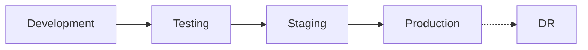
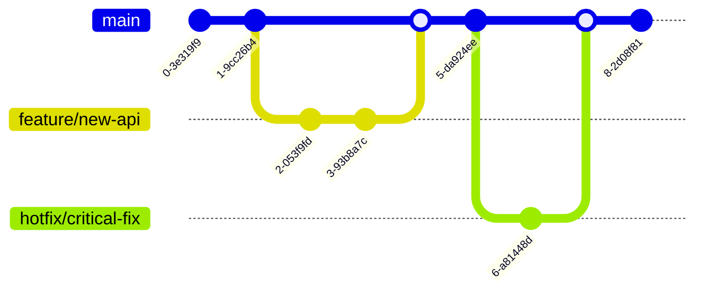
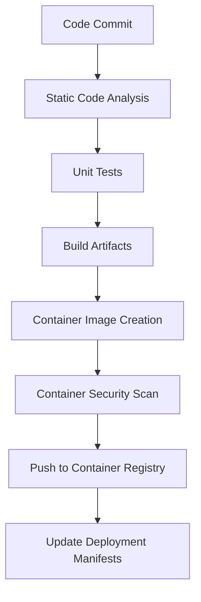
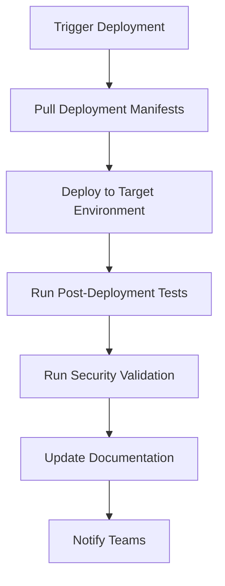

# API Connect SDLC

This page documents the Software Development Lifecycle (SDLC) for the IBM API Connect platform deployed on AWS EKS, including development processes, testing procedures, deployment workflows, and change management.

## Overview

The API Connect platform follows a structured development and deployment process that emphasizes quality, security, and operational stability. This document outlines the procedures and best practices for making changes to the platform.

### SDLC Principles

- **Infrastructure as Code**: All infrastructure and configuration changes are managed through version-controlled code
- **Continuous Integration**: Automated testing and validation for all changes
- **Continuous Delivery**: Automated deployment pipelines with appropriate approval gates
- **Shift-Left Security**: Security checks integrated throughout the development process
- **Observability by Design**: Monitoring and logging considerations built into development

### Development Workflow



## Environment Strategy

The API Connect platform uses multiple environments to support the development lifecycle:

| Environment | Purpose | Update Frequency | Access Controls |
|-------------|---------|------------------|----------------|
| Development | Active development and unit testing | Continuous | Development teams |
| Testing | Integration and QA testing | Daily/Weekly | QA teams, Development teams |
| Staging | Pre-production validation | Weekly/Bi-weekly | Limited team access |
| Production | Live business operations | Bi-weekly/Monthly | Restricted access |
| DR | Disaster recovery | Synced with Production | Emergency access only |

### Environment Comparison

| Aspect | Development | Testing | Staging | Production | DR |
|--------|-------------|---------|---------|------------|------------|
| Infrastructure | Single AZ | Dual AZ | Triple AZ | Triple AZ | Triple AZ |
| Node Counts | 2 | 4 | 6 | 6-10 (autoscaling) | 3-6 (warm standby) |
| Resource Limits | Low | Medium | Production-like | Full | Production-like |
| Data Retention | 7 days | 14 days | 30 days | 90 days | 90 days |
| Monitoring | Basic | Enhanced | Full | Full + Business KPIs | Full |
| Security Controls | Basic | Enhanced | Production-like | Full | Production-like |
| Change Process | Minimal | Peer review | Change ticket | CAB approval | Emergency only |

## Source Code Management

### Repository Structure

All API Connect code and configuration is stored in Git repositories:

| Repository | Purpose | URL | Branch Strategy |
|------------|---------|-----|----------------|
| api-connect-infra | Infrastructure as Code | https://github.com/your-org/api-connect-infra | Trunk-based |
| api-connect-config | Platform configuration | https://github.com/your-org/api-connect-config | Trunk-based |
| api-definitions | API definitions and policies | https://github.com/your-org/api-definitions | Trunk-based |
| api-connect-monitoring | Monitoring configurations | https://github.com/your-org/api-connect-monitoring | Trunk-based |
| api-connect-docs | Documentation and runbooks | https://github.com/your-org/api-connect-docs | Trunk-based |
| api-connect-extensions | Custom extensions and plugins | https://github.com/your-org/api-connect-extensions | Trunk-based |

### Branch Strategy

We follow the Trunk-Based Development model:

- **main**: Single source of truth (the "trunk")
- **feature/\***: Short-lived feature branches
- **hotfix/\***: Emergency fix branches



### Code Review Process

1. **Branch Creation**: Developer creates short-lived feature branch from main
2. **Implementation**: Developer implements changes and commits code
3. **Pull Request**: Developer creates PR to merge back to main
4. **Automated Checks**: CI pipeline runs automated tests and scans
5. **Peer Review**: At least one peer reviews the code
6. **Approval**: Technical lead approves changes
7. **Merge**: Changes are merged to main branch
8. **Deployment**: Continuous deployment pipeline deploys to development environment

## CI/CD Pipeline

Our CI/CD pipeline is implemented using Jenkins and follows trunk-based development practices.

### Jenkins Pipeline Structure

Each repository contains a `Jenkinsfile` that defines the build and deployment pipeline:

```groovy
pipeline {
    agent any
    stages {
        stage('Checkout') { ... }
        stage('Static Analysis') { ... }
        stage('Build') { ... }
        stage('Test') { ... }
        stage('Security Scan') { ... }
        stage('Publish') { ... }
        stage('Deploy') { ... }
    }
    post {
        always { ... }
    }
}
```

### Build Pipeline



### Deployment Pipeline



### Pipeline Tools

| Tool | Purpose | Integration |
|------|---------|------------|
| Jenkins | CI/CD orchestration | Git repositories |
| SonarQube | Code quality analysis | Jenkins pipeline |
| Trivy | Container security scanning | Jenkins pipeline |
| Terraform | Infrastructure as Code | Jenkins pipeline |
| ArgoCD | GitOps deployment | Kubernetes |
| Helm | Kubernetes package management | ArgoCD |

### Deployment Approval Process

| Environment | Approvers | SLA |
|-------------|-----------|-----|
| Development | Automatic | N/A |
| Testing | Team Lead | 4 hours |
| Staging | Product Owner, SRE Team | 1 business day |
| Production | Change Advisory Board | 3 business days |
| DR | Emergency CAB | 1 hour |

## Testing Strategy

### Testing Types

| Test Type | Responsibility | Tools | When Executed |
|-----------|----------------|-------|--------------|
| Unit Testing | Developers | Jest, JUnit | During development, PR validation |
| Integration Testing | Developers, QA | Postman, Newman | PR validation, dev deployment |
| API Functional Testing | QA Team | Postman, SoapUI | Testing environment |
| Performance Testing | Performance Team | JMeter, K6 | Staging environment |
| Security Testing | Security Team | OWASP ZAP, Burp Suite | Staging environment |
| Chaos Testing | SRE Team | Chaos Monkey | Staging environment |
| Smoke Testing | Ops Team | Synthetic monitors | Post-deployment (all environments) |
| Acceptance Testing | Product Team | Manual testing | Staging environment |

### Test Automation

Automated tests are integrated into the Jenkins pipeline:

1. **PR Validation**: Jenkins triggers on pull request creation to run unit tests, linting, and static analysis
2. **Development Deployment**: After merge to main, Jenkins deploys to development and runs integration tests
3. **Testing Deployment**: Promotion to testing environment triggers full functional test suite
4. **Staging Deployment**: Promotion to staging initiates performance tests, security tests, and UI tests
5. **Production Deployment**: Final verification through smoke tests and synthetic monitoring

### Testing Environments

Each testing environment has a specific purpose:

| Environment | Test Focus | Data Strategy | Reset Frequency |
|-------------|------------|---------------|----------------|
| Dev | Unit, Integration | Anonymized subset | Daily |
| Testing | Functional, Initial Performance | Synthetic test data | Weekly |
| Staging | Performance, Security, UAT | Production-like data | Before major releases |

## Release Management

### Release Types

| Release Type | Scope | Frequency | Notice Period | Downtime |
|--------------|-------|-----------|--------------|----------|
| Patch | Bug fixes, minor enhancements | Bi-weekly | 3 days | None (rolling update) |
| Minor | New features, non-breaking changes | Monthly | 1 week | Minimal (specific components) |
| Major | Breaking changes, major upgrades | Quarterly | 3 weeks | Scheduled window |
| Hotfix | Critical fixes | As needed | ASAP | None (rolling update) |

### Release Versioning

We follow semantic versioning (MAJOR.MINOR.PATCH):

- **MAJOR**: Breaking changes
- **MINOR**: New features, non-breaking
- **PATCH**: Bug fixes, minor enhancements

### Release Artifacts

| Artifact | Description | Storage Location |
|----------|-------------|------------------|
| Container Images | API Connect component images | ECR Repository |
| Deployment Manifests | Kubernetes manifests | GitHub |
| Release Notes | Documentation of changes | GitHub Wiki |
| DB Schema Updates | Database migration scripts | GitHub |
| Configuration Updates | Platform configuration | GitHub |

### Release Checklist

Before each release:

1. **Change Ticket**: Create and approve change request in ServiceNow
2. **Release Notes**: Compile and publish release notes
3. **Deployment Plan**: Document deployment steps and rollback procedures
4. **Testing Validation**: Verify all tests have passed in staging
5. **Security Sign-off**: Security team approval
6. **Stakeholder Communication**: Notify users and stakeholders
7. **Backup Verification**: Verify backups are current

## Change Management

### Change Categories

| Category | Description | Approval Process | Implementation Window |
|----------|-------------|------------------|----------------------|
| Standard | Pre-approved, low-risk changes | Team Lead | Business hours |
| Normal | Planned changes with moderate risk | Change Advisory Board | Scheduled maintenance window |
| Emergency | Urgent changes to restore service | Emergency CAB | Any time (with approval) |

### Change Request Process

1. **Request Creation**: Submit change request in ServiceNow
2. **Impact Assessment**: Document potential impact and risk
3. **Technical Review**: SRE team reviews technical details
4. **Approval Workflow**: Route for appropriate approvals
5. **Scheduling**: Schedule implementation window
6. **Implementation**: Execute change through Jenkins pipeline
7. **Verification**: Verify change was successful using automated tests
8. **Documentation**: Update documentation

### Change Advisory Board (CAB)

| Role | Responsibility | Attendance |
|------|----------------|------------|
| Product Owner | Business impact assessment | Always |
| SRE Lead | Technical impact assessment | Always |
| Security Lead | Security impact assessment | Always |
| Operations Manager | Operational impact assessment | Always |
| Business Stakeholder | Business continuity assessment | For significant changes |

### Change Calendar

The change calendar is maintained in ServiceNow and includes:

- Scheduled maintenance windows
- Planned releases
- Blackout periods (no changes allowed)
- Business-critical events

## Quality Assurance

### Code Quality Standards

| Aspect | Tool | Threshold |
|--------|------|-----------|
| Test Coverage | SonarQube | >80% |
| Code Duplication | SonarQube | <5% |
| Code Complexity | SonarQube | <15 |
| Security Vulnerabilities | SonarQube | 0 critical/high |
| Coding Standards | ESLint, Prettier | 0 errors |

### Security Requirements

| Requirement | Verification Method | Stage |
|-------------|---------------------|-------|
| No hardcoded secrets | Secret scanning | PR validation |
| Secure dependencies | Dependency scanning | PR validation |
| Container security | Container scanning | Build pipeline |
| API security | OWASP ZAP scanning | Staging testing |
| Authentication/Authorization | Security testing | Staging testing |
| Encryption standards | Security review | Pull request |

### Performance Requirements

| Metric | Target | Testing Method |
|--------|--------|---------------|
| API Response Time (p95) | <200ms | Load testing |
| Throughput | >1000 req/sec per gateway | Load testing |
| Error Rate | <0.1% | Load testing |
| Resource Utilization | <70% CPU/memory | Performance monitoring |
| Scalability | Linear scaling to 10 nodes | Scale testing |

## Documentation Standards

### Required Documentation

| Document Type | Purpose | Update Frequency | Format |
|---------------|---------|------------------|--------|
| API Specification | API contract documentation | With each API change | OpenAPI (Swagger) |
| Architectural Decision Records | Document design decisions | With architectural changes | Markdown |
| Runbooks | Operational procedures | With operational changes | Markdown |
| Release Notes | Document release changes | Each release | Markdown |
| User Guides | End-user documentation | Major releases | Markdown |

### Documentation Process

1. **Creation**: Author creates or updates documentation with code changes
2. **Review**: Documentation reviewed during code review
3. **Publication**: Documentation published to GitHub Wiki
4. **Notification**: Team notified of documentation updates

### API Documentation Standards

All APIs must include:

- Complete OpenAPI specification
- Authentication requirements
- Request/response schemas
- Error responses
- Rate limiting information
- Example requests/responses
- Versioning information

## Monitoring Integration

### Monitoring Standards

| Component | Required Metrics | Required Logs | Health Checks |
|-----------|------------------|--------------|---------------|
| API Gateway | Request count, latency, error rate | Access logs, error logs | /health endpoint |
| Management | Operation count, UI performance | Operation logs, error logs | /health endpoint |
| Portal | User actions, page performance | Access logs, error logs | /health endpoint |
| Database | Query performance, connection count | Query logs, error logs | Connection test |
| Infrastructure | Resource utilization, availability | System logs | Node readiness |

### Alerting Requirements

New services must include:

- Health check endpoints
- Appropriate metrics for SLOs
- Custom dashboards
- Alert configurations
- Runbook references in alerts

### Dashboard Standards

Each service should have dashboards for:

- Service health and SLOs
- Operational metrics
- Business metrics
- Troubleshooting data

## References

- [Architecture](../Architecture) - Platform architecture and design
- [Observability](../Observability) - Monitoring and alerting details
- [Runbook](../Runbook) - Operational procedures
- [Access](../Access) - Access management information
- [IBM API Connect Documentation](https://www.ibm.com/docs/en/api-connect)
- [Kubernetes Documentation](https://kubernetes.io/docs/)
- [AWS EKS Documentation](https://docs.aws.amazon.com/eks/)
