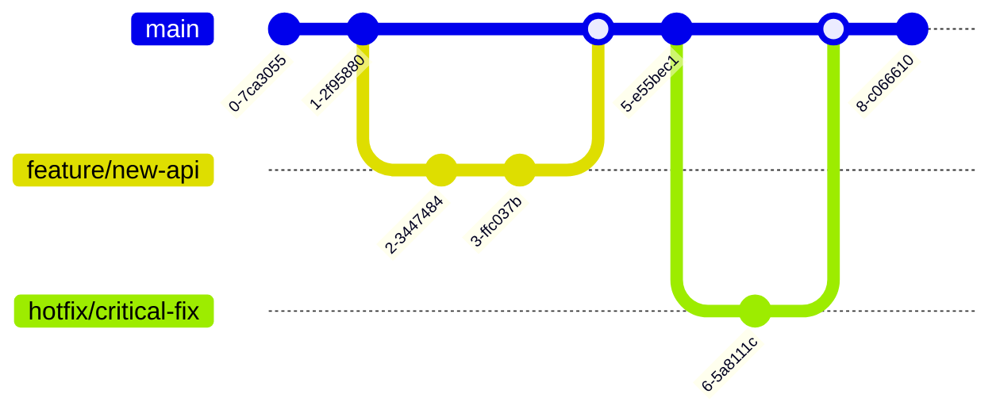

# API Connect SDLC

## Overview

The API Connect platform follows a structured development and deployment process that emphasizes quality, security, and operational stability. This document outlines the procedures and best practices for making changes to the platform.


### SDLC Principles

- **Infrastructure as Code**: All infrastructure and configuration changes are managed through version-controlled code
- **Continuous Integration**: Automated testing and validation for all changes
- **Continuous Delivery**: Automated deployment pipelines with appropriate approval gates
- **Shift-Left Security**: Security checks integrated throughout the development process
- **Observability by Design**: Monitoring and logging considerations built into development

### Development Workflow


## Environment Strategy

The API Connect platform uses multiple environments to support the development lifecycle:

| Environment | Purpose | Update Frequency | Access Controls |
|-------------|---------|------------------|----------------|
| Development | Active development and unit testing | Continuous | Development teams |
| Testing | Integration and QA testing | Daily/Weekly | QA teams, Development teams |
| Staging | Pre-production validation | Weekly/Bi-weekly | Limited team access |
| Production | Live business operations | Bi-weekly/Monthly | Restricted access |
| DR | Disaster recovery | Synced with Production | Emergency access only |

## Source Code Management

### Repository Structure

All API Connect code and configuration is stored in Git repositories:

| Repository | Purpose | URL | Branch Strategy |
|------------|---------|-----|----------------|
| api-connect-infra | Infrastructure as Code | https://github.com/your-org/api-connect-infra | Trunk-based |
| api-connect-config | Platform configuration | https://github.com/your-org/api-connect-config | Trunk-based |
| api-definitions | API definitions and policies | https://github.com/your-org/api-definitions | Trunk-based |
| api-connect-monitoring | Monitoring configurations | https://github.com/your-org/api-connect-monitoring | Trunk-based |
| api-connect-docs | Documentation and runbooks | https://github.com/your-org/api-connect-docs | Trunk-based |
| api-connect-extensions | Custom extensions and plugins | https://github.com/your-org/api-connect-extensions | Trunk-based |

### Branch Strategy

We follow the Trunk-Based Development model:

- **main**: Single source of truth (the "trunk")
- **feature/\***: Short-lived feature branches
- **hotfix/\***: Emergency fix branches



### Code Review Process

1. Feature branch from main
2. PR with automated CI checks
3. Minimum 1 peer review
4. Technical lead approval
5. Merge to main
6. Auto-deployment to development

## CI/CD Pipeline

Our CI/CD pipeline is implemented using Jenkins and follows trunk-based development practices.

### Jenkins Pipeline Structure

Each repository contains a `Jenkinsfile` that defines the build and deployment pipeline:

```groovy
pipeline {
    agent any
    stages {
        stage('Checkout') { ... }
        stage('Static Analysis') { ... }
        stage('Build') { ... }
        stage('Test') { ... }
        stage('Security Scan') { ... }
        stage('Publish') { ... }
        stage('Deploy') { ... }
    }
    post {
        always { ... }
    }
}
```

### Build Pipeline


### Deployment Pipeline


### Pipeline Tools

| Tool | Purpose | Integration |
|------|---------|------------|
| Jenkins | CI/CD orchestration | Git repositories |
| Terraform | Infrastructure as Code | Jenkins pipeline |

### Deployment Approval Process

| Environment | Approvers | SLA |
|-------------|-----------|-----|
| Development | Automatic | N/A |
| Testing | Team Lead | 4 hours |
| Staging | Product Owner, SRE Team | 1 business day |
| Production | Change Advisory Board | 3 business days |
| DR | Emergency CAB | 1 hour |

## Testing Strategy

### Testing Types

| Test Type | Responsibility | Tools | When Executed |
|-----------|----------------|-------|--------------|
| Unit Testing | Developers | Jest, JUnit | During development, PR validation |
| Integration Testing | Developers, QA | Postman, Newman | PR validation, dev deployment |
| API Functional Testing | QA Team | Postman, SoapUI | Testing environment |
| Performance Testing | Performance Team | JMeter, K6 | Staging environment |
| Security Testing | Security Team | OWASP ZAP, Burp Suite | Staging environment |
| Chaos Testing | SRE Team | Chaos Monkey | Staging environment |
| Smoke Testing | Ops Team | Synthetic monitors | Post-deployment (all environments) |
| Acceptance Testing | Product Team | Manual testing | Staging environment |

### Test Automation

1. **PR Validation**: Jenkins triggers on PR creation for unit tests, linting, static analysis
2. **Development**: Post-merge deployment with integration tests
3. **Testing**: Full functional test suite
4. **Staging**: Performance, security, UI tests
5. **Production**: Smoke tests, synthetic monitoring

### Testing Environments

Each testing environment has a specific purpose:

| Environment | Test Focus | Data Strategy | Reset Frequency |
|-------------|------------|---------------|----------------|
| Dev | Unit, Integration | Anonymized subset | Daily |
| Testing | Functional, Initial Performance | Synthetic test data | Weekly |
| Staging | Performance, Security, UAT | Production-like data | Before major releases |

## Change Management

### Change Categories

| Category | Description | Approval Process | Implementation Window |
|----------|-------------|------------------|----------------------|
| Normal | Planned changes with moderate risk | Change Advisory Board | Scheduled maintenance window |
| Emergency | Urgent changes to restore service | Emergency CAB | Any time (with approval) |

### Change Request Process

1. **Request Creation**: Submit change request in ServiceNow
2. **Impact Assessment**: Document potential impact and risk
3. **Technical Review**: SRE team reviews technical details
4. **Approval Workflow**: Route for appropriate approvals
5. **Scheduling**: Schedule implementation window
6. **Implementation**: Execute change through Jenkins pipeline
7. **Verification**: Verify change was successful using automated tests
8. **Documentation**: Update documentation

### Change Advisory Board (CAB)

| Role | Responsibility | Attendance |
|------|----------------|------------|
| Product Owner | Business impact assessment | Always |
| SRE Lead | Technical impact assessment | Always |
| Security Lead | Security impact assessment | Always |
| Operations Manager | Operational impact assessment | Always |
| Business Stakeholder | Business continuity assessment | For significant changes |

### Change Calendar

The change calendar is maintained in ServiceNow and includes:

- Scheduled maintenance windows
- Planned releases
- Blackout periods (no changes allowed)
- Business-critical events

## References

- [Architecture](../Architecture) - Platform architecture and design
- [Observability](../Observability) - Monitoring and alerting details
- [Runbook](../Runbook) - Operational procedures
- [Access](../Access) - Access management information
- [IBM API Connect Documentation](https://www.ibm.com/docs/en/api-connect)
- [Kubernetes Documentation](https://kubernetes.io/docs/)
- [AWS EKS Documentation](https://docs.aws.amazon.com/eks/)
